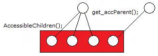

# ElementsChildHasDifferentParent

## Text

Element's child({0}) has different parent({1}) than element

## Type

Error

## Description

This error indicates that, when [**get\_accParent**](iaccessible-iaccessible--get-accparent.md) is called on the children of the target element, the children do not report a consistent parent.

This issue can cause navigation problems for automated tools because traversing elements might be erratic and unpredictable.

## Possible causes

An incorrect or invalid MSAA implementation.

## Related topics

<dl> <dt>

[**AccessibleChildren**](accessiblechildren.md)
</dt> </dl>

 

 

