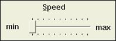

# Ensuring that UI Elements are Correctly Named

This topic describes the correct way to specify the names of the UI elements in your Microsoft Win32 applications so that Microsoft Active Accessibility can accurately expose the names to client applications through the [**IAccessible**](/windows/desktop/api/oleacc/nn-oleacc-iaccessible) [Name property](name-property.md).

The information in this section applies to Microsoft Active Accessibility only. It does not apply to applications that use Microsoft UI Automation or those based on markup languages such as HTML, Dynamic HTML (DHTML), or XML.

-   [Overview](#overview)
-   [How Incorrect Naming Causes Problems](#how-incorrect-naming-causes-problems)
-   [How MSAA Gets the Name Property](#how-msaa-gets-the-name-property)
-   [How to Find and Correct Naming Problems](#how-to-find-and-correct-naming-problems)
-   [How to Correctly Name a Trackbar](#how-to-correctly-name-a-trackbar)
-   [How to Use Invisible Labels to Name Controls](#how-to-use-invisible-labels-to-name-controls)
-   [How to Use Direct Annotation to Specify the Name Property](#how-to-use-direct-annotation-to-specify-the-name-property)
    -   [Steps for Annotating the Name Property](#steps-for-annotating-the-name-property)
    -   [Example of Annotating the Name Property](#example-of-annotating-the-name-property)
-   [Related topics](#related-topics)

## Overview

In Microsoft Active Accessibility, each UI element in an application is represented by an object that exposes the [**IAccessible**](/windows/desktop/api/oleacc/nn-oleacc-iaccessible) interface. Client applications use the properties and methods of the **IAccessible** interface to interact with the UI element and to retrieve information about it. One of the most important properties exposed by the **IAccessible** interface is the [Name property](name-property.md). Client applications rely on the Name property to find, identify, or announce a UI element to the user. If Microsoft Active Accessibility cannot properly expose the Name property of a particular UI element, client applications will be unable to present that UI element to the user, and the UI element will be inaccessible to users with disabilities.

## How Incorrect Naming Causes Problems

To illustrate the problems caused by incorrect naming of UI elements, consider the name entry form shown in the following illustration.


Although the UI elements in the form look okay, the programmatic implementation is incorrect. To a Microsoft Active Accessibility client such as a screen reader, the [Name property](name-property.md) of the top edit control is "Last Name:", and the Name property of the bottom edit control is an empty string (""). The screen reader will read the top edit control as "Last Name", although the user is expected to type in the first name. The screen reader will read the second edit control as "no name", so the user will have no idea what to type into the second edit control. The screen reader is unable to assist the user in entering data into this simple form.

Another problem with the form is that no shortcut keys are assigned to either of the edit controls. The user is forced to either tab to the controls or use the mouse.

The following sections explain the source of these problems and provide guidelines for correcting them.

## How MSAA Gets the Name Property

Microsoft Active Accessibility gets the [Name property](name-property.md) string from different locations depending on the type of the UI element. For most UI elements that have associated window text, Microsoft Active Accessibility uses the window text as the Name property string. Examples of this type of UI element include controls such as buttons, menu items, and tooltips.

For the following controls, Microsoft Active Accessibility ignores the window text and instead looks for a static text label (or group box label) immediately preceding the control in the tab order.

-   Combo Boxes
-   Date and Time Pickers
-   Edit and Rich Edit controls
-   IP Address controls
-   List Boxes
-   List Views
-   Progress Bars
-   Scrollbars
-   Static controls that have the SS\_ICON or SS\_BITMAP style
-   Trackbars
-   Tree Views

If the preceding controls are not accompanied by static text labels, or if the labels are not implemented correctly, Microsoft Active Accessibility cannot provide the correct [Name property](name-property.md) to client applications.

Most of the preceding controls actually do have associated window text. The resource editor automatically generates the window text, which consists of a generic string such as "edit1" or "listbox3". Although developers can replace the generated window text with more meaningful text, most never do. Because the generated window text has no meaning to the user, Microsoft Active Accessibility ignores it and uses the accompanying static text label instead.

## How to Find and Correct Naming Problems

In the name entry form shown in How Incorrect Naming Causes Problems, the cause of the problems is that the tab order of the controls is incorrect. Examining the UI with a testing tool such as [Inspect](inspect-objects.md) would reveal the problems with the object hierarchy. The following screen shot shows the broken object hierarchy of the name entry form as it appears in Inspect.


In the previous screen shot, notice that the object hierarchy does not match the structure of the controls as they appear in the user interface of the name entry form. Also notice that [Inspect](inspect-objects.md) has assigned the incorrect name to the next-to-last item (it is the edit control for entering the first name and should be a named "First Name:". Finally, notice that Inspect could not find a name for the last item (it is the edit control for entering the last name and should have a name of "Last Name:".

The following example shows the contents of the resource file for the name entry form. Notice that the tab order is not consistent with the logical structure of the controls as they appear in the user interface. Also notice that no shortcut keys are specified for the two edit controls.

``` syntax
IDD_INPUTNAME DIALOGEX 22, 17, 312, 118
STYLE DS_SETFONT | DS_MODALFRAME | WS_CAPTION | WS_SYSMENU
CAPTION "Enter your name"
FONT 8, "System", 0, 0, 0x0
BEGIN
    DEFPUSHBUTTON   "OK",IDOK,179,35,30,11,WS_GROUP
    LTEXT           "First Name:",IDC_STATIC,8,16,43,8
    LTEXT           "Last Name:",IDC_STATIC,8,33,43,8
    EDITTEXT        IDC_EDIT1,53,15,120,12,ES_AUTOHSCROLL
    EDITTEXT        IDC_EDIT2,53,34,120,12,ES_AUTOHSCROLL
END
```

To correct the problems with the name entry form, the resource (.rc) file should be edited to specify keyboard shortcuts, and the controls should be placed in the following order:

1.  The "&First Name:" static text label.
2.  The edit control for entering the first name (IDC\_EDIT1).
3.  The "&Last Name:" static text label.
4.  The edit control for entering the last name (IDC\_EDIT2).
5.  The "OK" default push button.

The following example shows the corrected resource file for the name entry form:

``` syntax
IDD_INPUTNAME DIALOGEX 22, 17, 312, 118
STYLE DS_SETFONT | DS_MODALFRAME | WS_CAPTION | WS_SYSMENU
CAPTION "Enter your name"
FONT 8, "System", 0, 0, 0x0
BEGIN
    LTEXT           "&First Name:",IDC_STATIC,8,16,43,8
    EDITTEXT        IDC_EDIT1,53,15,120,12,ES_AUTOHSCROLL
    LTEXT           "&Last Name:",IDC_STATIC,8,33,43,8
    EDITTEXT        IDC_EDIT2,53,34,120,12,ES_AUTOHSCROLL
    DEFPUSHBUTTON   "OK",IDOK,179,35,30,11,WS_GROUP
END
```

To make corrections to a resource file, you can either edit the file directly, or you can use the Tab Order tool in Microsoft Visual Studio. You can access the Tab Order tool in Visual Studio either by pressing CTRL+D, or by selecting **Tab Order** from the **Format** menu.

After correcting and rebuilding the application, the UI of the names entry form will look the same as it did before. However, Microsoft Active Accessibility will now provide the correct Name properties to client applications, and will set the focus correctly when the user presses the ALT+F or ALT+L keyboard shortcuts. Also, [Inspect](inspect-objects.md) will show the correct object hierarchy, as the following screen shot shows.


## How to Correctly Name a Trackbar

When defining a trackbar (or slider), ensure that the main static text label for the trackbar appears before the trackbar, and that the static text labels for the minimum and maximum ranges appear after the trackbar. Remember that Microsoft Active Accessibility uses the static text label that immediately precedes a control as the [Name property](name-property.md) for the control. Placing the main static text label immediately before the trackbar, and the other labels after it, ensures that Microsoft Active Accessibility provides the correct Name property to a client.

The following illustration shows a typical trackbar with a main static text label called "Speed", and static text labels for the minimum ("min") and maximum ("max") ranges.



The following example shows the correct way to define a trackbar and its static text labels in the resource file:

``` syntax
BEGIN
    ...

    LTEXT           "&Speed",IDC_STATIC,47,20,43,8
    CONTROL         "",IDC_SLIDER1,"msctls_trackbar32",
                    TBS_AUTOTICKS | TBS_BOTH | WS_TABSTOP,
                    32,32,62,23
    LTEXT           "min",IDC_STATIC,16,37,15,8
    LTEXT           "max",IDC_STATIC,94,38,43,8

    ...
END
```

## How to Use Invisible Labels to Name Controls

It is not always possible or desirable to have a visible label for every control. For example, sometimes adding labels can cause undesirable changes in the appearance of the UI. In this case, you can use invisible labels. Microsoft Active Accessibility will still pick up the text associated with an invisible label, but the label will not appear in, or interfere with, the visual UI.

As with visible labels, an invisible label must immediately precede the control in the tab order. To make a label invisible in a resource file (.rc), add `NOT WS_VISIBLE` or `|~WS_VISIBLE` to the style part of the static text control. If you are using the Resource Editor in Visual Studio, you can set the Visible property to False.

## How to Use Direct Annotation to Specify the Name Property

The default proxies included in the Microsoft Active Accessibility runtime component, Oleacc.dll, automatically provide an [**IAccessible**](/windows/desktop/api/oleacc/nn-oleacc-iaccessible) object for all of the standard Windows controls. If you customize a standard Windows control, the default proxies do their best to accurately provide all of the **IAccessible** properties for your customized control. You should thoroughly test a customized control to ensure that the default proxies are providing accurate and complete property values. If testing reveals inaccurate or incomplete property values, you may be able to use the Dynamic Annotation technique called direct annotation to provide correct property values and add those that are missing.

Note that Dynamic Annotation is not just for controls supported by the Microsoft Active Accessibility proxies. You can also use it to modify or provide properties for any control that provides its own [**IAccessible**](/windows/desktop/api/oleacc/nn-oleacc-iaccessible) implementation.

This section focuses on using direct annotation to provide a correct value for the [Name property](name-property.md) of the [**IAccessible**](/windows/desktop/api/oleacc/nn-oleacc-iaccessible) object for a control. You can use direct annotation to provide other properties values as well. Also, other Dynamic Annotation techniques beside direct annotation are available, and the features and capabilities of the Dynamic Annotation API extend far beyond what is described in this section. For more information about Dynamic Annotation, see [Dynamic Annotation API](dynamic-annotation-api.md).

### Steps for Annotating the Name Property

Using direct annotation to change the [Name Property](name-property.md) of a control involves the following steps.

1.  Include the following header files:
    -   Initguid.h
    -   Oleacc.h

    > [!Note]  
    > To define GUIDs, you must include Initguid.h before Oleacc.h in the same file.

     

2.  Initialize the Component Object Model (COM) library by calling the [CoInitializeEx](/windows/win32/api/combaseapi/nf-combaseapi-coinitializeex) function, typically during the application initialization process.
3.  Soon after the target control is created (typically during the [WM\_INITDIALOG](../dlgbox/wm-initdialog.md) message), create an instance of the annotation manager and obtain a pointer to its [**IAccPropServices**](/windows/desktop/api/oleacc/nn-oleacc-iaccpropservices) pointer.
4.  Annotate the [Name Property](name-property.md) of the target control by using the [**IAccPropServices::SetHwndPropStr**](/windows/desktop/api/Oleacc/nf-oleacc-iaccpropservices-sethwndpropstr) method.

5.  Release the [**IAccPropServices**](/windows/desktop/api/oleacc/nn-oleacc-iaccpropservices) pointer.
6.  Before the target control is destroyed (typically when handling the [WM\_DESTROY](../winmsg/wm-destroy.md) message), create an instance of the annotation manager and obtain a pointer to its [**IAccPropServices**](/windows/desktop/api/oleacc/nn-oleacc-iaccpropservices) interface.
7.  Use the [**IAccPropServices::ClearHwndProps**](/windows/desktop/api/Oleacc/nf-oleacc-iaccpropservices-clearhwndprops) method to clear the [Name property](name-property.md) annotations from the target control.
8.  Release the [**IAccPropServices**](/windows/desktop/api/oleacc/nn-oleacc-iaccpropservices) pointer.
9.  Before your application exits (typically while processing the [WM\_DESTROY](../winmsg/wm-destroy.md) message), release the COM library by calling the [CoUninitialize](/windows/win32/api/combaseapi/nf-combaseapi-couninitialize) function.

The [**IAccPropServices::SetHwndPropStr**](/windows/desktop/api/Oleacc/nf-oleacc-iaccpropservices-sethwndpropstr) function takes five parameters. The first three—*hwnd*, *idObject*, and *idChild*—combine to identify the control. The fourth parameter, *idProp*, specifies the identifier of the property to be changed. To change the [Name property](name-property.md), set *idProp* to **PROPID\_ACC\_NAME**. (For a list of other properties that you can set through direct annotation, see [Using Direct Annotation](using-direct-annotation.md).) The last parameter of **SetHwndPropStr**, *str*, is the new string to use as the Name property.

### Example of Annotating the Name Property

The following example code shows how to use direct annotation to change the [Name property](name-property.md) of the [**IAccessible**](/windows/desktop/api/oleacc/nn-oleacc-iaccessible) object for a control. To keep things simple, the example uses a hard-coded string ("New Control Name") to set the Name property. Hard-coded strings should not be used in the final version of your application because they cannot be localized. Instead, always load strings from your resource file. Also, the example does not show the calls to the [CoInitializeEx](/windows/win32/api/combaseapi/nf-combaseapi-coinitializeex) and [CoUninitialize](/windows/win32/api/combaseapi/nf-combaseapi-couninitialize) functions.


```C++
#include <initguid.h>
#include <oleacc.h>

// AnnotateControlName - Uses direct annotation to change the Name property 
// of the IAccessible object for a control.
//
// hDlg - Handle of the dialog box that contains the control.
// hwndCtl - Handle of the control whose Name property is to be changed.
HRESULT AnnotateControlName(HWND hDlg, HWND hwndCtl)
{
    HRESULT hr;        

    IAccPropServices *pAccPropSvc = NULL;  

    // Create an instance of the annotation manager and retrieve the 
    // IAccPropServices pointer.
    hr = CoCreateInstance(CLSID_AccPropServices, NULL, CLSCTX_SERVER, 
        IID_IAccPropServices, (void **) &pAccPropSvc);

    if (hr != S_OK || pAccPropSvc == NULL)
        return hr;

    // Set the Name property for the control.
    // Note: A hard-coded string is used here to keep the example simple.
    // Always use localizable string resources in your applications. 
    hr = pAccPropSvc->SetHwndPropStr(hwndCtl, OBJID_CLIENT, CHILDID_SELF, 
        PROPID_ACC_NAME, L"New Control Name");

    pAccPropSvc->Release();
    
    return hr;
}

// RemoveAnnotatedNameFromControl - Removes the annotated name from the 
// Name property of the IAccessible object for a control.
//
// hDlg - Handle of the dialog box that contains the control.
// hwndCtl - Handle of the control whose annotated name is to be removed.
HRESULT RemoveAnnotatedNameFromControl(HWND hDlg, HWND hwndCtl)
{
    HRESULT hr;

    IAccPropServices *pAccPropSvc = NULL;

    // Create an instance of the annotation manager and retrieve the 
    // IAccPropServices pointer.
    hr = CoCreateInstance(CLSID_AccPropServices, NULL, CLSCTX_SERVER, 
        IID_IAccPropServices, (void **) &pAccPropSvc);

    if (hr != S_OK || pAccPropSvc == NULL)
        return hr;

    // Remove the annotated name from the Name property for the control.
    MSAAPROPID propid = PROPID_ACC_NAME;
    hr = pAccPropSvc->ClearHwndProps(hwndCtl, OBJID_CLIENT, CHILDID_SELF, 
        &propid, 1);

    // Release the annotation manager.
    pAccPropSvc->Release();

    return hr;
}
```


## Related topics

<dl> <dt>

**Conceptual**
</dt> <dt>

[Dynamic Annotation API](dynamic-annotation-api.md)
</dt> <dt>

[Providing the Name Property](providing-the-name-property.md)
</dt> <dt>

[Testing Tools](testing-tools.md)
</dt> </dl>

 

 