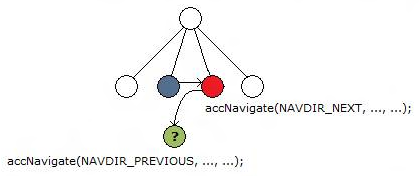

# IncorrectRoundTrip

## Text

Call to accNavigate((Click Snooze to be reminded again in:), 1, NAVDIR\_NEXT), then accNavigate((Open), 2, NAVDIR\_PREVIOUS), should have returned Click Snooze to be reminded again in:(ChildId=1), but returned Click Snooze to be reminded again in:

## Type

Error

## Description

using [**accNavigate**](/windows/desktop/api/Oleacc/nf-oleacc-iaccessible-accnavigate) to traverse the element tree of the verification target does not return the same starting element when the direction of traversal is reversed.

This issue can cause navigation problems for automated tools because traversing elements might be erratic and unpredictable.

## Possible causes

An incorrect or invalid MSAA implementation.

## Related topics

<dl> <dt>

[**IAccessible::accNavigate**](/windows/desktop/api/Oleacc/nf-oleacc-iaccessible-accnavigate)
</dt> </dl>

 

 

