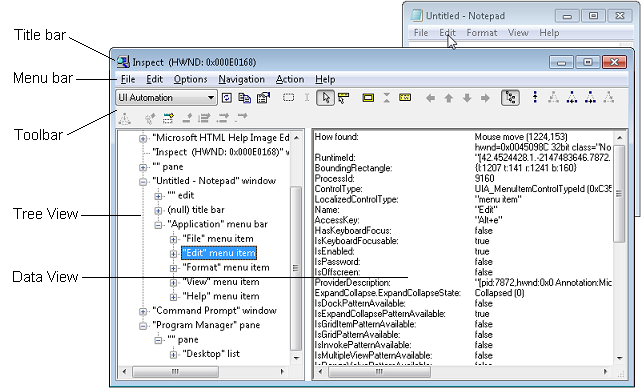

# Accessibility tools - Inspect

> [!Important]
> **Inspect** is a legacy tool. We recommend using [Accessibility Insights](https://accessibilityinsights.io/) instead.

**Inspect** (Inspect.exe) is a Windows-based tool that enables you select any UI element and view the element's accessibility data. You can view Microsoft UI Automation properties and control patterns, as well as Microsoft Active Accessibility properties. **Inspect** also enables you to test the navigational structure of the automation elements in the UI Automation tree, and the accessible objects in the Microsoft Active Accessibility hierarchy.

## Requirements

To examine UI Automation, UI Automation must be present on the system. For more information, see the "Requirements" section of [UI Automation](entry-uiauto-win32.md).

**Inspect** is installed as part of the overall set of tools in the Windows Software Development Kit (SDK), it is not distributed as a separate download. The Windows SDK includes all of the accessibility-related tools documented in this section.

[Download the Windows SDK](https://developer.microsoft.com/en-us/windows/downloads/windows-10-sdk/).

> [!NOTE]
> For older versions of the Windows SDK, see the [Windows SDK and emulator archive](https://developer.microsoft.com/en-us/windows/downloads/sdk-archive/).

**Inspect.exe** is located in the \\bin\\<*version*>\\<*platform*> folder of the SDK installation path (you don't typically have to run as administrator).

## The Inspect Window

The **Inspect** window has several main parts:

- Title bar. Displays the **Inspect** window handle (HWND).
- Menu bar. Provides access to **Inspect** functionality.
- Toolbar. Provides access to **Inspect** functionality.
- Tree view. Presents the hierarchical structure of UI elements as a tree-view control that you can use to navigate among the elements.
- Data view. Displays all exposed accessibility properties for the selected UI element.

The commands available in the menu bar are also available in the toolbar. The following image shows the **Inspect** tool querying the UI Automation properties of the **Edit** menu element in Notepad.

## Using Inspect

When you start **Inspect**, the **Tree** view shows the location of the currently selected UI element in the element hierarchy, and the **Data** view shows the property information for the selected UI element. You can navigate the UI to view accessibility information about every element in the UI. By default, **Inspect** tracks the keyboard or mouse focus. As focus changes, the **Data** view updates with the property information of the element with focus.

To navigate among UI elements, you can use any of the following:

- The mouse
- The keyboard
- The tree-view control in the **Tree** view
- The navigation options in the **Navigation** menu
- The navigation options in the toolbar

The last three options enable you to navigate the tree hierarchy of the UI. The structure of this tree may differ slightly between UI Automation and Microsoft Active Accessibility modes.

## Verifying Accessibility Property Information

The **Data** view shows the property information of the UI element that is currently selected. You can configure **Inspect** to show you information about all accessibility properties or a subset of those properties. You can also specify other viewing options, such as whether **Inspect** should remain on top of other user interfaces, or whether **Inspect** should highlight a bounding rectangle around the selected element. Once you have configured **Inspect** to work the way you want, you can begin navigating among UI elements and viewing property information. **Inspect** saves your configuration settings when it closes and uses them to initialize your next **Inspect** session.

### Configure Property Settings

1. From the **Options** menu, select **Settings...**, or select **Show Settings Dialog** from the toolbar.
2. In the **Display in Main Window** list, select the properties you want displayed in the **Data** view of **Inspect**.
3. In the **Display in Information Tooltip** list, select the properties you want displayed in a tooltip.
4. To view properties that the UI element may not support, check the **Display unsupported properties** box.
5. Click **OK**.

### To Configure Viewing Options

- In the **Options** menu or in the toolbar, you can select the following viewing options.

| When this option is selected | **Inspect** does this                                                                                                                                                                                                              |
|------------------------------|------------------------------------------------------------------------------------------------------------------------------------------------------------------------------------------------------------------------------------|
| Always on Top                | Appears on top of any other window on the screen.                                                                                                                                                                                  |
| MSAA Mode                    | Displays Microsoft Active Accessibility property information.                                                                                                                                                                      |
| UI Automation Mode           | Displays UI Automation property information.                                                                                                                                                                                       |
| Visible Windows Only View    | Available in MSAA mode only.                                                                                                                                                                                                       |
| Raw View                     | Presents the [raw view](uiauto-treeoverview.md) of the UI Automation tree or MSAA tree in the **Tree** view.                                                                                                             |
| Control View                 | Presents the [control view](uiauto-treeoverview.md) of the UI Automation tree in the **Tree** view. Available in UI Automation mode only.                                                                            |
| Content View                 | Presents the [content view](uiauto-treeoverview.md) of the UI Automation tree in the **Tree** view. Available in UI Automation mode only.                                                                            |
| Active Hover Toolbar         | Activates toolbar buttons on mouse hover, instead of requiring a mouse click.                                                                                                                                                      |
| Beep on Error                | Beeps when an error is detected during a UI Automation or MSAA operation.                                                                                                                                                          |
| SPI\_SCREENREADER Flag       | Assumes a screen reader is present. This flag indicates that an application should provide information textually instead of graphically. You should not assume this flag is set simply because a screen reader is present.         |
| Show Highlight Rectangle     | Highlights a rectangle around the element with focus.                                                                                                                                                                              |
| Show Caret Highlight         | Highlights the caret. Available in MSAA mode only.                                                                                                                                                                                 |
| Show Information Tooltip     | Shows property information in a tooltip.                                                                                                                                                                                           |
| Watch Focus                  | Follows the keyboard focus. When selected, an asynchronous focus event hook is installed and moves the caret to the top left of the element with the focus. This causes **Inspect** to refresh its properties in about one second. |
| Watch Caret                  | Follows the caret. Available in MSAA mode only.                                                                                                                                                                                    |
| Watch Cursor                 | Follows the cursor.                                                                                                                                                                                                                |
| Watch Tooltips               | Follows the tooltips.                                                                                                                                                                                                              |
| Show Tree                    | Displays the **Tree** view.                                                                                                                                                                                                        |

## Verifying Accessibility Navigation

Once you have selected a UI element using **Inspect**, you can validate that the element exposes the correct Windows Automation navigation for assistive technology products.

### Verify Accessibility Navigation

1. Open **Inspect** and the application you want to test.
2. Select the UI element from which you want to start navigation.
3. In the **Data** view, verify that the element exposes the correct navigation-related properties.
4. Use the **Tree** view, the **Navigation** menu, or the navigation buttons on the toolbar to navigate the UI and verify that each element exposes the correct navigation-related properties.
    > [!Note]  
    > The **Navigation** menu options and navigation toolbar buttons change depending on where the selected element is in the tree.

## Interacting with UI Elements

Windows Automation exposes methods that allow assistive technology products to interact with a UI element as if the mouse or keyboard were being used (for example, to click a button). The **Inspect** Action menu lets testers invoke Windows Automation methods on an element (for example, **Invoke.Invoke** calls the [**IUIAutomationInvokePattern::Invoke**](/windows/desktop/api/UIAutomationClient/nf-uiautomationclient-iuiautomationinvokepattern-invoke) method).

### Interact with UI Elements

1. Open **Inspect** and the application you want to test.
2. Select the UI element with which you want to interact.
3. From the **Action** menu or the toolbar, select the action that corresponds to Windows Automation method you want to invoke.

The **Action** menu contains the **Refresh** and **Focus** items, along with other items that vary depending on whether UI Automation mode or MSAA mode in selected. In UI Automation mode, the other items reflect the control patterns supported by the currently selected UI element. In MSAA mode, the other items always consist of the following:

| Action                | Description                                                                                                           |
|-----------------------|-----------------------------------------------------------------------------------------------------------------------|
| Refresh               | Refreshes the user interface. Available in MSAA and UI Automation mode.                                               |
| Default Action        | Performs the default action for the element.                                                                          |
| Focus                 | Sets focus on the element. Available in MSAA and UI Automation mode.                                                  |
| Select                | Selects the element.                                                                                                  |
| Extend Selection      | Extends the selection of elements to include all elements between the first selected element and the current element. |
| Add to Selection      | Selects the current element (such as a list item).                                                                    |
| Remove from Selection | Removes the current element from the selection.                                                                       |
| SetAccValue           | Sets the Microsoft Active Accessibility value of the element to the specified string.                                 |
| Focused Child         | Navigates to the child of the element that currently has focus.                                                       |
| HitTest at Cursor     | Navigates to the child of the element specified by mouse cursor.                                                      |
| HitTest...            | Opens the **HitTest** dialog box.                                                                                     |

 

## Keyboard Shortcuts

Many of the menu items can be invoked with a keyboard shortcut even when **Inspect** is not the active application. Note however, that the shortcut keys conflict with some applications.

The following keyboard shortcut keys activate the various options on the menu:

| To do this                                                                                                                                       | Use this keyboard shortcut |
|--------------------------------------------------------------------------------------------------------------------------------------------------|----------------------------|
| Invoke the default action of the object under the cursor (Do Default Action). Available in MSAA mode only.                                       | CTRL+SHIFT+F2              |
| Select the object under the cursor (Select). Available in MSAA mode only.                                                                        | CTRL+SHIFT+F3              |
| Set the keyboard focus to the object under the cursor (Focus).                                                                                   | CTRL+SHIFT+F4              |
| Move to the previous sibling object from the one under the cursor. This command navigates to objects only within a container (Previous Sibling). | CTRL+SHIFT+F5              |
| Move to the object's parent (Parent).                                                                                                            | CTRL+SHIFT+F6              |
| Move to the first child of the current object (First Child).                                                                                     | CTRL+SHIFT+F7              |
| Move to the next sibling object from the one under the cursor. This command navigates to objects only within a container (Next Sibling).         | CTRL+SHIFT+F8              |
| Move to the last child of the current object (Last Child).                                                                                       | CTRL+SHIFT+F9              |
| Move to the object under the mouse cursor (HitTest at Cursor). Available in MSAA mode only.                                                      | CTRL+SHIFT+1               |
| Copy the contents of the Data view to the clipboard (Copy All).                                                                                  | CTRL+SHIFT+4               |
| Refresh the contents of the Data view (Refresh).                                                                                                 | CTRL+SHIFT+5               |
| Watch the object that has focus (Watch Focus).                                                                                                   | CTRL+SHIFT+6               |
| Move to the sibling object to the left of the one the cursor is over (Left). Available in MSAA mode only.                                        | CTRL+SHIFT+7               |
| Move to the sibling object above the object the cursor is over (Up). Available in MSAA mode only.                                                | CTRL+SHIFT+8               |
| Move to the sibling object below the one the cursor is over (Down). Available in MSAA mode only.                                                 | CTRL+SHIFT+9               |
| Move to the sibling object to the right of the one the cursor is over (Right). Available in MSAA mode only.                                      | CTRL+SHIFT+0               |

## Related topics

- [Accessible Event Watcher](accessible-event-watcher.md)
- [Testing Tools](testing-tools.md)
- [UI Accessibility Checker](ui-accessibility-checker.md)
- [UI Automation Verify](ui-automation-verify.md)
- [AccScope](accscope.md)
