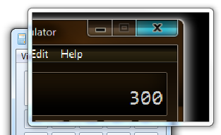

# Magnification API Overview

The Magnification API enables assistive technology vendors to develop screen magnification applications that run on Microsoft Windows. This topic describes the Magnification API and explains how to use it in an application. It contains the following sections:

- [Getting Started](#getting-started)
- [Basic Concepts](#basic-concepts)
  - [Types of Magnifiers](#types-of-magnifiers)
  - [Magnification Factor](#magnification-factor)
  - [Color Effects](#color-effects)
  - [Source Rectangle](#source-rectangle)
  - [Filter List](#filter-list)
  - [Input Transform](#input-transform)
  - [System Cursor](#system-cursor)
- [Initializing the Magnifier Run-time Library](#initializing-the-magnifier-run-time-library)
- [Using the Full-Screen Magnifier](#using-the-full-screen-magnifier)
- [Using the Magnifier Control](#using-the-magnifier-control)
  - [Creating the Magnifier Control](#creating-the-magnifier-control)
  - [Initializing the Control](#initializing-the-control)
  - [Setting the Source Rectangle](#setting-the-source-rectangle)
  - [Applying Color Effects](#applying-color-effects)
  - [Selective Magnification](#selective-magnification)
- [Related topics](#related-topics)

## Getting Started

The original release of the Magnification API is supported on Windows Vista and later operating systems. On Windows 8 and later, the API supports additional features, including full-screen magnification and setting the visibility of the magnified system cursor.

Support for the Magnification API is provided by Magnification.dll. To compile your application, include Magnification.h and link to Magnification.lib.

> [!Note]  
> The Magnification API is not supported under WOW64; that is, a 32-bit magnifier application will not run correctly on 64-bit Windows.

## Basic Concepts

This section describes the fundamental concepts that the magnification API is based on. It contains the following parts:

- [Types of Magnifiers](#types-of-magnifiers)
- [Magnification Factor](#magnification-factor)
- [Color Effects](#color-effects)
- [Source Rectangle](#source-rectangle)
- [Filter List](#filter-list)
- [Input Transform](#input-transform)
- [System Cursor](#system-cursor)

### Types of Magnifiers

The API supports two types of magnifiers, the *full-screen magnifier* and the *magnifier control*. The full-screen magnifier magnifies the content of the entire screen, while the magnifier control magnifies the content of a particular area of the screen and displays the content in a window. For both magnifiers, images and text are magnified, and both enable you to control the amount of magnification. You can also apply color effects to the magnified screen content, making it easier to see for people who have color deficiencies or need colors that have more or less contrast.

> [!Important]  
> The magnifier control API is available on Windows Vista and later operating systems, while the full-screen magnifier API is available only on Windows 8 and later operating systems.

### Magnification Factor

Both the full-screen magnifier and the magnifier control apply a scale transformation to magnify screen content. The amount of magnification applied by the scale transformation is called the *magnification factor*. It is expressed as a floating-point value where 1.0 corresponds to no magnification, and larger values result in a corresponding amount of magnification. For example, a value of 1.5 makes the screen content 50 percent larger. A magnification factor less than 1.0 is not valid.

### Color Effects

Color effects are achieved by applying a 5-by-5 color transformation matrix to the colors of the magnified screen content. The matrix determines the intensities of the red, blue, green, and alpha components of the content. For more information, see [Using a Color Matrix to Transform a Single Color](../../gdiplus/-gdiplus-using-a-color-matrix-to-transform-a-single-color-use.md) in the Windows GDI+ documentation.

### Source Rectangle

The full-screen magnifier applies the scale transformation and color transformation to the entire screen. The magnifier control, on the other hand, copies an area of the screen, called the *source rectangle*, to an off-screen bitmap. Next, the control applies the scale transformation and the color transformation, if any, to the off-screen bitmap. Finally, the control displays the scaled and color-transformed bitmap in the magnifier control window.

### Filter List

By default, the magnifier control magnifies all windows in the specified source rectangle. However, by providing a *filter list* of window handles, you can control which windows are included in the magnified content, and which are not. For more information, see [Selective Magnification](#selective-magnification).

The full-screen magnifier does not support a filter list; it always magnifies all windows on the screen.

### Input Transform

Normally, magnified screen content is "invisible" to user pen or touch input. For example, if the user taps the magnified image of a control, the system does not necessarily pass the input to the control. Instead, the system passes the input to whatever item (if any) resides at the tapped screen coordinates on the unmagnified desktop. The [**MagSetInputTransform**](/windows/win32/api/Magnification/nf-magnification-magsetinputtransform) function enables you to specify an *input transformation* that maps the coordinate space of the magnified screen content to the actual (unmagnified) screen coordinate space. This enables the system to pass pen or touch input that is entered in magnified screen content, to the correct UI element on the screen.

> [!Note]  
> The calling process must have UIAccess privileges to set the input transform. For more information, see [UI Automation Security Considerations](../uiauto-securityoverview.md) and [/MANIFESTUAC (Embeds UAC information in manifest)](/cpp/build/reference/manifestuac-embeds-uac-information-in-manifest).

### System Cursor

The [**MagShowSystemCursor**](/windows/win32/api/Magnification/nf-magnification-magshowsystemcursor) function enables you to show or hide the system cursor. If you show the system cursor when the full-screen magnifier is active, the system cursor is always magnified along with the rest of the screen content. If you hide the system cursor when the full-screen magnifier is active, the system cursor is not visible at all.

With the magnifier control, the [**MagShowSystemCursor**](/windows/win32/api/Magnification/nf-magnification-magshowsystemcursor) function shows or hides the unmagnified system cursor, but has no effect on the magnified system cursor. The visibility of the magnified system cursor depends on whether the magnifier control has the [**MS_SHOWMAGNIFIEDCURSOR**](magapi-magnifier-styles.md) style. If it has this style, the magnifier control displays the magnified system cursor, along with the magnified screen content, whenever the system cursor enters the source rectangle.

## Initializing the Magnifier Run-time Library

Before you can call any other magnifier API functions, you must create and initialize the magnifier run-time objects by calling the [**MagInitialize**](/windows/win32/api/Magnification/nf-magnification-maginitialize) function. Similarly, after you finish using the magnifier API, call the [**MagUninitialize**](/windows/win32/api/Magnification/nf-magnification-maguninitialize) function to destroy the magnifier run-time objects and free the associated system resources.

## Using the Full-Screen Magnifier

To use the full-screen magnifier, call the [**MagSetFullscreenTransform**](/windows/win32/api/Magnification/nf-magnification-magsetfullscreentransform) function. The *magLevel* parameter specifies the magnification factor. The *xOffset* and *yOffset* parameters specify how the magnified screen content is positioned relative to the screen.

When the screen content is magnified, it becomes larger than the screen itself. Some portion of the content extends beyond the edges of the screen and becomes invisible to the user. The *xOffset* and *yOffset* parameters of the [**MagSetFullscreenTransform**](/windows/win32/api/Magnification/nf-magnification-magsetfullscreentransform) function determine which portion of the magnified screen content appears on the screen. Together, the parameters specify the coordinates of a point in the unmagnified screen content. When the content is magnified, it is positioned with the specified point at the upper-left corner of the screen.

The following example sets the magnification factor for the full-screen magnifier and places the center of the magnified screen content at the center of the screen.

```C++
BOOL SetZoom(float magnificationFactor)
{
    // A magnification factor less than 1.0 is not valid.
    if (magnificationFactor < 1.0)
    {
        return FALSE;
    }

    // Calculate offsets such that the center of the magnified screen content 
    // is at the center of the screen. The offsets are relative to the 
    // unmagnified screen content.
    int xDlg = (int)((float)GetSystemMetrics(
            SM_CXSCREEN) * (1.0 - (1.0 / magnificationFactor)) / 2.0);
    int yDlg = (int)((float)GetSystemMetrics(
            SM_CYSCREEN) * (1.0 - (1.0 / magnificationFactor)) / 2.0);

    return MagSetFullscreenTransform(magnificationFactor, xDlg, yDlg);
}
```

Use the [**MagSetFullscreenColorEffect**](/windows/win32/api/Magnification/nf-magnification-magsetfullscreencoloreffect) function to apply color effects to the full-screen content by setting an application-defined color transformation matrix. For example, the following example sets a color transformation matrix that converts colors to grayscale.

```C++
// Initialize color transformation matrices used to apply grayscale and to 
// restore the original screen color.
MAGCOLOREFFECT g_MagEffectGrayscale = {0.3f,  0.3f,  0.3f,  0.0f,  0.0f,
                                       0.6f,  0.6f,  0.6f,  0.0f,  0.0f,
                                       0.1f,  0.1f,  0.1f,  0.0f,  0.0f,
                                       0.0f,  0.0f,  0.0f,  1.0f,  0.0f,
                                       0.0f,  0.0f,  0.0f,  0.0f,  1.0f};

MAGCOLOREFFECT g_MagEffectIdentity = {1.0f,  0.0f,  0.0f,  0.0f,  0.0f,
                                      0.0f,  1.0f,  0.0f,  0.0f,  0.0f,
                                      0.0f,  0.0f,  1.0f,  0.0f,  0.0f,
                                      0.0f,  0.0f,  0.0f,  1.0f,  0.0f,
                                      0.0f,  0.0f,  0.0f,  0.0f,  1.0f};

BOOL SetColorGrayscale(__in BOOL fGrayscaleOn)
{
    // Apply the color matrix required to either apply grayscale to the screen 
    // colors or to show the regular colors.
    PMAGCOLOREFFECT pEffect = 
                (fGrayscaleOn ? &amp;g_MagEffectGrayscale : &amp;g_MagEffectIdentity);

    return MagSetFullscreenColorEffect(pEffect);
}
```

You can retrieve the current magnification factor and offset values by calling the [**MagGetFullscreenTransform**](/windows/win32/api/Magnification/nf-magnification-maggetfullscreentransform) function. You can retrieve the current color transformation matrix by calling the [**MagGetFullscreenColorEffect**](/windows/win32/api/Magnification/nf-magnification-maggetfullscreencoloreffect) function.

## Using the Magnifier Control

The magnifier control magnifies the content of a particular area of the screen and displays the content in a window. This section describes how to use the magnifier control. It contains the following parts:

- [Creating the Magnifier Control](#creating-the-magnifier-control)
- [Initializing the Control](#initializing-the-control)
- [Setting the Source Rectangle](#setting-the-source-rectangle)
- [Applying Color Effects](#applying-color-effects)
- [Selective Magnification](#selective-magnification)

### Creating the Magnifier Control

The magnifier control must be hosted in a window created with the [**WS_EX_LAYERED**](../../winmsg/extended-window-styles.md) extended style. After creating the host window, call [**SetLayeredWindowAttributes**](/windows/win32/api/winuser/nf-winuser-setlayeredwindowattributes) to set the opacity of the host window. The host window is typically set to full opacity to prevent the underlying screen content from showing though. The following example shows how to set the host window to full opacity:

```C++
SetLayeredWindowAttributes(hwndHost, NULL, 255, LWA_ALPHA);
```

If you apply the [**WS_EX_TRANSPARENT**](../../winmsg/extended-window-styles.md) style to the host window, mouse clicks are passed to whatever object is behind the host window at the location of the mouse cursor. Be aware that, because the host window does not process mouse clicks, the user will not be able to move or resize the magnification window by using the mouse.

The window class of the magnifier control window must be **WC_MAGNIFIER**. If you apply the [**MS_SHOWMAGNIFIEDCURSOR**](magapi-magnifier-styles.md) style, the magnifier control includes the system cursor in the magnified screen contents, and the cursor is magnified along with the screen contents.

After you create the magnifier control, keep the window handle so that you can pass it to other functions.

The following example shows how to create the magnifier control.

```C++
// Description: 
//   Registers the host window class, creates the host window, sets the layered
//   window attributes, and creates the magnifier control. 
// Parameters:
//   hInstance - Instance handle of the application.
// Variables:
//   HostWndProc - Window procedure of the host window.
//   WindowClassName - Name of the window class.
//   WindowTitle - Title of the host window.
// Constants and global variables:
//   hwndHost - Handle of the host window.
//   hwndMag - Handle of the magnifier window.
//   LENS_WIDTH - Width of the magnifier window.
//   LENS_HEIGHT - Height of the magnifier window.
// 
BOOL CreateMagnifier(HINSTANCE hInstance)
{
   // Register the host window class.
    WNDCLASSEX wcex = {};
    wcex.cbSize = sizeof(WNDCLASSEX); 
    wcex.style          = 0;
    wcex.lpfnWndProc    = HostWndProc;
    wcex.hInstance      = hInstance;
    wcex.hCursor        = LoadCursor(NULL, IDC_ARROW);
    wcex.hbrBackground  = (HBRUSH)(1 + COLOR_BTNFACE);
    wcex.lpszClassName  = WindowClassName;
    
    if (RegisterClassEx(&amp;wcex) == 0)
        return FALSE;

    // Create the host window. 
    hwndHost = CreateWindowEx(WS_EX_TOPMOST | WS_EX_LAYERED | WS_EX_TRANSPARENT, 
        WindowClassName, WindowTitle, 
        WS_CLIPCHILDREN,
        0, 0, 0, 0,
        NULL, NULL, hInstance, NULL);
    if (!hwndHost)
    {
        return FALSE;
    }

    // Make the window opaque.
    SetLayeredWindowAttributes(hwndHost, 0, 255, LWA_ALPHA);

    // Create a magnifier control that fills the client area.
    hwndMag = CreateWindow(WC_MAGNIFIER, TEXT("MagnifierWindow"), 
        WS_CHILD | MS_SHOWMAGNIFIEDCURSOR | WS_VISIBLE,
        0, 0, 
        LENS_WIDTH, 
        LENS_HEIGHT, 
        hwndHost, NULL, hInstance, NULL );
    if (!hwndMag)
    {
        return FALSE;
    }

    return TRUE;
}
```

### Initializing the Control

After creating the magnifier control, you must call the [**MagSetWindowTransform**](/windows/win32/api/Magnification/nf-magnification-magsetwindowtransform) function to specify the magnification factor. This is simply a matter of specifying a matrix of

(*n*, 0.0, 0.0)

(0.0, *n*, 0.0)

(0.0, 0.0, 1.0)

where *n* is the magnification factor.

The following example shows how to set the magnification factor for the magnifier control.

```C++
// Description:
//   Sets the magnification factor for a magnifier control.
// Parameters:
//   hwndMag - Handle of the magnifier control.
//   magFactor - New magnification factor.
//
BOOL SetMagnificationFactor(HWND hwndMag, float magFactor)
{
    MAGTRANSFORM matrix;
    memset(&amp;matrix, 0, sizeof(matrix));
    matrix.v[0][0] = magFactor;
    matrix.v[1][1] = magFactor;
    matrix.v[2][2] = 1.0f;

    return MagSetWindowTransform(hwndMag, &amp;matrix);  
}
```

### Setting the Source Rectangle

As the user moves the mouse cursor around the screen, your application calls the [**MagSetWindowSource**](/windows/win32/api/Magnification/nf-magnification-magsetwindowsource) function to specify the part of the underlying screen that is to be magnified.

The following example function calculates the position and dimensions of the source rectangle (based on the mouse position and the dimensions of the magnifier window divided by the magnification factor) and sets the source rectangle accordingly. The function also centers the client area of the host window at the mouse position. This function would be called at intervals to update the magnification window.

```C++
// Description: 
//   Called by a timer to update the contents of the magnifier window and to set
//   the position of the host window. 
// Constants and global variables:
//   hwndHost - Handle of the host window.
//   hwndMag - Handle of the magnifier window.
//   LENS_WIDTH - Width of the magnifier window.
//   LENS_HEIGHT - Height of the magnifier window.
//   MAGFACTOR - The magnification factor.
//
void CALLBACK UpdateMagWindow(HWND /*hwnd*/, UINT /*uMsg*/, 
        UINT_PTR /*idEvent*/, DWORD /*dwTime*/)
{
    // Get the mouse coordinates.
    POINT mousePoint;
    GetCursorPos(&amp;mousePoint);

    // Calculate a source rectangle that is centered at the mouse coordinates. 
    // Size the rectangle so that it fits into the magnifier window (the lens).
    RECT sourceRect;
    int borderWidth = GetSystemMetrics(SM_CXFIXEDFRAME);
    int captionHeight = GetSystemMetrics(SM_CYCAPTION);
    sourceRect.left = (mousePoint.x - (int)((LENS_WIDTH / 2) / MAGFACTOR)) + 
             (int)(borderWidth / MAGFACTOR);
    sourceRect.top = (mousePoint.y - (int)((LENS_HEIGHT / 2) / MAGFACTOR)) + 
             (int)(captionHeight / MAGFACTOR) + (int)(borderWidth / MAGFACTOR); 
    sourceRect.right = LENS_WIDTH;
    sourceRect.bottom = LENS_HEIGHT;

    // Pass the source rectangle to the magnifier control.
    MagSetWindowSource(hwndMag, sourceRect);

    // Move the host window so that the origin of the client area lines up
    // with the origin of the magnified source rectangle.
    MoveWindow(hwndHost, 
        (mousePoint.x - LENS_WIDTH / 2), 
        (mousePoint.y - LENS_HEIGHT / 2), 
        LENS_WIDTH, 
        LENS_HEIGHT,
        FALSE);

    // Force the magnifier control to redraw itself.
    InvalidateRect(hwndMag, NULL, TRUE);

    return;
}
```

### Applying Color Effects

A magnifier control that has the [**MS_INVERTCOLORS**](magapi-magnifier-styles.md) style applies a built-in color transformation matrix that inverts the colors of the magnified screen content. The following illustration shows screen content in a magnifier control that has the **MS_INVERTCOLORS** style.



The [**MagSetColorEffect**](/windows/win32/api/Magnification/nf-magnification-magsetcoloreffect) function enables you to apply other color effects by setting an application-defined color transformation matrix. For example, the following function sets a color transformation matrix that converts colors to grayscale.


```C++
// Description:
//   Converts the colors displayed in the magnifier window to grayscale, or
//   returns the colors to normal.
// Parameters:
//   hwndMag - Handle of the magnifier control.
//   fInvert - TRUE to convert to grayscale, or FALSE for normal colors.
//
BOOL ConvertToGrayscale(HWND hwndMag, BOOL fConvert)
{
    // Convert the screen colors in the magnifier window.
    if (fConvert)
    {
        MAGCOLOREFFECT magEffectGrayscale = 
            {{ // MagEffectGrayscale
                {  0.3f,  0.3f,  0.3f,  0.0f,  0.0f },
                {  0.6f,  0.6f,  0.6f,  0.0f,  0.0f },
                {  0.1f,  0.1f,  0.1f,  0.0f,  0.0f },
                {  0.0f,  0.0f,  0.0f,  1.0f,  0.0f },
                {  0.0f,  0.0f,  0.0f,  0.0f,  1.0f } 
            }};

        return MagSetColorEffect(hwndMag, &amp;magEffectGrayscale);
    }

    // Return the colors to normal.
    else
    {
        return MagSetColorEffect(hwndMag, NULL);
    }
}
```

For more information about how color transformations work, see [Using a Color Matrix to Transform a Single Color](../../gdiplus/-gdiplus-using-a-color-matrix-to-transform-a-single-color-use.md) in the GDI+ documentation.

### Selective Magnification

By default, magnification is applied to all windows other than the magnification window itself. To specify which windows are to be magnified, call the [**MagSetWindowFilterList**](/windows/win32/api/Magnification/nf-magnification-magsetwindowfilterlist) function. This method takes either a list of windows to magnify, or a list of windows to exclude from magnification.

## Related topics

[Magnification API](entry-magapi-sdk.md)