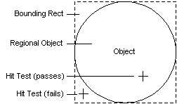

# Navigation Through Hit Testing and Screen Location

To locate an object's children or to determine an object's size, clients can hit test points on the screen. Two methods are available:

-   [**IAccessible::accHitTest**](iaccessible-iaccessible--acchittest.md)
-   [**IAccessible::accLocation**](iaccessible-iaccessible--acclocation.md)

## Using IAccessible::accHitTest

To identify whether a point is within an object, within its child, or neither, clients call the [**IAccessible::accHitTest**](iaccessible-iaccessible--acchittest.md) method of the parent object, passing the screen coordinates of the point to be hit tested. The following list describes some typical scenarios:

-   If the object's children overlap at a specified point, [**IAccessible::accHitTest**](iaccessible-iaccessible--acchittest.md) retrieves the topmost child that visually appears to occupy the space.
-   If a window covers a child, or if the child is clipped by the parent, hit testing the covered point retrieves the child even though it is not visible.
-   If the child found at the specified point is an accessible object, as opposed to a child element, the method returns the child's [**IDispatch**](idispatch-interface.md) interface.

## Using IAccessible::accLocation

To get the screen location of an object or one of the object's children, clients call [**IAccessible::accLocation**](iaccessible-iaccessible--acclocation.md). This method returns the coordinates of the specified object's bounding rectangle. If the object is not shaped like a rectangle, the method returns the coordinates of the smallest rectangle that encompasses the entire object.

The following illustration shows the relationship between a non-rectangular object's region and its bounding rectangle.

> [!Note]  
> [**IAccessible::accHitTest**](iaccessible-iaccessible--acchittest.md) is more precise than [**IAccessible::accLocation**](iaccessible-iaccessible--acclocation.md) because it enables clients to determine the location of objects on a pixel-by-pixel basis rather than with bounding rectangles. This precision is useful, for example, when an application is gathering information by tracking the location of the mouse pointer.

 

 

 

