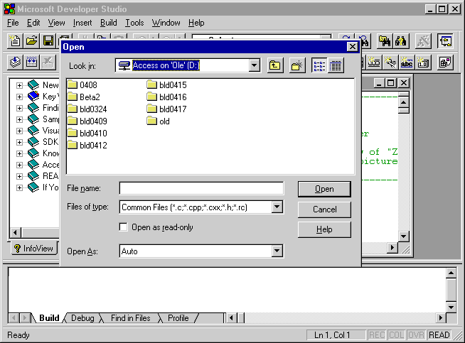

# Spatial and Logical Navigation

Clients retrieve information about an object that is spatially or logically near another object within the same container by calling [**IAccessible::accNavigate**](/windows/desktop/api/Oleacc/nf-oleacc-iaccessible-accnavigate) and specifying one of the [navigation constants](navigation-constants.md).

With *spatial navigation* clients navigate to an object based on its location on the screen. Clients navigate up, down, left, or right from the current object to obtain information about another object within the same container.

With *logical navigation* clients navigate to the object that logically precedes or follows another object, as determined by the server. Clients navigate to all of an object's children in two ways:

-   Start the navigation with [**NAVDIR\_FIRSTCHILD**](navigation-constants.md) and then repeatedly call the method with [**NAVDIR\_NEXT**](navigation-constants.md).
-   Start the navigation with [**NAVDIR\_LASTCHILD**](navigation-constants.md) and repeatedly call the method with [**NAVDIR\_PREVIOUS**](navigation-constants.md).

Regardless of the direction, the navigation visits each visible child that belongs to the parent object. Invisible children may be skipped with logical navigation. Additionally, each child is visited only once, and the navigation does not loop around. That is, the method fails if a client attempts to navigate before the first object or after the last object.

Spatial and logical navigation are related. For example, in a horizontal toolbar, calling the method with [**NAVDIR\_RIGHT**](navigation-constants.md) should produce the same results as calling the method with [**NAVDIR\_NEXT**](navigation-constants.md).

The starting object of the navigation is either the object it**self or one of the object's children, except when either** [**NAVDIR\_FIRSTCHILD**](navigation-constants.md) or [**NAVDIR\_LASTCHILD**](navigation-constants.md) is specified; in this case, the navigation must start from the object itself.

If a client navigates from an accessible object to a sibling user interface element, or if the **lVal** member of *varStart* is **CHILDID\_SELF** and the specified flag in *navDir* is any navigation flag except [**NAVDIR\_FIRSTCHILD**](navigation-constants.md) or [**NAVDIR\_LASTCHILD**](navigation-constants.md), the result in *pvarEnd* is either a child ID or an [**IDispatch**](idispatch-interface.md) interface. If *pvarEnd* contains a child ID, clients must first obtain a pointer to the parent's [**IAccessible**](/windows/desktop/api/oleacc/nn-oleacc-iaccessible) interface in order to navigate from this user interface element or to obtain more information about it. To obtain the parent object, clients call the [**IAccessible::get\_accParent**](/windows/desktop/api/Oleacc/nf-oleacc-iaccessible-get_accparent) property of the sibling object or the starting object of the navigation.

Note that clients must have information about all floating objects by calling the [**EnumChildWindows**](/windows/desktop/api/winuser/nf-winuser-enumchildwindows) function. Because a floating object is not clipped to its parent, clients do not have information about the hierarchical relationship between two objects near one another on the screen.

The following graphic is an example of a floating object that is not clipped to its parent.

## Establishing the Order in Logical Navigation

In logical navigation, the developers who design the objects establish the relationships between them. Logical navigation is more subjective than spatial navigation. Also, the order in logical navigation is not the same as the order used with child IDs.

For objects that have screen locations, server developers should establish the navigation order in the way that most users would consider logical. In English-speaking countries/regions, for instance, this means a left-to-right, top-to-bottom ordering.

Logical navigation order must parallel keyboard navigation order. For example, a dialog box contains **OK** and **Cancel** push buttons and a few edit controls. A client that calls [**IAccessible::accNavigate**](/windows/desktop/api/Oleacc/nf-oleacc-iaccessible-accnavigate) to navigate to the next or previous object in that dialog box moves in the same order as a user pressing TAB or SHIFT+TAB to move the focus between items.

For objects that do not have defined screen locations, the logical order is decided by server developers, and client developers should make no assumptions about it. For instance, it is acceptable for non-visible objects, such as objects that are only temporarily hidden, to be interspersed with visible objects.

 

 