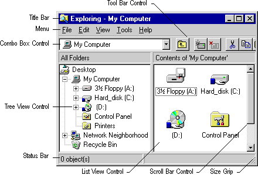

# System-Provided User Interface Elements

Microsoft Active Accessibility provides support for most predefined and common controls. The following illustration shows a typical window and some of the system-provided user interface elements that Microsoft Active Accessibility exposes, such as title bars, menus, combo boxes, toolbar controls, tree view controls, status bars, size grips, list-view controls, and scroll bars.

Microsoft Active Accessibility exposes system-provided user interface elements to server applications without requiring the server developer to implement the [**IAccessible**](/windows/desktop/api/oleacc/nn-oleacc-iaccessible) interface. Any application that contains these elements automatically inherits their accessibility.

For a list of the controls and other system-provided user interface elements that Microsoft Active Accessibility supports, see [Appendix A: Supported User Interface Elements Reference](appendix-a--supported-user-interface-elements-reference.md).

 

 

