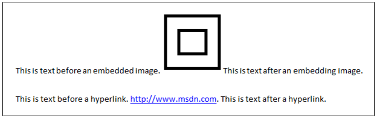

# TextChild Control Pattern

Introduces guidelines and conventions for implementing [**ITextChildProvider**](https://msdn.microsoft.com/library/windows/desktop/hh437317), including information about properties and methods. The **TextChild** control pattern is used to access an element’s nearest ancestor that supports the [Text](uiauto-implementingtextandtextrange.md) control pattern.

For example, suppose text in a document contains an embedded image and a hyperlink as shown in the following image.

If you use Microsoft UI Automation tools to examine the UI Automation tree for this document content, it might show a document element with one child element that represents the image, and another child element that represents the hyperlink. For example:

Typically, the document element in the preceding example supports the [Text](uiauto-implementingtextandtextrange.md) control pattern, but the two children of the document element do not. If a UI Automation client application has a reference to the image element or hyperlink element, the client can use the **TextChild** control pattern as a convenient way to access the Textcontrol pattern exposed by the containing document element.

## Implementation Guidelines and Conventions

When implementing the [**ITextChildProvider**](https://msdn.microsoft.com/library/windows/desktop/hh437317) interface, note the following guidelines and conventions:

-   The [**ITextChildProvider::TextContainer**](https://msdn.microsoft.com/library/windows/desktop/hh448814) property should specify the nearest ancestor element that supports [**ITextProvider**](uiauto-itextprovider.md) interface, regardless of whether elements higher in the ancestor chain also support **ITextProvider**.
-   An element should not support both the[**ITextProvider**](uiauto-itextprovider.md) and the [**ITextChildProvider**](https://msdn.microsoft.com/library/windows/desktop/hh437317) interface.
-   The [**ITextChildProvider::TextRange**](https://msdn.microsoft.com/library/windows/desktop/hh448816) property should specify the same text range as the one that the containing text provider element returns when its [**ITextProvider::RangeFromChild**](uiauto-itextprovider-rangefromchild.md) function is called with the text child element as the enclosed child element.

## Required Members for **ITextChildProvider**

These properties and methods are required for implementing the [**ITextChildProvider**](https://msdn.microsoft.com/library/windows/desktop/hh437317) interface.

| Required members                                                     | Member type | Notes |
|----------------------------------------------------------------------|-------------|-------|
| [**TextContainer**](https://msdn.microsoft.com/library/windows/desktop/hh448814) | Property    | None  |
| [**TextRange**](https://msdn.microsoft.com/library/windows/desktop/hh448816)         | Property    | None  |

 

This control pattern has no associated methods or events.

## Related topics

<dl> <dt>

**Conceptual**
</dt> <dt>

[Control Types and Their Supported Control Patterns](uiauto-controlpatternmapping.md)
</dt> <dt>

[UI Automation Control Patterns Overview](uiauto-controlpatternsoverview.md)
</dt> <dt>

[UI Automation Tree Overview](uiauto-treeoverview.md)
</dt> </dl>

 

 

