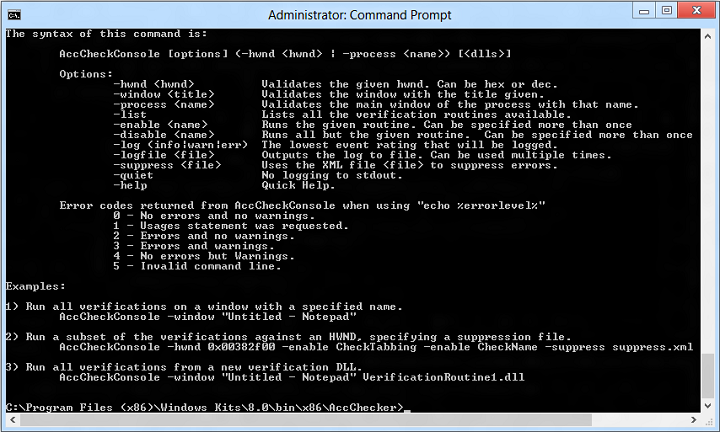

# The AccChecker Console

AccChecker Console (AccCheckConsole.exe) is a command-line tool for verifying the accessibility implementation of your application's UI. The command-line accepts a variety of inputs (such as HWND, window title, and verification routine) and supplies an exit code that corresponds to the error log count.

-   [Command-line Syntax](#command-line-syntax)
-   [Command-line Error Codes](#command-line-error-codes)
-   [Command-line Examples](#command-line-examples)
-   [Related topics](#related-topics)

## Command-line Syntax

AccChecker Console has the following command-line syntax.

**AccCheckConsole \[options\] (-hwnd &lt;hwnd&gt; \| -process &lt;name&gt;) \[&lt;dlls&gt;\]**

The command-line options are as follows.

| Options                                                                                                                                                         | Description                                                                                                                  |
|-----------------------------------------------------------------------------------------------------------------------------------------------------------------|------------------------------------------------------------------------------------------------------------------------------|
| -hwnd &lt;hwnd&gt;                                                                      | Validates the window that has the specified handle (HWND). The handle can be specified in hexidecimal or decimal.  |
| -window &lt;title&gt;                                                             | Validates the window that has the specified title.                                                                 |
|  -process &lt;name&gt;                        | Validates the main window of the process that has the specified name.                                              |
|  -list                                        | Lists all of the available verification routines.                                                                  |
|  -enable &lt;name&gt;                           | Runs the specified verification routine. This option can be specified more than once.                              |
|  -disable &lt;name&gt;  | Runs all but the specified verification routine. This option can be specified more than once.                      |
|  -log (info\|warn\|err)                           | The lowest event rating that will be logged.                                                                       |
|  -logfile &lt;file&gt;                        | Write the output to the specified log file. This option can be specified more than once.                           |
| -suppress &lt;file&gt;                                                          | Use the specified XML file to suppress errors.                                                                     |
| -quiet                                                                                              | Do not write logging output to stdout.                                                                             |
| -help                             | Displays quick help.                                                                                               |

 

## Command-line Error Codes

Following are error codes returned from AccCheckConsole when using "echo %errorlevel%"

| Error code                       | Description                                 |
|----------------------------------|---------------------------------------------|
| 0  | No errors and no warnings.        |
| 1  | Usages statement was requested.   |
| 2  | Errors and no warnings.           |
| 3  | Errors and warnings.              |
| 4  | Warnings but no errors.           |
| 5  | Invalid command line.             |

 

## Command-line Examples

Following are several AccChecker Console command-line examples.

-   Run all verifications on a window with a specified name.

    **AccCheckConsole -window "Untitled - Notepad"**

-   Run a subset of the verifications against an HWND, specifying a suppression file.

    **AccCheckConsole -hwnd 0x00382f00 -enable CheckTabbing -enable CheckName -suppress suppress.xml**

-   Run all verifications from a new verification DLL.

    **AccCheckConsole -window "Untitled - Notepad" VerificationRoutine1.dll**

## Related topics

<dl> <dt>

[UI Accessibility Checker](ui-accessibility-checker.md)
</dt> </dl>

 

 

