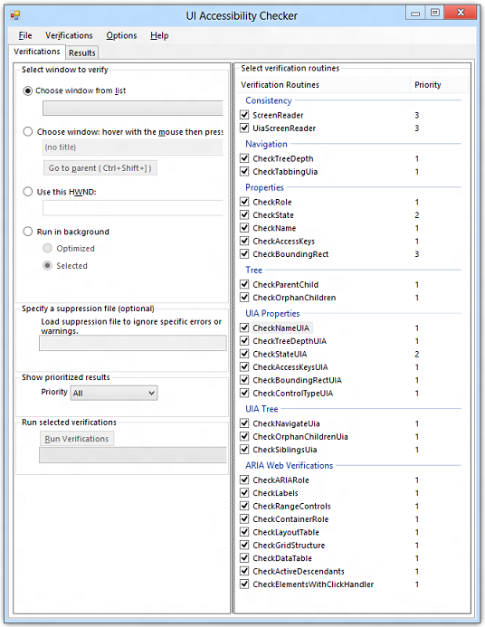
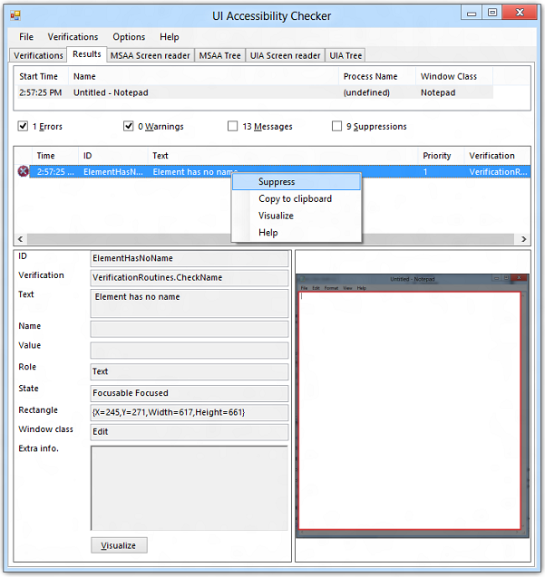
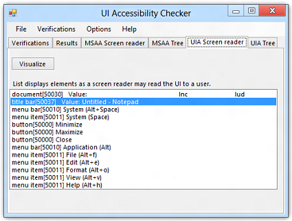
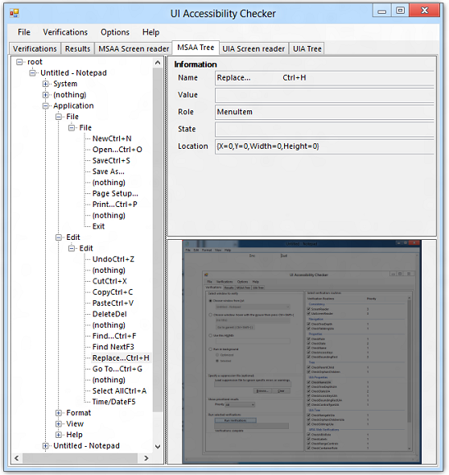

# The AccChecker Graphical User Interface

This topic describes the elements that make up the AccChecker GUI.

-   [Verifications Tab](#verifications-tab)
-   [Results Tab](#results-tab)
-   [MSAA and UIA Screen Reader Tabs](#msaa-and-uia-screen-reader-tabs)
-   [MSAA and UIA Tree Tabs](#msaa-and-uia-tree-tabs)
-   [File Menu](#file-menu)
-   [Related topics](#related-topics)

## Verifications Tab

AccChecker starts with the default view of the **Verifications** tab:



The **Verifications** tab contains the following components.

-   **Verification target selector** Offers the following options for selecting a target application or control.
    -   Choose a target from the pre-populated drop-down list. This list contains all top-level HWNDs identified at start-up.
    -   Choose an HWND based on the location of the mouse cursor (selectable controls are highlighted with a red rectangle). This option lets you select any visible object that has an HWND.
    -   Enter a particular HWND.
-   **Verification routines checklist** Provides the ability to select the desired verification routine to be performed against an application or control. See Verification Routines for more information.
-   **Error and warning suppression file selector** Suppression files are generated from the verification **Results** tab. By right-clicking an error or warning message and selecting **Suppress** from the context menu, a flag is set for that message. If the **Suppressions** check box is checked, suppressed entries appear in the list. A suppressed entry can be unsuppressed by using the same context menu used to suppress it.

    A suppression file is saved in XML format by selecting **Save Suppression** from the **File** menu. This file is consumed on subsequent verification runs where the messages will be hidden. To remove the suppression file, click **Clear**. For information on specific messages, see Verification Log Messages. Use **Save Log** from the **File** menu to save the entire list as a log file in XML or as a formatted text file.

    

    The following example shows the content of a suppression file generated by running the **Properties** verifications on the Windows Firewall control panel application. The error with an ID of "ElementHasNoName" was chosen for suppression in this example.

    ```XML
    <?xml version="1.0" encoding="utf-8"?><ArrayOfLogEvent xmlns:xsi="https://www.w3.org/2001/XMLSchema-instance" xmlns:xsd="https://www.w3.org/2001/XMLSchema">
      <LogEvent>
        <EventID>ElementHasNoName</EventID>
        <Text>Element has no name</Text>
        <ParentChain>Windows Firewall.Windows Firewall</ParentChain>
        <VerificationRoutine>VerificationRoutines.CheckName</VerificationRoutine>
        <Classname>ATL:BUTTON</Classname>
        <AccName />
        <AccRole>PushButton</AccRole>
      </LogEvent>
    </ArrayOfLogEvent>
    ```

    

-   **Show prioritized results** Offers the following options for filtering the verification results by priority.
    -   **All** Include all all results regardless of priority.
    -   **P1 only** Include only priority 0 and priority 1 results.
    -   **P1   P2 only** Include priority 0 through priority 2 results.
-   **Run selected verifications** Provides the **Run Verifications** button for starting the verification process. While verifications are running, the button changes to **Cancel Verifications** and can be used to stop the verifications after the current one completes.

## Results Tab

The **Results** tab is populated after the selected verification tasks are complete. It consists of the following components.

-   The message list, which displays the error, warning, and informational messages generated by the selected verification tasks. The messages displayed can be filtered by type using the checkboxes above the message list.
-   The message details and a screen capture of the verification target. Selecting a message from the message list displays further details and highlights the corresponding element in the screen capture pane. The **Visualize** button, switches AccChecker to the **MSAA Tree** tab. If an error is highlighted on the **Results** tab, the corresponding element is highlighted on the **MSAA Tree** tab.

Right-clicking on a message exposes a context menu with the following items.

-   **Suppress** Adds the message to the suppression list.
-   **Copy to clipboard** Copies the message details to the clipboard.
-   **Visualize** Switches AccChecker to the **MSAA Tree** tab. The element that corresponds to the selected error is highlighted.
-   **Help** Displays additional information about the message.

## MSAA and UIA Screen Reader Tabs

The MSAA Screen reader and the UIA Screen reader tabs are similar. Both display a transcript of elements encountered in a simulated traversal of the verification target by a screen reader, except that one shows the MSAA implementation, and the other shows the UIA implemention.

Elements are navigated and logged just as a screen reader would read them. The information presented on this tab is essential to confirm that only useful and relevant information is being announced. For example, a normal-sounding control name such as "MenuItem Edit" or "PushButton Close" is acceptable; however, a control name that doesn't make sense, such as "CPNavPanel22" or "DefaultValue1", is not acceptable. The **Visualize** button, causes AccChecker to switch to the **MSAA Tree** or **UIA Tree** tab. If an element is highlighted on the **Screen Reader** tab, the corresponding element is highlighted on the **MSAA Tree** or **UIA Tree** tab.

The **ScreenReader** verification routine under **Consistence** must be selected in the **Verifications** tab for the **MSAA Screen reader tab** to be displayed. Similarly, the **UiaScreenReader** verification routine must be selected for the **UIA Screen reader** tab to be displayed.

The following screen shot shows the UIA Screen reader tab with a sample verification of Notepad.



## MSAA and UIA Tree Tabs

Running any verification routine causes AccChecker to compile all visible elements in the verification target and display them hierarchically on the **MSAA Tree** tab and the **UIA Tree** tab. The following screen shot shows the MSAA Tree tab with the hierarchy of elements for Notepad.



## File Menu


<table>
<colgroup>
<col style="width: 33%" />
<col style="width: 33%" />
<col style="width: 33%" />
</colgroup>
<thead>
<tr class="header">
<th>Menu</th>
<th>Command</th>
<th>Description</th>
</tr>
</thead>
<tbody>
<tr class="odd">
<td rowspan="5"><strong>File</strong>${REMOVE}$<br />
</td>
<td><strong>Open</strong></td>
<td>Provides the following options.<br/>
<ul>
<li><strong>Verifications DLL</strong> Opens a verification DLL. Native AccChecker verifications are encapsulated in a standalone DLL (VerificationRoutines.dll). This design allows test teams to create their own set of verifications based on the UI platform being tested.</li>
<li><strong>Log file</strong> Lets you choose a verification log file to open.</li>
</ul></td>
</tr>
<tr class="even">
<td><strong>Automatically load available verifications</strong></td>
<td>Automatically loads all available AccChecker verifications.</td>

</tr>
<tr class="odd">
<td><strong>Save Log</strong></td>
<td>Save the verification log as XML or as plain text. Plain text is more readable.</td>

</tr>
<tr class="even">
<td><strong>Save Suppression</strong></td>
<td>Save the suppression log as XML. This file specifies the verification messages to ignore in regression testing.</td>

</tr>
<tr class="odd">
<td><strong>Exit</strong></td>
<td>Closes the AccChecker tool.</td>

</tr>
<tr class="even">
<td rowspan="3"><strong>Verifications</strong>${REMOVE}$<br />
</td>
<td><strong>Run Now</strong></td>
<td>Run the verification routines as specified for the chosen verification target.</td>
</tr>
<tr class="odd">
<td><strong>Enable All</strong></td>
<td>Check all verification routine check boxes.</td>

</tr>
<tr class="even">
<td><strong>Disable All</strong></td>
<td>Uncheck all verification routine check boxes.</td>

</tr>
<tr class="odd">
<td><strong>Options</strong></td>
<td><strong>Always On Top</strong></td>
<td>Make AccChecker the topmost window in the z-order.</td>
</tr>
<tr class="even">
<td rowspan="2"><strong>Help</strong>${REMOVE}$<br />
</td>
<td><strong>Help</strong></td>
<td>Display help information.</td>
</tr>
<tr class="odd">
<td><strong>About</strong></td>
<td>Display the AccChecker version and an email address for contacting Microsoft about AccChecker.</td>

</tr>
</tbody>
</table>


 

## Related topics

<dl> <dt>

[UI Accessibility Checker](ui-accessibility-checker.md)
</dt> </dl>

 

 


