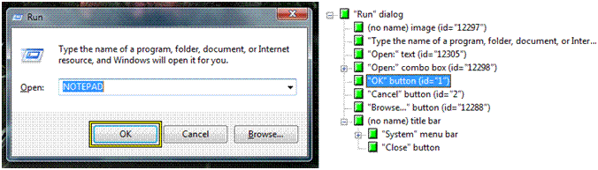

# UI Automation Specification

This topic provides an overview of the Microsoft UI Automation Specification, which forms the basis of the Windows implementation of UI Automation. The UI Automation Specification can be supported across platforms other than Microsoft Windows. For more information, see [UI Automation Specification](./uiauto-specandcommunitypromise.md)

This topic contains the following sections:

-   [Introducton](#introducton)
-   [UI Automation Elements](#ui-automation-elements)
-   [UI Automation Tree](#ui-automation-tree)
-   [UI Automation Properties](#ui-automation-properties)
-   [UI Automation Control Patterns](#ui-automation-control-patterns)
-   [UI Automation Control Types](#ui-automation-control-types)
-   [UI Automation Events](#ui-automation-events)
-   [Related topics](#related-topics)

## Introducton

The UI Automation Specification provides flexible programmatic access to UI elements on the Windows desktop, enabling assistive technology products such as screen readers to provide information about the UI to end users and to manipulate the UI by means other than standard input.

UI Automation is broader in scope than just an interface definition. It provides:

-   An object model and functions that make it easy for client applications to receive events, retrieve property values, and manipulate UI elements.
-   A core infrastructure for finding and fetching across process boundaries.
-   A set of interfaces for providers to express the tree structure, general properties, and functionality of UI elements.
-   A "control type" property that allows clients and providers to clearly indicate the common properties, functionality, and structure of a UI object.

UI Automation improves on Microsoft Active Accessibility by:

-   Enabling efficient out-of-process clients, while continuing to allow in-process access.
-   Exposing more information about the UI in a way that allows clients to be out-of-process.
-   Coexisting with and leveraging Microsoft Active Accessibility without inheriting its limitations. For more information, see [Microsoft Active Accessibility and UI Automation Compared](microsoft-active-accessibility-and-ui-automation-compared.md).
-   Providing an alternative to [**IAccessible**](/windows/desktop/api/oleacc/nn-oleacc-iaccessible) that is simple to implement.

The implementation of the UI Automation Specification in Windows features Component Object Model (COM)-based interfaces and managed interfaces.

## UI Automation Elements

UI Automation exposes every piece of the UI to client applications as an *automation element*. Providers supply property values for each element. Elements are exposed as a tree structure, with the desktop as the root element.

Automation elements expose common properties of the UI elements they represent. One of these properties is the control type, which describes its basic appearance and functionality (for example, a button or a check box).

## UI Automation Tree

The UI Automation tree represents the entire UI: the root element is the current desktop, and child elements are application windows. Each of these child elements can contain elements representing menus, buttons, toolbars, and so on. These elements in turn can contain elements like list items, as the following illustration shows.

Be aware that the order of the siblings in the UI Automation tree is quite important. Objects that are next to each other visually should also be next to each other in the UI Automation tree.

UI Automation providers for a particular control support navigation among the child elements of that control. However, providers are not concerned with navigation between these control sub-trees. This is managed by the UI Automation core, using information from the default window providers.

To help clients process UI information more effectively, the framework supports alternative views of the automation tree: raw view, control view, and content view. As the following table shows, the type of filtering determines the views, and the client defines the scope of a view.

| Automation Tree | Description                                                                                                             |
|-----------------|-------------------------------------------------------------------------------------------------------------------------|
| Raw view        | The full tree of automation element objects for which the desktop is the root.                                          |
| Control view    | A subset of the raw view that closely maps to the UI structure as the user perceives it.                                |
| Content view    | A subset of the control view that contains content most relevant to the user, like the values in a drop-down combo box. |

 

For more information, see [UI Automation Tree Overview](uiauto-treeoverview.md).

## UI Automation Properties

The UI Automation Specification defines two kinds of properties: automation element properties and control pattern properties. Automation element properties apply to most controls, providing fundamental information about the element, such as its name. Control pattern properties apply to control patterns, which are described next.

Unlike with Microsoft Active Accessibility, every UI Automation property is identified by a GUID and a programmatic name, which makes new properties easier to introduce.

For more information, see [UI Automation Properties Overview](uiauto-propertiesoverview.md).

## UI Automation Control Patterns

A control pattern describes a particular aspect of the functionality of an automation element. For example, a simple "click-able" control like a button or hyperlink should support the Invoke control pattern to represent the "click" action.

Each control pattern is a canonical representation of possible UI features and functions. The current implementation of UI Automation defines 22 control patterns. The Windows Automation API can also support custom control patterns. Unlike Microsoft Active Accessibility role or state properties, one automation element can support multiple UI Automation control patterns.

For more information, see [UI Automation Control Patterns Overview](uiauto-controlpatternsoverview.md).

## UI Automation Control Types

A control type is an automation element property that specifies a well-known control that the element represents. Currently, UI Automation defines thirty-eight control types, including Button, CheckBox, ComboBox, DataGrid, Document, Hyperlink, Image, ToolTip, Tree, and Window.

Before you can assign a control type to an element, the element needs to meet certain conditions, including a particular automation tree structure, property values, control patterns, and events. However, you are not limited to these. You can extend a control with custom patterns and properties, as well as with the predefined ones.

The total number of predefined control types is significantly lower than Microsoft Active Accessibility [object roles](object-roles.md), because UI Automation control patterns can be combined to express a larger set of features while Microsoft Active Accessibility roles cannot.

For more information, see [UI Automation Control Types Overview](uiauto-controltypesoverview.md).

## UI Automation Events

UI Automation events notify applications of changes to, and actions taken with automation elements. There are four different types of UI Automation events, and they do not necessarily mean that the visual state of the UI has changed. The UI Automation event model is independent of the [WinEvent](winevents-infrastructure.md) framework in Windows, although the Windows Automation API makes UI Automation events interoperable with the Microsoft Active Accessibility framework.

For more information, see [UI Automation Events Overview](uiauto-eventsoverview.md).

## Related topics

[UI Automation Specification](./uiauto-specandcommunitypromise.md), [Windows Automation API Overview](windows-automation-api-overview.md)
