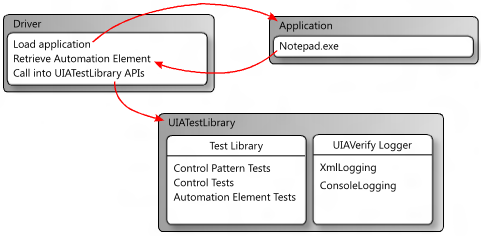

# UI Automation Test Library

The UI Automation Test Library (UIA Test Library) is an API that is called by the *driver* application in an automated testing scenario. The driver is the application that obtains an automation element ([**IUIAutomationElement**](/windows/desktop/api/UIAutomationClient/nn-uiautomationclient-iuiautomationelement) object) from a control that requires verification, and provides it to the UI Automation Test Library. Then, the test library checks and validates the UI Automation implementation. To learn more about UI Automation and automation elements, see [UI Automation Fundamentals](entry-uiautocore-overview.md).

-   [UI Automation Test Library Workflow](#ui-automation-test-library-workflow)
-   [Logging with the UI Automation Test Library](#logging-with-the-ui-automation-test-library)
    -   [XML Logging](#xml-logging)
    -   [Console Logging](#console-logging)
    -   [Code Requirements for Logging](#code-requirements-for-logging)
    -   [Logging Examples](#logging-examples)

## UI Automation Test Library Workflow

The following diagram shows a test workflow that incorporates the UI Automation Test Library by using a console application as the driver. In this case, the driver starts an instance of Notepad.exe and obtains an automation element (that is, a [**IUIAutomationElement**](/windows/desktop/api/UIAutomationClient/nn-uiautomationclient-iuiautomationelement) object) from the edit control. Next, the driver creates a UI Automation Test Library object based on the UI platform being tested, and then passes in the automation element as a parameter. The UI Automation Test Library determines that the automation element is a [Document](uiauto-supportdocumentcontroltype.md) control type, and then executes the Document control tests, the [Text](uiauto-implementingtextandtextrange.md) and [Scroll](uiauto-implementingscroll.md) control pattern tests, and generic automation element tests.



## Logging with the UI Automation Test Library

The UI Automation Test Library uses external DLLs to log results from test runs. It supports logging as XML and logging to the console.

### XML Logging

XML logging is typically used by Visual UI Automation Verify, but it can also be incorporated into a command-line workflow.

If XML logging is specified, the driver application must serialize the output by creating an **XmlWriter** object and passing it to the **XmlLog.GetTestRunXml** method. The driver can then use the serialized XML internally or write it to a file.

The following DLLs are required for XML logging.

-   WUIALogging.dll
-   WUIALoggerXml.dll

### Console Logging

By default, the UI Automation Test Library uses console logging, where all logging output is piped as plain text to the console window. WUIALogging.dll is required for console logging.

### Code Requirements for Logging

A driver application must include the following code snippets to use UI Automation Test Library logging.


```CSharp
\\ Include logging functionality.
using Microsoft.Test.UIAutomation.Logging;

...

\\ Select a logger.
UIAVerifyLogger.SetLoggerType(LogTypes.DefaultLogger | 
                              LogTypes.ConsoleLogger | 
                              LogTypes.XmlLogger);

...

\\ Output comment to selected logger.
UIAVerifyLogger.LogComment("...");
```


### Logging Examples

The following examples demonstrate basic logging functionality and show how to use the UI Automation Test Library API in a basic test automation driver application.


```CSharp
//---------------------------------------------------------------------------
//
// Description: Sample logger.
//
//---------------------------------------------------------------------------
using System;

namespace WUITest
{
    using Microsoft.Test.UIAutomation.Logging;

    public sealed class TestMain
    {
        private TestMain() { }

        /// -----------------------------------------------------------------
        /// <summary>
        /// Entry point
        /// </summary>
        /// -----------------------------------------------------------------
        [STAThread]
        static void Main(string[] args)
        {
            // Call SetLogger() if you don't want to use the default logger.
            // To set the logger type, call SetLogger(<string>).
            // <string> can be specified from the command line or from the 
            // the UI Automation Test Library enumeration:
            //  
            //     Logger.SetLogger(LogTypes.ConsoleLogger);
            //     Logger.SetLogger(LogTypes.DefaultLogger);

            Logger.SetLogger(LogTypes.DefaultLogger);

            Logger.StartTest("Test 1");
            Logger.LogComment("This is a comment");
            Logger.LogError(new Exception("My error"), false);
            Logger.EndTest();

            Logger.StartTest("Test 2");
            Logger.LogComment("This is a second comment");
            Logger.LogPass();
            Logger.EndTest();

            Logger.ReportResults();

        }
    }
}
```


```CSharp
//---------------------------------------------------------------------------
//
// Description: Sample test automation.
//
//---------------------------------------------------------------------------

using System;
using System.Windows;

namespace WUITest
{
    using System.Diagnostics;
    using System.Threading;
    using System.Windows.Automation;
    using Microsoft.Test.UIAutomation;
    using Microsoft.Test.UIAutomation.Core;
    using Microsoft.Test.UIAutomation.TestManager;
    using Microsoft.Test.UIAutomation.Tests.Controls;
    using Microsoft.Test.UIAutomation.Tests.Patterns;
    using Microsoft.Test.UIAutomation.Tests.Scenarios;
    using Microsoft.Test.UIAutomation.Logging;

    public sealed class TestMain
    {

        // Time in milliseconds to wait for the application to start.
        static int MAXTIME = 5000;
        // Time in milliseconds to wait before trying to find the application.
        static int TIMEWAIT = 100; 

        /// -------------------------------------------------------------------
        /// <summary>
        /// Start Notepad, obtain an AutomationElement object, and run tests.
        /// </summary>
        /// -------------------------------------------------------------------
        [STAThread]
        static void Main(string[] args)
        {
            // Dump the information to the console window.  
            // Use a different LogTypes value if you need to dump to another logger, 
            // or create your own logger that complies with the interface.
            UIAVerifyLogger.SetLoggerType(LogTypes.ConsoleLogger);

            // Get the automation element.
            AutomationElement element = StartApplication("NOTEPAD.EXE", null);

            // Call the UI Automation Test Library tests.
            TestRuns.RunAllTests(element, true, TestPriorities.Pri0, 
                    TestCaseType.Generic, false, true, null);

            // Clean up.
            ((WindowPattern)element.GetCurrentPattern(WindowPattern.Pattern)).Close();

            // Dump the summary of results.
            UIAVerifyLogger.ReportResults();
        }

        /// -------------------------------------------------------------------------
        /// <summary>
        /// Start the application and retrieve its AutomationElement. 
        /// </summary>
        /// -------------------------------------------------------------------------
        static public AutomationElement StartApplication(string appPath, 
                string arguments)
        {
            Process process;

            Library.ValidateArgumentNonNull(appPath, "appPath");

            ProcessStartInfo psi = new ProcessStartInfo();

            process = new Process();
            psi.FileName = appPath;

            if (arguments != null)
            {
                psi.Arguments = arguments;
            }

            UIAVerifyLogger.LogComment("Starting({0})", appPath);
            process.StartInfo = psi;

            process.Start();

            int runningTime = 0;
            while (process.MainWindowHandle.Equals(IntPtr.Zero))
            {
                if (runningTime > MAXTIME)
                    throw new Exception("Could not find " + appPath);

                Thread.Sleep(TIMEWAIT);
                runningTime += TIMEWAIT;

                process.Refresh();
            }

            UIAVerifyLogger.LogComment("{0} started", appPath);

            UIAVerifyLogger.LogComment("Obtained an AutomationElement for {0}", appPath);
            return AutomationElement.FromHandle(process.MainWindowHandle);

        }
    }
}
```


 

 


