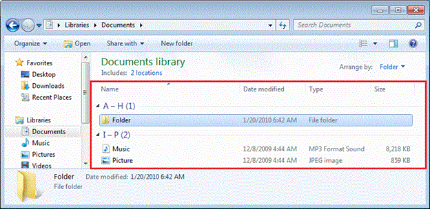

# How to Query a Virtualized Item in Items View

This topic describes how to use Microsoft UI Automation to retrieve UI information about virtualized items in the Windows 7 Items View. This topic includes the following sections.

> [!Note]  
> This topic applies to Windows 7 only. Be aware that the accessibility features described in this topic may change in future versions of Windows.

 

-   [Overview](#overview)
-   [Items View Tree Structure](#items-view-tree-structure)
-   [Virtualization](#virtualization)
-   [Obtaining a Count of All Items](#obtaining-a-count-of-all-items)
-   [Obtaining an Item Index with Respect to All Items](#obtaining-an-item-index-with-respect-to-all-items)
-   [Obtaining a Reference to a Vitualized Item](#obtaining-a-reference-to-a-vitualized-item)
-   [Scrolling a Virtualized Item on Screen](#scrolling-a-virtualized-item-on-screen)
-   [Related topics](#related-topics)

## Overview

Items View is a user interface component that enables users to view and interact with files and other items. In Windows 7, Items View replaces the list-view control for presenting items in the default view of Windows Explorer. Items View is also used in the Common Item Dialog, Start menu search results, and other Windows 7 UI elements that use the Explorer Browser control. Compared to the list-view control, Items View offers the following advantages to users:

-   Items View can present items in ways that are more useful, desirable, and relevant, enabling users to find and organize items more simply, quickly, and enjoyably.
-   Items View can display large sets of items from data sources that have different performance characteristics, enabling users to browse and search their entire collection of items across multiple sources.

The following image shows the Items View in Windows Explorer.

From a developer's perspective, the general structure and functionality of Items View is similar to that of the list-view control. The main difference is that Items View supports virtualization, whereas the list-view control does not. Also, Items View uses two new UI Automation interfaces to ensure that virtualized content provided by Items View is accessible. These interfaces are described in the following sections of this topic.

For general information about virtualization in UI Automation, see [Working with Virtualized Items](uiauto-workingwithvirtualizeditems.md).

## Items View Tree Structure

In the UI Automation tree, the top level UI Automation element of Items View has the name "ItemsView" and the control type "list". In the previous image, the ItemsView UI Automation element is outlined in red. Various UI Automation elements exist below the top level of ItemsView, but only two other UI Automation elements are referenced in this document: group items and list items.

The group items are the UI Automation elements that contain all of the list items of that group—their control type is "Group" and their names vary depending on the group name. In the previous image, the first group item contains both the "A-H (1)" header and the "Folder" list item, and its name is "A-H".

The list items are the UI Automation elements that represent the leaf items in the view—their control type is "ListItem" and their names vary depending on the item name. In the previous image, the list elements are the leaf elements such as "Folder", "Music", and "Picture". These three UI Automation elements are referred to by the terms ItemsView element, Group element, and ListItem element in the remainder of this document.

## Virtualization

Items View uses virtualization, which means that items outside the visible area of the view are not fetched from the system, and the UI representation of them is not created. These items are called *virtualized items*. Because they are not created, virtualized items do not have UI Automation elements and therefore do not appear in the UI Automation tree when a UI Automation client enumerates the tree. Also, UI Automation control patterns operate only on visible elements. For example, the [Selection](uiauto-implementingselection.md) control pattern returns only the visible selected items when a client calls the [**IUIAutomationSelectionPattern::GetCurrentSelection**](/windows/desktop/api/UIAutomationClient/nf-uiautomationclient-iuiautomationselectionpattern-getcurrentselection) method.

Items View supports the ability to retrieve the following information about virtualized items:

-   A count of the total number of items, including virtualized items
-   UI Automation elements for virtualized items
-   UI Automation elements for the virtualized items that are selected

## Obtaining a Count of All Items

A client can use the ItemsView element to get a count of all items, as well as a count of the selected items. The ItemsView element provides two ways to get these counts. The first is by getting the ItemStatus property of the ItemsView element, and the second is by getting custom properties from the ItemsView element.

The ItemStatus property is a string that specifies a count of the total number of items and a count of the selected items, separated by a comma. For example: "3 items, 1 item selected". This string is localized and can be communicated directly to the user.

The custom properties of the ItemsView element include one property for the item count, and another for the selection count. They include:

-   ItemCount\_Property\_GUID (ABBF5C45-5CCC-47b7-BB4E-87CB87BBD162)—The count of all unique items in the view. If grouped by a multi-value property (MVP) so that a single item can appear multiple times, each item is counted only once.

    (UIAutomationType: [**UIAutomationType\_Int**](/windows/desktop/api/UIAutomationCore/ne-uiautomationcore-uiautomationtype), Programmatic Name: "ItemCount")

-   SelectedItemCount\_Property\_GUID (92A053DA-2969-4021-BF27-514CFC2E4A69)—The count of all unique items selected in the view. If grouped by a multi-value property (MVP) so that a single item can appear multiple times, each item is counted only once.

    (UIAutomationType: [**UIAutomationType\_Int**](/windows/desktop/api/UIAutomationCore/ne-uiautomationcore-uiautomationtype), Programmatic Name: "SelectedItemCount")

These custom properties are defined in Shlguid.h, which is included in the Windows Software Development Kit (SDK), and these properties are registered through the [**IUIAutomationRegistrar::RegisterProperty**](/windows/desktop/api/UIAutomationCore/nf-uiautomationcore-iuiautomationregistrar-registerproperty) method. UI Automation clients use **RegisterProperty** to retrieve property identifiers (PROPERTYIDs) for the custom properties.

## Obtaining an Item Index with Respect to All Items

A client can obtain the index of an item either by getting the ItemStatus property of a ListItem element, or by getting a custom property of a ListItem element.

The ItemStatus property is a string that contains the index of an item with respect to the total number of items. For example: "item 1 of 3". This string is localized and can be communicated directly to the user.

The following custom property gets the item index of a ListItem element:

-   ItemIndex\_Property\_GUID (92A053DA-2969-4021-BF27-514CFC2E4A69)—The 1-based absolute index of an item. If grouped by a multi-value property (MVP) so that a single item can appear twice, each appearance of the item gets a separate index.

    (UIAutomationType: [**UIAutomationType\_Int**](/windows/desktop/api/UIAutomationCore/ne-uiautomationcore-uiautomationtype), Programmatic Name: "ItemIndex")

This custom property is defined in Shlguid.h, which is included in the Windows SDK, and is registered through the [**IUIAutomationRegistrar::RegisterProperty**](/windows/desktop/api/UIAutomationCore/nf-uiautomationcore-iuiautomationregistrar-registerproperty) method. UI Automation clients use **RegisterProperty** to retrieve a property identifier (PROPERTYIDs) for the custom property.

## Obtaining a Reference to a Vitualized Item

An ItemsView element implements the [ItemContainer](uiauto-implementingitemcontainer.md) control pattern ([**IItemContainerProvider**](/windows/desktop/api/UIAutomationCore/nn-uiautomationcore-iitemcontainerprovider) interface), which allows a client to get a UI Automation element for a virtualized item (an item that is outside the visible area). ItemsView allows the client to find a ListItem element by searching on the Name and Selection properties—attempting to search on any other property will fail.

A virtual element implements only the [VirtualizedItem](uiauto-implementingvirtualizeditem.md) control pattern ([**IVirtualizedItemProvider**](/windows/desktop/api/UIAutomationCore/nn-uiautomationcore-ivirtualizeditemprovider) interface). Because the item that is represented by a virtualized UI Automation element does not exist yet, attempting to get any other control pattern or property of the element will fail.

Both ListItem and Group elements are virtualized, but only ListItem elements can be returned from the [ItemContainer](uiauto-implementingitemcontainer.md) control pattern. Because the call to the [**IUIAutomationItemContainerPattern::FindItemByProperty**](/windows/desktop/api/UIAutomationClient/nf-uiautomationclient-iuiautomationitemcontainerpattern-finditembyproperty) method runs on the UI thread and is blocking, the view will not respond until **FindItemByProperty** returns, and any other method calls on the provider must wait until **FindItemByProperty** finishes. In some instances, **FindItemByProperty** must process the entire data set before returning, which can be resource-intensive. Specifying **NULL** as the starting element causes **FindItemByProperty** to begin the search with the first item in the view.

ItemsView supports the following properties for [**FindItemByProperty**](/windows/desktop/api/UIAutomationClient/nf-uiautomationclient-iuiautomationitemcontainerpattern-finditembyproperty):

-   Name (UIA\_NamePropertyId)—Searches for the first item whose name fully matches the specified string. The search is not case sensitive. Wildcard characters or partial matching is not supported. If a **NULL** name is specified, the next item after the starting element is returned. Specifying **NULL** names allows a UI Automation client to enumerate all items in the view; however, enumerating all items is discouraged because it causes all items in the view to be realized.
-   SelectionItem\_IsSelected (UIA\_SelectionItemIsSelectedPropertyId)—Searches for the first item whose SelectionItem\_IsSelected property matches the specified value. Specify **TRUE** to find the first selected item, or **FALSE** to find the first non-selected item. Be careful when enumerating all selected items because the number of selected items can be very large, especially if the user has selected all items.

## Scrolling a Virtualized Item on Screen

After obtaining a reference to a UI Automation element for a virtualized (off-screen) item, the client can scroll the item into view by using the [**IUIAutomationVirtualizeItemPattern::Realize**](/windows/desktop/api/UIAutomationClient/nf-uiautomationclient-iuiautomationvirtualizeditempattern-realize) method of the [VirtualizedItem](uiauto-implementingvirtualizeditem.md) control pattern. After the item is realized, it is visible, and all properties and control patterns normally associated with a ListItem element are available to the client.

Only ListItem elements obtained by the [**IUIAutomationItemContainerPattern::FindItemByProperty**](/windows/desktop/api/UIAutomationClient/nf-uiautomationclient-iuiautomationitemcontainerpattern-finditembyproperty) method expose the [VirtualizedItem](uiauto-implementingvirtualizeditem.md) control pattern. When an on-screen element is scrolled off-screen, the element becomes invalid and the client must call **FindItemByProperty** to get the off-screen reference.

It is also possible to move items into and out of view by using the [Scroll](uiauto-implementingscroll.md) control pattern (or by using the scroll bars). Items and groups are realized as they scroll into view, and are virtualized as they scroll out of view.

## Related topics

<dl> <dt>

[Working with Virtualized Items](uiauto-workingwithvirtualizeditems.md)
</dt> </dl>

 

 

