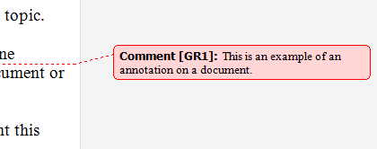

# Annotation Control Pattern

Describes guidelines and conventions for implementing [**IAnnotationProvider**](/windows/desktop/api/uiautomationcore/nn-uiautomationcore-iannotationprovider), including information about properties and methods. The **Annotation** control pattern is used to expose the properties of an annotation in a document.

One example is a comment balloon that is in the margin of a document and is connected to some document text or a spreadsheet cell.

The following illustration shows an example of an annotation. For examples of controls that implement this control pattern, see [Control Types and Their Supported Control Patterns](uiauto-controlpatternmapping.md).

This topic contains the following sections.

-   [Implementation Guidelines and Conventions](#implementation-guidelines-and-conventions)
-   [Required Members for **IAnnotationProvider**](#required-members-for-iannotationprovider)
-   [Related topics](#related-topics)

## Implementation Guidelines and Conventions

When implementing the **Annotation** control pattern, note the following guidelines and conventions:

-   There are many different kinds of annotations. The UIAutomationClient.h header file defines a set of named constant values that identify the types of annotations that Microsoft UI Automation supports. For more information, see [**Annotation Type Identifiers**](uiauto-annotation-type-identifiers.md).
-   If you use [**AnnotationType\_Unknown**](uiauto-annotation-type-identifiers.md), you must implement the [**IAnnotationProvider::AnnotationTypeName**](/windows/desktop/api/uiautomationcore/nf-uiautomationcore-iannotationprovider-get_annotationtypename) property to enable clients to discover the name of the annotation type. You do not need to implement **AnnotationTypeName** for a standard annotation type because UI Automation provides a default name, but you can implement it if you need to override the default name.
-   The [**IAnnotationProvider::Author**](/windows/desktop/api/uiautomationcore/nf-uiautomationcore-iannotationprovider-get_author) property is optional.
-   The [**IAnnotationProvider::DateTime**](/windows/desktop/api/uiautomationcore/nf-uiautomationcore-iannotationprovider-get_datetime) property is optional.
-   The [**IAnnotationProvider::Target**](/windows/desktop/api/uiautomationcore/nf-uiautomationcore-iannotationprovider-get_target) property is required because it links an annotation to a UI element, enabling a client to navigate from the annotation back to the UI element to which the annotation refers.
-   Because annotations can take many different forms, the [**IAnnotationProvider**](/windows/desktop/api/uiautomationcore/nn-uiautomationcore-iannotationprovider) interface does not define a property for storing the value or text of an annotation. A simple annotation should expose the [**IValueProvider**](/windows/desktop/api/UIAutomationCore/nn-uiautomationcore-ivalueprovider) interface, and the [**IValueProvider::Value**](/windows/desktop/api/UIAutomationCore/nf-uiautomationcore-ivalueprovider-get_value) property should return a read-only value that specifies the annotation text. A richer annotation should expose the [**ITextProvider**](/windows/desktop/api/UIAutomationCore/nn-uiautomationcore-itextprovider) interface to provide richer text to clients.
-   Navigating from a UI element to an annotation on the element depends on the kind of element being annotated, as follows:
    -   For spreadsheet cells, implement the [**ISpreadsheetItemProvider::GetAnnotationObjects**](/windows/desktop/api/uiautomationcore/nf-uiautomationcore-ispreadsheetitemprovider-getannotationobjects) method to refer to the annotation.
    -   For textual content, implement the [**AnnotationObjects**](uiauto-textattribute-ids.md) text attribute on the [**ITextRangeProvider**](/windows/desktop/api/UIAutomationCore/nn-uiautomationcore-itextrangeprovider) interface to refer to the annotation.
-   Some kinds of annotations do not require a full implementation of the [**IAnnotationProvider**](/windows/desktop/api/uiautomationcore/nn-uiautomationcore-iannotationprovider) interface. For example, a simple spelling-error indicator could be represented by having the [**ITextRangeProvider**](/windows/desktop/api/UIAutomationCore/nn-uiautomationcore-itextrangeprovider) interface return an [**AnnotationTypes**](uiauto-textattribute-ids.md) text attribute of [**AnnotationType\_SpellingError**](uiauto-annotation-type-identifiers.md), and a null value for the [**AnnotationObjects**](uiauto-textattribute-ids.md) text attribute.
-   It can be useful to implement the [**IAnnotationProvider**](/windows/desktop/api/uiautomationcore/nn-uiautomationcore-iannotationprovider) interface on a UI element that is not visible. For example, you could create a non-visible UI Automation element that implements **IAnnotationProvider** to provide extended information about a grammar error.
-   Annotations in a text-based control can be complex if the control contains overlapping comments. Use the following guidelines to handle complex annotations:
    -   A text range with no annotations should return an empty array for the [**AnnotationTypes**](uiauto-textattribute-ids.md) text attribute and an empty array for the [**AnnotationObjects**](uiauto-textattribute-ids.md) text attribute.
    -   A text range with one annotation should return an array of one integer value for the [**AnnotationTypes**](uiauto-textattribute-ids.md) text attribute and an array of one [**IRawElementProviderSimple**](/windows/desktop/api/UIAutomationCore/nn-uiautomationcore-irawelementprovidersimple) interface for the [**AnnotationObjects**](uiauto-textattribute-ids.md) text attribute.
    -   A text range with multiple annotations should return an array of multiple integer values for the [**AnnotationTypes**](uiauto-textattribute-ids.md) text attribute and an array of a matching number of [**IRawElementProviderSimple**](/windows/desktop/api/UIAutomationCore/nn-uiautomationcore-irawelementprovidersimple) interfaces for the [**AnnotationObjects**](uiauto-textattribute-ids.md) text attribute.
    -   A text range with varying annotations, such as a range with both annotated and non-annotated text, should return the [**ReservedMixedAttributeValue**](/windows/desktop/api/UIAutomationCoreApi/nf-uiautomationcoreapi-uiagetreservedmixedattributevalue) property for both [**AnnotationTypes**](uiauto-textattribute-ids.md) and [**AnnotationObjects**](uiauto-textattribute-ids.md). A client receiving this response can subdivide the text range to find where the annotations begin and end.

## Required Members for **IAnnotationProvider**

The following properties are required for implementing the [**IAnnotationProvider**](/windows/desktop/api/uiautomationcore/nn-uiautomationcore-iannotationprovider) interface.

| Required members                                                                | Member type | Notes |
|---------------------------------------------------------------------------------|-------------|-------|
| [**AnnotationTypeId**](/windows/desktop/api/uiautomationcore/nf-uiautomationcore-iannotationprovider-get_annotationtypeid)     | Property    | None. |
| [**AnnotationTypeName**](/windows/desktop/api/uiautomationcore/nf-uiautomationcore-iannotationprovider-get_annotationtypename) | Property    | None. |
| [**Author**](/windows/desktop/api/uiautomationcore/nf-uiautomationcore-iannotationprovider-get_author)                         | Property    | None. |
| [**DateTime**](/windows/desktop/api/uiautomationcore/nf-uiautomationcore-iannotationprovider-get_datetime)                     | Property    | None. |
| [**Target**](/windows/desktop/api/uiautomationcore/nf-uiautomationcore-iannotationprovider-get_target)                         | Property    | None. |

 

This control pattern has no associated events.

## Related topics

<dl> <dt>

[Control Types and Their Supported Control Patterns](uiauto-controlpatternmapping.md)
</dt> <dt>

[UI Automation Control Patterns Overview](uiauto-controlpatternsoverview.md)
</dt> <dt>

[UI Automation Tree Overview](uiauto-treeoverview.md)
</dt> </dl>

 

 