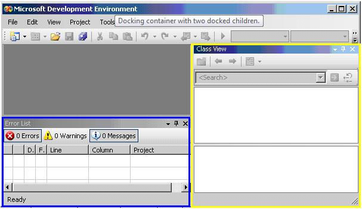

# Dock Control Pattern

Describes guidelines and conventions for implementing [**IDockProvider**](/windows/win32/UIAutomationCore/nn-uiautomationcore-idockprovider?branch=master), including information about properties and methods. The **Dock** control pattern is used to expose the dock properties of a control within a docking container.

A docking container is a control that allows you to arrange child elements horizontally and vertically, relative to each other. The following image shows a docking container with two child elements. For examples of controls that implement this control pattern, see [Control Types and Their Supported Control Patterns](uiauto-controlpatternmapping.md).

This topic contains the following sections.

-   [Implementation Guidelines and Conventions](#implementation-guidelines-and-conventions)
-   [Required Members for **IDockProvider**](#required-members-for-idockprovider)
-   [Related topics](#related-topics)

## Implementation Guidelines and Conventions

When implementing the **Dock** control pattern, note the following guidelines and conventions:

-   [**IDockProvider**](/windows/win32/UIAutomationCore/nn-uiautomationcore-idockprovider?branch=master) does not expose any properties of the docking container or any properties of controls that are docked adjacent to the current control within the docking container.
-   Controls are docked relative to each other based on their current z-order; the higher their z-order placement, the farther they are placed from the specified edge of the docking container.
-   If the docking container is resized, any docked controls within the container will be repositioned flush to the same edge to which they were originally docked. The docked controls will also resize to fill any space within the container according to the docking behavior of their [**DockPosition**](/windows/win32/UIAutomationCore/nf-uiautomationcore-idockprovider-get_dockposition?branch=master) property. For example, if **DockPosition\_Top** is specified, the left and right sides of the control will expand to fill any available space. If **DockPosition\_Fill** is specified, all four sides of the control will expand to fill any available space.
-   On a multi-monitor system, controls should dock to the left or right side of the current monitor. If that is not possible, they should dock to the left side of the leftmost monitor or the right side of the rightmost monitor.

## Required Members for **IDockProvider**

The following properties and methods are required for implementing the [**IDockProvider**](/windows/win32/UIAutomationCore/nn-uiautomationcore-idockprovider?branch=master) interface.

| Required members                                                | Member type | Notes |
|-----------------------------------------------------------------|-------------|-------|
| [**DockPosition**](/windows/win32/UIAutomationCore/nf-uiautomationcore-idockprovider-get_dockposition?branch=master)       | Property    | None  |
| [**SetDockPosition**](/windows/win32/UIAutomationCore/nf-uiautomationcore-idockprovider-setdockposition?branch=master) | Method      | None  |

 

This control pattern has no associated events.

## Related topics

<dl> <dt>

[Control Types and Their Supported Control Patterns](uiauto-controlpatternmapping.md)
</dt> <dt>

[UI Automation Control Patterns Overview](uiauto-controlpatternsoverview.md)
</dt> <dt>

[UI Automation Tree Overview](uiauto-treeoverview.md)
</dt> </dl>

 

 

