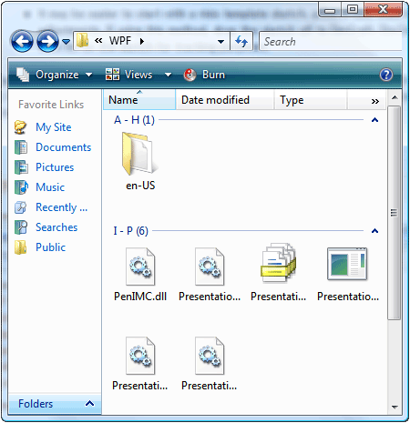

# Grid Control Pattern

Describes guidelines and conventions for implementing [**IGridProvider**](/windows/win32/UIAutomationCore/nn-uiautomationcore-igridprovider?branch=master), including information about properties and methods. The **Grid** control pattern is used to support controls that act as containers for a collection of child elements.

The children of this element must implement [**IGridItemProvider**](/windows/win32/UIAutomationCore/nn-uiautomationcore-igriditemprovider?branch=master) and be organized in a two-dimensional logical coordinate system that can be traversed by row and column. For examples of controls that implement this control pattern, see [Control Types and Their Supported Control Patterns](uiauto-controlpatternmapping.md).

This topic contains the following sections.

-   [Implementation Guidelines and Conventions](#implementation-guidelines-and-conventions)
-   [Required Members for **IGridProvider**](#required-members-for-igridprovider)
-   [Related topics](#related-topics)

## Implementation Guidelines and Conventions

When implementing the **Grid** control pattern, note the following guidelines and conventions:

-   Grid coordinates are zero-based with the upper left (or upper right cell depending on locale) having coordinates (0,0).
-   If a cell is empty, a Microsoft UI Automation element must still be returned in order to support the [**IGridItemProvider::ContainingGrid**](/windows/win32/UIAutomationCore/nf-uiautomationcore-igriditemprovider-get_containinggrid?branch=master) property for that cell. This is possible when the layout of child elements in the grid is similar to a ragged array (see example below).

    

-   A grid with a single item is still required to implement [**IGridProvider**](/windows/win32/UIAutomationCore/nn-uiautomationcore-igridprovider?branch=master) if it is logically considered to be a grid. The number of child items in the grid is immaterial.
-   Hidden rows and columns, depending on the provider implementation, may be loaded in the UI Automation tree and will therefore be reflected in the [**IGridProvider::RowCount**](/windows/win32/UIAutomationCore/nf-uiautomationcore-igridprovider-get_rowcount?branch=master) and [**ColumnCount**](/windows/win32/UIAutomationCore/nf-uiautomationcore-igridprovider-get_columncount?branch=master) properties. If the hidden rows and columns have not yet been loaded, they should not be counted.
-   [**IGridProvider**](/windows/win32/UIAutomationCore/nn-uiautomationcore-igridprovider?branch=master) does not enable active manipulation of a grid; [**ITransformProvider**](/windows/win32/UIAutomationCore/nn-uiautomationcore-itransformprovider?branch=master) must be implemented to enable this functionality.
-   Use a [**IUIAutomationStructureChangedEventHandler**](/windows/win32/UIAutomationClient/nn-uiautomationclient-iuiautomationstructurechangedeventhandler?branch=master) to listen for structural or layout changes to the grid such as cells that have been added, removed, or merged.
-   Use a [**IUIAutomationFocusChangedEventHandler**](/windows/win32/UIAutomationClient/nn-uiautomationclient-iuiautomationfocuschangedeventhandler?branch=master) to track traversal through the items or cells of a grid.

## Required Members for **IGridProvider**

The following properties and methods are required for implementing the [**IGridProvider**](/windows/win32/UIAutomationCore/nn-uiautomationcore-igridprovider?branch=master) interface.

| Required members                                        | Member type | Notes |
|---------------------------------------------------------|-------------|-------|
| [**RowCount**](/windows/win32/UIAutomationCore/nf-uiautomationcore-igridprovider-get_rowcount?branch=master)       | Property    | None  |
| [**ColumnCount**](/windows/win32/UIAutomationCore/nf-uiautomationcore-igridprovider-get_columncount?branch=master) | Property    | None  |
| [**GetItem**](/windows/win32/UIAutomationCore/nf-uiautomationcore-igridprovider-getitem?branch=master)         | Method      | None  |

 

This control pattern has no associated events.

## Related topics

<dl> <dt>

[Control Types and Their Supported Control Patterns](uiauto-controlpatternmapping.md)
</dt> <dt>

[GridItem Control Pattern](uiauto-implementinggriditem.md)
</dt> <dt>

[UI Automation Control Patterns Overview](uiauto-controlpatternsoverview.md)
</dt> <dt>

[UI Automation Tree Overview](uiauto-treeoverview.md)
</dt> </dl>

 

 

