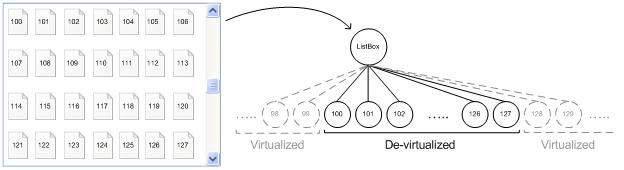

# ItemContainer Control Pattern

Describes guidelines and conventions for implementing [**IItemContainerProvider**](/windows/desktop/api/UIAutomationCore/nn-uiautomationcore-iitemcontainerprovider), including information about methods. The **ItemContainer** control pattern is used to support item virtualization.

Controls that contain a large number of child items can use virtualization to efficiently manage the items. With virtualization, the control maintains full information in memory for only a subset of items at any given time. Typically, the subset includes only those items that are currently visible to the user. Full information about the remaining virtualized items is kept in storage and is loaded into memory, or realized, as the control needs it, for example, as new items become visible to the user.

For example, the following diagram shows a list box that contains thousands of virtualized items. Because the control maintains full information only for the child items that are currently visible, the provider can expose Microsoft UI Automation elements only for items 100—127.

Controls that use virtualization represent a challenge because only realized (de-virtualized) items are fully available as UI Automation elements in the UI Automation tree. Virtualized items do not exist in the tree, so information about them is not available.

To provide information about virtualized items, providers implement the **ItemContainer** control pattern, which exposes the [**IItemContainerProvider**](/windows/desktop/api/UIAutomationCore/nn-uiautomationcore-iitemcontainerprovider) interface. The [**FindItemByProperty**](/windows/desktop/api/UIAutomationCore/nf-uiautomationcore-iitemcontainerprovider-finditembyproperty) method finds child items based on the value of a particular property, such as **Name**, **AutomationId**, or **IsSelected**. If an item is virtualized, **FindItemByProperty** retrieves a UI Automation placeholder element for the item. A placeholder element is an implementation of the [**IRawElementProviderSimple**](/windows/desktop/api/UIAutomationCore/nn-uiautomationcore-irawelementprovidersimple) interface that supports only the [VirtualizedItem](uiauto-implementingvirtualizeditem.md) control pattern.

The [**IVirtualizedItemProvider::Realize**](/windows/desktop/api/UIAutomationCore/nf-uiautomationcore-ivirtualizeditemprovider-realize) method enables a client to request that a virtualized item be realized, thereby exposing a full UI Automation element for the item so that all required properties and patterns are available.

Although the primary purpose of the **ItemContainer** control pattern is to support virtualized container scenarios, it can be implemented by any container that retrieves child items by name, regardless of whether the container uses virtualization.

This topic contains the following sections.

-   [Implementation Guidelines and Conventions](#implementation-guidelines-and-conventions)
-   [Required Members for IItemContainerProvider](#required-members-for-iitemcontainerprovider)
-   [Related topics](#related-topics)

## Implementation Guidelines and Conventions

When implementing the **ItemContainer** control pattern, note the following guidelines and conventions:

-   Any control that can contain virtualized items must support the **ItemContainer** control pattern. Any container that supports the retrieval of items based on a property value can support this pattern, regardless of whether the container uses virtualization.
-   When a container is virtualized, other controls patterns such as [Selection](uiauto-implementingselection.md), [Table](uiauto-implementingtable.md), and [Grid](uiauto-implementinggrid.md) can be affected. For example, the [**ISelectionProvider::GetSelection**](/windows/desktop/api/UIAutomationCore/nf-uiautomationcore-iselectionprovider-getselection) method may support only elements that are in the viewport, or only selected elements that are currently not virtualized.
-   The [Scroll](uiauto-implementingscroll.md) control pattern should be unaffected by virtualization.
-   No item count or index information is available for virtualized items. A virtualized control can use the **DescribedBy** or the **ItemStatus** property to provide this information, if necessary.
-   Control developers should document and publish details of all UI Automation properties and control patterns affected by the use of virtualization. Although the ItemContainer and [VirtualizedItem](uiauto-implementingvirtualizeditem.md) control patterns offer basic support, they may not support some virtualization behaviors.

The following guidelines and requirements apply to the [**IItemContainerProvider::FindItemByProperty**](/windows/desktop/api/UIAutomationCore/nf-uiautomationcore-iitemcontainerprovider-finditembyproperty) method.

-   While not required, Microsoft highly recommends that [**FindItemByProperty**](/windows/desktop/api/UIAutomationCore/nf-uiautomationcore-iitemcontainerprovider-finditembyproperty) support the **Name**, **AutomationId**, and **IsSelected** properties.
-   [**FindItemByProperty**](/windows/desktop/api/UIAutomationCore/nf-uiautomationcore-iitemcontainerprovider-finditembyproperty) can be slow if it needs to traverse multiple objects to find a matching one.
-   [**FindItemByProperty**](/windows/desktop/api/UIAutomationCore/nf-uiautomationcore-iitemcontainerprovider-finditembyproperty) can be called repeatedly to find items in sequence. The items can be in any order as long as each item is returned only once.
-   [**FindItemByProperty**](/windows/desktop/api/UIAutomationCore/nf-uiautomationcore-iitemcontainerprovider-finditembyproperty) may be implemented to find only those elements that appear in the control or content view of the UI Automation tree. Elements that appear only in raw view can be skipped to avoid retrieving multiple elements that represent only a portion of an "item" to the user.
-   When the search criteria matches a virtualized item, the provider can return a placeholder element that supports the [VirtualizedItem](uiauto-implementingvirtualizeditem.md) control pattern. The following guidelines apply to placeholder elements:
    -   Retrieving a placeholder element for a virtualized item must not cause UI changes.
    -   The placeholder element must be a peer of other child elements (a structure-changed event is required).
    -   When possible, the provider can create a full automation element instead of a placeholder.
-   When the search criteria matches a non-virtualized element, the provider must return the actual element, not a placeholder.
-   When no item is found, [**IItemContainerProvider::FindItemByProperty**](/windows/desktop/api/UIAutomationCore/nf-uiautomationcore-iitemcontainerprovider-finditembyproperty) should set the *pFound* parameter to **NULL** and return **S\_OK**.
-   When the *propertyId* parameter is 0, the provider should return the next item after *pStartAfter*.
-   If the *pStartAfter* parameter is **NULL** and *propertyId* is 0, the provider should return the first item in the container.
-   When the *propertyId* parameter is 0, the value parameter is ignored.

The following guidelines and requirements apply to placeholder elements for virtualized items in the UI Automation tree.

-   Although providers are encouraged to support more properties and control patterns for a placeholder element, only the [VirtualizedItem](uiauto-implementingvirtualizeditem.md) control pattern is required.
-   The provider can invalidate a previous placeholder element when [**IItemContainerProvider::FindItemByProperty**](/windows/desktop/api/UIAutomationCore/nf-uiautomationcore-iitemcontainerprovider-finditembyproperty) is called again. (If a client needs to realize the placeholder element, it should do so immediately; otherwise, the element can be invalidated if **FindItemByProperty** is called again or if the viewport changes for whatever reason.)
-   UI actions such as scrolling or resizing can cause the viewport of the container to change and a new set of child items to become visible. In this case, previously-retrieved placeholder elements may not be available in the UI Automation tree.
-   The provider should not virtualize UI elements that are available on-screen in the viewport of the container object.

## Required Members for IItemContainerProvider

The following method is required for implementing the [**IItemContainerProvider**](/windows/desktop/api/UIAutomationCore/nn-uiautomationcore-iitemcontainerprovider) interface.

| Required members                                                               | Member type | Notes |
|--------------------------------------------------------------------------------|-------------|-------|
| [**FindItemByProperty**](/windows/desktop/api/UIAutomationCore/nf-uiautomationcore-iitemcontainerprovider-finditembyproperty) | Method      | None  |

 

The **ItemContainer** control pattern has no associated properties or events.

## Related topics

<dl> <dt>

[Control Types and Their Supported Control Patterns](uiauto-controlpatternmapping.md)
</dt> <dt>

[UI Automation Control Patterns Overview](uiauto-controlpatternsoverview.md)
</dt> <dt>

[UI Automation Tree Overview](uiauto-treeoverview.md)
</dt> <dt>

[VirtualizedItem Control Pattern](uiauto-implementingvirtualizeditem.md)
</dt> </dl>

 

 

