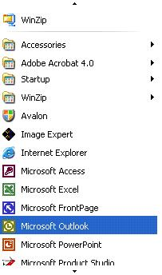

# Scroll Control Pattern

Describes guidelines and conventions for implementing [**IScrollProvider**](/windows/win32/UIAutomationCore/nn-uiautomationcore-iscrollprovider?branch=master), including information about properties and methods. The **Scroll** control pattern is used to support a control that acts as a scrollable container for a collection of child objects.

The control is not required to use scroll bars to support the scrolling functionality, although it commonly does. The following image shows a scrolling control that does not use scroll bars. For examples of controls that implement this control pattern, see [Control Types and Their Supported Control Patterns](uiauto-controlpatternmapping.md).

This topic contains the following sections.

-   [Implementation Guidelines and Conventions](#implementation-guidelines-and-conventions)
-   [Required Members for **IScrollProvider**](#required-members-for-iscrollprovider)
-   [Related topics](#related-topics)

## Implementation Guidelines and Conventions

When implementing the **Scroll** control pattern, note the following guidelines and conventions:

-   The children of this control must implement [**IScrollItemProvider**](/windows/win32/UIAutomationCore/nn-uiautomationcore-iscrollitemprovider?branch=master).
-   The scroll bars of a container control do not support the **Scroll** control pattern. They must support the [RangeValue](uiauto-implementingrangevalue.md) control pattern instead.
-   When scrolling is measured in percentages, all values or amounts related to scroll graduation must be normalized to a range of 0 to 100.
-   The [**IScrollProvider::HorizontallyScrollable**](/windows/win32/UIAutomationCore/nf-uiautomationcore-iscrollprovider-get_horizontallyscrollable?branch=master) property and [**VerticallyScrollable**](/windows/win32/UIAutomationCore/nf-uiautomationcore-iscrollprovider-get_verticallyscrollable?branch=master) property are independent of the **IsEnabled** property.
-   If the [**IScrollProvider::HorizontallyScrollable**](/windows/win32/UIAutomationCore/nf-uiautomationcore-iscrollprovider-get_horizontallyscrollable?branch=master) property is **FALSE**, the [**HorizontalViewSize**](/windows/win32/UIAutomationCore/nf-uiautomationcore-iscrollprovider-get_horizontalviewsize?branch=master) property should be set to 100 (100%) and [**HorizontalScrollPercent**](/windows/win32/UIAutomationCore/nf-uiautomationcore-iscrollprovider-get_horizontalscrollpercent?branch=master) property should be set to **UIA\_ScrollPatternNoScroll** (-1). Likewise, if the [**VerticallyScrollable**](/windows/win32/UIAutomationCore/nf-uiautomationcore-iscrollprovider-get_verticallyscrollable?branch=master) property is **FALSE**, the [**VerticalViewSize**](/windows/win32/UIAutomationCore/nf-uiautomationcore-iscrollprovider-get_verticalviewsize?branch=master) property should be set to 100 (100%) and [**VerticalScrollPercent**](/windows/win32/UIAutomationCore/nf-uiautomationcore-iscrollprovider-get_verticalscrollpercent?branch=master) property should be set to **UIA\_ScrollPatternNoScroll** (-1). This allows a Microsoft UI Automation client to use these property values within the [**SetScrollPercent**](/windows/win32/UIAutomationCore/nf-uiautomationcore-iscrollprovider-setscrollpercent?branch=master) method while avoiding a race condition if a direction the client is not interested in scrolling becomes activated.
-   The [**IScrollProvider::HorizontalScrollPercent**](/windows/win32/UIAutomationCore/nf-uiautomationcore-iscrollprovider-get_horizontalscrollpercent?branch=master) property is locale-specific. Setting **HorizontalScrollPercent** to 100 must set the scrolling location of the control to the equivalent of its rightmost position for languages such as English that read left to right. Alternately, for languages such as Arabic that read right to left, setting **HorizontalScrollPercent** to 100 must set the scroll location to the leftmost position.

## Required Members for **IScrollProvider**

The following properties and methods are required for implementing the [**IScrollProvider**](/windows/win32/UIAutomationCore/nn-uiautomationcore-iscrollprovider?branch=master) interface.

| Required members                                                                  | Member type | Notes |
|-----------------------------------------------------------------------------------|-------------|-------|
| [**HorizontalScrollPercent**](/windows/win32/UIAutomationCore/nf-uiautomationcore-iscrollprovider-get_horizontalscrollpercent?branch=master) | Property    | None  |
| [**VerticalScrollPercent**](/windows/win32/UIAutomationCore/nf-uiautomationcore-iscrollprovider-get_verticalscrollpercent?branch=master)     | Property    | None  |
| [**HorizontalViewSize**](/windows/win32/UIAutomationCore/nf-uiautomationcore-iscrollprovider-get_horizontalviewsize?branch=master)           | Property    | None  |
| [**VerticalViewSize**](/windows/win32/UIAutomationCore/nf-uiautomationcore-iscrollprovider-get_verticalviewsize?branch=master)               | Property    | None  |
| [**HorizontallyScrollable**](/windows/win32/UIAutomationCore/nf-uiautomationcore-iscrollprovider-get_horizontallyscrollable?branch=master)   | Property    | None  |
| [**VerticallyScrollable**](/windows/win32/UIAutomationCore/nf-uiautomationcore-iscrollprovider-get_verticallyscrollable?branch=master)       | Property    | None  |
| [**Scroll**](/windows/win32/UIAutomationCore/nf-uiautomationcore-iscrollprovider-scroll?branch=master)                                   | Method      | None  |
| [**SetScrollPercent**](/windows/win32/UIAutomationCore/nf-uiautomationcore-iscrollprovider-setscrollpercent?branch=master)               | Method      | None  |

 

This control pattern has no associated events.

## Related topics

<dl> <dt>

[Control Types and Their Supported Control Patterns](uiauto-controlpatternmapping.md)
</dt> <dt>

[UI Automation Control Patterns Overview](uiauto-controlpatternsoverview.md)
</dt> <dt>

[UI Automation Tree Overview](uiauto-treeoverview.md)
</dt> </dl>

 

 

