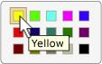

# Selection Control Pattern

Describes guidelines and conventions for implementing [**ISelectionProvider**](/windows/desktop/api/UIAutomationCore/nn-uiautomationcore-iselectionprovider), including information about properties, methods, and events. The **Selection** control pattern is used to support controls that act as containers for a collection of selectable child items. The children of this element must implement [**ISelectionItemProvider**](/windows/desktop/api/UIAutomationCore/nn-uiautomationcore-iselectionitemprovider).

For examples of controls that implement this control pattern, see [Control Types and Their Supported Control Patterns](uiauto-controlpatternmapping.md).

This topic contains the following sections.

-   [Implementation Guidelines and Conventions](#implementation-guidelines-and-conventions)
-   [Required Members for **ISelectionProvider**](#required-members-for-iselectionprovider)
-   [Related topics](#related-topics)

## Implementation Guidelines and Conventions

When implementing the **Selection** control pattern, note the following guidelines and conventions:

-   Controls that implement [**ISelectionProvider**](/windows/desktop/api/UIAutomationCore/nn-uiautomationcore-iselectionprovider) allow either single or multiple child items to be selected. For example, list boxes, list views, and tree views support multiple selections, whereas combo boxes, sliders, and radio button groups support single selection.
-   Controls that have a minimum, maximum, and continuous range, such as the **Volume** slider control of a media player, should implement [**IRangeValueProvider**](/windows/desktop/api/UIAutomationCore/nn-uiautomationcore-irangevalueprovider) instead of [**ISelectionProvider**](/windows/desktop/api/UIAutomationCore/nn-uiautomationcore-iselectionprovider).
-   Single-selection controls that manage child controls that implement [**IRawElementProviderFragmentRoot**](/windows/desktop/api/UIAutomationCore/nn-uiautomationcore-irawelementproviderfragmentroot), such as the **Screen Resolution** slider in the **Display Properties** dialog for Windows, or the **Color Picker** selection control from Microsoft Word (see the following image), should implement [**ISelectionProvider**](/windows/desktop/api/UIAutomationCore/nn-uiautomationcore-iselectionprovider); their children should implement both [**IRawElementProviderFragment**](/windows/desktop/api/UIAutomationCore/nn-uiautomationcore-irawelementproviderfragment) and [**ISelectionItemProvider**](/windows/desktop/api/UIAutomationCore/nn-uiautomationcore-iselectionitemprovider).

    

-   Menus do not support the **Selection** control pattern. If you are working with menu items that include both graphics and text (such as the **Preview Pane** items in the **View** menu in Microsoft Outlook) and need to convey state, you should implement [**IToggleProvider**](/windows/desktop/api/UIAutomationCore/nn-uiautomationcore-itoggleprovider).

## Required Members for **ISelectionProvider**

The following properties, methods, and events are required for implementing the [**ISelectionProvider**](/windows/desktop/api/UIAutomationCore/nn-uiautomationcore-iselectionprovider) interface.

| Required members                                                                                | Member type | Notes                                                                       |
|-------------------------------------------------------------------------------------------------|-------------|-----------------------------------------------------------------------------|
| [**CanSelectMultiple**](/windows/desktop/api/UIAutomationCore/nf-uiautomationcore-iselectionprovider-get_canselectmultiple)                        | Property    | None                                                                        |
| [**IsSelectionRequired**](/windows/desktop/api/UIAutomationCore/nf-uiautomationcore-iselectionprovider-get_isselectionrequired)                    | Property    | None                                                                        |
| [**GetSelection**](/windows/desktop/api/UIAutomationCore/nf-uiautomationcore-iselectionprovider-getselection)                                  | Method      | None                                                                        |
| [**UIA\_Selection\_InvalidatedEventId**](uiauto-event-ids.md) | Event       | Raise this event when a selection in a container has changed significantly. |

 

The [**ISelectionProvider::IsSelectionRequired**](/windows/desktop/api/UIAutomationCore/nf-uiautomationcore-iselectionprovider-get_isselectionrequired) and [**CanSelectMultiple**](/windows/desktop/api/UIAutomationCore/nf-uiautomationcore-iselectionprovider-get_canselectmultiple) properties can be dynamic. For example, the initial state of a control might not have any items selected by default, indicating that **IsSelectionRequired** is false. However, after an item is selected, the control must always have at least one item selected. Similarly, in rare cases, a control might allow multiple items to be selected on initialization, but subsequently allow only single selections to be made.

## Related topics

<dl> <dt>

[Control Types and Their Supported Control Patterns](uiauto-controlpatternmapping.md)
</dt> <dt>

[SelectionItem Control Pattern](uiauto-implementingselectionitem.md)
</dt> <dt>

[UI Automation Control Patterns Overview](uiauto-controlpatternsoverview.md)
</dt> <dt>

[UI Automation Tree Overview](uiauto-treeoverview.md)
</dt> </dl>

 

 

