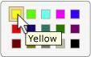

# Table Control Pattern

Describes guidelines and conventions for implementing [**ITableProvider**](/windows/desktop/api/UIAutomationCore/nn-uiautomationcore-itableprovider), including information about properties and methods. The **Table** control pattern is used to support controls that act as containers for a collection of child elements.

The children of the container element must implement [**ITableItemProvider**](/windows/desktop/api/UIAutomationCore/nn-uiautomationcore-itableitemprovider) and be organized in a two-dimensional logical coordinate system that can be traversed by row and column. This control pattern is analogous to [**IGridProvider**](/windows/desktop/api/UIAutomationCore/nn-uiautomationcore-igridprovider) with the distinction that any control implementing [**ITableProvider**](/windows/desktop/api/UIAutomationCore/nn-uiautomationcore-itableprovider) must also expose a column and/or row header relationship for each child element. For examples of controls that implement this control pattern, see [Control Types and Their Supported Control Patterns](uiauto-controlpatternmapping.md).

This topic contains the following sections.

-   [Implementation Guidelines and Conventions](#implementation-guidelines-and-conventions)
-   [Required Members for **ITableProvider**](#required-members-for-itableprovider)
-   [Related topics](#related-topics)

## Implementation Guidelines and Conventions

When implementing the **Table** control pattern, note the following guidelines and conventions:

-   Access to the content of individual cells is through a two-dimensional logical coordinate system or array provided by the required, concurrent implementation of [**IGridProvider**](/windows/desktop/api/UIAutomationCore/nn-uiautomationcore-igridprovider).
-   A column or row header can be contained within a table object or be a separate header object that is associated with a table object.
-   Column and row headers may include both a primary header as well as any supporting headers.
    > [!Note]  
    > This concept becomes evident in a Microsoft Excel spreadsheet where a user has defined a **First name** column. This column now has two headers, including the **First name** header defined by the user, and the alphanumeric designation for that column assigned by the application.

     

-   See [Grid Control Pattern](uiauto-implementinggrid.md) for related grid functionality.

    The following image shows a table with complex column headers.

    

    The following image shows a table with an ambiguous [**ITableProvider::RowOrColumnMajor**](/windows/desktop/api/UIAutomationCore/nf-uiautomationcore-itableprovider-get_roworcolumnmajor) property.

    

## Required Members for **ITableProvider**

The following properties and methods are required for implementing the [**ITableProvider**](/windows/desktop/api/UIAutomationCore/nn-uiautomationcore-itableprovider) interface.

| Required members                                                   | Member type | Notes |
|--------------------------------------------------------------------|-------------|-------|
| [**RowOrColumnMajor**](/windows/desktop/api/UIAutomationCore/nf-uiautomationcore-itableprovider-get_roworcolumnmajor) | Property    | None  |
| [**GetColumnHeaders**](/windows/desktop/api/UIAutomationCore/nf-uiautomationcore-itableprovider-getcolumnheaders) | Method      | None  |
| [**GetRowHeaders**](/windows/desktop/api/UIAutomationCore/nf-uiautomationcore-itableprovider-getrowheaders)       | Method      | None  |

 

This control pattern has no associated events.

## Related topics

<dl> <dt>

**Conceptual**
</dt> <dt>

[Control Types and Their Supported Control Patterns](uiauto-controlpatternmapping.md)
</dt> <dt>

[TableItem Control Pattern](uiauto-implementingtableitem.md)
</dt> <dt>

[UI Automation Control Patterns Overview](uiauto-controlpatternsoverview.md)
</dt> <dt>

[UI Automation Tree Overview](uiauto-treeoverview.md)
</dt> </dl>

 

 

