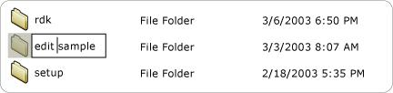

# Value Control Pattern

Describes guidelines and conventions for implementing [**IValueProvider**](uiauto-ivalueprovider.md), including information about properties and methods. The **Value** control pattern is used to support controls that have an intrinsic value not spanning a range and that can be represented as a string.

The value string can be editable, depending on the control and its settings. For examples of controls that implement this control pattern, see [Control Types and Their Supported Control Patterns](uiauto-controlpatternmapping.md).

This topic contains the following sections.

-   [Implementation Guidelines and Conventions](#implementation-guidelines-and-conventions)
-   [Required Members for **IValueProvider**](#required-members-for-ivalueprovider)
-   [Related topics](#related-topics)

## Implementation Guidelines and Conventions

When implementing the **Value** control pattern, note the following guidelines and conventions:

-   Controls such as a list item or tree item must support the **Value** control pattern if the value of any of the items is editable, regardless of the current edit mode of the control. The parent control must also support the **Value** control pattern if the child items are editable. The following image shows an example of an editable list item.

    

-   Single-line edit controls support programmatic access to their contents by implementing [**IValueProvider**](uiauto-ivalueprovider.md). Multiline edit controls typically do not implement **IValueProvider**; instead they provide access to their content by implementing [**ITextProvider**](uiauto-itextprovider.md). **IValueProvider** can be implemented for multiline edit controls whose contents can be changed.
-   To retrieve the textual contents of a multiline edit control, the control must implement [**ITextProvider**](uiauto-itextprovider.md). However, **ITextProvider** does not support setting the value of a control.
-   [**IValueProvider**](uiauto-ivalueprovider.md) does not support the retrieval of formatting information or substring values. Implement [**ITextProvider**](uiauto-itextprovider.md) in these scenarios.
-   [**IValueProvider**](uiauto-ivalueprovider.md) must be implemented by controls such as the color picker selection control from Microsoft Word (see the following image), which supports string mapping between a color value (for example, "yellow") and an equivalent internal [RGB](http://go.microsoft.com/fwlink/p/?linkid=186474) value.

    

-   A control should have its **IsEnabled** property set to **TRUE** and its [**ITextProvider::IsReadOnly**](uiauto-ivalueprovider-isreadonly.md) property set to **FALSE** before allowing a call to [**ITextProvider::SetValue**](uiauto-ivalueprovider-setvalue.md).

## Required Members for **IValueProvider**

The following properties and methods are required for implementing the [**IValueProvider**](uiauto-ivalueprovider.md) interface.

| Required members                                       | Member type | Notes |
|--------------------------------------------------------|-------------|-------|
| [**IsReadOnly**](uiauto-ivalueprovider-isreadonly.md) | Property    | None  |
| [**Value**](uiauto-ivalueprovider-value.md)           | Property    | None  |
| [**SetValue**](uiauto-ivalueprovider-setvalue.md)     | Method      | None  |

 

This control pattern has no associated events.

## Related topics

<dl> <dt>

[Control Types and Their Supported Control Patterns](uiauto-controlpatternmapping.md)
</dt> <dt>

[UI Automation Control Patterns Overview](uiauto-controlpatternsoverview.md)
</dt> <dt>

[UI Automation Tree Overview](uiauto-treeoverview.md)
</dt> <dt>

[Text and TextRange Control Patterns](uiauto-implementingtextandtextrange.md)
</dt> </dl>

 

 

