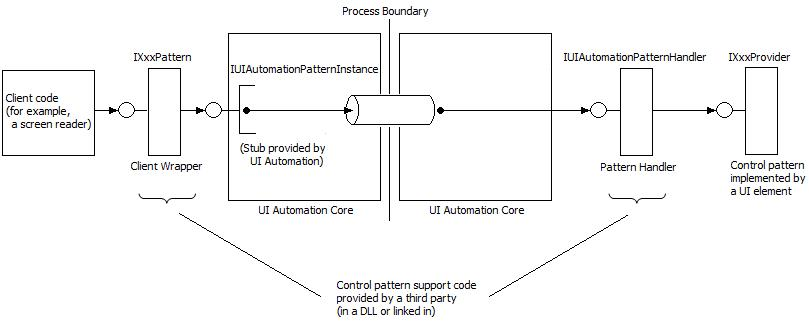

# Register custom properties, events, and control patterns

Before a custom property, event, or control pattern can be used, both the provider and the client must register the property, event, or control pattern at run time. The registration is effective globally within an application process, and remains effective until the process closes or the last Microsoft UI Automation element object ([**IUIAutomation**](/windows/desktop/api/UIAutomationClient/nn-uiautomationclient-iuiautomation) or [**IRawElementProviderSimple**](/windows/desktop/api/UIAutomationCore/nn-uiautomationcore-irawelementprovidersimple)) is released within the process.

Registation involves passing a GUID to UI Automation, along with detailed information about the custom property, event, or control pattern. Attempting to register the same GUID a second time with the same information will succeed, but attempting to register the same GUID a second time but with different information (for example, a custom property of a different type) will fail. In the future, if the custom specification is accepted and integrated into the UI Automation core, UI Automation will validate the custom registration information and use the already registered code instead of the "official" framework implementation, thereby minimizing application compatibility issues. You cannot remove properties, events, or control patterns that are already registered.

This topic contains the following sections:

-   [Registering Custom Properties and Events](#registering-custom-properties-and-events)
-   [Implementing Custom Control Patterns](#implementing-custom-control-patterns)
    -   [The Client Wrapper and the Pattern Handler](#the-client-wrapper-and-the-pattern-handler)
    -   [Implementing the Client Wrapper](#implementing-the-client-wrapper)
    -   [Implementing the Pattern Handler](#implementing-the-pattern-handler)
    -   [Registering a Custom Control Pattern](#registering-a-custom-control-pattern)
    -   [Example Implementation of a Custom Control Pattern](#example-implementation-of-a-custom-control-pattern)
-   [Related topics](#related-topics)

## Registering Custom Properties and Events

Registering a custom property or event enables the provider and client to obtain an ID for the property or event, which can then be passed to various API methods that take IDs as parameters.

To register a property or event:

1.  Define a GUID for the custom property or event.
2.  Fill a [**UIAutomationPropertyInfo**](/windows/desktop/api/UIAutomationCore/ns-uiautomationcore-uiautomationpropertyinfo) or a [**UIAutomationEventInfo**](/windows/desktop/api/UIAutomationCore/ns-uiautomationcore-uiautomationeventinfo) structure with information about the property or event, including the GUID and a nonlocalizable string that contains the name of the custom property or event. Custom properties also require the data type of the property to be specified, for example, whether the property holds an integer or a string. The data type must be one of the following types specified by the [**UIAutomationType**](/windows/desktop/api/UIAutomationCore/ne-uiautomationcore-uiautomationtype) enumeration. No other data types are supported for custom properties.
    -   **UIAutomationType\_Bool**
    -   **UIAutomationType\_Double**
    -   **UIAutomationType\_Element**
    -   **UIAutomationType\_Int**
    -   **UIAutomationType\_Point**
    -   **UIAutomationType\_String**
3.  Use the [**CoCreateInstance**](/windows/desktop/api/combaseapi/nf-combaseapi-cocreateinstance) function to create an instance of the [**CUIAutomationRegistrar**](/previous-versions/windows/desktop/legacy/ff384837(v=vs.85)) object and retrieve a pointer to the object's [**IUIAutomationRegistrar**](/windows/desktop/api/UIAutomationCore/nn-uiautomationcore-iuiautomationregistrar) interface.
4.  Call the [**IUIAutomationRegistrar::RegisterProperty**](/windows/desktop/api/UIAutomationCore/nf-uiautomationcore-iuiautomationregistrar-registerproperty) or [**RegisterEvent**](/windows/desktop/api/UIAutomationCore/nf-uiautomationcore-iuiautomationregistrar-registerevent) method and pass the address of the [**UIAutomationPropertyInfo**](/windows/desktop/api/UIAutomationCore/ns-uiautomationcore-uiautomationpropertyinfo) structure or the [**UIAutomationEventInfo**](/windows/desktop/api/UIAutomationCore/ns-uiautomationcore-uiautomationeventinfo) structure.

The [**IUIAutomationRegistrar::RegisterProperty**](/windows/desktop/api/UIAutomationCore/nf-uiautomationcore-iuiautomationregistrar-registerproperty) or [**RegisterEvent**](/windows/desktop/api/UIAutomationCore/nf-uiautomationcore-iuiautomationregistrar-registerevent) method returns a property ID or event ID that an application can pass to any UI Automation method that takes such an identifier as a parameter. For example, you can pass a registered property ID to the [**IUIAutomationElement::GetCurrentPropertyValue**](/windows/desktop/api/UIAutomationClient/nf-uiautomationclient-iuiautomationelement-getcurrentpropertyvalue) method or to the [**IUIAutomation::CreatePropertyCondition**](/windows/desktop/api/UIAutomationClient/nf-uiautomationclient-iuiautomation-createpropertycondition) method.

The following example demonstrates how to register a custom property.


```C++
// Declare a variable for holding the custom property ID.
PATTERNID g_MyCustomPropertyID;
// Define a GUID for the custom property.
GUID GUID_MyCustomProperty = { 0x82f383ff, 0x4b4d, 0x40d3, 
    { 0x8e, 0xd2, 0x90, 0xb5, 0x25, 0x8e, 0xaa, 0x19 } };

HRESULT RegisterProperty()
{
    // Fill the structure with the GUID, name, and data type.
    UIAutomationPropertyInfo MyCustomPropertyInfo = 
    {
        GUID_MyCustomProperty,
        L"MyCustomProp",
        UIAutomationType_String
    };

    // Create the registrar object and get the IUIAutomationRegistrar 
    // interface pointer. 
    IUIAutomationRegistrar * pUIARegistrar = NULL;
    CoCreateInstance(CLSID_CUIAutomationRegistrar, NULL, CLSCTX_INPROC_SERVER, 
            IID_IUIAutomationRegistrar, (void **)&pUIARegistrar);

    if (pUIARegistrar == NULL)
        return E_NOINTERFACE;

    // Register the property and retrieve the property ID. 
    HRESULT hr = pUIARegistrar->RegisterProperty(&MyCustomPropertyInfo, &g_MyCustomPropertyID);
    pUIARegistrar->Release();

    return hr;
}
```


The property and event identifiers retrieved by the [**IUIAutomationRegistrar::RegisterProperty**](/windows/desktop/api/UIAutomationCore/nf-uiautomationcore-iuiautomationregistrar-registerproperty) and [**RegisterEvent**](/windows/desktop/api/UIAutomationCore/nf-uiautomationcore-iuiautomationregistrar-registerevent) methods are valid only in the context of the application that retrieves them, and only for the duration of the application's lifetime. The registration methods can return different integer values for the same GUID when it is called over different runtime instances of the same application.

There is no method that unregisters a custom property or event. Instead, they are implicitly unregistered when the last UI Automation object is released.

> [!IMPORTANT]
> If your code is a Microsoft Active Accessibility (MSAA) client, you must call the [**NotifyWinEvent**](/windows/desktop/api/Winuser/nf-winuser-notifywinevent) function when you change the value of a custom property.

 

## Implementing Custom Control Patterns

A custom control pattern is not included in the UI Automation API, but is provided by a third party at run time. Developers of client and provider applications must work together to define a custom control pattern, including the methods, properties, and events that the control pattern will support. After defining the control pattern, both the client and the provider must implement supporting Component Object Model (COM) objects, along with code to register the control pattern at run time. A custom control pattern requires the implementation of two COM objects: a client wrapper and a pattern handler.

> [!Note]  
> The examples in the following topics illustrate how to implement a custom control pattern that duplicates the functionality of the existing [Value](uiauto-implementingvalue.md) control pattern. These examples are for instructional purposes only. An actual custom control pattern should provide functionality that is not available from the standard UI Automation control patterns.

 

### The Client Wrapper and the Pattern Handler

The client wrapper implements the API that is used by the client to retrieve properties and call methods exposed by the custom control pattern. The API is implemented as a COM interface that passes all property requests and method calls to the UI Automation core, which then marshals the requests and calls to the provider.

The code that registers a custom control pattern must supply a class factory that UI Automation can use to create instances of the client wrapper object. When a custom control pattern is successfully registered, UI Automation returns an [**IUIAutomationPatternInstance**](/windows/desktop/api/UIAutomationCore/nn-uiautomationcore-iuiautomationpatterninstance) interface pointer that is used by the client to forward property requests and methods calls to the UI Automation core.

On the provider side, the UI Automation core takes the property requests and method calls from the client and passes them to the pattern handler object. The pattern handler then calls the appropriate methods on the provider interface for the custom control pattern.

The code that registers a custom control pattern creates the pattern handler object and, when registering the control pattern, provides UI Automation with a pointer to the object's [**IUIAutomationPatternHandler**](/windows/desktop/api/UIAutomationCore/nn-uiautomationcore-iuiautomationpatternhandler) interface.

The following diagram shows how a client property request or method call flows from the client wrapper, through the UI Automation core components to the pattern handler, and then to the provider interface.



The objects that implement the client wrapper and pattern handler interfaces must be free-threaded. Also, the UI Automation core must be able to call the objects directly without any intermediate marshaling code.

### Implementing the Client Wrapper

The client wrapper is an object that exposes an IXxxPattern interface that the client uses to request properties and call methods supported by the custom control pattern. The interface consists of a pair of "getter" methods for each supported property (get\_CurrentXxx and get\_CachedXxx method), and a "caller" method for each supported method. When the object is instantiated, the object constructor receives a pointer to the [**IUIAutomationPatternInstance**](/windows/desktop/api/UIAutomationCore/nn-uiautomationcore-iuiautomationpatterninstance) interface, which is implemented by the UI Automation core. The methods of the IXxxPattern interface use the [**IUIAutomationPatternInstance::GetProperty**](/windows/desktop/api/UIAutomationCore/nf-uiautomationcore-iuiautomationpatterninstance-getproperty) and [**CallMethod**](/windows/desktop/api/UIAutomationCore/nf-uiautomationcore-iuiautomationpatterninstance-callmethod) methods to forward property requests and method calls to the UI Automation core.

The following example shows how to implement a client wrapper object for a simple custom control pattern that supports a single property. For a more complex example, see [Example Implementation of a Custom Control Pattern](#example-implementation-of-a-custom-control-pattern).


```C++
// Define the client interface.
interface __declspec(uuid("c78b266d-b2c0-4e9d-863b-e3f74a721d47"))
IMyCustomPattern : public IUnknown
{
    STDMETHOD (get_CurrentIsReadOnly)(BOOL * pIsReadOnly) = 0;
    STDMETHOD (get_CachedIsReadOnly)(BOOL * pIsReadOnly) = 0;
};

// Implement the client wrapper class.
class CMyValuePatternClientWrapper :
    public IMyCustomPattern
{
    IUIAutomationPatternInstance * _pInstance;
    
public:
    // Get IUIAutomationPatternInstance interface pointer from the
    // UI Automation core.
    CMyValuePatternClientWrapper(IUIAutomationPatternInstance * pInstance)
        : _pInstance(pInstance)
    {
        _pInstance->AddRef();
    }
    
    ~CMyValuePatternClientWrapper()
    {
        _pInstance->Release();
    }

    // Note: Put standard IUnknown implementation here.

    STDMETHODIMP get_CurrentIsReadOnly(BOOL * pIsReadOnly)
    {
        return _pInstance->GetProperty(0, FALSE, UIAutomationType_Bool, pIsReadOnly);
    }

    STDMETHODIMP get_CachedIsReadOnly(BOOL * pIsReadOnly)
    {
        return _pInstance->GetProperty(0, TRUE, UIAutomationType_Bool, pIsReadOnly);
    }
};
```


### Implementing the Pattern Handler

The pattern handler is an object that implements the [**IUIAutomationPatternHandler**](/windows/desktop/api/UIAutomationCore/nn-uiautomationcore-iuiautomationpatternhandler) interface. This interface has two methods: [**IUIAutomationPatternHandler::CreateClientWrapper**](/windows/desktop/api/UIAutomationCore/nf-uiautomationcore-iuiautomationpatternhandler-createclientwrapper) and [**Dispatch**](/windows/desktop/api/UIAutomationCore/nf-uiautomationcore-iuiautomationpatternhandler-dispatch). The **CreateClientWrapper** method is called by the UI Automation core and receives a pointer to the [**IUIAutomationPatternInstance**](/windows/desktop/api/UIAutomationCore/nn-uiautomationcore-iuiautomationpatterninstance) interface. **CreateClientWrapper** responds by instantiating the client wrapper object and passing the **IUIAutomationPatternInstance** interface pointer to the client wrapper constructor.

The [**Dispatch**](/windows/desktop/api/UIAutomationCore/nf-uiautomationcore-iuiautomationpatternhandler-dispatch) method is used by the UI Automation core to pass property requests and method calls to the provider interface for the custom control pattern. Parameters include a pointer to the provider interface, the zero-based index of the property getter or method being called, and an array of [**UIAutomationParameter**](/windows/desktop/api/UIAutomationCore/ns-uiautomationcore-uiautomationparameter) structures that contain the parameters to pass to the provider. The pattern handler responds by checking the index parameter to determine which provider method to call, and then calls that provider interface, passing the parameters contained in the **UIAutomationParameter** structures.

The pattern handler object is instantiated by the same code that registers the custom control pattern, before the control pattern is registered. The code must pass the pattern handler object's [**IUIAutomationPatternHandler**](/windows/desktop/api/UIAutomationCore/nn-uiautomationcore-iuiautomationpatternhandler) interface pointer to the UI Automation core at registration time.

The following example shows how to implement a pattern handler object for a simple custom control pattern that supports a single property. For a more complex example, see [Example Implementation of a Custom Control Pattern](#example-implementation-of-a-custom-control-pattern).


```C++
// Define the provider interface.
interface __declspec(uuid("9f5266dd-f0ab-4562-8175-c383abb2569e"))
IMyValueProvider : public IUnknown
{
    STDMETHOD (get_IsReadOnly)(BOOL * pIsReadOnly) = 0;
};            

// Index used by IUIAutomationPatternHandler::Dispatch.
const int MyValue_GetIsReadOnly = 0; 
            
// Define the pattern handler class.        
class CMyValuePatternHandler : public IUIAutomationPatternHandler
{
public:
    
    // Put standard IUnknown implementation here.

    STDMETHODIMP CreateClientWrapper(
            IUIAutomationPatternInstance * pPatternInstance, 
            IUnknown ** pClientWrapper)
    {
        *pClientWrapper = new CMyValuePatternClientWrapper(pPatternInstance);
        if (*pClientWrapper == NULL)
            return E_INVALIDARG;
        return S_OK;
    }
    
    STDMETHODIMP Dispatch (IUnknown * pTarget, UINT index, 
            const struct UIAutomationParameter *pParams, UINT cParams)
    {
        switch(index)
        {
        case MyValue_GetIsReadOnly:
            return ((IMyValueProvider*)pTarget)->get_IsReadOnly((BOOL*)pParams[0].pData);
        }
        return E_INVALIDARG;
    }
};
```


### Registering a Custom Control Pattern

Before it can be used, a custom control pattern must be registered by both the provider and the client. Registering provides the UI Automation core with detailed information about the control pattern, and supplies the provider or client with the control pattern ID, and IDs for the properties and events that are supported by the control pattern. On the provider side, the custom control pattern must be registered before the associated control handles the [**WM\_GETOBJECT**](wm-getobject.md) message, or at the same time.

When registering a custom control pattern, the provider or client supplies the following information:

-   The GUID of the custom control pattern.
-   A nonlocalizable string containing the name of the custom control pattern.
-   The GUID of the provider interface that supports the custom control pattern.
-   The GUID of the client interface that supports the custom control pattern.
-   An array of [**UIAutomationPropertyInfo**](/windows/desktop/api/UIAutomationCore/ns-uiautomationcore-uiautomationpropertyinfo) structures that describe the properties supported by the custom control pattern. For each property, the GUID, property name, and data type must be specified.
-   An array of [**UIAutomationMethodInfo**](/windows/desktop/api/UIAutomationCore/ns-uiautomationcore-uiautomationmethodinfo) structures that describe the methods supported by the custom control pattern. For each method, the structure includes the following information: the method name, a count of parameters, a list of parameter data types, and a list of the parameter names.
-   An array of [**UIAutomationEventInfo**](/windows/desktop/api/UIAutomationCore/ns-uiautomationcore-uiautomationeventinfo) structures that describe the events raised by the custom control pattern. For each event, the GUID and event name must be specified.
-   The address of the [**IUIAutomationPatternHandler**](/windows/desktop/api/UIAutomationCore/nn-uiautomationcore-iuiautomationpatternhandler) interface of the pattern handler object that makes the custom control pattern available to clients.

To register the custom control pattern, the provider or client code must perform the following steps:

1.  Fill a [**UIAutomationPatternInfo**](/windows/desktop/api/UIAutomationCore/ns-uiautomationcore-uiautomationpatterninfo) structure with the preceding information.
2.  Use the [**CoCreateInstance**](/windows/desktop/api/combaseapi/nf-combaseapi-cocreateinstance) function to create an instance of the [**CUIAutomationRegistrar**](/previous-versions/windows/desktop/legacy/ff384837(v=vs.85)) object and retrieve a pointer to the object's [**IUIAutomationRegistrar**](/windows/desktop/api/UIAutomationCore/nn-uiautomationcore-iuiautomationregistrar) interface.
3.  Call the [**IUIAutomationRegistrar::RegisterPattern**](/windows/desktop/api/UIAutomationCore/nf-uiautomationcore-iuiautomationregistrar-registerpattern) method, passing the address of the [**UIAutomationPatternInfo**](/windows/desktop/api/UIAutomationCore/ns-uiautomationcore-uiautomationpatterninfo) structure.

The [**RegisterPattern**](/windows/desktop/api/UIAutomationCore/nf-uiautomationcore-iuiautomationregistrar-registerpattern) method returns a control pattern ID, along with a list of property IDs and event IDs. An application can pass these IDs to any UI Automation method that takes such an identifier as a parameter. For example, you can pass a registered pattern ID to the [**IUIAutomationElement::GetCurrentPattern**](/windows/desktop/api/UIAutomationClient/nf-uiautomationclient-iuiautomationelement-getcurrentpattern) method to retrieve a pointer to the provider interface for the control pattern.

There is no method that unregisters a custom control pattern. Instead, it is implicitly unregistered when the last UI Automation object is released.

For an example that shows how to register a custom control pattern, see the following section.

### Example Implementation of a Custom Control Pattern

This section contains example code that demonstrates how to implement the client wrapper and pattern handler objects for a custom control pattern. The example implements a custom control pattern that is based on the [Value](uiauto-implementingvalue.md) control pattern.


```C++
// Step 1: Define the public provider and client interfaces using IDL. Interface 
// definitions are in C here to simplify the example.

// Define the provider interface.
interface __declspec(uuid("9f5266dd-f0ab-4562-8175-c383abb2569e"))
IMyValueProvider : public IUnknown
{
    STDMETHOD (get_Value)(BSTR * pValue) = 0;
    STDMETHOD (get_IsReadOnly)(BOOL * pIsReadOnly) = 0;
    STDMETHOD (SetValue)(LPCWSTR pNewValue) = 0;
    STDMETHOD (Reset)() = 0;
};

// Define the client interface.
interface __declspec(uuid("103b8323-b04a-4180-9140-8c1e437713a3"))
IUIAutomationMyValuePattern : public IUnknown
{
    STDMETHOD (get_CurrentValue)(BSTR * pValue) = 0;
    STDMETHOD (get_CachedValue)(BSTR * pValue) = 0;

    STDMETHOD (get_CurrentIsReadOnly)(BOOL * pIsReadOnly) = 0;
    STDMETHOD (get_CachedIsReadOnly)(BOOL * pIsReadOnly) = 0;

    STDMETHOD (SetValue)(LPCWSTR pNewValue) = 0;
    STDMETHOD (Reset)() = 0;
};

// Enumerate the properties and methods starting from 0, and placing the 
// properties first. 
enum
{
    MyValue_GetValue = 0,
    MyValue_GetIsReadOnly = 1,
    MyValue_SetValue = 2,
    MyValue_Reset = 3,
};

// Step 2: Implement the client wrapper class.
class CMyValuePatternClientWrapper :
    public IUIAutomationMyValuePattern
{
    IUIAutomationPatternInstance * _pInstance;

public:
    // Get IUIAutomationPatternInstance interface pointer.
    CMyValuePatternClientWrapper(IUIAutomationPatternInstance * pInstance)
    {
        _pInstance = pInstance;
        _pInstance->AddRef();
    }

    // Put standard IUnknown implementation here.

    STDMETHODIMP get_CurrentValue(BSTR * pValue)
    {
        return _pInstance->GetProperty(MyValue_GetValue, FALSE, 
                UIAutomationType_String, pValue);
    }

    STDMETHODIMP get_CachedValue(BSTR * pValue)
    {
        return _pInstance->GetProperty(MyValue_GetValue, TRUE, 
                UIAutomationType_String, pValue);
    }

    STDMETHODIMP get_CurrentIsReadOnly(BOOL * pIsReadOnly)
    {
        return _pInstance->GetProperty(MyValue_GetIsReadOnly, FALSE, 
                UIAutomationType_Bool, pIsReadOnly);
    }

    STDMETHODIMP get_CachedIsReadOnly(BOOL * pIsReadOnly)
    {
        return _pInstance->GetProperty(MyValue_GetIsReadOnly, TRUE, 
                UIAutomationType_Bool, pIsReadOnly);
    }

    STDMETHODIMP SetValue(LPCWSTR pValue)
    {
        UIAutomationParameter SetValueParams[] = 
                { UIAutomationType_String, &pValue };
        return _pInstance->CallMethod(MyValue_SetValue,  SetValueParams, 
                ARRAYSIZE(SetValueParams));
    }

    STDMETHODIMP Reset()
    {
        return _pInstance->CallMethod(MyValue_Reset, NULL, 0);
    }
};

// Step 3: Implement the pattern handler class.
class CMyValuePatternHandler : public IUIAutomationPatternHandler
{
public:

    // Put standard IUnknown implementation here.
    
    STDMETHODIMP CreateClientWrapper(
            IUIAutomationPatternInstance * pPatternInstance, 
            IUnknown ** pClientWrapper)
    {
        *pClientWrapper = new CMyValuePatternClientWrapper(pPatternInstance);
        if (*pClientWrapper == NULL)
            return E_INVALIDARG;
        return S_OK;
    }
    
    STDMETHODIMP Dispatch (IUnknown * pTarget, UINT index, 
            const struct UIAutomationParameter *pParams, 
            UINT cParams)
    {
        switch(index)
        {
        case MyValue_GetValue:
            return ((IMyValueProvider*)pTarget)->get_Value((BSTR*)pParams[0].pData);

        case MyValue_GetIsReadOnly:
            return ((IMyValueProvider*)pTarget)->get_IsReadOnly((BOOL*)pParams[0].pData);

        case MyValue_SetValue:
            return ((IMyValueProvider*)pTarget)->SetValue(*(LPCWSTR*)pParams[0].pData);

        case MyValue_Reset:
            return ((IMyValueProvider*)pTarget)->Reset();
        }
        return E_INVALIDARG;
    }
};

CMyValuePatternHandler g_MyValuePatternHandler;

// Step 4: Declare information about the properties and methods supported
// by the custom control pattern.

// Define GUIDs for the custom control pattern and each of its properties 
// and events.
static const GUID MyValue_Pattern_Guid = { 0xa49aa3c0, 0xe413, 0x4ecf, 
        { 0xa1, 0xc3, 0x37, 0x42, 0xa7, 0x86, 0x67, 0x3f } };
static const GUID MyValue_Value_Property_Guid = { 0xe58f3f67, 0x22c7, 0x44f0, 
        { 0x83, 0x55, 0xd8, 0x76, 0x14, 0xa1, 0x10, 0x81 } };
static const GUID MyValue_IsReadOnly_Property_Guid = { 0x480540f2, 0x9829, 0x4acd, 
        { 0xb8, 0xea, 0x6e, 0x2a, 0xdc, 0xe5, 0x3a, 0xfb } };
static const GUID MyValue_Reset_Event_Guid = { 0x5b80edd3, 0x67f, 0x4a70, 
        { 0xb0, 0x7, 0x4, 0x12, 0x85, 0x11, 0x1, 0x7a } };

// Declare information about the properties, in the same order as the
// previously defined "MyValue_" enumerated type.
UIAutomationPropertyInfo g_MyValueProperties[] = 
{
    // GUID, name, data type.
    { MyValue_Value_Property_Guid, L"MyValuePattern.Value", 
                                                    UIAutomationType_String },
    { MyValue_IsReadOnly_Property_Guid, L"MyValuePattern.IsReadOnly", 
                                                    UIAutomationType_Bool },
};

// Declare information about the event.
UIAutomationEventInfo g_MyValueEvents [] =
{
    { MyValue_Reset_Event_Guid,  L"MyValuePattern.Reset" },
};

// Declare the data type and name of the SetValue method parameter. 
UIAutomationType g_SetValueParamTypes[] = { UIAutomationType_String };
LPCWSTR g_SetValueParamNames[] = {L"pNewValue"};

// Declare information about the methods.
UIAutomationMethodInfo g_MyValueMethods[] =
{
    // Name, focus flag, count of in parameters, count of out parameters, types, parameter names.
    { L"MyValuePattern.SetValue", TRUE, 1, 0, g_SetValueParamTypes, g_SetValueParamNames },
    { L"MyValuePattern.Reset", TRUE, 0, 0, NULL, NULL },
};

// Declare the custom control pattern using the previously defined information.
UIAutomationPatternInfo g_ValuePatternInfo =
{
    MyValue_Pattern_Guid,
    L"MyValuePattern",
    __uuidof(IMyValueProvider),
    __uuidof(IUIAutomationMyValuePattern),
    ARRAYSIZE(g_MyValueProperties), g_MyValueProperties, // properties
    ARRAYSIZE(g_MyValueMethods), g_MyValueMethods,       // methods
    ARRAYSIZE(g_MyValueEvents), g_MyValueEvents,         // events 
    &g_MyValuePatternHandler
};

// Step 5: Register the custom control pattern and retrieve the control pattern and property 
// identifiers.

// Control pattern, property, and event IDs.
PATTERNID  g_MyValue_PatternID;
PROPERTYID g_MyValue_Value_PropertyID;
PROPERTYID g_MyValue_IsReadOnly_PropertyID;
EVENTID    g_MyValueReset_EventID;

// ID used by the client to determine whether the custom control pattern is available.
PROPERTYID g_IsMyValuePatternAvailable_PropertyID;

HRESULT RegisterPattern()
{
    // Create the registrar object and get the IUIAutomationRegistrar interface pointer. 
    IUIAutomationRegistrar * pUIARegistrar;
    CoCreateInstance(CLSID_CUIAutomationRegistrar, NULL, CLSCTX_INPROC_SERVER, 
            IID_IUIAutomationRegistrar, (void **)&pUIARegistrar);

    if (pUIARegistrar == NULL)
        return E_NOINTERFACE;

    PROPERTYID propIDs[2]; // Array for property IDs.

    // Register the control pattern.
    HRESULT hr = pUIARegistrar->RegisterPattern(
        &g_ValuePatternInfo,
        &g_MyValue_PatternID,
        &g_IsMyValuePatternAvailable_PropertyID,
        ARRAYSIZE(propIDs), 
        propIDs,
        1,
        &g_MyValueReset_EventID);
            
    if (hr == S_OK)
    {
        // Copy the property IDs.
        g_MyValue_Value_PropertyID = propIDs[0];
        g_MyValue_IsReadOnly_PropertyID = propIDs[1];
    }

    pUIARegistrar->Release();
    return hr;
}
```


## Related topics

<dl> <dt>

**Conceptual**
</dt> <dt>

[Designing Custom Properties, Events, and Control Patterns](uiauto-designingcustompropseventpatterns.md)
</dt> <dt>

[UI Automation Properties Overview](uiauto-propertiesoverview.md)
</dt> <dt>

[UI Automation Events Overview](uiauto-eventsoverview.md)
</dt> <dt>

[UI Automation Control Patterns Overview](uiauto-controlpatternsoverview.md)
</dt> </dl>

 

 