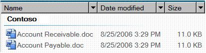

# DataGrid Control Type

This topic provides information about Microsoft UI Automation support for the **DataGrid** control type.

The **DataGrid** control type lets a user easily work with items that contain data or automation elements presented in columns or rows. Data grid controls have rows of items and columns of information about those items. A list-view control in Windows Vista Explorer is an example that supports the **DataGrid** control type.

The following sections define the required UI Automation tree structure, properties, control patterns, and events for the **DataGrid** control type. The UI Automation requirements apply to all data grid controls where the UI framework/platform integrates UI Automation support for control types and control patterns.

This topic contains the following sections.

-   [Typical Tree Structure](#typical-tree-structure)
-   [Relevant Properties](#relevant-properties)
-   [Required Control Patterns](#required-control-patterns)
-   [Required Events](#required-events)
-   [DataGrid Control Type Example](#datagrid-control-type-example)
-   [Related topics](#related-topics)

## Typical Tree Structure

The following table depicts a typical control and content view of the UI Automation tree that pertains to data grid controls and describes what can be contained in each view. For more information about the UI Automation tree, see [UI Automation Tree Overview](uiauto-treeoverview.md).

| Control View | Content View | 
|--------------|--------------|
| <ul><li>DataGrid<ul><li>Header (0, 1, or 2)<ul><li>HeaderItem (number of columns or rows)</li></ul></li><li>DataItem (0 or more; can be structured in a hierarchy)</li></ul></li></ul> | <ul><li>DataGrid<ul><li>DataItem (0 or more; can be structured in a hierarchy)</li></ul></li></ul> | 

 

## Relevant Properties

The following table lists the UI Automation properties whose value or definition is especially relevant to the **DataGrid** control type. For more information about UI Automation properties, see [Retrieving Properties from UI Automation Elements](uiauto-propertiesforclients.md).

| UI Automation Property                                                                                              | Value        | Notes                                                                                                                                                                                                                                                                                                        |
|---------------------------------------------------------------------------------------------------------------------|--------------|--------------------------------------------------------------------------------------------------------------------------------------------------------------------------------------------------------------------------------------------------------------------------------------------------------------|
| [**UIA\_AutomationIdPropertyId**](uiauto-automation-element-propids.md)                 | See notes.   | The value of this property must be unique among all peer elements in the raw view of the UI Automation tree.                                                                                                                                                                                                 |
| [**UIA\_BoundingRectanglePropertyId**](uiauto-automation-element-propids.md)       | See notes.   | The outermost rectangle that contains the whole control.                                                                                                                                                                                                                                                     |
| [**UIA\_ClickablePointPropertyId**](uiauto-automation-element-propids.md)             | See notes.   | Supported if there is a bounding rectangle. If not every point within the bounding rectangle is clickable, and the element performs specialized hit testing, override and provide a clickable point.                                                                                                         |
| [**UIA\_ControlTypePropertyId**](uiauto-automation-element-propids.md)                   | **DataGrid** |                                                                                                                                                                                                                                                                                                              |
| [**UIA\_IsContentElementPropertyId**](uiauto-automation-element-propids.md)         | TRUE         | The value of this property must always be **TRUE**. This means that the data grid control must always be in the content view of the UI Automation tree.                                                                                                                                                      |
| [**UIA\_IsControlElementPropertyId**](uiauto-automation-element-propids.md)         | TRUE         | The value of this property must always **TRUE**. This means that the data grid control must always be included in the control view of the UI Automation tree.                                                                                                                                                |
| [**UIA\_IsKeyboardFocusablePropertyId**](uiauto-automation-element-propids.md)   | See notes.   | If the control can receive keyboard focus, it must support this property.                                                                                                                                                                                                                                    |
| [**UIA\_LabeledByPropertyId**](uiauto-automation-element-propids.md)                       | See notes.   | If there is a static text label, this property must expose a reference to that control.                                                                                                                                                                                                                      |
| [**UIA\_LocalizedControlTypePropertyId**](uiauto-automation-element-propids.md) | See notes.   | Localized string corresponding to the **DataGrid** control type. The default value is "data grid" for en-US or English (United States).                                                                                                                                                                      |
| [**UIA\_NamePropertyId**](uiauto-automation-element-propids.md)                                 | See notes.   | The data grid control typically gets the value for its **Name** property from a static text label. If there is not a static text label an application developer must assign a value to for the **Name** property. The value of the **Name** property must never be the textual contents of the edit control. |

 

## Required Control Patterns

The following table lists the UI Automation control patterns required to be supported by all data grid controls. For more information on control patterns, see [UI Automation Control Patterns Overview](uiauto-controlpatternsoverview.md).

| Control Pattern                                         | Support  | Notes                                                                                                                                                                             |
|---------------------------------------------------------|----------|-----------------------------------------------------------------------------------------------------------------------------------------------------------------------------------|
| [**IGridProvider**](/windows/desktop/api/UIAutomationCore/nn-uiautomationcore-igridprovider)           | Required | The data grid control itself always supports the [Grid](uiauto-implementinggrid.md) control pattern because the items that it contains have metadata that is laid out in a grid. |
| [**IScrollProvider**](/windows/desktop/api/UIAutomationCore/nn-uiautomationcore-iscrollprovider)       | Depends  | The ability to scroll the data grid depends on content and whether scroll bars are present.                                                                                       |
| [**ISelectionProvider**](/windows/desktop/api/UIAutomationCore/nn-uiautomationcore-iselectionprovider) | Depends  | The ability to select the data grid depends on content.                                                                                                                           |
| [**ITableProvider**](/windows/desktop/api/UIAutomationCore/nn-uiautomationcore-itableprovider)         | Depends  | A data grid control that has a header should support the [Table](uiauto-implementingtable.md) control pattern.                                                                   |

 

Data items within the data grid containers will support at a minimum:

-   [SelectionItem](uiauto-implementingselectionitem.md) control pattern (if the data grid is selectable)
-   [ScrollItem](uiauto-implementingscrollitem.md) control pattern (if the data grid is scrollable)
-   [GridItem](uiauto-implementinggriditem.md) control pattern
-   [TableItem](uiauto-implementingtableitem.md) control pattern (if the data grid has a header)

## Required Events

The following table lists the UI Automation events that data grid controls are required to support. For more information on events, see [UI Automation Events Overview](uiauto-eventsoverview.md).

| UI Automation Event                                                                                                                                        | Notes                                                                                                                                                    |
|------------------------------------------------------------------------------------------------------------------------------------------------------------|----------------------------------------------------------------------------------------------------------------------------------------------------------|
| [**UIA\_AutomationFocusChangedEventId**](uiauto-event-ids.md)                                                           |                                                                                                                                                          |
| [**UIA\_BoundingRectanglePropertyId**](uiauto-automation-element-propids.md) property-changed event.                      |                                                                                                                                                          |
| [**UIA\_IsEnabledPropertyId**](uiauto-automation-element-propids.md) property-changed event.                                      | If the control supports the [**IsEnabled**](uiauto-automation-element-propids.md) property, it must support this event.                                 |
| [**UIA\_IsOffscreenPropertyId**](uiauto-automation-element-propids.md) property-changed event.                                  | If the control supports the [**IsOffscreen**](uiauto-automation-element-propids.md) property, it must support this event.                               |
| [**UIA\_LayoutInvalidatedEventId**](uiauto-event-ids.md)                                                                     |                                                                                                                                                          |
| [**UIA\_StructureChangedEventId**](uiauto-event-ids.md)                                                                       |                                                                                                                                                          |
| [**UIA\_MultipleViewCurrentViewPropertyId**](uiauto-control-pattern-propids.md) property-changed event.             | If the control supports the CurrentView property of the [MultipleView](uiauto-implementingmultipleview.md) control pattern, it must support this event. |
| [**UIA\_ScrollHorizontallyScrollablePropertyId**](uiauto-control-pattern-propids.md) property-changed event.   | If the control supports the [Scroll](uiauto-implementingscroll.md) control pattern, it must support this event.                                         |
| [**UIA\_ScrollHorizontalScrollPercentPropertyId**](uiauto-control-pattern-propids.md) property-changed event. | If the control supports the [Scroll](uiauto-implementingscroll.md) control pattern, it must support this event.                                         |
| [**UIA\_ScrollHorizontalViewSizePropertyId**](uiauto-control-pattern-propids.md) property-changed event.           | If the control supports the [Scroll](uiauto-implementingscroll.md) control pattern, it must support this event.                                         |
| [**UIA\_ScrollVerticalScrollPercentPropertyId**](uiauto-control-pattern-propids.md) property-changed event.     | If the control supports the [Scroll](uiauto-implementingscroll.md) control pattern, it must support this event.                                         |
| [**UIA\_ScrollVerticallyScrollablePropertyId**](uiauto-control-pattern-propids.md) property-changed event.       | If the control supports the [Scroll](uiauto-implementingscroll.md) control pattern, it must support this event.                                         |
| [**UIA\_ScrollVerticalViewSizePropertyId**](uiauto-control-pattern-propids.md) property-changed event.               | If the control supports the [Scroll](uiauto-implementingscroll.md) control pattern, it must support this event.                                         |
| [**UIA\_Selection\_InvalidatedEventId**](uiauto-event-ids.md)                                                            |                                                                                                                                                          |

 

## DataGrid Control Type Example

The following image illustrates a list-view control that implements the **DataGrid** control type.

The control view and the content view of the UI Automation tree that pertains to the list-view control is displayed below. The control patterns for each automation element are shown in parentheses.

| UI Automation Tree - Control View | UI Automation Tree - Content View | 
|-----------------------------------|-----------------------------------|
| DataGrid (Sort, Table, Selection, Grid)<ul><li>Header<ul><li>HeaderItem "Name" (Invoke)</li><li>HeaderItem "Date Modified" (Invoke)</li><li>HeaderItem "Size" (Invoke)</li></ul></li><li>Group "Contoso" (TableItem, GridItem, SelectionItem, Table*, Grid*)<ul><li>DataItem "Accounts Receivable.doc" (SelectionItem, Invoke, TableItem*, GridItem*)</li><li>DataItem "Accounts Payable.doc" (SelectionItem, Invoke, TableItem*, GridItem*)</li></ul></li></ul> | DataGrid (Table, Grid, Selection)<ul><li>Group "Contoso" (TableItem, GridItem, SelectionItem, Table*, Grid*)<ul><li>DataItem "Accounts Receivable.doc" (SelectionItem, Invoke, TableItem*, GridItem*)</li><li>DataItem "Accounts Payable.doc" (SelectionItem, Invoke, TableItem*, GridItem*)</li></ul></li></ul> | 

 

\*The preceding example shows a data grid that contains multiple levels of controls. The **Group** ("Contoso") control contains two **DataItem** controls ("Accounts Receivable.doc" and "Accounts Payable.doc"). A **DataGrid**/**GridItem** pair is independent of a pair at another level. The **DataItem** controls under a **Group** can also be exposed as a [ListItem](uiauto-supportlistitemcontroltype.md) control type, enabling them to be presented more clearly as selectable objects, rather than as simple data elements. This example does not include the sub-elements of the grouped data items. For another example of multiple levels of controls, see the [DataItem](uiauto-supportdataitemcontroltype.md) control type.

## Related topics

<dl> <dt>

**Conceptual**
</dt> <dt>

[UI Automation Control Types Overview](uiauto-controltypesoverview.md)
</dt> <dt>

[UI Automation Overview](uiauto-uiautomationoverview.md)
</dt> </dl>

 

 

