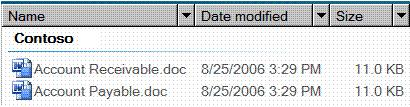

# DataItem Control Type

This topic provides information about Microsoft UI Automation support for the **DataItem** control type.

An entry in a Contacts list is an example of a data item control. A data item control contains information that is of interest to an end user. It is more complicated than the simple list item because it contains richer information.

The following sections define the required UI Automation tree structure, properties, control patterns, and events for the **DataItem** control type. The UI Automation requirements apply to all data item controls where the UI framework/platform integrates UI Automation support for control types and control patterns.

This topic contains the following sections.

-   [Typical Tree Structure](#typical-tree-structure)
-   [Relevant Properties](#relevant-properties)
-   [Required Control Patterns](#required-control-patterns)
-   [Working with DataItems in Large Lists](#working-with-dataitems-in-large-lists)
-   [Required Events](#required-events)
-   [DataItem Control Type Example](#dataitem-control-type-example)
-   [Related topics](#related-topics)

## Typical Tree Structure

The following table depicts a typical control and content view of the UI Automation tree that pertains to data item controls and describes what can be contained in each view. For more information about the UI Automation tree, see [UI Automation Tree Overview](uiauto-treeoverview.md).

| Control View | Content View | 
|--------------|--------------|
| <ul><li>DataItem<ul><li>Varies (0 or more; can be structured in hierarchy)</li></ul></li></ul> | <ul><li>DataItem<ul><li>Varies (0 or more; can be structured in hierarchy)</li></ul></li></ul> | 

 

A data item element in a data grid can host a variety of objects, including another layer of data items, or specific grid elements such as text, images, or edit controls. If the data item element has a specific object role, the element should be exposed as a specific control type; for example, a [ListItem](uiauto-supportlistitemcontroltype.md) control type for a selectable data item in the grid.

## Relevant Properties

The following table lists the UI Automation properties whose value or definition is especially relevant to the DataItem control type. For more information about UI Automation properties, see [Retrieving Properties from UI Automation Elements](uiauto-propertiesforclients.md).

| UI Automation Property                                                                                              | Value        | Notes                                                                                                                                                                                                |
|---------------------------------------------------------------------------------------------------------------------|--------------|------------------------------------------------------------------------------------------------------------------------------------------------------------------------------------------------------|
| [**UIA\_AutomationIdPropertyId**](uiauto-automation-element-propids.md)                 | See notes.   | The value of this property must be unique among all peer elements in the raw view of the UI Automation tree.                                                                                         |
| [**UIA\_BoundingRectanglePropertyId**](uiauto-automation-element-propids.md)       | See notes.   | The outermost rectangle that contains the whole control.                                                                                                                                             |
| [**UIA\_ClickablePointPropertyId**](uiauto-automation-element-propids.md)             | See notes.   | Supported if there is a bounding rectangle. If not every point within the bounding rectangle is clickable, and the element performs specialized hit testing, override and provide a clickable point. |
| [**UIA\_ControlTypePropertyId**](uiauto-automation-element-propids.md)                   | **DataItem** |                                                                                                                                                                                                      |
| [**UIA\_IsContentElementPropertyId**](uiauto-automation-element-propids.md)         | TRUE         | The data item control must always be content.                                                                                                                                                        |
| [**UIA\_IsControlElementPropertyId**](uiauto-automation-element-propids.md)         | TRUE         | The data item control must always be a control.                                                                                                                                                      |
| [**UIA\_IsKeyboardFocusablePropertyId**](uiauto-automation-element-propids.md)   | See notes.   | If the control can receive keyboard focus, it must support this property.                                                                                                                            |
| [**UIA\_ItemStatusPropertyId**](uiauto-automation-element-propids.md)                     | See notes.   | If the control contains status that is being updated dynamically, this property must be supported so that an assistive technology can receive updates when the status of the element changes.        |
| [**UIA\_ItemTypePropertyId**](uiauto-automation-element-propids.md)                         | See notes.   | This is the string value that conveys to the end user the underlying object that the item represents. Examples include "Media File" and "Contact".                                                   |
| [**UIA\_LabeledByPropertyId**](uiauto-automation-element-propids.md)                       | Null         | Data item controls do not have a static text label.                                                                                                                                                  |
| [**UIA\_LocalizedControlTypePropertyId**](uiauto-automation-element-propids.md) | See notes.   | Localized string corresponding to the **DataItem** control type. The default value is "data item" for en-US or English (United States).                                                              |
| [**UIA\_NamePropertyId**](uiauto-automation-element-propids.md)                                 | See notes.   | The data item control always contains a primary text element that the user would recognize as the identifier for the item.                                                                           |

 

## Required Control Patterns

The following table lists the UI Automation control patterns required to be supported by all data item controls. For more information on control patterns, see [UI Automation Control Patterns Overview](uiauto-controlpatternsoverview.md).

| Control Pattern                                                   | Support | Notes                                                                                                                                                                                                                 |
|-------------------------------------------------------------------|---------|-----------------------------------------------------------------------------------------------------------------------------------------------------------------------------------------------------------------------|
| [**IExpandCollapseProvider**](/windows/desktop/api/UIAutomationCore/nn-uiautomationcore-iexpandcollapseprovider) | Depends | If the data item can be expanded or collapsed to show and hide information, the [ExpandCollapse](uiauto-implementingexpandcollapse.md) control pattern must be supported.                                            |
| [**IGridItemProvider**](/windows/desktop/api/UIAutomationCore/nn-uiautomationcore-igriditemprovider)             | Depends | Data items will support the [GridItem](uiauto-implementinggriditem.md) control pattern when a collection of data items is available within a container that can be spatially navigated item-to-item.                 |
| [**IScrollItemProvider**](/windows/desktop/api/UIAutomationCore/nn-uiautomationcore-iscrollitemprovider)         | Depends | All data items support the ability to be scrolled into view with the [ScrollItem](uiauto-implementingscrollitem.md) control pattern when their data container has more items than can fit on the screen.             |
| [**ISelectionItemProvider**](/windows/desktop/api/UIAutomationCore/nn-uiautomationcore-iselectionitemprovider)   | Depends | The ability to select the data items depends on the content.                                                                                                                                                          |
| [**ITableItemProvider**](/windows/desktop/api/UIAutomationCore/nn-uiautomationcore-itableitemprovider)           | Depends | If the data item is contained within a [DataGrid](uiauto-supportdatagridcontroltype.md) control type that has a header element, it should support the [TableItem](uiauto-implementingtableitem.md) control pattern. |
| [**IToggleProvider**](/windows/desktop/api/UIAutomationCore/nn-uiautomationcore-itoggleprovider)                 | Depends | If the data item contains a state that can be cycled through, it should support the [Toggle](uiauto-implementingtoggle.md) control pattern.                                                                          |
| [**IValueProvider**](/windows/desktop/api/UIAutomationCore/nn-uiautomationcore-ivalueprovider)                   | Depends | If the data item's primary text is editable, the [Value](uiauto-implementingvalue.md) control pattern must be supported.                                                                                             |

 

## Working with DataItems in Large Lists

Because large lists are often virtualized within UI frameworks to assist in performance, a UI Automation client cannot use the UI Automation query feature to search the contents of the full tree in the same way that it can in other item containers. A client should scroll the item into view (or expand the control to show all available options) prior to accessing the full set of information from the data item.

When calling [**SetFocus**](/windows/desktop/api/UIAutomationClient/nf-uiautomationclient-iuiautomationelement-setfocus) on the UI Automation element for the data item, Microsoft Windows Explorer returns successfully and causes focus to be set to the Edit control within the data item subtree.

## Required Events

The following table lists the UI Automation events that data item controls are required to support. For more information on events, see [UI Automation Events Overview](uiauto-eventsoverview.md).

| UI Automation Event                                                                                                                                                | Notes                                                                                                                            |
|--------------------------------------------------------------------------------------------------------------------------------------------------------------------|----------------------------------------------------------------------------------------------------------------------------------|
| [**UIA\_AutomationFocusChangedEventId**](uiauto-event-ids.md)                                                                   |                                                                                                                                  |
| [**UIA\_BoundingRectanglePropertyId**](uiauto-automation-element-propids.md) property-changed event.                              |                                                                                                                                  |
| [**UIA\_ExpandCollapseExpandCollapseStatePropertyId**](uiauto-control-pattern-propids.md) property-changed event. | If the control supports the [ExpandCollapse](uiauto-implementingexpandcollapse.md) control pattern, it must support this event. |
| [**UIA\_Invoke\_InvokedEventId**](uiauto-event-ids.md)                                                                                  | If the control supports the [Invoke](uiauto-implementinginvoke.md) control pattern, it must support this event.                 |
| [**UIA\_IsEnabledPropertyId**](uiauto-automation-element-propids.md) property-changed event.                                              | If the control supports the [**IsEnabled**](uiauto-automation-element-propids.md) property, it must support this event.         |
| [**UIA\_IsOffscreenPropertyId**](uiauto-automation-element-propids.md) property-changed event.                                          | If the control supports the [**IsOffscreen**](uiauto-automation-element-propids.md) property, it must support this event.       |
| [**UIA\_ItemStatusPropertyId**](uiauto-automation-element-propids.md) property-changed event.                                            | If the control supports the [**ItemStatus**](uiauto-automation-element-propids.md) property, it must support this event.        |
| [**UIA\_NamePropertyId**](uiauto-automation-element-propids.md) property-changed event.                                                        |                                                                                                                                  |
| [**UIA\_SelectionItem\_ElementAddedToSelectionEventId**](uiauto-event-ids.md)                                    | If the control supports the [SelectionItem](uiauto-implementingselectionitem.md) control pattern, it must support this event.   |
| [**UIA\_SelectionItem\_ElementRemovedFromSelectionEventId**](uiauto-event-ids.md)                            | If the control supports the [SelectionItem](uiauto-implementingselectionitem.md) control pattern, it must support this event.   |
| [**UIA\_SelectionItem\_ElementSelectedEventId**](uiauto-event-ids.md)                                                    | If the control supports the [SelectionItem](uiauto-implementingselectionitem.md) control pattern, it must support this event.   |
| [**UIA\_StructureChangedEventId**](uiauto-event-ids.md)                                                                               |                                                                                                                                  |
| [**UIA\_ToggleToggleStatePropertyId**](uiauto-control-pattern-propids.md) property-changed event.                                 | If the control supports the [Toggle](uiauto-implementingtoggle.md) control pattern, it must support this event.                 |
| [**UIA\_ValueValuePropertyId**](uiauto-control-pattern-propids.md) property-changed event.                                               | If the control supports the [Value](uiauto-implementingvalue.md) control pattern, it must support this event.                   |

 

## DataItem Control Type Example

The following image illustrates a DataItem control type in a list-view control.

The control view and the content view of the UI Automation tree that pertains to the data item control is displayed below. The control patterns for each automation element are shown in parentheses. The **Group** "Contoso" is also part of the grid of the data grid host control. For an example of a higher level grid structure, see [DataGrid Control Type](uiauto-supportdatagridcontroltype.md).

| UI Automation Tree - Control View | UI Automation Tree - Content View | 
|-----------------------------------|-----------------------------------|
| <ul><li>Group "Contoso" (Table, Grid)<ul><li>DataItem "Accounts Receivable.doc" (TableItem, GridItem, SelectionItem, Invoke)<ul><li>Image "Accounts Receivable.doc"</li><li>Edit "Name" (TableItem, GridItem, Value "Accounts Receivable.doc")</li><li>Edit "Date modified" (TableItem, GridItem, Value "8/25/2006 3:29 PM")</li><li>Edit "Size" (GridItem, TableItem, Value "11.0 KB")</li></ul></li><li>DataItem "Accounts Payable.doc" (TableItem, GridItem, SelectionItem, Invoke)<ul><li>...</li></ul></li></ul></li></ul> | <ul><li>Group "Contoso" (Table, Grid)<ul><li>DataItem "Accounts Receivable.doc" (TableItem, GridItem, SelectionItem, Invoke)<ul><li>Image "Accounts Receivable.doc"</li><li>Edit "Name" (TableItem, GridItem, Value "Accounts Receivable.doc")</li><li>Edit "Date modified" (TableItem, GridItem, Value "8/25/2006 3:29 PM")</li><li>Edit "Size" (GridItem, TableItem, Value "11.0 KB")</li></ul></li><li>DataItem "Accounts Payable.doc" (TableItem, GridItem, SelectionItem, Invoke)<ul><li>...</li></ul></li></ul></li></ul> | 

 

If a grid represents a list of selectable items, the corresponding selectable UI elements can be exposed with the [ListItem](uiauto-supportlistitemcontroltype.md) control type instead of the DataItem control type. In the preceding example, the **DataItem** elements ("Accounts Receivable.doc" and "Accounts Payable.doc") under **Group** ("Contoso") can be improved by exposing them as ListItem control types because that type already supports the [SelectionItem](uiauto-implementingselectionitem.md) control pattern.

## Related topics

<dl> <dt>

**Conceptual**
</dt> <dt>

[UI Automation Control Types Overview](uiauto-controltypesoverview.md)
</dt> <dt>

[UI Automation Overview](uiauto-uiautomationoverview.md)
</dt> </dl>

 

 

