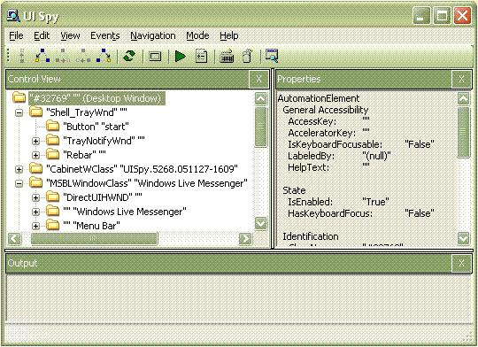

# Pane Control Type

This topic provides information about Microsoft UI Automation support for the **Pane** control type.

The **Pane** control type is for potentially scrollable regions that have disparate content. It is used to represent an object within a frame or document window. Users can navigate between pane controls and within the contents of the current pane. Pane controls represent a level of grouping lower than windows or documents, but above individual controls. The user navigates between panes by pressing TAB, F6, or CTRL+TAB, depending on the context.

The following sections define the required UI Automation tree structure, properties, control patterns, and events for the **Pane** control type. The UI Automation requirements apply to all pane controls where the UI framework/platform integrates UI Automation support for control types and control patterns.

This topic contains the following sections.

-   [Typical Tree Structure](#typical-tree-structure)
-   [Relevant Properties](#relevant-properties)
-   [Required Control Patterns](#required-control-patterns)
-   [Required Events](#required-events)
-   [Pane Control Type Example](#pane-control-type-example)
-   [Related topics](#related-topics)

## Typical Tree Structure

The following table depicts a typical control and content view of the UI Automation tree that pertains to pane controls and describes what can be contained in each view. For more information about the UI Automation tree, see [UI Automation Tree Overview](uiauto-treeoverview.md).

| Control View | Content View | 
|--------------|--------------|
| <ul><li>Pane</li></ul> | <ul><li>Pane</li></ul> | 

 

A pane control always appears in the control and content views. Do not expose a layout object as a pane in either the control or content view if the object is used only for visual presentation.

## Relevant Properties

The following table lists the UI Automation properties whose value or definition is especially relevant to pane controls. For more information about UI Automation properties, see [Retrieving Properties from UI Automation Elements](uiauto-propertiesforclients.md).

| UI Automation Property                                                                                              | Value      | Notes                                                                                                                                                                                                                                                                                                                 |
|---------------------------------------------------------------------------------------------------------------------|------------|-----------------------------------------------------------------------------------------------------------------------------------------------------------------------------------------------------------------------------------------------------------------------------------------------------------------------|
| [**UIA\_AccessKeyPropertyId**](uiauto-automation-element-propids.md)                       | See notes. | If a specific key combination gives focus to the pane, that information should be exposed through this property.                                                                                                                                                                                                      |
| [**UIA\_AutomationIdPropertyId**](uiauto-automation-element-propids.md)                 | See notes. | The value of this property must be unique among all peer elements in the raw view of the UI Automation tree.                                                                                                                                                                                                          |
| [**UIA\_BoundingRectanglePropertyId**](uiauto-automation-element-propids.md)       | See notes. | The outermost rectangle that contains the whole control.                                                                                                                                                                                                                                                              |
| [**UIA\_ClickablePointPropertyId**](uiauto-automation-element-propids.md)             | See notes. | This property exposes a clickable point of the pane control that causes the pane to become focused when it is clicked.                                                                                                                                                                                                |
| [**UIA\_ControlTypePropertyId**](uiauto-automation-element-propids.md)                   | **Pane**   |                                                                                                                                                                                                                                                                                                                       |
| [**UIA\_HelpTextPropertyId**](uiauto-automation-element-propids.md)                         | See notes. | The help text for pane controls should explain the purpose of the frame and how it relates to other frames. A description is necessary if the purpose and relationship of the frames is not clear from the value of the [**UIA\_NamePropertyId**](uiauto-automation-element-propids.md) property. |
| [**UIA\_IsContentElementPropertyId**](uiauto-automation-element-propids.md)         | TRUE       | The pane control is always included in the content view of the UI Automation tree.                                                                                                                                                                                                                                    |
| [**UIA\_IsControlElementPropertyId**](uiauto-automation-element-propids.md)         | TRUE       | The pane control is always included in the control view of the UI Automation tree.                                                                                                                                                                                                                                    |
| [**UIA\_IsKeyboardFocusablePropertyId**](uiauto-automation-element-propids.md)   | See notes. | If the control can receive keyboard focus, it must support this property.                                                                                                                                                                                                                                             |
| [**UIA\_LabeledByPropertyId**](uiauto-automation-element-propids.md)                       | See notes. | Pane controls typically do not have a static label. If there is a static text label, it should be exposed through this property.                                                                                                                                                                                      |
| [**UIA\_LocalizedControlTypePropertyId**](uiauto-automation-element-propids.md) | See notes. | Localized string corresponding to the **Pane** control type. The default value is "pane" for en-US or English (United States).                                                                                                                                                                                        |
| [**UIA\_NamePropertyId**](uiauto-automation-element-propids.md)                                 | See notes. | The value for this property must always be a clear, concise and meaningful title.                                                                                                                                                                                                                                     |

 

## Required Control Patterns

The following table lists the UI Automation control patterns required to be supported by pane controls. For more information on control patterns, see [UI Automation Control Patterns Overview](uiauto-controlpatternsoverview.md).

| Control Pattern                                         | Support | Notes                                                                                                                                                                                         |
|---------------------------------------------------------|---------|-----------------------------------------------------------------------------------------------------------------------------------------------------------------------------------------------|
| [**IDockProvider**](/windows/desktop/api/UIAutomationCore/nn-uiautomationcore-idockprovider)           | Depends | Implement the [Dock](uiauto-implementingdock.md) control pattern if the pane control can be docked.                                                                                          |
| [**IScrollProvider**](/windows/desktop/api/UIAutomationCore/nn-uiautomationcore-iscrollprovider)       | Depends | Implement the [Scroll](uiauto-implementingscroll.md) control pattern if the pane control can be scrolled.                                                                                    |
| [**ITransformProvider**](/windows/desktop/api/UIAutomationCore/nn-uiautomationcore-itransformprovider) | Depends | Implement the [Transform](uiauto-implementingtransform.md) control pattern if the pane control can be moved, resized, or rotated on the screen.                                              |
| [**IWindowProvider**](/windows/desktop/api/UIAutomationCore/nn-uiautomationcore-iwindowprovider)       | Never   | If the element needs to implement the [Window](uiauto-implementingwindow.md) control pattern, the control should be based on the [Window](uiauto-supportwindowcontroltype.md) control type. |

 

## Required Events

The following table lists the UI Automation events that pane controls are required to support. For more information on events, see [UI Automation Events Overview](uiauto-eventsoverview.md).

| UI Automation Event                                                                                                                                        | Notes                                                                                                                      |
|------------------------------------------------------------------------------------------------------------------------------------------------------------|----------------------------------------------------------------------------------------------------------------------------|
| [**UIA\_AsyncContentLoadedEventId**](uiauto-event-ids.md)                                                                   |                                                                                                                            |
| [**UIA\_AutomationFocusChangedEventId**](uiauto-event-ids.md)                                                           |                                                                                                                            |
| [**UIA\_BoundingRectanglePropertyId**](uiauto-automation-element-propids.md) property-changed event.                      |                                                                                                                            |
| [**UIA\_IsOffscreenPropertyId**](uiauto-automation-element-propids.md) property-changed event.                                  | If the control supports the [**IsOffscreen**](uiauto-automation-element-propids.md) property, it must support this event. |
| [**UIA\_ScrollHorizontallyScrollablePropertyId**](uiauto-control-pattern-propids.md) property-changed event.   | If the control supports the [Scroll](uiauto-implementingscroll.md) control pattern, it must support this event.           |
| [**UIA\_ScrollHorizontalScrollPercentPropertyId**](uiauto-control-pattern-propids.md) property-changed event. | If the control supports the [Scroll](uiauto-implementingscroll.md) control pattern, it must support this event.           |
| [**UIA\_ScrollHorizontalViewSizePropertyId**](uiauto-control-pattern-propids.md) property-changed event.           | If the control supports the [Scroll](uiauto-implementingscroll.md) control pattern, it must support this event.           |
| [**UIA\_ScrollVerticallyScrollablePropertyId**](uiauto-control-pattern-propids.md) property-changed event.       | If the control supports the [Scroll](uiauto-implementingscroll.md) control pattern, it must support this event.           |
| [**UIA\_ScrollVerticalScrollPercentPropertyId**](uiauto-control-pattern-propids.md) property-changed event.     | If the control supports the [Scroll](uiauto-implementingscroll.md) control pattern, it must support this event.           |
| [**UIA\_ScrollVerticalViewSizePropertyId**](uiauto-control-pattern-propids.md) property-changed event.               | If the control supports the [Scroll](uiauto-implementingscroll.md) control pattern, it must support this event.           |
| [**UIA\_StructureChangedEventId**](uiauto-event-ids.md)                                                                       |                                                                                                                            |

 

## Pane Control Type Example

The following image illustrates a control that implements the **Pane** control type.

| UI Automation Tree—Control View | UI Automation Tree—Content View | 
|-----------------------------------|-----------------------------------|
| <ul><li>Pane<ul><li>Tree (Scroll Pattern)<ul><li>TreeItem</li><li>...</li></ul></li></ul></li><li>Pane<ul><li>Edit (Scroll Pattern)</li></ul></li></ul> | <ul><li>Pane<ul><li>Tree (Scroll Pattern)<ul><li>TreeItem</li><li>...</li></ul></li><li>Pane<ul><li>Edit (Scroll Pattern)</li></ul></li></ul></li></ul> | 

 

## Related topics

<dl> <dt>

**Conceptual**
</dt> <dt>

[UI Automation Control Types Overview](uiauto-controltypesoverview.md)
</dt> <dt>

[UI Automation Overview](uiauto-uiautomationoverview.md)
</dt> </dl>

 

 

