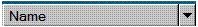

# SplitButton Control Type

This topic provides information about Microsoft UI Automation support for the **SplitButton** control type.

The split button control enables an action to be performed on a control, and to expand the control to see a list of other possible actions that can be performed.

The following sections define the required UI Automation tree structure, properties, control patterns, and events for the **SplitButton** control type. The UI Automation requirements apply to all split button controls where the UI framework/platform integrates UI Automation support for control types and control patterns.

This topic contains the following sections.

-   [Typical Tree Structure](#typical-tree-structure)
-   [Relevant Properties](#relevant-properties)
-   [Required Control Patterns](#required-control-patterns)
-   [Required Events](#required-events)
-   [SplitButton Control Type Example](#splitbutton-control-type-example)
-   [Related topics](#related-topics)

## Typical Tree Structure

The following table depicts a typical control and content view of the UI Automation tree that pertains to split button controls and describes what can be contained in each view. For more information about the UI Automation tree, see [UI Automation Tree Overview](uiauto-treeoverview.md).

| Control View | Content View | 
|--------------|--------------|
| <ul><li>SplitButton<ul><li>Image (0 or 1)</li><li>Text (0 or 1)</li><li>Button (1 or 2)<ul><li>Menu (0 or 1; appears as a child of a sub-button that supports the ExpandCollapse pattern)<ul><li>MenuItem (1 to many)</li></ul></li></ul></li></ul></li></ul> | <ul><li>SplitButton<ul><li>Button (1 or 2)<ul><li>MenuItem (1 to many)</li></ul></li></ul></li></ul> | 

 

## Relevant Properties

The following table lists the UI Automation properties whose value or definition is especially relevant to the **SplitButton** control type. For more information about UI Automation properties, see [Retrieving Properties from UI Automation Elements](uiauto-propertiesforclients.md).

| UI Automation Property                                                                                              | Value           | Notes                                                                                                                                                                                                |
|---------------------------------------------------------------------------------------------------------------------|-----------------|------------------------------------------------------------------------------------------------------------------------------------------------------------------------------------------------------|
| [**UIA\_AutomationIdPropertyId**](uiauto-automation-element-propids.md)                 | See notes.      | The value of this property must be unique among all peer elements in the raw view of the UI Automation tree.                                                                                         |
| [**UIA\_BoundingRectanglePropertyId**](uiauto-automation-element-propids.md)       | See notes.      | The outermost rectangle that contains the whole control.                                                                                                                                             |
| [**UIA\_ClickablePointPropertyId**](uiauto-automation-element-propids.md)             | See notes.      | Supported if there is a bounding rectangle. If not every point within the bounding rectangle is clickable, and the element performs specialized hit testing, override and provide a clickable point. |
| [**UIA\_ControlTypePropertyId**](uiauto-automation-element-propids.md)                   | **SplitButton** | This value is the same for all UI frameworks.                                                                                                                                                        |
| [**UIA\_HelpTextPropertyId**](uiauto-automation-element-propids.md)                         | See notes.      | The help text can indicate the result of activating the split button, which is typically the same type of information presented through a tooltip.                                                   |
| [**UIA\_IsContentElementPropertyId**](uiauto-automation-element-propids.md)         | TRUE            | The split button control contains information for the end user.                                                                                                                                      |
| [**UIA\_IsControlElementPropertyId**](uiauto-automation-element-propids.md)         | TRUE            | The split button control is visible to the end user.                                                                                                                                                 |
| [**UIA\_IsKeyboardFocusablePropertyId**](uiauto-automation-element-propids.md)   | See notes.      | If the control can receive keyboard focus, it must support this property.                                                                                                                            |
| [**UIA\_LabeledByPropertyId**](uiauto-automation-element-propids.md)                       | NULL            | Split button controls do not have a static text label.                                                                                                                                               |
| [**UIA\_LocalizedControlTypePropertyId**](uiauto-automation-element-propids.md) | See notes.      | Localized string corresponding to the **SplitButton** control type. The default value is "split button" for en-US or English (United States).                                                        |
| [**UIA\_NamePropertyId**](uiauto-automation-element-propids.md)                                 | See notes.      | The text that is used to label the split button. Whenever an image is used to label a split button, alternate text must be supplied for the split button Name property.                              |

 

## Required Control Patterns

The following table lists the UI Automation control patterns required to be supported by all split button controls. For more information on control patterns, see [UI Automation Control Patterns Overview](uiauto-controlpatternsoverview.md).

| Control Pattern                                                   | Support  | Notes                                                                                                                                                                                                                          |
|-------------------------------------------------------------------|----------|--------------------------------------------------------------------------------------------------------------------------------------------------------------------------------------------------------------------------------|
| [**IExpandCollapseProvider**](/windows/desktop/api/UIAutomationCore/nn-uiautomationcore-iexpandcollapseprovider) | Required | Because split buttons always have the ability to expand a list of options, they must support the [ExpandCollapse](uiauto-implementingexpandcollapse.md) control pattern.                                                      |
| [**IInvokeProvider**](/windows/desktop/api/UIAutomationCore/nn-uiautomationcore-iinvokeprovider)                 | Required | Because split buttons always have a default action associated with the [**IInvokeProvider::Invoke**](/windows/desktop/api/UIAutomationCore/nf-uiautomationcore-iinvokeprovider-invoke) method, they must support the [Invoke](uiauto-implementinginvoke.md) control pattern. |

 

## Required Events

The following table lists the UI Automation events that split button controls are required to support. For more information on events, see [UI Automation Events Overview](uiauto-eventsoverview.md).

| UI Automation Event                                                                                                                                                | Notes                                                                                                                      |
|--------------------------------------------------------------------------------------------------------------------------------------------------------------------|----------------------------------------------------------------------------------------------------------------------------|
| [**UIA\_AutomationFocusChangedEventId**](uiauto-event-ids.md)                                                                   |                                                                                                                            |
| [**UIA\_BoundingRectanglePropertyId**](uiauto-automation-element-propids.md) property-changed event.                              |                                                                                                                            |
| [**UIA\_ExpandCollapseExpandCollapseStatePropertyId**](uiauto-control-pattern-propids.md) property-changed event. |                                                                                                                            |
| [**UIA\_Invoke\_InvokedEventId**](uiauto-event-ids.md)                                                                                  |                                                                                                                            |
| [**UIA\_IsEnabledPropertyId**](uiauto-automation-element-propids.md) property-changed event.                                              | If the control supports the [**IsEnabled**](uiauto-automation-element-propids.md) property, it must support this event.   |
| [**UIA\_IsOffscreenPropertyId**](uiauto-automation-element-propids.md) property-changed event.                                          | If the control supports the [**IsOffscreen**](uiauto-automation-element-propids.md) property, it must support this event. |
| [**UIA\_StructureChangedEventId**](uiauto-event-ids.md)                                                                               |                                                                                                                            |

 

## SplitButton Control Type Example

The following image illustrates a control that implements the **SplitButton** control type.

| UI Automation Tree—Control View | UI Automation Tree—Content View | 
|-----------------------------------|-----------------------------------|
| <ul><li>SplitButton "Name" (Invoke, ExpandCollapse)<ul><li>Button "More option" (Invoke)<ul><li>Menu<ul><li>MenuItem</li><li>...</li></ul></li></ul></li></ul></li></ul> | <ul><li>SplitButton "Name" (Invoke, ExpandCollapse)<ul><li>Button "More option" (Invoke)<ul><li>Menu<ul><li>MenuItem</li><li>...</li></ul></li></ul></li></ul></li></ul> | 

 

## Related topics

<dl> <dt>

**Conceptual**
</dt> <dt>

[UI Automation Control Types Overview](uiauto-controltypesoverview.md)
</dt> <dt>

[UI Automation Overview](uiauto-uiautomationoverview.md)
</dt> </dl>

 

 

