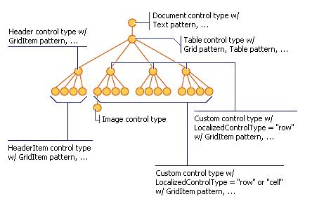
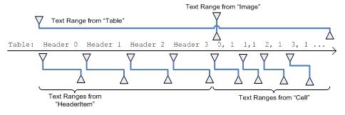
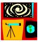
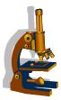

# How UI Automation Exposes Embedded Objects

This topic describes how Microsoft UI Automation uses the Text and TextRange control patterns to expose embedded objects (child/descendent elements) in a text document or container.

For UI Automation, an embedded object is any element that has non-textual boundaries such as an image, hyperlink, table, or document type (Microsoft Excel spreadsheet, Microsoft Windows Media file, and so on).

> [!NOTE]
> This differs from the Component Object Model (COM) OLE definition (see [Embedded Objects](../com/embedded-objects.md)), where an element is created in one application and embedded or linked in another application. Whether the object can be edited in its original application is irrelevant in the context of UI Automation.

## Embedded Objects and the UI Automation Tree

Embedded objects are treated as individual elements in the control view of the UI Automation tree. They are exposed as children of the text container so that they can be accessed through the same object model as other controls in UI Automation.

The following table lists examples of container and non-container elements.

:::row:::
   :::column span="2":::

      **Container elements**

   :::column-end:::
   :::column span="":::

      **Non-container elements**

   :::column-end:::
:::row-end:::
:::row:::
   :::column span="":::

- Calendar
- Combobox
- DataGrid
- Document
- Edit
- Group
- Header
- HeaderItem
- List
- Menu

   :::column-end:::
   :::column span="":::

- MenuBar
- Pane
- SplitButton
- Tab
- Table
- Toolbar
- Tree
- TreeItem
- Window

   :::column-end:::
   :::column span="":::

- Link
- CheckBoxes
- Button

  :::column-end:::
:::row-end:::

The following image shows a text container (document) with an embedded table and image.


The UI Automation content view of the preceding document is shown in the following diagram.



### "Compatible" and "Non-Compatible" embedded objects

Some UI Automation providers use the same text store for each TextPattern object they contain.  Objects backed by the same text store as their container are referred to as "compatible" embedded objects. These objects can be TextPattern objects themselves and, in this case, their text ranges are comparable to text ranges obtained from their container. This enables the providers to expose client information about the individual TextPattern objects as if they were one, large text provider.

However, providers can use different text stores for different TextPattern objects embedded within a TextPattern container. Objects not backed by the container's text store are referred to as "non-compatible" embedded objects. These types of embedded objects might or might not be TextPattern-based objects.  

The following table lists some examples of compatible and non-compatible embedded objects.

| Objects  | Compatible embedded objects | Non-compatible embedded objects |
| --- | --- | --- |
| Non-TextPattern embedded objects | Button in Microsoft Edge<br>Data Table in Microsoft Edge | Button in RichTextBlock in Microsoft’s XAML framework<br>Images with alt-text in Microsoft Edge<br>ListView with ListItems in RichTextBlock in Microsoft’s XAML framework |
| TextPattern embedded objects | Input control of type “text” in Microsoft Edge<br>Table in a Word document | TextBox element in a Microsoft Word document |

## Exposing Embedded Objects

The [Text and TextRange](uiauto-implementingtextandtextrange.md) control patterns expose properties and methods that facilitate navigation and querying of embedded objects.

The textual content (or inner text) of a text container and an embedded object, such as a hyperlink or table cell, is exposed as a single, continuous text stream in both the control view and the content view of the UI Automation tree; object boundaries are ignored. If a UI Automation client is retrieving the text to recite, interpret, or analyze in some manner, the text range should be checked for special cases, such as a table with textual content or other embedded objects. Call [**IUIAutomationTextRange::GetChildren**](/windows/desktop/api/UIAutomationClient/nf-uiautomationclient-iuiautomationtextrange-getchildren) to obtain a [**IUIAutomationElement**](/windows/desktop/api/UIAutomationClient/nn-uiautomationclient-iuiautomationelement) interface for each embedded object, and then call [**IUIAutomationTextPattern::RangeFromChild**](/windows/desktop/api/UIAutomationClient/nf-uiautomationclient-iuiautomationtextpattern-rangefromchild) to obtain a text range for each element. This is done recursively until all textual content has been retrieved.

> [!NOTE]
> A degenerate (or collapsed) range is where the start endpoint and the end endpoint are same. Degenerate ranges are often used to indicate text cursor position through the [ITextProvider](/windows/win32/api/uiautomationcore/nn-uiautomationcore-itextprovider) [GetSelection](/windows/win32/api/uiautomationcore/nf-uiautomationcore-itextprovider-getselection) and [GetCaretRange](/windows/win32/api/uiautomationcore/nf-uiautomationcore-itextprovider2-getcaretrange) methods.

The following diagram shows a text stream with embedded objects and their range spans.



## Embedded objects and TextUnit

An [ITextProvider](/windows/win32/api/uiautomationcore/nn-uiautomationcore-itextprovider) object can be traversed and  by a specified [TextUnit](/windows/desktop/api/uiautomationcore/ne-uiautomationcore-textunit). Providers that contain embedded objects can be traversed in much the same way, but embedded objects do affect traversal. Here are some things to be aware of:

- Any non-compatible embedded object is represented by the replacement character U+FFFC in the text store of the container element's TextPattern. It is also considered both a character unit and a word unit.
- Compatible embedded objects may consist of multiple characters and words.
- The enclosing element is the bottom-most element that spans the entire text range.
- Child elements of a range are also child elements of a container element that is partially or completely enclosed within the range.
- Ideally (especially in case of container elements like Table) a word boundary does not go beyond the object boundary. In the following example, the word unit "Bar" does not contain any text position that is outside the `</td>` tag (`<br \>` is not be part of the word "Bar").

```Xaml
<table style="width:100%">
  <tr>
    <th>Name</th>
    <th>Notes</th>
  </tr>
  <tr>
    <td>Eve Jackson</td>
    <td>Foo Bar</td>
  </tr>
</table>
<br/>
```

- In general, `<br \>` is treated as an individual word such that it does not go beyond a line boundary.
- An exception to the previous rule is where a Word text unit contains complete objects within itself. For example, `<p>Hello <a href="#">link</a> here.</p>`, which includes inline containers, has the words "Hello ", "link " and "here." Where "link " has a TextPattern object as the enclosing element and a link object as its child.
- In the case of Character units, the object is the enclosing element (text units like this should not have children).
- Annotation objects should not be represented as embedded object. For example, the presence of other Author specifiers in a co-authored document.
- Embedded objects take up at least one cursor position, annotation is just metadata.
- Each object boundary (start and end) is represented by a format break in the TextPattern document range.
- For HTML, each html tag does not necessarily result in a UI Automation object. For example, content within <em></em> emphasis tags need not be represented as element but rather a text stream where UIA_IsItalicAttributeId returns TRUE.
- Start endpoint is inclusive and is the preferred endpoint while the End endpoint is exclusive. This is useful for when the range is degenerate and the Start and End endpoints belong to same position for that range.

## Comparing embedded objects

Nested TextPattern objects that are in a similar child relationship and share the same backing text store are called comparable. In this case, ranges from either of the TextPattern objects can be compared using [ITextRangeProvider::Compare](/windows/win32/api/uiautomationcore/nf-uiautomationcore-itextrangeprovider-compare) and [ITextRangeProvider::CompareEndpoints](/windows/win32/api/uiautomationcore/nf-uiautomationcore-itextrangeprovider-compareendpoints). Both result in a valid numerical value specifying their relative position.

A non-TextPattern object embedded in a TextPattern object is comparable to the TextPattern if the object has a valid range in the TextPattern ([ITextProvider::RangeFromChild](/windows/win32/api/uiautomationcore/nf-uiautomationcore-itextprovider-rangefromchild)) and the content behind the text range is not empty and is not a replacement character.

## Embedded TextPattern objects and the Document TextUnit

For embedded TextPattern objects, the [Document](/windows/win32/api/uiautomationcore/ne-uiautomationcore-textunit) unit only recognizes the content contained within that element.

### Word TextPattern element hierarchy

- The document element implements TextPattern and [Document](/windows/win32/api/uiautomationcore/ne-uiautomationcore-textunit) returns the entire Word document range.
- Individual pages of the document implement TextPattern and [Document](/windows/win32/api/uiautomationcore/ne-uiautomationcore-textunit) returns the content of those individual pages (even though the pages share the same text store with the entire document TextPattern).

### Webpage and text input controls in Edge

- The main webpage Pane element implements TextPattern and exposes the entire webpage content.
- Individual text input controls support TextPattern where a document range represents the text contained in each input field (even though they share the same text store with the entire webpage).

## Common Scenarios

This section presents examples of common scenarios that involve embedded objects: hyperlinks, images, and tables. In the following examples, the left brace ({) represents the Start endpoint of the text range, and the right brace (}) represents the End endpoint.

### HyperLink Example 1: A text range that contains an embedded text hyperlink

The following text range contains an embedded text hyperlink.

  {The URL https://www.microsoft.com is embedded in text}.

Calling the [**IUIAutomationTextRange::GetText**](/windows/desktop/api/UIAutomationClient/nf-uiautomationclient-iuiautomationtextrange-gettext), [**GetEnclosingElement**](/windows/desktop/api/UIAutomationClient/nf-uiautomationclient-iuiautomationtextrange-getenclosingelement), [**GetChildren**](/windows/desktop/api/UIAutomationClient/nf-uiautomationclient-iuiautomationtextrange-getchildren), and [**IUIAutomationTextPattern::RangeFromChild**](/windows/desktop/api/UIAutomationClient/nf-uiautomationclient-iuiautomationtextpattern-rangefromchild) methods results in the behaviors described in the following table.

| Method called                                                                                                                                                                                                                                                     | Result                                                                                                                                                   |
|-------------------------------------------------------------------------------------------------------------------------------------------------------------------------------------------------------------------------------------------------------------------|----------------------------------------------------------------------------------------------------------------------------------------------------------|
| [**IUIAutomationTextRange::GetText**](/windows/desktop/api/UIAutomationClient/nf-uiautomationclient-iuiautomationtextrange-gettext)                                                                                                                                                                                  | Returns the string "The URL https://www.microsoft.com is embedded in text".                                                                               |
| [**IUIAutomationTextRange::GetEnclosingElement**](/windows/desktop/api/UIAutomationClient/nf-uiautomationclient-iuiautomationtextrange-getenclosingelement)                                                                                                                                                          | Returns the innermost UI Automation element that encloses the text range, in this case, the automation element that represents the text provider itself. |
| [**IUIAutomationTextRange::GetChildren**](/windows/desktop/api/UIAutomationClient/nf-uiautomationclient-iuiautomationtextrange-getchildren)                                                                                                                                                                          | Returns a UI Automation element representing the hyperlink control.                                                                                      |
| [**IUIAutomationTextPattern::RangeFromChild**](/windows/desktop/api/UIAutomationClient/nf-uiautomationclient-iuiautomationtextpattern-rangefromchild), where the UI Automation element was returned by the previous [**IUIAutomationTextRange::GetChildren**](/windows/desktop/api/UIAutomationClient/nf-uiautomationclient-iuiautomationtextrange-getchildren) method. | Returns the range that represents "https://www.microsoft.com".                                                                                            |
### HyperLink Example 2: A text range that partially spans an embedded text hyperlink

The following text range partially spans an embedded text hyperlink.

  The URL https://{www} is embedded in text.

Calling the [**IUIAutomationTextRange::GetText**](/windows/desktop/api/UIAutomationClient/nf-uiautomationclient-iuiautomationtextrange-gettext), [**GetEnclosingElement**](/windows/desktop/api/UIAutomationClient/nf-uiautomationclient-iuiautomationtextrange-getenclosingelement), and [**GetChildren**](/windows/desktop/api/UIAutomationClient/nf-uiautomationclient-iuiautomationtextrange-getchildren) methods results in the behaviors described in the following table.

| Method called                                                                                            | Result                                                                                                         |
|----------------------------------------------------------------------------------------------------------|----------------------------------------------------------------------------------------------------------------|
| [**IUIAutomationTextRange::GetText**](/windows/desktop/api/UIAutomationClient/nf-uiautomationclient-iuiautomationtextrange-gettext)                         | Returns the string "www".                                                                                      |
| [**IUIAutomationTextRange::GetEnclosingElement**](/windows/desktop/api/UIAutomationClient/nf-uiautomationclient-iuiautomationtextrange-getenclosingelement) | Returns the innermost UI Automation element that encloses the text range; in this case, the hyperlink control. |
| [**IUIAutomationTextRange::GetChildren**](/windows/desktop/api/UIAutomationClient/nf-uiautomationclient-iuiautomationtextrange-getchildren)                 | Returns **NULL** because the text range does not span the entire URL string.                                   |

### HyperLink Example 3: A text range that partially spans the content of a text container

The following text range partially spans the content of a text container. The text container has an embedded text hyperlink that is not part of the text range.

  {The URL} https://www.microsoft.com is embedded in text.

Calling the [**IUIAutomationTextRange::GetText**](/windows/desktop/api/UIAutomationClient/nf-uiautomationclient-iuiautomationtextrange-gettext), [**GetEnclosingElement**](/windows/desktop/api/UIAutomationClient/nf-uiautomationclient-iuiautomationtextrange-getenclosingelement), and [**Move**](/windows/desktop/api/UIAutomationClient/nf-uiautomationclient-iuiautomationtextrange-move) methods results in the behaviors described in the following table.

| Method called                                                                                            | Result                                                                                                                                                                                                                            |
|----------------------------------------------------------------------------------------------------------|-----------------------------------------------------------------------------------------------------------------------------------------------------------------------------------------------------------------------------------|
| [**IUIAutomationTextRange::GetText**](/windows/desktop/api/UIAutomationClient/nf-uiautomationclient-iuiautomationtextrange-gettext)                         | Returns the string "The URL".                                                                                                                                                                                                     |
| [**IUIAutomationTextRange::GetEnclosingElement**](/windows/desktop/api/UIAutomationClient/nf-uiautomationclient-iuiautomationtextrange-getenclosingelement) | Returns the innermost UI Automation element that encloses the text range, in this case, the element that represents the text provider itself.                                                                                     |
| [**IUIAutomationTextRange::Move**](/windows/desktop/api/UIAutomationClient/nf-uiautomationclient-iuiautomationtextrange-move)                               | Moves the text range span to "https://" because the text of the hyperlink is made up of individual words. In this case, the hyperlink is not treated as a single object.<br/> The URL {http} is embedded in text.<br/> |

### Image Example 1: A text range that contains an embedded image

The following text range contains an embedded image of a shuttle.

 {The image  is embedded in text}.

Calling the [**IUIAutomationTextRange::GetText**](/windows/desktop/api/UIAutomationClient/nf-uiautomationclient-iuiautomationtextrange-gettext), [**GetEnclosingElement**](/windows/desktop/api/UIAutomationClient/nf-uiautomationclient-iuiautomationtextrange-getenclosingelement), [**GetChildren**](/windows/desktop/api/UIAutomationClient/nf-uiautomationclient-iuiautomationtextrange-getchildren), and [**IUIAutomationTextPattern::RangeFromChild**](/windows/desktop/api/UIAutomationClient/nf-uiautomationclient-iuiautomationtextpattern-rangefromchild) methods results in the behaviors described in the following table.

| Method called                                                                                                                                                                                                                                                    | Result                                                                                                                                        |
|------------------------------------------------------------------------------------------------------------------------------------------------------------------------------------------------------------------------------------------------------------------|-----------------------------------------------------------------------------------------------------------------------------------------------|
| [**IUIAutomationTextRange::GetText**](/windows/desktop/api/UIAutomationClient/nf-uiautomationclient-iuiautomationtextrange-gettext)                                                                                                                                                                                 | Returns the string "The image is embedded in text". Any ALT text associated with the image is not included in the text stream.                |
| [**IUIAutomationTextRange::GetEnclosingElement**](/windows/desktop/api/UIAutomationClient/nf-uiautomationclient-iuiautomationtextrange-getenclosingelement)                                                                                                                                                         | Returns the innermost UI Automation element that encloses the text range, in this case, the element that represents the text provider itself. |
| [**IUIAutomationTextRange::GetChildren**](/windows/desktop/api/UIAutomationClient/nf-uiautomationclient-iuiautomationtextrange-getchildren)                                                                                                                                                                         | Returns a UI Automation element representing the image control.                                                                               |
| [**IUIAutomationTextPattern::RangeFromChild**](/windows/desktop/api/UIAutomationClient/nf-uiautomationclient-iuiautomationtextpattern-rangefromchild) where the UI Automation element was returned by the previous [**IUIAutomationTextRange::GetChildren**](/windows/desktop/api/UIAutomationClient/nf-uiautomationclient-iuiautomationtextrange-getchildren) method. | Returns the degenerate range.                                                                                                                 |

### Image Example 2: A text range that partially spans the content of a text container

The following text range partially spans the content of a text container. The text container has an embedded image that is not part of the text range.

 {The image}  is embedded in text.

Calling the [**IUIAutomationTextRange::GetText**](/windows/desktop/api/UIAutomationClient/nf-uiautomationclient-iuiautomationtextrange-gettext), [**GetEnclosingElement**](/windows/desktop/api/UIAutomationClient/nf-uiautomationclient-iuiautomationtextrange-getenclosingelement), and [**Move**](/windows/desktop/api/UIAutomationClient/nf-uiautomationclient-iuiautomationtextrange-move) methods results in the behaviors described in the following table.

| Method called                                                                                                          | Result                                                                                                                                                                                                                                                                          |
|------------------------------------------------------------------------------------------------------------------------|---------------------------------------------------------------------------------------------------------------------------------------------------------------------------------------------------------------------------------------------------------------------------------|
| [**IUIAutomationTextRange::GetText**](/windows/desktop/api/UIAutomationClient/nf-uiautomationclient-iuiautomationtextrange-gettext)                                       | Returns the string "The image".                                                                                                                                                                                                                                                 |
| [**IUIAutomationTextRange::GetEnclosingElement**](/windows/desktop/api/UIAutomationClient/nf-uiautomationclient-iuiautomationtextrange-getenclosingelement)               | Returns the innermost UI Automation element that encloses the text range, in this case, the element that represents the text provider itself.                                                                                                                                   |
| [**IUIAutomationTextRange::Move**](/windows/desktop/api/UIAutomationClient/nf-uiautomationclient-iuiautomationtextrange-move) with parameters of (**TextUnit\_Word**, 2). | Moves the text range span to "is ". Because only text-based embedded objects are considered part of the text stream, the image in this example does not affect [**IUIAutomationTextRange::Move**](/windows/desktop/api/UIAutomationClient/nf-uiautomationclient-iuiautomationtextrange-move) or its return value, in this case, 2. |

### Table

### Table Example 1: Gets the text container from the content of a cell

The following table gets the text container from the content of a cell.

| Cell with Image                                            | Cell with Text |
|------------------------------------------------------------|----------------|
|            | X              |
|  | Y              |
|      | Z              |

Calling the [**IUIAutomationGridPattern::GetItem**](/windows/desktop/api/UIAutomationClient/nf-uiautomationclient-iuiautomationgridpattern-getitem), [**IUIAutomationTextPattern::RangeFromChild**](/windows/desktop/api/UIAutomationClient/nf-uiautomationclient-iuiautomationtextpattern-rangefromchild), and [**IUIAutomationTextRange::GetEnclosingElement**](/windows/desktop/api/UIAutomationClient/nf-uiautomationclient-iuiautomationtextrange-getenclosingelement) methods results in the behaviors described in the following table.

| Method called                                                                                                                                                                                                                       | Result                                                                                                                                                                                      |
|-------------------------------------------------------------------------------------------------------------------------------------------------------------------------------------------------------------------------------------|---------------------------------------------------------------------------------------------------------------------------------------------------------------------------------------------|
| [**IUIAutomationGridPattern::GetItem**](/windows/desktop/api/UIAutomationClient/nf-uiautomationclient-iuiautomationgridpattern-getitem) with parameters (0, 0).                                                                                                                        | Returns the UI Automation element that represents the content of the table cell, in this case, the element is a text control.                                                               |
| [**iuiautomationtextpattern::rangefromchild**](/windows/desktop/api/UIAutomationClient/nf-uiautomationclient-iuiautomationtextpattern-rangefromchild)                                                                                                                                  | returns the range of the image .                                                                                                            |
| [**GetEnclosingElement**](/windows/desktop/api/UIAutomationClient/nf-uiautomationclient-iuiautomationtextrange-getenclosingelement) for the object returned by the previous [**IUIAutomationTextPattern::RangeFromChild**](/windows/desktop/api/UIAutomationClient/nf-uiautomationclient-iuiautomationtextpattern-rangefromchild) method. | Returns the UI Automation element representing the table cell. In this case, the element is a text control that supports the [TableItem](uiauto-implementingtableitem.md) control pattern. |
| [**IUIAutomationTextRange::GetEnclosingElement**](/windows/desktop/api/UIAutomationClient/nf-uiautomationclient-iuiautomationtextrange-getenclosingelement) for the object returned by the previous **GetEnclosingElement** method.                                                    | Returns the UI Automation element representing the table.                                                                                                                                   |
| [**IUIAutomationTextRange::GetEnclosingElement**](/windows/desktop/api/UIAutomationClient/nf-uiautomationclient-iuiautomationtextrange-getenclosingelement) for the object returned by the previous **GetEnclosingElement** method.                                                    | Returns the UI Automation element that represents the text provider itself.                                                                                                                 |

### Table Example 2: Gets the text content of a cell

The table in the preceding example gets the text content of a cell.

Calling the [**IUIAutomationGridPattern::GetItem**](/windows/desktop/api/UIAutomationClient/nf-uiautomationclient-iuiautomationgridpattern-getitem) and [**IUIAutomationTextPattern::RangeFromChild**](/windows/desktop/api/UIAutomationClient/nf-uiautomationclient-iuiautomationtextpattern-rangefromchild) methods results in the behaviors described in the following table.

| Method called                                                                                                                                                                                                                                                          | Result                                                                                                                     |
|------------------------------------------------------------------------------------------------------------------------------------------------------------------------------------------------------------------------------------------------------------------------|----------------------------------------------------------------------------------------------------------------------------|
| [**IUIAutomationGridPattern::GetItem**](/windows/desktop/api/UIAutomationClient/nf-uiautomationclient-iuiautomationgridpattern-getitem) with parameters (1,1).                                                                                                                                                            | Returns the UI Automation element representing the content of the table cell. In this case, the element is a text control. |
| [**IUIAutomationTextPattern::RangeFromChild**](/windows/desktop/api/UIAutomationClient/nf-uiautomationclient-iuiautomationtextpattern-rangefromchild) where the UI Automation element is the object returned by the previous [**IUIAutomationGridPattern::GetItem**](/windows/desktop/api/UIAutomationClient/nf-uiautomationclient-iuiautomationgridpattern-getitem) method. | Returns "Y".                                                                                                               |

When moving through a document by [**TextUnit\_Line**](/windows/desktop/api/UIAutomationCore/ne-uiautomationcore-textunit), if the text range enters an embedded table, each line of text in a cell should be treated as a line.

## Related topics

### Conceptual

- [About the Text and TextRange Control Patterns](uiauto-about-text-and-textrange-patterns.md)
- [UI Automation Text Attributes](uiauto-textattributes.md)
- [UI Automation Control Patterns Overview](uiauto-controlpatternsoverview.md)
- [UI Automation Support for Textual Content](uiauto-ui-automation-textpattern-overview.md)