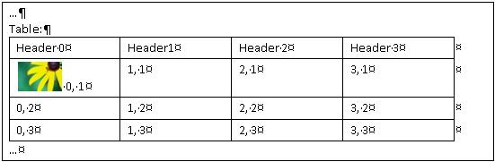

# How UI Automation Exposes Embedded Objects

This topic describes how Microsoft UI Automation exposes embedded objects, or child elements, in a text document or container.

In UI Automation, an embedded object is any element that has nontextual boundaries; for example, an image, hyperlink, table, or document type such as a Microsoft Excel spreadsheet or Microsoft Windows Media file (WMF). This differs from the standard definition, where an element is created in one application and embedded or linked in another application. Whether the object can be edited in its original application is irrelevant in the context of UI Automation.

This topic contains the following sections:

-   [Embedded Objects and the UI Automation Tree](#embedded-objects-and-the-ui-automation-tree)
-   [Exposing Embedded Objects](#exposing-embedded-objects)
-   [Common Scenarios](#common-scenarios)
    -   [HyperLink Example 1: A text range that contains an embedded text hyperlink](#hyperlink-example-1-a-text-range-that-contains-an-embedded-text-hyperlink)
    -   [HyperLink Example 2: A text range that partially spans an embedded text hyperlink](#hyperlink-example-2-a-text-range-that-partially-spans-an-embedded-text-hyperlink)
    -   [HyperLink Example 3: A text range that partially spans the content of a text container](#hyperlink-example-3-a-text-range-that-partially-spans-the-content-of-a-text-container)
    -   [Image Example 1: A text range that contains an embedded image](#image-example-1-a-text-range-that-contains-an-embedded-image)
    -   [Image Example 2: A text range that partially spans the content of a text container](#image-example-2-a-text-range-that-partially-spans-the-content-of-a-text-container)
    -   [Table](#table-example-1-gets-the-text-container-from-the-content-of-a-cell)
    -   [Table Example 1: Gets the text container from the content of a cell](#table-example-1-gets-the-text-container-from-the-content-of-a-cell)
    -   [Table Example 2: Gets the text content of a cell](#table-example-2-gets-the-text-content-of-a-cell)
-   [Related topics](#related-topics)

## Embedded Objects and the UI Automation Tree

Embedded objects are treated as individual elements in the control view of the UI Automation tree. They are exposed as children of the text container so that they can be accessed through the same object model as other controls in UI Automation.

The following example shows a text container (document) with an embedded table and image.

The UI Automation content view of the preceding document is shown in the following diagram.

## Exposing Embedded Objects

The [Text and TextRange](uiauto-implementingtextandtextrange.md) control patterns expose properties and methods that facilitate navigation and querying of embedded objects.

The textual content (or inner text) of a text container and an embedded object, such as a hyperlink or table cell, is exposed as a single, continuous text stream in both the control view and the content view of the UI Automation tree; object boundaries are ignored. If a UI Automation client is retrieving the text to recite, interpret, or analyze in some manner, the text range should be checked for special cases, such as a table with textual content or other embedded objects. Call [**IUIAutomationTextRange::GetChildren**](/windows/desktop/api/UIAutomationClient/nf-uiautomationclient-iuiautomationtextrange-getchildren) to obtain a [**IUIAutomationElement**](/windows/desktop/api/UIAutomationClient/nn-uiautomationclient-iuiautomationelement) interface for each embedded object, and then call [**IUIAutomationTextPattern::RangeFromChild**](/windows/desktop/api/UIAutomationClient/nf-uiautomationclient-iuiautomationtextpattern-rangefromchild) to obtain a text range for each element. This is done recursively until all textual content has been retrieved.

The following diagram shows a text stream with embedded objects and their range spans.

## Common Scenarios

This section presents examples of common scenarios that involve embedded objects: hyperlinks, images, and tables. In the following examples, the left brace ({) represents the Start endpoint of the text range, and the right brace (}) represents the End endpoint.

### HyperLink Example 1: A text range that contains an embedded text hyperlink

The following text range contains an embedded text hyperlink.

  {The URL http://www.microsoft.com is embedded in text}.

Calling the [**IUIAutomationTextRange::GetText**](/windows/desktop/api/UIAutomationClient/nf-uiautomationclient-iuiautomationtextrange-gettext), [**GetEnclosingElement**](/windows/desktop/api/UIAutomationClient/nf-uiautomationclient-iuiautomationtextrange-getenclosingelement), [**GetChildren**](/windows/desktop/api/UIAutomationClient/nf-uiautomationclient-iuiautomationtextrange-getchildren), and [**IUIAutomationTextPattern::RangeFromChild**](/windows/desktop/api/UIAutomationClient/nf-uiautomationclient-iuiautomationtextpattern-rangefromchild) methods results in the behaviors described in the following table.

| Method called                                                                                                                                                                                                                                                     | Result                                                                                                                                                   |
|-------------------------------------------------------------------------------------------------------------------------------------------------------------------------------------------------------------------------------------------------------------------|----------------------------------------------------------------------------------------------------------------------------------------------------------|
| [**IUIAutomationTextRange::GetText**](/windows/desktop/api/UIAutomationClient/nf-uiautomationclient-iuiautomationtextrange-gettext)                                                                                                                                                                                  | Returns the string "The URL http://www.microsoft.com is embedded in text".                                                                               |
| [**IUIAutomationTextRange::GetEnclosingElement**](/windows/desktop/api/UIAutomationClient/nf-uiautomationclient-iuiautomationtextrange-getenclosingelement)                                                                                                                                                          | Returns the innermost UI Automation element that encloses the text range, in this case, the automation element that represents the text provider itself. |
| [**IUIAutomationTextRange::GetChildren**](/windows/desktop/api/UIAutomationClient/nf-uiautomationclient-iuiautomationtextrange-getchildren)                                                                                                                                                                          | Returns a UI Automation element representing the hyperlink control.                                                                                      |
| [**IUIAutomationTextPattern::RangeFromChild**](/windows/desktop/api/UIAutomationClient/nf-uiautomationclient-iuiautomationtextpattern-rangefromchild), where the UI Automation element was returned by the previous [**IUIAutomationTextRange::GetChildren**](/windows/desktop/api/UIAutomationClient/nf-uiautomationclient-iuiautomationtextrange-getchildren) method. | Returns the range that represents "http://www.microsoft.com".                                                                                            |

 

### HyperLink Example 2: A text range that partially spans an embedded text hyperlink

The following text range partially spans an embedded text hyperlink.

  The URL http://{www} is embedded in text.

Calling the [**IUIAutomationTextRange::GetText**](/windows/desktop/api/UIAutomationClient/nf-uiautomationclient-iuiautomationtextrange-gettext), [**GetEnclosingElement**](/windows/desktop/api/UIAutomationClient/nf-uiautomationclient-iuiautomationtextrange-getenclosingelement), and [**GetChildren**](/windows/desktop/api/UIAutomationClient/nf-uiautomationclient-iuiautomationtextrange-getchildren) methods results in the behaviors described in the following table.

| Method called                                                                                            | Result                                                                                                         |
|----------------------------------------------------------------------------------------------------------|----------------------------------------------------------------------------------------------------------------|
| [**IUIAutomationTextRange::GetText**](/windows/desktop/api/UIAutomationClient/nf-uiautomationclient-iuiautomationtextrange-gettext)                         | Returns the string "www".                                                                                      |
| [**IUIAutomationTextRange::GetEnclosingElement**](/windows/desktop/api/UIAutomationClient/nf-uiautomationclient-iuiautomationtextrange-getenclosingelement) | Returns the innermost UI Automation element that encloses the text range; in this case, the hyperlink control. |
| [**IUIAutomationTextRange::GetChildren**](/windows/desktop/api/UIAutomationClient/nf-uiautomationclient-iuiautomationtextrange-getchildren)                 | Returns **NULL** because the text range does not span the entire URL string.                                   |

 

### HyperLink Example 3: A text range that partially spans the content of a text container

The following text range partially spans the content of a text container. The text container has an embedded text hyperlink that is not part of the text range.

  {The URL} http://www.microsoft.com is embedded in text.

Calling the [**IUIAutomationTextRange::GetText**](/windows/desktop/api/UIAutomationClient/nf-uiautomationclient-iuiautomationtextrange-gettext), [**GetEnclosingElement**](/windows/desktop/api/UIAutomationClient/nf-uiautomationclient-iuiautomationtextrange-getenclosingelement), and [**Move**](/windows/desktop/api/UIAutomationClient/nf-uiautomationclient-iuiautomationtextrange-move) methods results in the behaviors described in the following table.

| Method called                                                                                            | Result                                                                                                                                                                                                                            |
|----------------------------------------------------------------------------------------------------------|-----------------------------------------------------------------------------------------------------------------------------------------------------------------------------------------------------------------------------------|
| [**IUIAutomationTextRange::GetText**](/windows/desktop/api/UIAutomationClient/nf-uiautomationclient-iuiautomationtextrange-gettext)                         | Returns the string "The URL".                                                                                                                                                                                                     |
| [**IUIAutomationTextRange::GetEnclosingElement**](/windows/desktop/api/UIAutomationClient/nf-uiautomationclient-iuiautomationtextrange-getenclosingelement) | Returns the innermost UI Automation element that encloses the text range, in this case, the element that represents the text provider itself.                                                                                     |
| [**IUIAutomationTextRange::Move**](/windows/desktop/api/UIAutomationClient/nf-uiautomationclient-iuiautomationtextrange-move)                               | Moves the text range span to "http://" because the text of the hyperlink is made up of individual words. In this case, the hyperlink is not treated as a single object.  The URL {http} is embedded in text.  |

 

### Image Example 1: A text range that contains an embedded image

The following text range contains an embedded image of a shuttle.

 {The image  is embedded in text}.

Calling the [**IUIAutomationTextRange::GetText**](/windows/desktop/api/UIAutomationClient/nf-uiautomationclient-iuiautomationtextrange-gettext), [**GetEnclosingElement**](/windows/desktop/api/UIAutomationClient/nf-uiautomationclient-iuiautomationtextrange-getenclosingelement), [**GetChildren**](/windows/desktop/api/UIAutomationClient/nf-uiautomationclient-iuiautomationtextrange-getchildren), and [**IUIAutomationTextPattern::RangeFromChild**](/windows/desktop/api/UIAutomationClient/nf-uiautomationclient-iuiautomationtextpattern-rangefromchild) methods results in the behaviors described in the following table.

| Method called                                                                                                                                                                                                                                                    | Result                                                                                                                                        |
|------------------------------------------------------------------------------------------------------------------------------------------------------------------------------------------------------------------------------------------------------------------|-----------------------------------------------------------------------------------------------------------------------------------------------|
| [**IUIAutomationTextRange::GetText**](/windows/desktop/api/UIAutomationClient/nf-uiautomationclient-iuiautomationtextrange-gettext)                                                                                                                                                                                 | Returns the string "The image is embedded in text". Any ALT text associated with the image is not included in the text stream.                |
| [**IUIAutomationTextRange::GetEnclosingElement**](/windows/desktop/api/UIAutomationClient/nf-uiautomationclient-iuiautomationtextrange-getenclosingelement)                                                                                                                                                         | Returns the innermost UI Automation element that encloses the text range, in this case, the element that represents the text provider itself. |
| [**IUIAutomationTextRange::GetChildren**](/windows/desktop/api/UIAutomationClient/nf-uiautomationclient-iuiautomationtextrange-getchildren)                                                                                                                                                                         | Returns a UI Automation element representing the image control.                                                                               |
| [**IUIAutomationTextPattern::RangeFromChild**](/windows/desktop/api/UIAutomationClient/nf-uiautomationclient-iuiautomationtextpattern-rangefromchild) where the UI Automation element was returned by the previous [**IUIAutomationTextRange::GetChildren**](/windows/desktop/api/UIAutomationClient/nf-uiautomationclient-iuiautomationtextrange-getchildren) method. | Returns the degenerate range.                                                                                                                 |

 

### Image Example 2: A text range that partially spans the content of a text container

The following text range partially spans the content of a text container. The text container has an embedded image that is not part of the text range.

 {The image}  is embedded in text.

Calling the [**IUIAutomationTextRange::GetText**](/windows/desktop/api/UIAutomationClient/nf-uiautomationclient-iuiautomationtextrange-gettext), [**GetEnclosingElement**](/windows/desktop/api/UIAutomationClient/nf-uiautomationclient-iuiautomationtextrange-getenclosingelement), and [**Move**](/windows/desktop/api/UIAutomationClient/nf-uiautomationclient-iuiautomationtextrange-move) methods results in the behaviors described in the following table.

| Method called                                                                                                          | Result                                                                                                                                                                                                                                                                          |
|------------------------------------------------------------------------------------------------------------------------|---------------------------------------------------------------------------------------------------------------------------------------------------------------------------------------------------------------------------------------------------------------------------------|
| [**IUIAutomationTextRange::GetText**](/windows/desktop/api/UIAutomationClient/nf-uiautomationclient-iuiautomationtextrange-gettext)                                       | Returns the string "The image".                                                                                                                                                                                                                                                 |
| [**IUIAutomationTextRange::GetEnclosingElement**](/windows/desktop/api/UIAutomationClient/nf-uiautomationclient-iuiautomationtextrange-getenclosingelement)               | Returns the innermost UI Automation element that encloses the text range, in this case, the element that represents the text provider itself.                                                                                                                                   |
| [**IUIAutomationTextRange::Move**](/windows/desktop/api/UIAutomationClient/nf-uiautomationclient-iuiautomationtextrange-move) with parameters of (**TextUnit\_Word**, 2). | Moves the text range span to "is ". Because only text-based embedded objects are considered part of the text stream, the image in this example does not affect [**IUIAutomationTextRange::Move**](/windows/desktop/api/UIAutomationClient/nf-uiautomationclient-iuiautomationtextrange-move) or its return value, in this case, 2. |

 

### Table

### Table Example 1: Gets the text container from the content of a cell

The following table gets the text container from the content of a cell.

| Cell with Image                                            | Cell with Text |
|------------------------------------------------------------|----------------|
|            | X              |
|  | Y              |
|      | Z              |

 

Calling the [**IUIAutomationGridPattern::GetItem**](/windows/desktop/api/UIAutomationClient/nf-uiautomationclient-iuiautomationgridpattern-getitem), [**IUIAutomationTextPattern::RangeFromChild**](/windows/desktop/api/UIAutomationClient/nf-uiautomationclient-iuiautomationtextpattern-rangefromchild), and [**IUIAutomationTextRange::GetEnclosingElement**](/windows/desktop/api/UIAutomationClient/nf-uiautomationclient-iuiautomationtextrange-getenclosingelement) methods results in the behaviors described in the following table.

| Method called                                                                                                                                                                                                                       | Result                                                                                                                                                                                      |
|-------------------------------------------------------------------------------------------------------------------------------------------------------------------------------------------------------------------------------------|---------------------------------------------------------------------------------------------------------------------------------------------------------------------------------------------|
| [**IUIAutomationGridPattern::GetItem**](/windows/desktop/api/UIAutomationClient/nf-uiautomationclient-iuiautomationgridpattern-getitem) with parameters (0, 0).                                                                                                                        | Returns the UI Automation element that represents the content of the table cell, in this case, the element is a text control.                                                               |
| [**iuiautomationtextpattern::rangefromchild**](/windows/desktop/api/UIAutomationClient/nf-uiautomationclient-iuiautomationtextpattern-rangefromchild)                                                                                                                                  | returns the range of the image .                                                                                                            |
| [**GetEnclosingElement**](/windows/desktop/api/UIAutomationClient/nf-uiautomationclient-iuiautomationtextrange-getenclosingelement) for the object returned by the previous [**IUIAutomationTextPattern::RangeFromChild**](/windows/desktop/api/UIAutomationClient/nf-uiautomationclient-iuiautomationtextpattern-rangefromchild) method. | Returns the UI Automation element representing the table cell. In this case, the element is a text control that supports the [TableItem](uiauto-implementingtableitem.md) control pattern. |
| [**IUIAutomationTextRange::GetEnclosingElement**](/windows/desktop/api/UIAutomationClient/nf-uiautomationclient-iuiautomationtextrange-getenclosingelement) for the object returned by the previous **GetEnclosingElement** method.                                                    | Returns the UI Automation element representing the table.                                                                                                                                   |
| [**IUIAutomationTextRange::GetEnclosingElement**](/windows/desktop/api/UIAutomationClient/nf-uiautomationclient-iuiautomationtextrange-getenclosingelement) for the object returned by the previous **GetEnclosingElement** method.                                                    | Returns the UI Automation element that represents the text provider itself.                                                                                                                 |

 

### Table Example 2: Gets the text content of a cell

The table in the preceding example gets the text content of a cell.

Calling the [**IUIAutomationGridPattern::GetItem**](/windows/desktop/api/UIAutomationClient/nf-uiautomationclient-iuiautomationgridpattern-getitem) and [**IUIAutomationTextPattern::RangeFromChild**](/windows/desktop/api/UIAutomationClient/nf-uiautomationclient-iuiautomationtextpattern-rangefromchild) methods results in the behaviors described in the following table.

| Method called                                                                                                                                                                                                                                                          | Result                                                                                                                     |
|------------------------------------------------------------------------------------------------------------------------------------------------------------------------------------------------------------------------------------------------------------------------|----------------------------------------------------------------------------------------------------------------------------|
| [**IUIAutomationGridPattern::GetItem**](/windows/desktop/api/UIAutomationClient/nf-uiautomationclient-iuiautomationgridpattern-getitem) with parameters (1,1).                                                                                                                                                            | Returns the UI Automation element representing the content of the table cell. In this case, the element is a text control. |
| [**IUIAutomationTextPattern::RangeFromChild**](/windows/desktop/api/UIAutomationClient/nf-uiautomationclient-iuiautomationtextpattern-rangefromchild) where the UI Automation element is the object returned by the previous [**IUIAutomationGridPattern::GetItem**](/windows/desktop/api/UIAutomationClient/nf-uiautomationclient-iuiautomationgridpattern-getitem) method. | Returns "Y".                                                                                                               |

 

When moving through a document by [**TextUnit\_Line**](uiauto-textunitenum.md#textunit-line), if the text range enters an embedded table, each line of text in a cell should be treated as a line.

## Related topics

<dl> <dt>

**Conceptual**
</dt> <dt>

[About the Text and TextRange Control Patterns](uiauto-about-text-and-textrange-patterns.md)
</dt> <dt>

[UI Automation Text Attributes](uiauto-textattributes.md)
</dt> <dt>

[UI Automation Control Patterns Overview](uiauto-controlpatternsoverview.md)
</dt> <dt>

[UI Automation Support for Textual Content](uiauto-ui-automation-textpattern-overview.md)
</dt> </dl>

 

 

