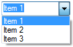
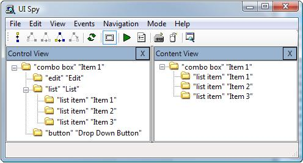

# UI Automation Tree Overview

Assistive technology products and test scripts navigate the Microsoft UI Automation tree to gather information about the UI and its elements.

In the UI Automation tree is a root element that represents the Windows desktop window ("the desktop") and whose child elements represent application windows. Each of these child elements can contain elements that represent pieces of the UI, such as menus, buttons, toolbars, and list boxes. These elements can contain elements, such as list items.

The UI Automation tree is not a fixed structure. It is seldom seen in its totality because it might contain thousands of elements. Parts of the UI Automation tree are built as a client needs them, and the structure of the tree changes as elements are added, moved, or removed.

UI Automation providers support the UI Automation tree by implementing navigation among items in a fragment. A fragment is a complete subtree of elements from a particular framework, and has a root element (called the *fragment root*) that is typically hosted in a window.

Providers are not concerned with navigation from one control to another. This is managed by the UI Automation core, which uses information from the default window providers.

This topic contains the following sections.

-   [Views of the UI Automation Tree](#views-of-the-ui-automation-tree)
    -   [Raw View](#raw-view)
    -   [Control View](#control-view)
    -   [Content View](#content-view)
-   [Related topics](#related-topics)

## Views of the UI Automation Tree

The UI Automation tree can be filtered to create views that contain only those UI Automation elements that are relevant for a particular client. This approach allows clients to customize the structure that is presented through UI Automation to their particular needs.

The client can customize the view by scoping and by filtering. Scoping is defining the extent of the view, starting from a base element. For example, the application might want to find only direct children of the desktop, or all descendants of an application window. Filtering is defining the types of elements that are included in the view.

UI Automation providers support filtering by defining properties on elements, including the [**IUIAutomationElement::IsControlElement**](/windows/desktop/api/UIAutomationClient/nf-uiautomationclient-iuiautomationelement-get_currentiscontrolelement) and [**IUIAutomationElement::IsContentElement**](/windows/desktop/api/UIAutomationClient/nf-uiautomationclient-iuiautomationelement-get_currentiscontentelement) properties.

UI Automation provides three default views: raw view, control view, and content view. These views are defined by the type of filtering performed. The scope of any view is defined by the application. The application can apply other filters on properties; for example, to include only enabled controls in a control view.

### Raw View

The raw view of the UI Automation tree is the full tree of automation elements for which the desktop is the root. The raw view closely follows the native programmatic structure of an application, and is the most detailed view available. It is also the base on which the other views of the tree are built. Because this view depends on the underlying UI framework, the raw view of a Windows Presentation Foundation (WPF) button has a different raw view than a Microsoft Win32 button.

The raw view is obtained by searching for elements without specifying properties or by using the [**IUIAutomation::RawViewWalker**](/windows/desktop/api/UIAutomationClient/nf-uiautomationclient-iuiautomation-get_rawviewwalker) to get an [**IUIAutomationTreeWalker**](/windows/desktop/api/UIAutomationClient/nn-uiautomationclient-iuiautomationtreewalker) interface for navigating the tree.

### Control View

The control view is a subset of the raw view. It includes only those UI items that have the [**IUIAutomationElement::IsControlElement**](/windows/desktop/api/UIAutomationClient/nf-uiautomationclient-iuiautomationelement-get_currentiscontrolelement) property set to **TRUE**.

The control view includes the UI items that provide information to the user or enable the user to perform an action. These are the UI items that are most interesting to automated testing applications.

The control view also includes noninteractive UI items that contribute to the logical structure of the UI. These include item containers such as list view headers, toolbars, menus, and the status bar. Other noninteractive items that appear in the control view are graphics with information and static text in a dialog box.

Noninteractive items used only for layout or decorative purposes, such as panels used to lay out controls in a dialog box, do not appear in the control view.

The control view of the UI Automation tree closely maps to the UI structure perceived by an end user. This makes it easier for the assistive technology product to describe the UI to the end user and help that end user interact with the application.

The control view is obtained by searching for elements that have the [**IUIAutomationElement::IsControlElement**](/windows/desktop/api/UIAutomationClient/nf-uiautomationclient-iuiautomationelement-get_currentiscontrolelement) property set to true, or by using [**ControlViewWalker**](/windows/desktop/api/UIAutomationClient/nf-uiautomationclient-iuiautomation-get_controlviewwalker) to get an [**IUIAutomationTreeWalker**](/windows/desktop/api/UIAutomationClient/nn-uiautomationclient-iuiautomationtreewalker) interface for navigating the tree.

### Content View

The content view of the UI Automation tree is a subset of the control view. It includes only those UI items that have both the [**IUIAutomationElement::IsControlElement**](/windows/desktop/api/UIAutomationClient/nf-uiautomationclient-iuiautomationelement-get_currentiscontrolelement) and the [**IUIAutomationElement::IsContentElement**](/windows/desktop/api/UIAutomationClient/nf-uiautomationclient-iuiautomationelement-get_currentiscontentelement) property set to **TRUE**.

The content view contains UI items that convey the actual information in a user interface, including UI items that can receive keyboard focus and some text that is not a label on a UI item. These are the UI items that are most interesting to a screen reader application. For example, the values in a drop-down combo box appear in the content view because the values represent information being used by an end user.

In the content view, a combo box and a list box are both represented as a collection of UI items where one, or more than one, item can be selected. The fact that one item is always open and one item can expand and collapse is irrelevant in the content view because it is designed to show the data, or content, that is being presented to the user.

The content view is obtained by searching for elements that have both the [**IsControlElement**](/windows/desktop/api/UIAutomationClient/nf-uiautomationclient-iuiautomationelement-get_currentiscontrolelement) and the [**CurrentIsContentElement**](/windows/desktop/api/UIAutomationClient/nf-uiautomationclient-iuiautomationelement-get_currentiscontentelement) property set to **TRUE**, or by using [**IUIAutomation::ContentViewWalker**](/windows/desktop/api/UIAutomationClient/nf-uiautomationclient-iuiautomation-get_contentviewwalker) to get an [**IUIAutomationTreeWalker**](/windows/desktop/api/UIAutomationClient/nn-uiautomationclient-iuiautomationtreewalker) interface for navigating the tree.

The following images show the differences between the control view and content view. The first image shows a simple combo box with three items in the dropdown list. The second image shows how the combo box UI items appear in the control and content views of the UISpy.exe application.

## Related topics

<dl> <dt>

**Conceptual**
</dt> <dt>

[Creating the CUIAutomation Object](uiauto-creatingcuiautomation.md)
</dt> <dt>

[Obtaining UI Automation Elements](uiauto-obtainingelements.md)
</dt> <dt>

[UI Automation Fundamentals](entry-uiautocore-overview.md)
</dt> </dl>

 

 

