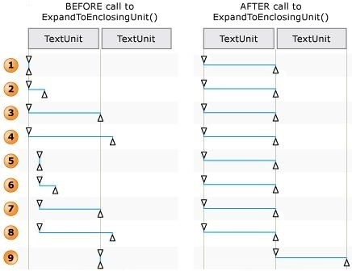
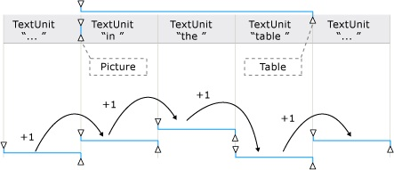
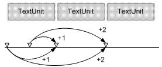

# Using Text Ranges

This topic describes how to use the properties and methods of the [**IUIAutomationTextRange**](/windows/desktop/api/UIAutomationClient/nn-uiautomationclient-iuiautomationtextrange) interface to access and manipulate the textual content of a text-based control. It contains the following sections:

-   [What is a Text Range?](#using-text-ranges)
-   [Acquiring Text Range Objects](#acquiring-text-range-objects)
-   [Selecting Text in a Text Range](#selecting-text-in-a-text-range)
-   [Retrieving Text from a Text Range](#retrieving-text-from-a-text-range)
-   [Retrieving Text Attributes from a Text Range](#retrieving-text-attributes-from-a-text-range)
-   [Retrieving Embedded Objects from a Text Range](#retrieving-embedded-objects-from-a-text-range)
-   [Manipulating a Text Range](#manipulating-a-text-range)
-   [Scrolling a Text Range into View](#scrolling-a-text-range-into-view)
-   [Retrieving the Enclosing Element of a Text Range](#retrieving-the-enclosing-element-of-a-text-range)
-   [Comparing and Cloning Text Ranges](#comparing-and-cloning-text-ranges)
-   [Retrieving Annotations](#retrieving-annotations)
    -   [Retrieving Annotations Types from a Text Range](#retrieving-annotations-types-from-a-text-range)
    -   [Retrieving All Annotations from a Text Range](#retrieving-all-annotations-from-a-text-range)
    -   [Retrieving Information About a Particular Annotation](#retrieving-information-about-a-particular-annotation)
    -   [Retrieving the Annotation Target Text](#retrieving-the-annotation-target-text)
-   [Retrieving Visual Styles](#retrieving-visual-styles)
-   [Invoking Context Menus From Text Ranges](#invoking-context-menus-from-text-ranges)
-   [Related topics](#related-topics)

## What is a Text Range?

The Microsoft UI Automation text object model is based on the concept of the *text range*. A text range is an object that exposes the [**IUIAutomationTextRange**](/windows/desktop/api/UIAutomationClient/nn-uiautomationclient-iuiautomationtextrange) interface, and represents a contiguous span of text in a text-based control. Each text range has both a starting endpoint and an ending endpoint, and all textual content between the two endpoints is considered part of the range. A text range whose starting endpoint and ending endpoint are at the same location is called a *degenerate* (or empty) text range. A degenerate text range is used to mark a specific location within the text of a control, such as the location of the text insertion point.

## Acquiring Text Range Objects

Client applications acquire text range objects by using the properties and methods of the [**IUIAutomationTextPattern**](/windows/desktop/api/UIAutomationClient/nn-uiautomationclient-iuiautomationtextpattern) interface. The [**IUIAutomationTextRangePattern::DocumentRange**](/windows/desktop/api/UIAutomationClient/nf-uiautomationclient-iuiautomationtextpattern-get_documentrange) property retrieves a text range that represents the entire textual content of a text-based control, while other methods acquire text ranges that represent some portion of the content, such as the selected text, the visible text, or an object embedded in the text.

The [**IUIAutomationTextRangePattern::GetVisibleRanges**](/windows/desktop/api/UIAutomationClient/nf-uiautomationclient-iuiautomationtextpattern-getvisibleranges) and [**GetSelection**](/windows/desktop/api/UIAutomationClient/nf-uiautomationclient-iuiautomationtextpattern-getselection) methods can retrieve arrays of text range objects. If a control is partially obscured by an overlapping window or other object, **GetVisibleRanges** returns an array containing a text range object for each partially visible line of text. Similarly, if a text-based control supports the selection of multiple, disjoint spans of text, **GetSelection** returns an array that contains a text range object for each selected span.

The [**IUIAutomationTextRangePattern::RangeFromChild**](/windows/desktop/api/UIAutomationClient/nf-uiautomationclient-iuiautomationtextpattern-rangefromchild) method enables a client application to retrieve a text range that encloses an object that is embedded in the textual content. The client specifies the [**IUIAutomationElement**](/windows/desktop/api/UIAutomationClient/nn-uiautomationclient-iuiautomationelement) interface pointer of an embedded object, such as an image, a table, or a hyperlink, and the method returns a text range that encloses the object. However, if the embedded object has no text associated with it, the method returns a degenerate text range.

A client application can use the [**IUIAutomationTextRangePattern::RangeFromPoint**](/windows/desktop/api/UIAutomationCore/nf-uiautomationcore-itextprovider-rangefrompoint) method to retrieve a text range for the visible text or embedded object that is nearest to the specified screen coordinates.

## Selecting Text in a Text Range

The [**IUIAutomationTextRange**](/windows/desktop/api/UIAutomationClient/nn-uiautomationclient-iuiautomationtextrange) interface includes a number of methods that enable a client application to control the selection of text in a text-based control.

Client applications can use the [**IUIAutomationTextRange::Select**](/windows/desktop/api/UIAutomationClient/nf-uiautomationclient-iuiautomationtextrange-select) method to select the text that corresponds to a text range, and to remove the previous selection, if any, from the text control. Calling **Select** with a degenerate text range moves the insertion point to the location of the text range without selecting any text.

If a control supports the selection of multiple, disjoint spans of text, a client can use the [**IUIAutomationTextRange::AddToSelection**](/windows/desktop/api/UIAutomationClient/nf-uiautomationclient-iuiautomationtextrange-addtoselection) and [**RemoveFromSelection**](/windows/desktop/api/UIAutomationClient/nf-uiautomationclient-iuiautomationtextrange-removefromselection) methods to add text ranges to, and remove them from, the collection of selected text ranges. If the control supports only one selected text range at a time, but the selection operation would result in the selection of multiple disjoint text ranges, the method returns either an **E\_INVALIDOPERATION** error, or extends or truncates the current selection. A client application can discover whether a control supports the selection of single or multiple spans of text, or none at all, by checking the [**IUIAutomationTextPattern::SupportedTextSelection**](/windows/desktop/api/UIAutomationClient/nf-uiautomationclient-iuiautomationtextpattern-get_supportedtextselection) property.

If a text-based control supports text insertions, calling [**IUIAutomationTextRange::AddToSelection**](/windows/desktop/api/UIAutomationClient/nf-uiautomationclient-iuiautomationtextrange-addtoselection) or [**RemoveFromSelection**](/windows/desktop/api/UIAutomationClient/nf-uiautomationclient-iuiautomationtextrange-removefromselection) on a degenerate text range in the control moves the insertion point but does not select any text.

## Retrieving Text from a Text Range

Client applications can use the [**IUIAutomationTextRange::GetText**](/windows/desktop/api/UIAutomationClient/nf-uiautomationclient-iuiautomationtextrange-gettext) method to retrieve the plain text of a text range. The plain text includes all control characters found in the source text, such as carriage returns and the Unicode left-to-right mark (LRM). The plain text does not include any markup tags such as HTML that may be present in the source text. Also, any escape codes in the source text are converted to the plain text equivalents. For example, "&nbsp;" is converted to a simple space character.

If an embedded object spans a range of text, the plain text includes the inner text of the object, but not the alternative text (the name property of the embedded object). For more information, see [How UI Automation Exposes Embedded Objects](uiauto-textpattern-and-embedded-objects-overview.md).

The [**IUIAutomationTextRange::FindText**](/windows/desktop/api/UIAutomationClient/nf-uiautomationclient-iuiautomationtextrange-findtext) method searches a text range for a particular string and, if it is found, returns a new text range that encompasses the string.

## Retrieving Text Attributes from a Text Range

Text attributes determine the formatting style of the text in a text-based control, and include such things as foreground color, bullet style, font size, and so on. UI Automation supports a number of text attributes, and defines an identifier for each supported attribute. A client application can query a text range for the value of a particular text attribute by specifying an attribute identifier in a call to the [**IUIAutomationTextRange::GetAttributeValue**](/windows/desktop/api/UIAutomationClient/nf-uiautomationclient-iuiautomationtextrange-getattributevalue) method, along with a pointer to a [**VARIANT**](/windows/win32/api/oaidl/ns-oaidl-variant) structure that receives the attribute value. For detailed information about each text attribute that UI Automation supports, see [Text Attribute Identifiers](uiauto-textattribute-ids.md).

The value retrieved by [**GetAttributeValue**](/windows/desktop/api/UIAutomationClient/nf-uiautomationclient-iuiautomationtextrange-getattributevalue) represents the value of the attribute across the entire text range. If all text in the range shares the same value for the specified attribute, that value is returned by **GetAttributeValue**. However, if the value of the attribute varies across the text range, **GetAttributeValue** returns an [**IUnknown**](/windows/desktop/api/unknwn/nn-unknwn-iunknown) pointer to a static token object called the **ReservedMixedAttribute** object. To discover whether the value of an attribute varies across a text range, a client application should compare the results of **GetAttributeValue** with the **ReservedMixedAttribute** object retrieved from the [**IUIAutomation::ReservedMixedAttributeValue**](/windows/desktop/api/UIAutomationClient/nf-uiautomationclient-iuiautomation-get_reservedmixedattributevalue) property.

A text-based control is not required to support all UI Automation text attributes. If a client calls the [**IUIAutomationTextRange::GetAttributeValue**](/windows/desktop/api/UIAutomationClient/nf-uiautomationclient-iuiautomationtextrange-getattributevalue) method and passes the identifier of an unsupported attribute, the method returns an [**IUnknown**](/windows/desktop/api/unknwn/nn-unknwn-iunknown) pointer to a static token object called the **ReservedNotSupported** object. To discover whether a particular attribute is supported, a client application should compare the results of **GetAttributeValue** with the **ReservedNotSupported** object retrieved from the [**IUIAutomation::ReservedNotSupportedValue**](/windows/desktop/api/UIAutomationClient/nf-uiautomationclient-iuiautomation-get_reservednotsupportedvalue) property.

Client applications can use the [**IUIAutomationTextRange::FindAttribute**](/windows/desktop/api/UIAutomationClient/nf-uiautomationclient-iuiautomationtextrange-findattribute) method to search a text range for text that has a particular text attribute. If found, the method returns a new text range that encompasses the matching text. Note that **FindAttribute** returns a text range for matching text even if the text is not visible.

## Retrieving Embedded Objects from a Text Range

A text range can include embedded objects such as tables, images, hyperlinks, and so on. A client application can retrieve a collection of all embedded objects in a range by calling the [**IUIAutomationTextRange::GetChildren**](/windows/desktop/api/UIAutomationClient/nf-uiautomationclient-iuiautomationtextrange-getchildren) method. Embedded objects that overlap with the range but are not entirely enclosed by it are also included in the collection. If the range contains no embedded objects, **GetChildren** retrieves an empty collection.

Although it depends on the provider of the text-based control, the [**GetChildren**](/windows/desktop/api/UIAutomationClient/nf-uiautomationclient-iuiautomationtextrange-getchildren) method typically does not return any children of the embedded elements. For example, if a text range contains a table that has a number of child cells, the **GetChildren** method typically returns just the table element and not the cell elements.

For performance or architectural reasons, [**GetChildren**](/windows/desktop/api/UIAutomationClient/nf-uiautomationclient-iuiautomationtextrange-getchildren) may not be able to retrieve [**IUIAutomationElement**](/windows/desktop/api/UIAutomationClient/nn-uiautomationclient-iuiautomationelement) objects for all embedded objects in a text range. Instead, the provider might return a collection that includes virtualized items. For more information, see [Working with Virtualized Items](uiauto-workingwithvirtualizeditems.md).

## Manipulating a Text Range

The [**IUIAutomationTextRange**](/windows/desktop/api/UIAutomationClient/nn-uiautomationclient-iuiautomationtextrange) interface provides several methods for manipulating and navigating text ranges in a text-based control. The [**IUIAutomationTextRange::Move**](/windows/desktop/api/UIAutomationClient/nf-uiautomationclient-iuiautomationtextrange-move), [**MoveEndpointByUnit**](/windows/desktop/api/UIAutomationClient/nf-uiautomationclient-iuiautomationtextrange-moveendpointbyunit), and [**ExpandToEnclosingUnit**](/windows/desktop/api/UIAutomationClient/nf-uiautomationclient-iuiautomationtextrange-expandtoenclosingunit) methods move a text range or one of its endpoints by the specified text unit, such as character, word, paragraph, and so on. For more information, see [UI Automation Text Units](/windows/desktop/WinAuto/uiauto-uiautomationtextunits).

Despite its name, the [**ExpandToEnclosingUnit**](/windows/desktop/api/UIAutomationClient/nf-uiautomationclient-iuiautomationtextrange-expandtoenclosingunit) method does not necessarily expand a text range. Instead, it "normalizes" a text range by moving the endpoints so that the range encompasses the specified text unit exactly. The range is expanded if it is smaller than the specified unit, or shortened if it is longer than the specified unit. The following diagram shows how **ExpandToEnclosingUnit** normalizes a text range by moving the endpoints of the range.

If the text range starts at the beginning of a text unit and ends at the beginning of, or before, the next text unit boundary, the ending endpoint is moved to the next text unit boundary (see 1 and 2 in the previous illustration).

If the text range starts at the beginning of a text unit and ends at, or after, the next unit boundary, the ending endpoint stays or is moved backward to the next unit boundary after the starting endpoint (see 3 and 4 in the previous illustration). If there is more than one text unit boundary between the starting and ending endpoints, the ending endpoint is moved backward to the next unit boundary after the starting endpoint, resulting in a text range that is one text unit in length.

If the text range starts in the middle of a text unit, the starting endpoint is moved backward to the beginning of the text unit, and the ending endpoint is moved forward or backward, as necessary, to the next unit boundary after the starting endpoint (see 5 through 8 in the previous illustration).

When the [**IUIAutomationTextRange::Move**](/windows/desktop/api/UIAutomationClient/nf-uiautomationclient-iuiautomationtextrange-move) method is called, the provider normalizes the text range by the specified text unit. Then, the provider moves the range backward or forward by the specified number of text units. When moving the range, the provider ignores the boundaries of any embedded objects in the text. (However, the unit boundary itself may be affected by the existence of an embedded object). The following diagram demonstrates how the **Move** method moves a text range, unit by unit, across embedded objects and text unit boundaries.

The [**IUIAutomationTextRange::MoveEndpointByUnit**](/windows/desktop/api/UIAutomationClient/nf-uiautomationclient-iuiautomationtextrange-moveendpointbyunit) method moves one of the endpoints forward or backward by specified text unit. The following illustration shows how an endpoint moves forward.

The [**IUIAutomationTextRange::MoveEndpointByRange**](/windows/desktop/api/UIAutomationClient/nf-uiautomationclient-iuiautomationtextrange-moveendpointbyrange) method enables a client application to set one endpoint of a text range to same location as the specified endpoint of a second text range.

## Scrolling a Text Range into View

The [**IUIAutomationTextRange::ScrollIntoView**](/windows/desktop/api/UIAutomationClient/nf-uiautomationclient-iuiautomationtextrange-scrollintoview) method scrolls a text range so that the text is visible in the viewport of the text-based control. When calling **ScrollIntoView**, a client can specify whether the text should be aligned with the top or bottom of the viewport.

## Retrieving the Enclosing Element of a Text Range

A client application can use the [**IUIAutomationTextRange::GetEnclosingElement**](/windows/desktop/api/UIAutomationClient/nf-uiautomationclient-iuiautomationtextrange-getenclosingelement) method to retrieve the [**IUIAutomation**](/windows/desktop/api/UIAutomationClient/nn-uiautomationclient-iuiautomation) interface pointer of the innermost element that encloses a text range. The enclosing element is typically the text provider that supplies the text range. However, if the text provider supports child elements such as tables or hyperlinks, the enclosing element could be a descendant of the text provider.

## Comparing and Cloning Text Ranges

The [**IUIAutomationTextRange**](/windows/desktop/api/UIAutomationClient/nn-uiautomationclient-iuiautomationtextrange) interface includes two methods for comparing text ranges. The [**IUIAutomationTextRange::Compare**](/windows/desktop/api/UIAutomationClient/nf-uiautomationclient-iuiautomationtextrange-compareendpoints) method compares the starting and ending endpoints of two text ranges and returns **TRUE** if both endpoints are the same. The **IUIAutomationTextRange::CompareEndpoints** method compares either the start or the ending endpoint of the two ranges. The return value is zero if the endpoints are the same, or a positive value or negative value that indicates the relative positions of the two endpoints.

Client applications can use the [**IUIAutomationTextRange::Clone**](/windows/desktop/api/UIAutomationClient/nf-uiautomationclient-iuiautomationtextrange-clone) method to create an exact copy of text range. The new text range can be manipulated independently of the original text range.

## Retrieving Annotations

A text range can include annotations if the text-based control supports them. There are many different kinds of annotations. The UIAutomationClient.h header file defines a set of named constant values that identify the types of annotations that UI Automation supports. For more information, see [**Annotation Type Identifiers**](uiauto-annotation-type-identifiers.md).

Some kinds of annotations are represented by an automation element that supports the [Annotation](uiauto-implementingannotation.md) control pattern ([**IUIAutomationAnnotationPattern**](/windows/desktop/api/uiautomationclient/nn-uiautomationclient-iuiautomationannotationpattern) interface). Other kinds of annotations are exposed through the [TextRange](uiauto-about-text-and-textrange-patterns.md) control pattern. For example, a provider could expose a simple spelling-error indicator by having the [**IUIAutomationTextRange::GetAttributeValue**](/windows/desktop/api/UIAutomationCore/nf-uiautomationcore-itextrangeprovider-getattributevalue) method return an [**AnnotationTypes**](uiauto-textattribute-ids.md) text attribute of [**AnnotationType\_SpellingError**](uiauto-annotation-type-identifiers.md), and a null value for the [**AnnotationObjects**](uiauto-textattribute-ids.md) text attribute.

### Retrieving Annotations Types from a Text Range

You can retrieve a list of the types of annotations that are present in a text range by using the [**IUIAutomationTextRange::GetAttributeValue**](/windows/desktop/api/UIAutomationClient/nf-uiautomationclient-iuiautomationtextrange-getattributevalue) method. When calling the method, specify a text attribute ID of [**UIA\_AnnotationTypesAttributeId**](uiauto-textattribute-ids.md) and a pointer to a parameter of type [**VARIANT**](/windows/win32/api/oaidl/ns-oaidl-variant). When the method returns, the **VARIANT** parameter contains a list of annotation type identifiers, one for each type of annotation in the text range. For more information, see [**Annotation Type Identifiers**](uiauto-annotation-type-identifiers.md).

### Retrieving All Annotations from a Text Range

To retrieve the annotations from a text range, call the [**IUIAutomationTextRange::GetAttributeValue**](/windows/desktop/api/UIAutomationClient/nf-uiautomationclient-iuiautomationtextrange-getattributevalue) method, specifying a text attribute ID of [**UIA\_AnnotationObjectsAttributeId**](uiauto-textattribute-ids.md) and a pointer to a parameter of type [**VARIANT**](/windows/win32/api/oaidl/ns-oaidl-variant). When the method returns, the **VARIANT** parameter contains an [**IUIAutomationElementArray**](/windows/desktop/api/UIAutomationClient/nn-uiautomationclient-iuiautomationelementarray) interface that represents an array of automation elements, one for each annotation in the text range. The [**IUIAutomationElementArray::Length**](/windows/desktop/api/UIAutomationClient/nf-uiautomationclient-iuiautomationelementarray-get_length) property indicates the number of elements in the array, and the [**IUIAutomationElementArray::GetElement**](/windows/desktop/api/UIAutomationClient/nf-uiautomationclient-iuiautomationelementarray-getelement) method retrieves the [**IUIAutomationElement**](/windows/desktop/api/UIAutomationClient/nn-uiautomationclient-iuiautomationelement) interface for a particular element.

### Retrieving Information About a Particular Annotation

To retrieve information about a particular annotation, first retrieve the [**IUIAutomationElement**](/windows/desktop/api/UIAutomationClient/nn-uiautomationclient-iuiautomationelement) interface for the annotation element as described in the previous section. Next, retrieve the [**IUIAutomationAnnotationPattern**](/windows/desktop/api/uiautomationclient/nn-uiautomationclient-iuiautomationannotationpattern) interface for the annotation by calling the [**IUIAutomationElement::GetCurrentPatternAs**](/windows/desktop/api/UIAutomationClient/nf-uiautomationclient-iuiautomationelement-getcurrentpatternas) method with a control pattern ID of [**UIA\_AnnotationPatternId**](uiauto-controlpattern-ids.md), an interface identifier of IID\_IUIAutomationAnnotationPattern, and the address of a variable that receives the **IUIAutomationAnnotation** pointer for the annotation. Query the properties of the **IUIAutomationAnnotation** interface to retrieve the annotation type name and type ID, the name of the annotation author, the date and time of the annotation, and the **IUIAutomationElement** interface for the element that is being annotated.

### Retrieving the Annotation Target Text

Typically, an annotation applies to some subset of the text in a text range. After you retrieve the [**IUIAutomationElement**](/windows/desktop/api/UIAutomationClient/nn-uiautomationclient-iuiautomationelement) interface for an annotation, you can pass the interface to the [**IUIAutomationTextRange2::RangeFromAnnotation**](/windows/desktop/api/UIAutomationCore/nf-uiautomationcore-itextprovider2-rangefromannotation) method to retrieve a text range that contains the text that is the target of the annotation.

## Retrieving Visual Styles

A provider implements the [Styles](/windows/desktop/WinAuto/uiauto-implementingstyles) control pattern to describe a UI element that has a specific style, fill color, fill pattern, or shape. This is especially useful when describing elements in a document, which frequently have such styles. Styles like this often carry information that is useful for customers with disabilities; for example, styles can describe a certain string as the title of a document, or a certain flowchart object as a diamond or a circle.

You can use the [**IUIAutomationTextRange::GetAttributeValue**](/windows/desktop/api/UIAutomationClient/nf-uiautomationclient-iuiautomationtextrange-getattributevalue) method to retrieve the names and identifiers of the visual styles that are used in a text range. Use the [**UIA\_StyleNameAttributeId**](uiauto-textattribute-ids.md) text attribute to retrieve the style names, and [**UIA\_StyleIdAttributeId**](uiauto-textattribute-ids.md) to retrieve the style identifiers.

A text-based control that supports visual styles can implement the [Styles](/windows/desktop/WinAuto/uiauto-implementingstyles) control pattern to enable clients to access information about a visual style used by the control. Clients access the Styles control pattern through the [**IUIAutomationStylesPattern**](/windows/desktop/api/uiautomationclient/nn-uiautomationclient-iuiautomationstylespattern) interface. You can retrieve this interface by calling the [**IUIAutomationElement::GetCurrentPattern**](/windows/desktop/api/UIAutomationClient/nf-uiautomationclient-iuiautomationelement-getcurrentpattern) or [**GetCurrentPatternAs**](/windows/desktop/api/UIAutomationClient/nf-uiautomationclient-iuiautomationelement-getcurrentpatternas) method, specifying [**UIA\_StylesPatternId**](uiauto-controlpattern-ids.md) as the control pattern identifier.

The [**IUIAutomationStylesPattern**](/windows/desktop/api/uiautomationclient/nn-uiautomationclient-iuiautomationstylespattern) interface includes properties and methods that provide the following information about a visual style:

-   The name of the visual style, such as "Normal" or "Heading 1".
-   The identifier of the visual style. For more information, see [**Style Identifiers**](uiauto-style-identifiers.md).
-   The color used to fill the text-based control.
-   The color of the pattern used to fill the text-based control.
-   The shape of the text-based control.
-   The extended properties; that is, a list of control-specific style names and values.

## Invoking Context Menus From Text Ranges

Starting with Windows 8.1, text ranges may support the [**IUIAutomationTextRange2**](/windows/desktop/api/UIAutomationClient/nn-uiautomationclient-iuiautomationtextrange2) interface. This interface supports the [**ShowContextMenu**](/windows/desktop/api/UIAutomationClient/nf-uiautomationclient-iuiautomationtextrange2-showcontextmenu) method. You can call this method to invoke any context menu that is associated with a text range. The scenario for this is autocorrection of text ranges or IME candidate selection. In these cases a context menu appears that supports user interaction.

## Related topics

<dl> <dt>

[Text and TextRange Control Patterns](uiauto-implementingtextandtextrange.md)
</dt> <dt>

[UI Automation Support for Textual Content](uiauto-ui-automation-textpattern-overview.md)
</dt> <dt>

[Working with Text-based Controls](uiauto-workingwithtextbasedcontrols.md)
</dt> </dl>

 

 