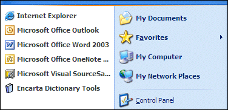
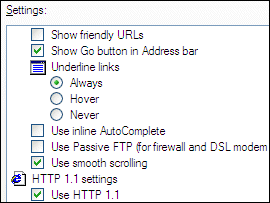
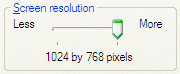

# Value Map Annotation

With value map annotation, you can use a mapping string to indicate how the image index of an item in a list view or tree view corresponds to its role or state. For example, a mapping string may indicate that a list view's image index 0 maps to a role of check box, while image index 1 maps to a role of radio button.

You can also use value map annotation to specify strings that map to the numeric values on a slider.

## When to Use This Technique

Consider using Value Map Annotation in the following situations.

-   When an owner-drawn list view or tree view incorporates the use of images, and you want to provide a custom accessible description ([**Description**](description-property.md) property) based on that image. The following illustration shows an example.

    

-   When an owner-drawn list view or tree view control incorporates the use of images to make the tree or list items act like simple controls, typically checkboxes or radio buttons, and you want to map the image to a role. The following screen shot shows an example.

    

-   When a slider is used to select a value that can be described as something other than a simple integer, as in the following screen shot, where the screen resolution setting is described by a string.

    

With value map annotation, a mapping string indicates how the list's or tree's image index corresponds to its role or state. Or, it can indicate how a slider's numeric value corresponds to a string. For example, a mapping string may indicate that a list view's image index 0 maps to a role of check box and image index 1 maps to a role of radio button. Use [**IAccPropServices::SetHwndPropStr()**](/windows/desktop/api/Oleacc/nf-oleacc-iaccpropservices-sethwndpropstr) to attach the mapping string to the control.

Because control-specific knowledge is required to support value mapping, there are a limited number of controls and properties that support value map annotation, including slider value maps, list views, and tree views.

## Slider Value Map

**PROPID\_ACC\_VALUEMAP** contains a mapping from internal slider positions to human-readable strings. This property is supported by the Oleacc.dll slider proxy. If the current slider value is found in the value map, the corresponding string will be exposed as the value instead of the default percentage string (for example, "50").

## List View and Tree View

**PROPID\_ACC\_ROLEMAP**, **PROPID\_ACC\_STATEMAP**, and **PROPID\_ACC\_DESCRIPTONMAP** provide mappings from state image indexes to role and state values. These maps allow those image indexes to be mapped to appropriate roles (usually [**ROLE\_SYSTEM\_RADIOBUTTON**](object-roles.md) or [**ROLE\_SYSTEM\_CHECKBUTTON**](object-roles.md)) and additional state bits (usually [**STATE\_SYSTEM\_CHECKED**](object-state-constants.md)).

For more information about value map annotation, see the following topics:

-   [Using Value Map Annotation](using-value-map-annotation.md)
-   [Value Map Annotation Sample](value-map-annotation-sample.md)

## Annotation Map Format

The following table describes the fields that are included in an annotation map.


| Field               | Description                                                                                                                                                                                                                                                                   |
|---------------------|-------------------------------------------------------------------------------------------------------------------------------------------------------------------------------------------------------------------------------------------------------------------------------|
| 'A'                 | Indicates that a particular coding scheme is used. Additional prefixes may be supported for future encoding schemes.                                                                                                                                                          |
| Delimiter character | Usually a colon (:) is used, but can be another character except for **NULL** or an empty space. Because this character will be used as a delimiter for the remaining fields, it may not be used as part of a value in the map.                                               |
| 0, 1, or 2          | A value that indicates which key is being used. For Tree View and List View role and state maps, this key can be 0 (image index), 1 (state image index), or 2 (overlay image index). For sliders and other controls that do not offer a choice of keys, this value must be 0. |
| Delimiter character | :                                                                                                                                                                                                                                                                             |
| Key value pairs     | Each pair consists of a key string and a delimiter character. The key string is a number and may be in decimal or hexadecimal (with a leading "0x" prefix) format.                                                                                                            |
| Value string        | For value maps, this is a string. For role and state maps, this is a number (decimal or hexadecimal).                                                                                                                                                                         |
| Delimiter character | :                                                                                                                                                                                                                                                                             |


 

For example, a map may look like the following:


```C++
A:0:0:Cold:1:Warm:3:Hot:
```


When this value map is applied to a slider control, a value of "Warm" will be exposed when the slider is at position 1. Because value 2 is not included in this example, the default value for that position will be exposed. For a slider, the default would be a percentage value, such as 33.

 

 


