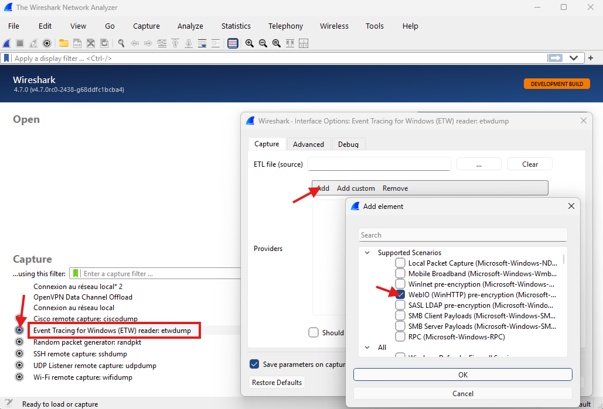
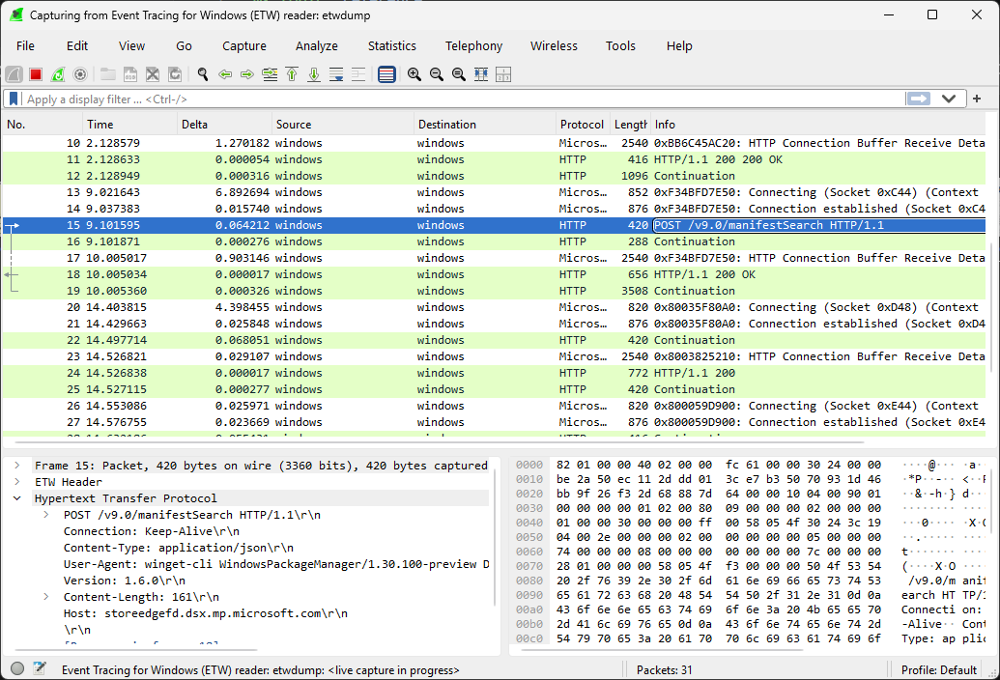

# Collect WinHTTP ETW traces

The ability to monitor WinHTTP functions and their corresponding network traffic is important. On Windows 7 and later, you can collect [Microsoft Windows HTTP Services (WinHTTP)](about-winhttp.md) traces for debugging and packet-sniffing purposes. Those traces are unencrypted, which allows you to debug applications using TLS.

## Method 1 - using Wireshark

> [!NOTE]
> Capturing WinHTTP traces in `Microsoft Message Analyzer` or `Microsoft NetMon` is now deprecated.

1. Follow the instructions from [Analyzing Mobile Broadband Logs in Wireshark](/windows-hardware/drivers/network/analyzing-mobile-broadband-logs-in-wireshark) to install Wireshark with `etwdump`. You need at least Wireshark 4.7.0.

2. Open Wireshark as administrator, and click on the cog next to `etwdump`. Select Add > `WebIO (WinHTTP)`.

3. Start the capture. You should see the WinHTTP ETW events along with the un-encrypted requests/responses.

## Method 2 - using netsh

You can use `netsh trace start scenario=internetclient` to start a collect.

For more info, see [Network tracing in Windows](/windows/win32/ndf/network-tracing-in-windows-7) and [Using netsh to manage traces](/windows/win32/ndf/using-netsh-to-manage-traces).

> [!NOTE]
> The trace configuration tool `WinHttpTraceCfg.exe` is now deprecated.
