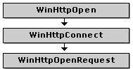

# HINTERNET handles in WinHTTP

Microsoft Windows HTTP Services (WinHTTP) uses handles to keep track of settings and information required when using the HTTP protocol. Each handle maintains information pertinent to an HTTP session, a connection with an HTTP server, or a specific resource. This topic describes the various types of handles, the naming conventions for these handles, and their hierarchical structure.

-   [About HINTERNET handles](#about-hinternet-handles)
-   [Naming handles](#naming-handles)
-   [Handle hierarchy](#handle-hierarchy)
-   [Explanation of the handle hierarchy](#explanation-of-the-handle-hierarchy)

## About HINTERNET handles

The handles that are created and used by WinHTTP are called **HINTERNET** handles. The WinHTTP functions return **HINTERNET** handles that are not interchangeable with other handles, so they cannot be used with functions such as [**ReadFile**](/windows/desktop/api/fileapi/nf-fileapi-readfile) or [**CloseHandle**](/windows/desktop/api/handleapi/nf-handleapi-closehandle). Similarly, other handles cannot be used with WinHTTP functions. For example, a handle returned by [**CreateFile**](/windows/desktop/api/fileapi/nf-fileapi-createfilea) cannot be passed to [**WinHttpReadData**](/windows/desktop/api/Winhttp/nf-winhttp-winhttpreaddata). These **HINTERNET** handles cannot be closed while an API call using the handle is in progress. To avoid a race condition, applications should protect the handle and prevent it from being closed for as long as the API call is in progress.

Microsoft Win32 Internet (WinInet) functions also use **HINTERNET** handles. However, the handles used in WinInet functions cannot be interchanged with the handles used in WinHTTP functions. For more information about WinInet, see [About WinINet](/windows/desktop/WinInet/about-wininet).

The [**WinHttpCloseHandle**](/windows/desktop/api/Winhttp/nf-winhttp-winhttpclosehandle) function closes WinHTTP **HINTERNET** handles.

## Naming handles

Throughout the WinHTTP documentation, descriptions of functions in the application programming interface (API) and sample code show the creation and use of various types of **HINTERNET** handles. To keep track of the different types of handles available, the naming of these handles is consistent. The following table shows the identifiers used by convention in the documentation.

| Handle type       | Function creating handle                                                                                                          | Identifier |
|-------------------|-----------------------------------------------------------------------------------------------------------------------------------|------------|
| Generic handle    | [**WinHttpOpen**](/windows/desktop/api/Winhttp/nf-winhttp-winhttpopen), [**WinHttpConnect**](/windows/desktop/api/Winhttp/nf-winhttp-winhttpconnect), or [**WinHttpOpenRequest**](/windows/desktop/api/Winhttp/nf-winhttp-winhttpopenrequest) | hInternet  |
| Session handle    | [**WinHttpOpen**](/windows/desktop/api/Winhttp/nf-winhttp-winhttpopen)                                                                                                | hSession   |
| Connection handle | [**WinHttpConnect**](/windows/desktop/api/Winhttp/nf-winhttp-winhttpconnect)                                                                                          | hConnect   |
| Request handle    | [**WinHttpOpenRequest**](/windows/desktop/api/Winhttp/nf-winhttp-winhttpopenrequest)                                                                                  | hRequest   |
| Web Socket handle    | [**WinHttpWebSocketCompleteUpgrade**](/windows/desktop/api/Winhttp/nf-winhttp-winhttpwebsocketcompleteupgrade)                                                     | hWebSocket |

## Handle hierarchy

The **HINTERNET** handles are maintained in a hierarchy. The handle returned by [**WinHttpOpen**](/windows/desktop/api/Winhttp/nf-winhttp-winhttpopen) is the session **HINTERNET** handle. Calling **WinHttpOpen** initializes the WinHTTP functions and begins a session context that maintains user information and settings throughout the life of the session handle. [**WinHttpConnect**](/windows/desktop/api/Winhttp/nf-winhttp-winhttpconnect) specifies a target HTTP or HTTPS server and creates a connection **HINTERNET** handle. By default, the connection handle inherits the settings for the session handle. Each resource specified with a call to [**WinHttpOpenRequest**](/windows/desktop/api/Winhttp/nf-winhttp-winhttpopenrequest) is assigned a request **HINTERNET** handle.

The following diagram illustrates the hierarchy of **HINTERNET** handles. Each box in the diagram represents a WinHTTP function that returns an **HINTERNET** handle.

After closing a handle, the application must be prepared to receive callback notifications on the handle until the final **WINHTTP\_CALLBACK\_STATUS\_HANDLE\_CLOSED** value is returned to indicate that the handle is completely closed (or until the application does its own equivalent synchronization, such  as tracking and waiting for any callbacks from pending asynchronous operations and ensuring no further operations are attempted using that handle).

A session handle is termed the parent of any connection handle it used to create; likewise, both the connection handle and its parent session handle are termed parents of any request handle that the connection handle is used to create.

When a parent handle is closed, any children it has are indirectly invalidated even if not closed themselves, and subsequent requests using them fail with the error **ERROR\_INVALID\_HANDLE**. Pending asynchronous requests cannot be relied on to complete correctly.

The following diagram shows the functions that use the **HINTERNET** handle created by [**WinHttpOpenRequest**](/windows/desktop/api/Winhttp/nf-winhttp-winhttpopenrequest). The shaded boxes represent WinHTTP functions that create handles, and the plain boxes show the functions that use those **HINTERNET** handles. The diagram is also organized to show the order in which WinHTTP functions are normally called.

## Explanation of the handle hierarchy

First, a session handle is created with [**WinHttpOpen**](/windows/desktop/api/Winhttp/nf-winhttp-winhttpopen). [**WinHttpConnect**](/windows/desktop/api/Winhttp/nf-winhttp-winhttpconnect) requires the session handle as its first parameter and returns a connection handle for a specified server. A request handle is created by [**WinHttpOpenRequest**](/windows/desktop/api/Winhttp/nf-winhttp-winhttpopenrequest), which uses the connection handle created by [**WinHttpConnect**](/windows/desktop/api/Winhttp/nf-winhttp-winhttpconnect). If the application chooses to add additional headers to the request, or if is it necessary for the application to set credentials for authentication, [**WinHttpAddRequestHeaders**](/windows/desktop/api/Winhttp/nf-winhttp-winhttpaddrequestheaders) and [**WinHttpSetCredentials**](/windows/desktop/api/Winhttp/nf-winhttp-winhttpsetcredentials) can be called using this request handle. The request is sent by [**WinHttpSendRequest**](/windows/desktop/api/Winhttp/nf-winhttp-winhttpsendrequest), which uses the request handle. After sending the request, additional data can be sent to the server using [**WinHttpWriteData**](/windows/desktop/api/Winhttp/nf-winhttp-winhttpwritedata), or the application can skip directly to [**WinHttpReceiveResponse**](/windows/desktop/api/Winhttp/nf-winhttp-winhttpreceiveresponse) to specify that no more information is sent to the server. At this point, depending on the purpose of the application, the request handle can be used to call [**WinHttpQueryHeaders**](/windows/desktop/api/Winhttp/nf-winhttp-winhttpqueryheaders), [**WinHttpQueryAuthSchemes**](/windows/desktop/api/Winhttp/nf-winhttp-winhttpqueryauthschemes), or retrieve a resource with [**WinHttpQueryDataAvailable**](/windows/desktop/api/Winhttp/nf-winhttp-winhttpquerydataavailable) and [**WinHttpReadData**](/windows/desktop/api/Winhttp/nf-winhttp-winhttpreaddata).

## Web sockets in the handle hierarchy

A web socket handle inherits from the connection and session handles, and occupies a similar position in the handle hierarchy as a request handle does. In order to create a web socket handle, a request handle must exist; but once the web socket handle is created, the request may be closed, and the web socket handle will continue to function.
