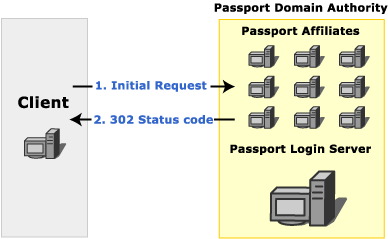

# Passport Authentication in WinHTTP

Microsoft Windows HTTP Services (WinHTTP) fully support the client side use of the Microsoft Passport authentication protocol. This topic provides an overview of the transactions involved in Passport authentication and how to handle them.

> [!Note]  
> In WinHTTP 5.1, Passport authentication is disabled by default.

 

## Passport 1.4

Passport is a core component of the Microsoft .NET building block services. It enables businesses to develop and offer distributed Web services across a wide range of applications and enables its members to use one sign-in name and password at all participating Web sites.

WinHTTP provides platform support for Microsoft Passport 1.4 by implementing the client-side protocol for Passport 1.4 authentication. It frees applications from the details of interacting with the Passport infrastructure and the Stored User Names and Passwords in Windows XP. This abstraction makes using Passport no different from a developer's perspective than using traditional authentication schemes like Basic or Digest.

**Windows XP:** The **HKCU\\Software\\Microsoft\\Windows\\CurrentVersion\\Internet Settings\\Passport\\NumRegistrationRuns** registry key identifies the number of times the Passport Authentication Wizard is displayed when PassPort authentication is required. If the value for this key is set to a number greater than 5, the wizard is not displayed.

The following sections describe the transactions involved in Passport authentication from the point of view of a client application. For server-side Passport development, see the Passport SDK Documentation Overview.

-   [Initial Request](#initial-request)
-   [Passport Login Server](#passport-login-server)
-   [Authenticated Request](#authenticated-request)

### Initial Request

When a client requests a resource on a server that requires Passport authentication, the server checks the request for the presence of [*tickets*](glossary.md). If a valid *ticket* is sent with the request, the server responds with the requested resource. If the *ticket* does not exist on the client, the server responds with a 302 status code. The response includes the challenge header, "WWW-Authenticate: Passport1.4". Clients that are not using Passport can follow the redirection to the Passport login server. More advanced clients typically contact the Passport nexus to determine the location of the Passport login server.

> [!Note]  
> Central to the Microsoft Passport network is the Passport *Nexus*, which facilitates synchronization of Passport participant sites to assure that each site has the latest details on network configuration and other issues. Each Passport component (Passport Manager, Login servers, Update servers, and so on) periodically communicates with the Nexus to retrieve the information it needs to locate, and properly communicate with, the other components in the Passport network. This information is retrieved as an XML document called a Component Configuration Document, or CCD.

 

The following image shows the initial request to a Passport affiliate.



### Passport Login Server

A Passport login server handles all requests for [*tickets*](glossary.md) for any resource in a Passport *domain authority*. Before a request can be authenticated using Passport, the client application must contact the login server to obtain the appropriate *tickets*.

When a client requests [*tickets*](glossary.md) from a Passport login server, the login server typically responds with a 401 status code to indicate that user credentials must be provided. When these credentials are provided, the login server responds with the *tickets* required to access the specified resource on the server that contains the originally requested resource. The login server can also redirect the client to another server that can provide the requested resource.


### Authenticated Request

When the client has the [*tickets*](glossary.md) that correspond to a given server, those *tickets* are included with all requests to that server. If the *tickets* have not been modified since they were retrieved from the Passport login server, and the *tickets* are valid for the resource server, the resource server sends a response that includes both the requested resource and cookies that indicate that the user is authenticated for future requests.

The additional cookies in the response are intended to speed the authentication process. Additional requests in the same session for resources on servers in the same Passport Domain Authority all include these additional cookies. Credentials do not need to be sent to the login server again until the cookies expire.


## Using Passport in WinHTTP

Passport authentication in WinHTTP is very similar to other authentication schemes. See [Authentication in WinHTTP](authentication-in-winhttp.md) for an overview of authentication in WinHTTP.

In WinHTTP 5.1, Passport authentication is disabled by default and must be explicitly enabled with [**WinHttpSetOption**](/windows/desktop/api/Winhttp/nf-winhttp-winhttpsetoption) before use.

WinHTTP handles many of the transaction details internally for Passport authentication. During the initial request, the server responds with a 302 status code when authentication is necessary. The 302 status code actually indicates a redirection and is part of the Passport protocol for backwards compatibility. WinHTTP hides the 302 status code and contacts the Passport nexus, and then the login server. The WinHTTP application is notified of the 401 status code sent by the login server to request user credentials. To the application, however, it appears as if the 401 status originates from the server from which the resource was requested. In this way, the WinHTTP application is unaware of interactions with other servers, and it can handle Passport authentication with the same code that handles other authentication schemes.

Typically, a WinHTTP application responds to a 401 status code by supplying authentication credentials. When credentials are supplied with [**WinHttpSetCredentials**](/windows/desktop/api/Winhttp/nf-winhttp-winhttpsetcredentials) or [**SetCredentials**](iwinhttprequest-setcredentials.md) for passport authentication, the credentials are actually being sent to the login server, not to the server indicated in the request.

However, when responding to a 407 status code, a WinHTTP application must use [**WinHttpSetOption**](/windows/desktop/api/Winhttp/nf-winhttp-winhttpsetoption) to provide proxy credentials, rather than [**WinHttpSetCredentials**](/windows/desktop/api/Winhttp/nf-winhttp-winhttpsetcredentials). Because **WinHttpSetOption** is a less secure way to supply credentials, it should normally be avoided.

Once retrieved, [*tickets*](glossary.md) are managed internally and are automatically sent to applicable servers in future requests.

> [!Note]  
> WinHTTP enables you to disable automatic redirection by calling the [**WinHttpSetOption**](/windows/desktop/api/Winhttp/nf-winhttp-winhttpsetoption) function for the [**WINHTTP\_OPTION\_DISABLE\_FEATURE**](option-flags.md) flag and specifying a value of [**WINHTTP\_DISABLE\_REDIRECTS**](option-flags.md). Disabling redirection does not interfere with the redirection that WinHTTP handles internally for Passport transactions.

 

WinHTTP can successfully complete the Passport authentication even if an application disables auto redirection. However, after the Passport authentication is complete, an implicit redirect must occur from the Passport login server URL back to the original URL. This redirect is not triggered by a 302 HTTP response, but is implicit in the Passport protocol.

WinHTTP handles this implicit redirect specially. If an application has disabled automatic redirection, WinHTTP requires that the application give WinHTTP "permission" to redirect automatically in this special case.

In order to have WinHTTP redirect back to the original URL after authentication, the application must register a callback function using [**WinHttpSetStatusCallback**](/windows/desktop/api/Winhttp/nf-winhttp-winhttpsetstatuscallback). WinHTTP can then notify the application with a WINHTTP\_CALLBACK\_STATUS\_REDIRECT callback, which allows the application to cancel the redirect. An application does not need to provide any functionality in the callback function; registration of the callback is sufficient to enable WinHTTP to follow this special-case redirect.

The ERROR\_WINHTTP\_LOGIN\_FAILURE message is generated if a callback function is not set by the application.

### Passport Cobranding

Unlike traditional authentication schemes supported by WinHTTP, Passport can be extensively [*cobranded*](glossary.md). Upon receiving a 401 status code that indicates a challenge, an application can retrieve the *cobranding* graphic and text. Retrieve a URL for the *cobranding* graphic by calling [**WinHttpQueryOption**](/windows/desktop/api/Winhttp/nf-winhttp-winhttpqueryoption) with the WINHTTP\_OPTION\_PASSPORT\_COBRANDING\_URL flag. Retrieve the *cobranding* text by calling [**WinHttpQueryOption**](/windows/desktop/api/Winhttp/nf-winhttp-winhttpqueryoption) with the WINHTTP\_OPTION\_PASSPORT\_COBRANDING\_TEXT flag. These items can be used to customize a credential-gathering dialog.

### Stored User Names and Passwords

Windows XP introduced the concept of Stored User Names and Passwords. If a user's Passport credentials are saved through the **Passport Registration Wizard** or the standard **Credential Dialog**, it is saved in the Stored User Names and Passwords. When using WinHTTP on Windows XP or later, WinHTTP automatically uses the credentials in the Stored User Names and Passwords if credentials are not explicitly set. This is similar to the support of default logon credentials for NTLM/Kerberos. However, use of default Passport credentials is not subject to the automatic logon policy settings.

### Disabling Passport Authentication

Some applications might require the ability to disable Passport authentication. For example, when a Passport affiliate responds with the initial 302 status code, it might be preferable to follow the indicated redirection and render the HTML Passport authentication page rather than allowing WinHTTP to handle the authentication internally. Passport authentication is disabled in WinHTTP by calling the [**WinHttpSetOption**](/windows/desktop/api/Winhttp/nf-winhttp-winhttpsetoption) function with the WINHTTP\_OPTION\_CONFIGURE\_PASSPORT\_AUTH option and passing the value WINHTTP\_DISABLE\_PASSPORT\_AUTH. It can later be re-enabled with WINHTTP\_ENABLE\_PASSPORT\_AUTH.

Passport authentication cannot be disabled when using the [**WinHttpRequest**](winhttprequest.md) object.

As noted earlier in this section, Passport authentication is disabled by default in WinHTTP 5.1, and must be explicitly enabled with [**WinHttpSetOption**](/windows/desktop/api/Winhttp/nf-winhttp-winhttpsetoption) before use.

## Passport Configuration Overrides Used for Testing

WinHTTP relies on the configuration information it downloads from the passport nexus server to support Passport 1.4 authentication. By default this secure (SSL) server is nexus.passport.com, and the configuration resource is rdr/pprdr.asp, which is known as the "live" passport configuration. The format of the information is a custom HTTP header "PassportURLs", followed by comma delimited attribute-value pairs.

For example, "https://nexus.passport.com/rdr/pprdr.asp" returns the following configuration information:

``` syntax
PassportURLs: DARealm=Passport.net,
DALogin=login.passport.com/login2.asp,
DAReg=https://register.passport.com/defaultwiz.asp,
Properties=https://memberservices.passport.com/ppsecure/MSRV_EditProfile.asp,
Privacy=https://www.passport.com/consumer/privacypolicy.asp,
GeneralRedir=https://nexusrdr.passport.com/redir.asp,
Help=https://memberservices.passport.com/UI/MSRV_UI_Help.asp,
ConfigVersion=2
\r\n
```

The parts that are relevant to WinHTTP are DARealm, DALogin, and ConfigVersion. For performance reasons, they are cached for the lifetime of a WinHTTP session. These three values can be overridden by applications that are required to work with another passport infrastructure other than the "live" production setup by changing the appropriate registry settings under

```
HKEY_LOCAL_MACHINE
   SOFTWARE
      Microsoft
         Windows
            CurrentVersion
               Internet Settings
                  WinHttp
                     Passport Test
```

``` syntax
LoginServerRealm (REG_SZ)    For example: abc.net
LoginServerUrl (REG_SZ)      For example: https://private-login.passport.com/login2.asp
ConfigVersion (REG_DWORD)    For example: 10
```

If LoginServerUrl is present in the registry, WinHTTP does not contact the nexus server for other configuration values. In this case, LoginServerRealm and ConfigVersion should also be set through the registry to correct values.

An application may, for testing purposes, be required to download passport configuration from a private nexus server. This can be done by overriding two registry values under

```
HKEY_LOCAL_MACHINE
   SOFTWARE
      Microsoft
         Windows
            CurrentVersion
               Internet Settings
                  WinHttp
                     Passport Test
```

``` syntax
NexusHost (REG_SZ)    e.g. private-nexus.passport.com
NexusObj(REG_SZ)      e.g. config/passport.asp
```

## Related topics

<dl> <dt>

[Authentication in WinHTTP](authentication-in-winhttp.md)
</dt> </dl>

 

 


