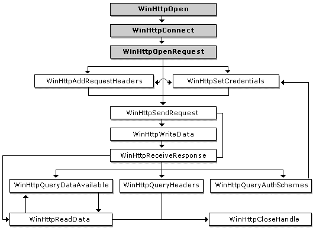

# WinHTTP Sessions Overview

The Microsoft Windows HTTP Services (WinHTTP) exposes a set of C/C++ functions that enable your application to access HTTP resources on the Web. This topic provides an overview of how these functions are used to interact with an HTTP server.

-   [Using the WinHTTP API to Access the Web](#using-the-winhttp-api-to-access-the-web)
-   [Initializing WinHTTP](#initializing-winhttp)
-   [Opening a Request](#opening-a-request)
-   [Adding Request Headers](#adding-request-headers)
-   [Sending a Request](#sending-a-request)
-   [Posting Data to the Server](#posting-data-to-the-server)
-   [Getting Information About a Request](#getting-information-about-a-request)
-   [Downloading Resources from the Web](#downloading-resources-from-the-web)

## Using the WinHTTP API to Access the Web

The following diagram shows the order in which WinHTTP functions are typically called when interacting with an HTTP server. The shaded boxes represent functions that generate an [HINTERNET](hinternet-handles-in-winhttp.md) handle, while the plain boxes represent functions that use those handles.



## Initializing WinHTTP

Before interacting with a server, WinHTTP must be initialized by calling [**WinHttpOpen**](/windows/desktop/api/Winhttp/nf-winhttp-winhttpopen). [**WinHttpOpen**](/windows/desktop/api/Winhttp/nf-winhttp-winhttpopen) creates a session context to maintain details about the HTTP session, and returns a session handle. Using this handle, the [**WinHttpConnect**](/windows/desktop/api/Winhttp/nf-winhttp-winhttpconnect) function is then able to specify a target HTTP or Secure Hypertext Transfer Protocol (HTTPS) server.

> [!Note]  
> A call to [**WinHttpConnect**](/windows/desktop/api/Winhttp/nf-winhttp-winhttpconnect) does not result in an actual connection to the HTTP server until a request is made for a specific resource.

 

## Opening a Request

The [**WinHttpOpenRequest**](/windows/desktop/api/Winhttp/nf-winhttp-winhttpopenrequest) function opens an HTTP request for a particular resource and returns an [HINTERNET](hinternet-handles-in-winhttp.md) handle that can be used by the other HTTP functions. [**WinHttpOpenRequest**](/windows/desktop/api/Winhttp/nf-winhttp-winhttpopenrequest) does not send the request to the server when called. The [**WinHttpSendRequest**](/windows/desktop/api/Winhttp/nf-winhttp-winhttpsendrequest) function actually establishes a connection over the network and sends the request.

The following example shows a sample call to [**WinHttpOpenRequest**](/windows/desktop/api/Winhttp/nf-winhttp-winhttpopenrequest) that uses the default options.

`HINTERNET hRequest = WinHttpOpenRequest( hConnect, L"GET", NULL, NULL, NULL, NULL, 0);`

## Adding Request Headers

The [**WinHttpAddRequestHeaders**](/windows/desktop/api/Winhttp/nf-winhttp-winhttpaddrequestheaders) function allows an application to append additional free-format request headers to the HTTP request handle. It is intended for use by sophisticated applications that require precise control over the requests sent to the HTTP server.

The [**WinHttpAddRequestHeaders**](/windows/desktop/api/Winhttp/nf-winhttp-winhttpaddrequestheaders) function requires an HTTP request handle created by [**WinHttpOpenRequest**](/windows/desktop/api/Winhttp/nf-winhttp-winhttpopenrequest), a string that contains the headers, the length of the headers, and any modifiers.

The following modifiers can be used with [**WinHttpAddRequestHeaders**](/windows/desktop/api/Winhttp/nf-winhttp-winhttpaddrequestheaders).


| Modifier                                                                                         | Description                                                                                                                                                                                                                                                                                                                                   |
|--------------------------------------------------------------------------------------------------|-----------------------------------------------------------------------------------------------------------------------------------------------------------------------------------------------------------------------------------------------------------------------------------------------------------------------------------------------|
| [**WINHTTP\_ADDREQ\_FLAG\_ADD**](/windows/desktop/api/Winhttp/nf-winhttp-winhttpaddrequestheaders)                       | Adds the header if it does not exist. Used with [**WINHTTP\_ADDREQ\_FLAG\_REPLACE**](/windows/desktop/api/Winhttp/nf-winhttp-winhttpaddrequestheaders).                                                                                                                                                                                                               |
| [**WINHTTP\_ADDREQ\_FLAG\_ADD\_IF\_NEW**](/windows/desktop/api/Winhttp/nf-winhttp-winhttpaddrequestheaders)              | Adds the header only if it does not already exist; otherwise, an error is returned.                                                                                                                                                                                                                                                           |
| [**WINHTTP\_ADDREQ\_FLAG\_COALESCE**](/windows/desktop/api/Winhttp/nf-winhttp-winhttpaddrequestheaders)                  | Merges headers of the same name.                                                                                                                                                                                                                                                                                                              |
| [**WINHTTP\_ADDREQ\_FLAG\_COALESCE\_WITH\_COMMA**](/windows/desktop/api/Winhttp/nf-winhttp-winhttpaddrequestheaders)     | Merges headers of the same name using a comma. For example, adding "Accept: text/\*" followed by "Accept: audio/\*" with this flag forms the single header "Accept: text/\*, audio/\*", causing the first header found to be merged. It is up to the calling application to ensure a cohesive scheme with respect to merged/separate headers. |
| [**WINHTTP\_ADDREQ\_FLAG\_COALESCE\_WITH\_SEMICOLON**](/windows/desktop/api/Winhttp/nf-winhttp-winhttpaddrequestheaders) | Merges headers of the same name using a semicolon.                                                                                                                                                                                                                                                                                            |
| [**WINHTTP\_ADDREQ\_FLAG\_REPLACE**](/windows/desktop/api/Winhttp/nf-winhttp-winhttpaddrequestheaders)                   | Replaces or removes a header. If the header value is empty and the header is found, it is removed. If the header value is not empty, the header value is replaced.                                                                                                                                                                            |


 

## Sending a Request

The [**WinHttpSendRequest**](/windows/desktop/api/Winhttp/nf-winhttp-winhttpsendrequest) function establishes a connection to the server and sends the request to the specified site. This function requires an [HINTERNET](hinternet-handles-in-winhttp.md) handle created by [**WinHttpOpenRequest**](/windows/desktop/api/Winhttp/nf-winhttp-winhttpopenrequest). [**WinHttpSendRequest**](/windows/desktop/api/Winhttp/nf-winhttp-winhttpsendrequest) can also send additional headers or optional information. The optional information is generally used for operations that write information to the server, such as PUT and POST.

After the [**WinHttpSendRequest**](/windows/desktop/api/Winhttp/nf-winhttp-winhttpsendrequest) function sends the request, the application can use the [**WinHttpReadData**](/windows/desktop/api/Winhttp/nf-winhttp-winhttpreaddata) and [**WinHttpQueryDataAvailable**](/windows/desktop/api/Winhttp/nf-winhttp-winhttpquerydataavailable) functions on the [HINTERNET](hinternet-handles-in-winhttp.md) handle to download the server's resources.

## Posting Data to the Server

To post data to a server, the [*HTTP verb*](glossary.md) in the call to [**WinHttpOpenRequest**](/windows/desktop/api/Winhttp/nf-winhttp-winhttpopenrequest) must be either POST or PUT. When [**WinHttpSendRequest**](/windows/desktop/api/Winhttp/nf-winhttp-winhttpsendrequest) is called, the *dwTotalLength* parameter should be set to the size of the data in bytes. Then use [**WinHttpWriteData**](/windows/desktop/api/Winhttp/nf-winhttp-winhttpwritedata) to post the data to the server.

Alternatively, set the *lpOptional* parameter of [**WinHttpSendRequest**](/windows/desktop/api/Winhttp/nf-winhttp-winhttpsendrequest) to the address of a buffer that contains data to post to the server. When using this technique, you must set both the *dwOptionalLength* and *dwTotalLength* parameters of [**WinHttpSendRequest**](/windows/desktop/api/Winhttp/nf-winhttp-winhttpsendrequest) to be the size of the data being posted. Calling [**WinHttpSendRequest**](/windows/desktop/api/Winhttp/nf-winhttp-winhttpsendrequest) in this manner eliminates the need to call [**WinHttpWriteData**](/windows/desktop/api/Winhttp/nf-winhttp-winhttpwritedata).

## Getting Information About a Request

The [**WinHttpQueryHeaders**](/windows/desktop/api/Winhttp/nf-winhttp-winhttpqueryheaders) function allows an application to retrieve information about an HTTP request. The function requires an [HINTERNET](hinternet-handles-in-winhttp.md) handle created by [**WinHttpOpenRequest**](/windows/desktop/api/Winhttp/nf-winhttp-winhttpopenrequest), an information level value, and a buffer length. [**WinHttpQueryHeaders**](/windows/desktop/api/Winhttp/nf-winhttp-winhttpqueryheaders) also accepts a buffer that stores the information and a zero-based header index that enumerates multiple headers with the same name.

Use any of the information level values found on the [**Query Info Flags**](query-info-flags.md) page with a modifier to control the format in which the information is stored in the *lpvBuffer* parameter of [**WinHttpQueryHeaders**](/windows/desktop/api/Winhttp/nf-winhttp-winhttpqueryheaders).

## Downloading Resources from the Web

After opening a request with the [**WinHttpOpenRequest**](/windows/desktop/api/Winhttp/nf-winhttp-winhttpopenrequest) function, sending it to the server with [**WinHttpSendRequest**](/windows/desktop/api/Winhttp/nf-winhttp-winhttpsendrequest), and preparing the request handle to receive a response with [**WinHttpReceiveResponse**](/windows/desktop/api/Winhttp/nf-winhttp-winhttpreceiveresponse), the application can use the [**WinHttpReadData**](/windows/desktop/api/Winhttp/nf-winhttp-winhttpreaddata) and [**WinHttpQueryDataAvailable**](/windows/desktop/api/Winhttp/nf-winhttp-winhttpquerydataavailable) functions to download the resource from the HTTP server.

The following sample code shows how to download a resource with secure transaction semantics. The sample code initializes the WinHTTP application programming interface (API), selects a target HTTPS server, and then opens and sends a request for this secure resource. [**WinHttpQueryDataAvailable**](/windows/desktop/api/Winhttp/nf-winhttp-winhttpquerydataavailable) is used with the request handle to determine how much data is available for download, and then [**WinHttpReadData**](/windows/desktop/api/Winhttp/nf-winhttp-winhttpreaddata) is used to read that data. This process is repeated until the entire document has been retrieved and displayed.


```C++
  DWORD dwSize = 0;
  DWORD dwDownloaded = 0;
  LPSTR pszOutBuffer;
  BOOL  bResults = FALSE;
  HINTERNET  hSession = NULL, 
             hConnect = NULL,
             hRequest = NULL;

  // Use WinHttpOpen to obtain a session handle.
  hSession = WinHttpOpen( L"WinHTTP Example/1.0",  
                          WINHTTP_ACCESS_TYPE_DEFAULT_PROXY,
                          WINHTTP_NO_PROXY_NAME, 
                          WINHTTP_NO_PROXY_BYPASS, 0 );

  // Specify an HTTP server.
  if( hSession )
    hConnect = WinHttpConnect( hSession, L"www.microsoft.com",
                               INTERNET_DEFAULT_HTTPS_PORT, 0 );

  // Create an HTTP request handle.
  if( hConnect )
    hRequest = WinHttpOpenRequest( hConnect, L"GET", NULL,
                                   NULL, WINHTTP_NO_REFERER, 
                                   WINHTTP_DEFAULT_ACCEPT_TYPES, 
                                   WINHTTP_FLAG_SECURE );

  // Send a request.
  if( hRequest )
    bResults = WinHttpSendRequest( hRequest,
                                   WINHTTP_NO_ADDITIONAL_HEADERS, 0,
                                   WINHTTP_NO_REQUEST_DATA, 0, 
                                   0, 0 );


  // End the request.
  if( bResults )
    bResults = WinHttpReceiveResponse( hRequest, NULL );

  // Keep checking for data until there is nothing left.
  if( bResults )
  {
    do 
    {
      // Check for available data.
      dwSize = 0;
      if( !WinHttpQueryDataAvailable( hRequest, &dwSize ) )
        printf( "Error %u in WinHttpQueryDataAvailable.\n",
                GetLastError( ) );

      // Allocate space for the buffer.
      pszOutBuffer = new char[dwSize+1];
      if( !pszOutBuffer )
      {
        printf( "Out of memory\n" );
        dwSize=0;
      }
      else
      {
        // Read the data.
        ZeroMemory( pszOutBuffer, dwSize+1 );

        if( !WinHttpReadData( hRequest, (LPVOID)pszOutBuffer, 
                              dwSize, &dwDownloaded ) )
          printf( "Error %u in WinHttpReadData.\n", GetLastError( ) );
        else
          printf( "%s", pszOutBuffer );

        // Free the memory allocated to the buffer.
        delete [] pszOutBuffer;
      }
    } while( dwSize > 0 );
  }


  // Report any errors.
  if( !bResults )
    printf( "Error %d has occurred.\n", GetLastError( ) );

  // Close any open handles.
  if( hRequest ) WinHttpCloseHandle( hRequest );
  if( hConnect ) WinHttpCloseHandle( hConnect );
  if( hSession ) WinHttpCloseHandle( hSession );
```


 

 


