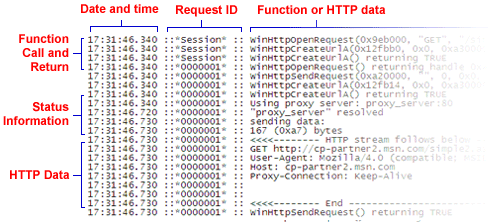

# WinHttpTraceCfg.exe, a Trace Configuration Tool

The [Microsoft Windows HTTP Services (WinHTTP)](about-winhttp.md) trace configuration tool, WinHttpTraceCfg.exe, is used to configure trace capabilities for debugging and packet-sniffing purposes. The ability to monitor WinHTTP functions and their corresponding network traffic is important. Debugging applications that utilize encrypted wire protocols, such as Secure Sockets Layer (SSL), preclude sniffing packets at the network transport layer and require the ability to intercept traffic between the client and server after it has been decrypted. Microsoft Windows HTTP Services (WinHTTP) provides a trace facility that has a range of capabilities for intercepting the traffic stream between the client and server.

This trace facility can be a valuable tool for debugging. It can be used, for example, to view parameters passed to various function calls, as well as to view actual data sent and received by a WinHTTP application.

-   [Using the Trace Facility](#using-the-trace-facility)
-   [Interpreting Trace Data](#interpreting-trace-data)

## Using the Trace Facility

WinHTTP obtains tracing control parameters from the registry. These control parameters affect how WinHTTP produces trace output, and how that output is formatted. All applications that use WinHTTP share the same settings.

A trace facility configuration tool, WinHttpTraceCfg.exe, is available as a download on the [Windows Server 2003 Resource Kit Tools](https://www.microsoft.com/downloads/details.aspx?familyid=9d467a69-57ff-4ae7-96ee-b18c4790cffd) website. The configuration tool sets or retrieves the trace facility registry settings based on the specified command line parameters.

``` syntax
WinHttpTraceCfg [-e <0|1>] [-l [log-file]] [-d <0|1>] [-s <0|1|2>] 
                [-t <0|1>] [-?] [-m <file size>]
```

The following table lists possible parameters for the configuration tool.


<table>
<colgroup>
<col style="width: 50%" />
<col style="width: 50%" />
</colgroup>
<thead>
<tr class="header">
<th>Parameter</th>
<th>Description</th>
</tr>
</thead>
<tbody>
<tr class="odd">
<td>-?</td>
<td>Displays syntax data.<br/></td>
</tr>
<tr class="even">
<td>-e</td>
<td>Specifies whether the trace facility is enabled or disabled. <br/> 
<table>
<tbody>
<tr class="odd">
<td>0</td>
<td>Default setting. Disables tracing.</td>
</tr>
<tr class="even">
<td>1</td>
<td>Enables tracing.</td>
</tr>
</tbody>
</table>

<p> </p></td>
</tr>
<tr class="odd">
<td>-l</td>
<td><p>Specifies a prefix for the log file. The prefix can include a path. The log file is written to the current directory or the directory specified in the prefix and has the following format.</p>
<p><<em>prefix</em>>-<<em>application name</em>>.<<em>time</em>>.log</p>
<p>If a prefix is not specified, an empty string is used. Specify &quot;*&quot; to delete an existing prefix.</p></td>
</tr>
<tr class="even">
<td>-d</td>
<td><p>Specifies whether the trace output is displayed in a debugger or written to a file.</p>

<table>
<tbody>
<tr class="odd">
<td>0</td>
<td>Default setting. Writes to log file.</td>
</tr>
<tr class="even">
<td>1</td>
<td>Displays in a debugger.</td>
</tr>
</tbody>
</table>

<p> </p></td>
</tr>
<tr class="odd">
<td>-s</td>
<td><p>Specifies how network traffic (requests and responses) is displayed.</p>

<table>
<tbody>
<tr class="odd">
<td>0</td>
<td>Only displays HTTP headers.</td>
</tr>
<tr class="even">
<td>1</td>
<td>Default setting. Shows network traffic in American National Standards Institute (ANSI) format.</td>
</tr>
<tr class="odd">
<td>2</td>
<td>Shows network traffic in hexadecimal format.</td>
</tr>
</tbody>
</table>

<p> </p></td>
</tr>
<tr class="even">
<td>-t</td>
<td><p>Specifies whether top-level function calls are recorded in the trace.</p>

<table>
<tbody>
<tr class="odd">
<td>0</td>
<td>Default setting. Function calls are not recorded.</td>
</tr>
<tr class="even">
<td>1</td>
<td>Top-level function calls are recorded.</td>
</tr>
</tbody>
</table>

<p> </p></td>
</tr>
<tr class="odd">
<td>-m</td>
<td><p>Specifies the maximum size, in bytes, of a log file generated by the tracing facility. If this option is specified without a size, the minimum value is 65,535 bytes. If a log file reaches the maximum size, the contents of the file are erased. Trace data continues to be written to the log file.</p></td>
</tr>
</tbody>
</table>


 

Running the trace facility configuration tool and specifying no parameters retrieves and displays the current registry settings.

> [!Note]  
> Log files grow rapidly and degrade application performance. Ensure that the required hard disk drive space is available before enabling the trace facility.

 

## Interpreting Trace Data

The trace facility data stream reflects WinHTTP functions called in the application and any HTTP data sent or received. In some cases, functions called internally by WinHTTP are also shown.

The following image shows a portion of a log file generated by the trace facility. Several items are highlighted and labeled.



Each line of trace output contains information in three columns. The first column shows the date and time when the entry was recorded. The second column shows a request identifier (ID) that can be used to differentiate between multiple requests. If the log entry does not correspond to a specific request, "\*Session\*" is displayed in this column. It can be useful to sort the log file based on this ID to see only events that occur for a single request. The following example shows a command you can use to sort the log file.

**findstr 00000001 LogFile.log**

The third column shows a function call, HTTP traffic, or a status message included to help interpret the trace.

When a log entry corresponds to a function call, the parameters of the function are also recorded. Memory addresses are displayed in hexadecimal while all other values are displayed as an ASCII string. The trace facility also records the return time and value for each function.

The format of HTTP data depends on the registry settings specified with the trace facility configuration tool. When HTTP data is encrypted, the decrypted data is also shown in the trace output.

 

 


