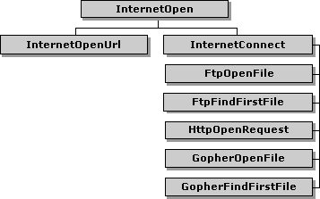
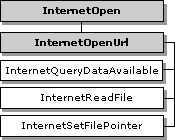
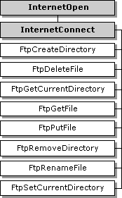
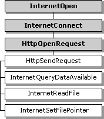

# HINTERNET Handles

This section contains information about the handles that are used by the WinINet functions and the hierarchy in which they work.

-   [About HINTERNET Handles](#about-hinternet-handles)
-   [Handle Hierarchy](#handle-hierarchy)
-   [FTP Hierarchy](#ftp-hierarchy)
-   [HTTP Hierarchy](#http-hierarchy)

## About HINTERNET Handles

The handles that are created and used by the WinINet functions are of type **HINTERNET**. The WinINet functions return **HINTERNET** handles that are not interchangeable with other handle types. Therefore, they cannot be used with functions such as [**ReadFile**](/windows/desktop/api/fileapi/nf-fileapi-readfile) or [**CloseHandle**](/windows/desktop/api/handleapi/nf-handleapi-closehandle). Similarly, other handle types cannot be used with the WinINet functions. For example, a handle returned by [**CreateFile**](/windows/desktop/api/fileapi/nf-fileapi-createfilea) cannot be passed to [**InternetReadFile**](/windows/desktop/api/Wininet/nf-wininet-internetreadfile).

The [**InternetCloseHandle**](/windows/desktop/api/Wininet/nf-wininet-internetclosehandle) function closes handles of type **HINTERNET**. Note that handle values are recycled quickly; therefore, if a handle is closed and a new handle is generated immediately, there is a good chance that the new handle has the same value as the handle just closed.

## Handle Hierarchy

The **HINTERNET** handles are maintained in a tree hierarchy. The handle returned by the [**InternetOpen**](/windows/desktop/api/Wininet/nf-wininet-internetopena) function is the root node. Handles returned by the [**InternetConnect**](/windows/desktop/api/Wininet/nf-wininet-internetconnecta) function occupy the next level. Handles returned by the [**FtpOpenFile**](/windows/desktop/api/Wininet/nf-wininet-ftpopenfilea), [**FtpFindFirstFile**](/windows/desktop/api/Wininet/nf-wininet-ftpfindfirstfilea), and [**HttpOpenRequest**](/windows/desktop/api/Wininet/nf-wininet-httpopenrequesta) functions are the leaf nodes.

**Windows XP and Windows Server 2003 R2 and earlier:** Handles returned by , [**GopherOpenFile**](/windows/desktop/api/Wininet/nf-wininet-gopheropenfilea), and [**GopherFindFirstFile**](/windows/desktop/api/Wininet/nf-wininet-gopherfindfirstfilea) are also leaf nodes.

The following diagram illustrates the hierarchy of the **HINTERNET** handles. Each box in the diagram represents a function that returns an **HINTERNET** handle.

At the top level is the [**InternetOpen**](/windows/desktop/api/Wininet/nf-wininet-internetopena) function, which creates the root handle. The next level contains the [**InternetOpenUrl**](/windows/desktop/api/Wininet/nf-wininet-internetopenurla) and [**InternetConnect**](/windows/desktop/api/Wininet/nf-wininet-internetconnecta) functions. The functions that use the handle returned by [**InternetConnect**](/windows/desktop/api/Wininet/nf-wininet-internetconnecta) make up the last level.

The following diagram shows the functions that are dependent on the handle created by [**InternetOpenUrl**](/windows/desktop/api/Wininet/nf-wininet-internetopenurla). The shaded boxes represent functions that return **HINTERNET** handles, while the plain boxes represent functions that use the **HINTERNET** handle created by the associated function.

The [**InternetQueryDataAvailable**](/windows/desktop/api/Wininet/nf-wininet-internetquerydataavailable), [**InternetReadFile**](/windows/desktop/api/Wininet/nf-wininet-internetreadfile), and [**InternetSetFilePointer**](/windows/desktop/api/Wininet/nf-wininet-internetsetfilepointer) functions use the **HINTERNET** handle created by [**InternetOpenUrl**](/windows/desktop/api/Wininet/nf-wininet-internetopenurla).

## FTP Hierarchy

The following diagram shows the FTP functions that are dependent on the FTP session handle returned by [**InternetConnect**](/windows/desktop/api/Wininet/nf-wininet-internetconnecta). The shaded boxes represent functions that return **HINTERNET** handles, while the plain boxes represent functions that use the **HINTERNET** handle created by the function on which they depend.

The [**FtpCreateDirectory**](/windows/desktop/api/Wininet/nf-wininet-ftpcreatedirectorya), [**FtpDeleteFile**](/windows/desktop/api/Wininet/nf-wininet-ftpdeletefilea), [**FtpGetCurrentDirectory**](/windows/desktop/api/Wininet/nf-wininet-ftpgetcurrentdirectorya), [**FtpGetFile**](/windows/desktop/api/Wininet/nf-wininet-ftpgetfilea), [**FtpPutFile**](/windows/desktop/api/Wininet/nf-wininet-ftpputfilea), [**FtpRemoveDirectory**](/windows/desktop/api/Wininet/nf-wininet-ftpremovedirectorya), [**FtpRenameFile**](/windows/desktop/api/Wininet/nf-wininet-ftprenamefilea), and [**FtpSetCurrentDirectory**](/windows/desktop/api/Wininet/nf-wininet-ftpsetcurrentdirectorya) functions all use the **HINTERNET** handle created by [**InternetConnect**](/windows/desktop/api/Wininet/nf-wininet-internetconnecta).

The following diagram shows the two FTP functions that return handles and the functions that are dependent on them. The shaded boxes represent functions that return **HINTERNET** handles, while the plain boxes represent functions that use the **HINTERNET** handle created by the function on which they depend.

The [**InternetFindNextFile**](/windows/desktop/api/Wininet/nf-wininet-internetfindnextfilea) function is dependent on the handle created by [**FtpFindFirstFile**](/windows/desktop/api/Wininet/nf-wininet-ftpfindfirstfilea), while [**InternetReadFile**](/windows/desktop/api/Wininet/nf-wininet-internetreadfile) and [**InternetWriteFile**](/windows/desktop/api/Wininet/nf-wininet-internetwritefile) use the handle created by [**FtpOpenFile**](/windows/desktop/api/Wininet/nf-wininet-ftpopenfilea).

## HTTP Hierarchy

The following diagram shows the relationships of the functions that are used for the HTTP protocol. The shaded boxes represent functions that return **HINTERNET** handles, while the plain boxes represent functions that use the **HINTERNET** handle created by the function on which they depend.

The [**HttpAddRequestHeaders**](/windows/desktop/api/Wininet/nf-wininet-httpaddrequestheadersa), [**HttpQueryInfo**](/windows/desktop/api/Wininet/nf-wininet-httpqueryinfoa), [**HttpSendRequest**](/windows/desktop/api/Wininet/nf-wininet-httpsendrequesta), [**HttpSendRequestEx**](/windows/desktop/api/Wininet/nf-wininet-httpsendrequestexa), and [**InternetErrorDlg**](/windows/desktop/api/Wininet/nf-wininet-interneterrordlg) functions are dependent on the handle created by [**HttpOpenRequest**](/windows/desktop/api/Wininet/nf-wininet-httpopenrequesta).

The following diagram shows the functions that use the **HINTERNET** handle created by [**HttpOpenRequest**](/windows/desktop/api/Wininet/nf-wininet-httpopenrequesta) after it is sent by [**HttpSendRequest**](/windows/desktop/api/Wininet/nf-wininet-httpsendrequesta). The shaded boxes represent functions that return **HINTERNET** handles, while the plain boxes represent functions that use the **HINTERNET** handle created by the function on which they depend.

After [**HttpSendRequest**](/windows/desktop/api/Wininet/nf-wininet-httpsendrequesta) has used the handle returned by [**HttpOpenRequest**](/windows/desktop/api/Wininet/nf-wininet-httpopenrequesta), it can be used by [**InternetQueryDataAvailable**](/windows/desktop/api/Wininet/nf-wininet-internetquerydataavailable), [**InternetReadFile**](/windows/desktop/api/Wininet/nf-wininet-internetreadfile), and [**InternetSetFilePointer**](/windows/desktop/api/Wininet/nf-wininet-internetsetfilepointer).

After [**HttpSendRequestEx**](/windows/desktop/api/Wininet/nf-wininet-httpsendrequestexa) has used the handle returned by [**HttpOpenRequest**](/windows/desktop/api/Wininet/nf-wininet-httpopenrequesta), the handle can be used by [**HttpEndRequest**](/windows/desktop/api/Wininet/nf-wininet-httpendrequesta), [**InternetReadFileEx**](/windows/desktop/api/Wininet/nf-wininet-internetreadfileexa), and [**InternetWriteFile**](/windows/desktop/api/Wininet/nf-wininet-internetwritefile). After [**HttpEndRequest**](/windows/desktop/api/Wininet/nf-wininet-httpendrequesta) has been called, the handle can be used by [**InternetReadFile**](/windows/desktop/api/Wininet/nf-wininet-internetreadfile), [**InternetSetFilePointer**](/windows/desktop/api/Wininet/nf-wininet-internetsetfilepointer), and [**InternetQueryDataAvailable**](/windows/desktop/api/Wininet/nf-wininet-internetquerydataavailable).

> [!Note]  
> WinINet does not support server implementations. In addition, it should not be used from a service. For server implementations or services use [Microsoft Windows HTTP Services (WinHTTP)](/windows/desktop/WinHttp/winhttp-start-page).

 

 

 