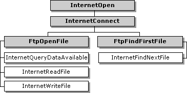

# FTP Sessions

WinINet enables applications to navigate and manipulate directories and files on an ftp server. Because CERN proxies do not support FTP, applications that use a CERN proxy exclusively must use the [**InternetOpenUrl**](/windows/win32/Wininet/nf-wininet-internetopenurla?branch=master) function. For more information about how to use [**InternetOpenUrl**](/windows/win32/Wininet/nf-wininet-internetopenurla?branch=master), see [Accessing URLs Directly](handling-uniform-resource-locators.md#accessing-urls-directly).

To begin an FTP session, use [**InternetConnect**](/windows/win32/Wininet/nf-wininet-internetconnecta?branch=master) to create the session handle.

WinINet enables you to perform the following actions on an FTP server:

-   Navigate between directories.
-   Enumerate, create, remove, and rename directories.
-   Rename, upload, download, and delete files.

Navigation is provided by the [**FtpGetCurrentDirectory**](/windows/win32/Wininet/nf-wininet-ftpgetcurrentdirectorya?branch=master) and [**FtpSetCurrentDirectory**](/windows/win32/Wininet/nf-wininet-ftpsetcurrentdirectorya?branch=master) functions. These functions utilize the session handle created by a previous call to [**InternetConnect**](/windows/win32/Wininet/nf-wininet-internetconnecta?branch=master) to determine which directory the application is currently in, or to change to a different subdirectory.

Directory enumeration is performed by using the [**FtpFindFirstFile**](/windows/win32/Wininet/nf-wininet-ftpfindfirstfilea?branch=master) and [**InternetFindNextFile**](/windows/win32/Wininet/nf-wininet-internetfindnextfilea?branch=master) functions. [**FtpFindFirstFile**](/windows/win32/Wininet/nf-wininet-ftpfindfirstfilea?branch=master) uses the session handle created by [**InternetConnect**](/windows/win32/Wininet/nf-wininet-internetconnecta?branch=master) to find the first file that matches the given search criteria and returns a handle to continue the directory enumeration. [**InternetFindNextFile**](/windows/win32/Wininet/nf-wininet-internetfindnextfilea?branch=master) uses the handle returned by [**FtpFindFirstFile**](/windows/win32/Wininet/nf-wininet-ftpfindfirstfilea?branch=master) to return the next file that matches the original search criteria. The application should continue to call [**InternetFindNextFile**](/windows/win32/Wininet/nf-wininet-internetfindnextfilea?branch=master) until there are no more files left in the directory.

Use the [**FtpCreateDirectory**](/windows/win32/Wininet/nf-wininet-ftpcreatedirectorya?branch=master) function to create new directories. This function uses the session handle created by [**InternetConnect**](/windows/win32/Wininet/nf-wininet-internetconnecta?branch=master) and creates the directory specified by the string passed to the function. The string can contain a directory name relative to the current directory, or a fully qualified directory path.

To rename either files or directories, the application can call [**FtpRenameFile**](/windows/win32/Wininet/nf-wininet-ftprenamefilea?branch=master). This function replaces the original name with the new name passed to the function. The name of the file or directory can be relative to the current directory, or a fully qualified name.

To upload or place files on an FTP server, the application can use either [**FtpPutFile**](/windows/win32/Wininet/nf-wininet-ftpputfilea?branch=master) or [**FtpOpenFile**](/windows/win32/Wininet/nf-wininet-ftpopenfilea?branch=master) (along with [**InternetWriteFile**](/windows/win32/Wininet/nf-wininet-internetwritefile?branch=master)). [**FtpPutFile**](/windows/win32/Wininet/nf-wininet-ftpputfilea?branch=master) can be used if the file already exists locally, while [**FtpOpenFile**](/windows/win32/Wininet/nf-wininet-ftpopenfilea?branch=master) and [**InternetWriteFile**](/windows/win32/Wininet/nf-wininet-internetwritefile?branch=master) can be used if data needs to be written to a file on the FTP server.

To download or get files, the application can use either [**FtpGetFile**](/windows/win32/Wininet/nf-wininet-ftpgetfilea?branch=master) or [**FtpOpenFile**](/windows/win32/Wininet/nf-wininet-ftpopenfilea?branch=master) (with [**InternetReadFile**](/windows/win32/Wininet/nf-wininet-internetreadfile?branch=master)). [**FtpGetFile**](/windows/win32/Wininet/nf-wininet-ftpgetfilea?branch=master) is used to retrieve a file from an FTP server and store it locally, while [**FtpOpenFile**](/windows/win32/Wininet/nf-wininet-ftpopenfilea?branch=master) and [**InternetReadFile**](/windows/win32/Wininet/nf-wininet-internetreadfile?branch=master) can be used to control where the downloaded information is going (for example, the application could display the information in an edit box).

Delete files on an FTP server by using the [**FtpDeleteFile**](/windows/win32/Wininet/nf-wininet-ftpdeletefilea?branch=master) function. This function removes a file name that is relative either to the current directory or to a fully qualified file name from the FTP server. [**FtpDeleteFile**](/windows/win32/Wininet/nf-wininet-ftpdeletefilea?branch=master) requires a session handle returned by [**InternetConnect**](/windows/win32/Wininet/nf-wininet-internetconnecta?branch=master).

## FTP Function Handles

To work properly, the FTP functions require certain types of [**HINTERNET**](appendix-a-hinternet-handles.md) handles. These handles must be created in a specific order, starting with the root handle created by [**InternetOpen**](/windows/win32/Wininet/nf-wininet-internetopena?branch=master). [**InternetConnect**](/windows/win32/Wininet/nf-wininet-internetconnecta?branch=master) can then create an FTP session handle.

The following diagram shows the functions that are dependent on the FTP session handle returned by [**InternetConnect**](/windows/win32/Wininet/nf-wininet-internetconnecta?branch=master). The shaded boxes represent functions that return [**HINTERNET**](appendix-a-hinternet-handles.md) handles, while the plain boxes represent functions that use the HINTERNET handle created by the function on which they depend.


The following diagram shows the two functions that return [HINTERNET](appendix-a-hinternet-handles.md) handles and the functions that are dependent on them. The shaded boxes represent functions that return **HINTERNET** handles, while the plain boxes represent functions that use the **HINTERNET** handle created by the function on which they depend.



For more information, see [HINTERNET Handles](appendix-a-hinternet-handles.md).

## Using the WinINet Functions for FTP Sessions

The following functions are used during FTP sessions. These functions are not recognized by CERN proxies. Applications that must function through CERN proxies should use [**InternetOpenUrl**](/windows/win32/Wininet/nf-wininet-internetopenurla?branch=master) and access the resources directly. For more information on direct resource access, see [Accessing URLs Directly](handling-uniform-resource-locators.md#accessing-urls-directly).


| Function                                                 | Description                                                                                                                                                    |
|----------------------------------------------------------|----------------------------------------------------------------------------------------------------------------------------------------------------------------|
| [**FtpCreateDirectory**](/windows/win32/Wininet/nf-wininet-ftpcreatedirectorya?branch=master)         | Creates a new directory on the server. This function requires a handle created by [**InternetConnect**](/windows/win32/Wininet/nf-wininet-internetconnecta?branch=master).                                  |
| [**FtpDeleteFile**](/windows/win32/Wininet/nf-wininet-ftpdeletefilea?branch=master)                   | Deletes a file from the server. This function requires a handle created by [**InternetConnect**](/windows/win32/Wininet/nf-wininet-internetconnecta?branch=master).                                         |
| [**FtpFindFirstFile**](/windows/win32/Wininet/nf-wininet-ftpfindfirstfilea?branch=master)             | Starts file enumeration or file search in the current directory. This function requires a handle created by [**InternetConnect**](/windows/win32/Wininet/nf-wininet-internetconnecta?branch=master).        |
| [**FtpGetCurrentDirectory**](/windows/win32/Wininet/nf-wininet-ftpgetcurrentdirectorya?branch=master) | Returns the client's current directory on the server. This function requires a handle created by [**InternetConnect**](/windows/win32/Wininet/nf-wininet-internetconnecta?branch=master).                   |
| [**FtpGetFile**](/windows/win32/Wininet/nf-wininet-ftpgetfilea?branch=master)                         | Retrieves a file from the server. This function requires a handle created by [**InternetConnect**](/windows/win32/Wininet/nf-wininet-internetconnecta?branch=master).                                       |
| [**FtpOpenFile**](/windows/win32/Wininet/nf-wininet-ftpopenfilea?branch=master)                       | Initiates access to a file on the server for either reading or writing. This function requires a handle created by [**InternetConnect**](/windows/win32/Wininet/nf-wininet-internetconnecta?branch=master). |
| [**FtpPutFile**](/windows/win32/Wininet/nf-wininet-ftpputfilea?branch=master)                         | Writes a file to the server. This function requires a handle created by [**InternetConnect**](/windows/win32/Wininet/nf-wininet-internetconnecta?branch=master).                                            |
| [**FtpRemoveDirectory**](/windows/win32/Wininet/nf-wininet-ftpremovedirectorya?branch=master)         | Deletes a directory on the server. This function requires a handle created by [**InternetConnect**](/windows/win32/Wininet/nf-wininet-internetconnecta?branch=master).                                      |
| [**FtpRenameFile**](/windows/win32/Wininet/nf-wininet-ftprenamefilea?branch=master)                   | Renames a file on the server. This function requires a handle created by [**InternetConnect**](/windows/win32/Wininet/nf-wininet-internetconnecta?branch=master).                                           |
| [**FtpSetCurrentDirectory**](/windows/win32/Wininet/nf-wininet-ftpsetcurrentdirectorya?branch=master) | Changes the client's current directory on the server. This function requires a handle created by [**InternetConnect**](/windows/win32/Wininet/nf-wininet-internetconnecta?branch=master).                   |
| [**InternetWriteFile**](/windows/win32/Wininet/nf-wininet-internetwritefile?branch=master)           | Writes data to an open file on the server. This function requires a handle created by [**FtpOpenFile**](/windows/win32/Wininet/nf-wininet-ftpopenfilea?branch=master).                                      |


 

### Starting an FTP Session

The application establishes an FTP session by calling [**InternetConnect**](/windows/win32/Wininet/nf-wininet-internetconnecta?branch=master) on a handle created by [**InternetOpen**](/windows/win32/Wininet/nf-wininet-internetopena?branch=master). [**InternetConnect**](/windows/win32/Wininet/nf-wininet-internetconnecta?branch=master) needs the server name, port number, user name, password, and service type (which must be set to INTERNET\_SERVICE\_FTP). For passive FTP semantics, the application must also set the [INTERNET\_FLAG\_PASSIVE](api-flags.md#internet-flag-passive) flag.

The INTERNET\_DEFAULT\_FTP\_PORT and INTERNET\_INVALID\_PORT\_NUMBER values can be used for the port number. INTERNET\_DEFAULT\_FTP\_PORT uses the default FTP port, but the service type still must be set. INTERNET\_INVALID\_PORT\_NUMBER uses the default value for the indicated service type.

The values for the user name and password can be set to **NULL**. If both values are set to **NULL**, [**InternetConnect**](/windows/win32/Wininet/nf-wininet-internetconnecta?branch=master) uses "anonymous" for the user name, and the user's email address for the password. If only the password is set to **NULL**, the user name passed to [**InternetConnect**](/windows/win32/Wininet/nf-wininet-internetconnecta?branch=master) is used for the user name, and an empty string is used for the password. If neither value is **NULL**, the user name and password given to [**InternetConnect**](/windows/win32/Wininet/nf-wininet-internetconnecta?branch=master) are used.

### Enumerating Directories

Enumeration of a directory on an FTP server requires the creation of a handle by [**FtpFindFirstFile**](/windows/win32/Wininet/nf-wininet-ftpfindfirstfilea?branch=master). This handle is a branch of the session handle created by [**InternetConnect**](/windows/win32/Wininet/nf-wininet-internetconnecta?branch=master). [**FtpFindFirstFile**](/windows/win32/Wininet/nf-wininet-ftpfindfirstfilea?branch=master) locates the first file or directory on the server and returns it in a [**WIN32\_FIND\_DATA**](https://msdn.microsoft.com/library/windows/desktop/aa365740) structure. Use [**InternetFindNextFile**](/windows/win32/Wininet/nf-wininet-internetfindnextfilea?branch=master) until it returns [**ERROR\_NO\_MORE\_FILES**](wininet-errors.md#error-no-more-files). This method finds all subsequent files and directories on the server. For more information on [**InternetFindNextFile**](/windows/win32/Wininet/nf-wininet-internetfindnextfilea?branch=master), see [Finding the Next File](common-functions.md#finding-the-next-file).

To determine if the file retrieved by [**FtpFindFirstFile**](/windows/win32/Wininet/nf-wininet-ftpfindfirstfilea?branch=master) or [**InternetFindNextFile**](/windows/win32/Wininet/nf-wininet-internetfindnextfilea?branch=master) is a directory, check the **dwFileAttributes** member of the [**WIN32\_FIND\_DATA**](https://msdn.microsoft.com/library/windows/desktop/aa365740) structure to see if it is equal to FILE\_ATTRIBUTE\_DIRECTORY.

If the application makes changes on the FTP server or if the FTP server changes frequently, the [INTERNET\_FLAG\_NO\_CACHE\_WRITE](api-flags.md#internet-flag-no-cache-write) and [INTERNET\_FLAG\_RELOAD](api-flags.md#internet-flag-reload) flags should be set in [**FtpFindFirstFile**](/windows/win32/Wininet/nf-wininet-ftpfindfirstfilea?branch=master). These flags ensure that the directory information being retrieved from the FTP server is current.

After the application completes the directory enumeration, the application must make a call to [**InternetCloseHandle**](/windows/win32/Wininet/nf-wininet-internetclosehandle?branch=master) on the handle created by [**FtpFindFirstFile**](/windows/win32/Wininet/nf-wininet-ftpfindfirstfilea?branch=master). Until that handle is closed, the application cannot call [**FtpFindFirstFile**](/windows/win32/Wininet/nf-wininet-ftpfindfirstfilea?branch=master) again on the session handle created by [**InternetConnect**](/windows/win32/Wininet/nf-wininet-internetconnecta?branch=master). If a call to [**FtpFindFirstFile**](/windows/win32/Wininet/nf-wininet-ftpfindfirstfilea?branch=master) is made on the same session handle before the previous call to the same function is closed, the function fails, returning [ERROR\_FTP\_TRANSFER\_IN\_PROGRESS](wininet-errors.md#error-ftp-transfer-in-progress).

The following example enumerates the contents of an FTP directory into a list box control. The *hConnection* parameter is a handle returned by the [**InternetConnect**](/windows/win32/Wininet/nf-wininet-internetconnecta?branch=master) function after it establishes an FTP session. Sample source code for the InternetErrorOut function referenced in this example can be found in the [Handling Errors](appendix-c-handling-errors.md)topic.


```C++
#include <windows.h>
#include <strsafe.h>
#include <wininet.h>

#pragma comment(lib, "wininet.lib")
#pragma comment(lib, "user32.lib")

#define  FTP_FUNCTIONS_BUFFER_SIZE          MAX_PATH+8

BOOL WINAPI DisplayFtpDir(
                           HWND hDlg,
                           HINTERNET hConnection,
                           DWORD dwFindFlags,
                           int nListBoxId )
{
  WIN32_FIND_DATA dirInfo;
  HINTERNET       hFind;
  DWORD           dwError;
  BOOL            retVal = FALSE;
  TCHAR           szMsgBuffer[FTP_FUNCTIONS_BUFFER_SIZE];
  TCHAR           szFName[FTP_FUNCTIONS_BUFFER_SIZE];
  
  SendDlgItemMessage( hDlg, nListBoxId, LB_RESETCONTENT, 0, 0 );
  hFind = FtpFindFirstFile( hConnection, TEXT( "*.*" ), 
                            &amp;dirInfo, dwFindFlags, 0 );
  if ( hFind == NULL )
  {
    dwError = GetLastError( );
    if( dwError == ERROR_NO_MORE_FILES )
    {
      StringCchCopy( szMsgBuffer, FTP_FUNCTIONS_BUFFER_SIZE,
        TEXT( "No files found at FTP location specified." ) );
      retVal = TRUE;
      goto DisplayDirError_1;
    }
    StringCchCopy( szMsgBuffer, FTP_FUNCTIONS_BUFFER_SIZE,
      TEXT( "FtpFindFirstFile failed." ) );
    goto DisplayDirError_1;
  }

  do
  {
    if( FAILED( StringCchCopy( szFName, FTP_FUNCTIONS_BUFFER_SIZE,
                  dirInfo.cFileName ) ) ||
        ( ( dirInfo.dwFileAttributes & FILE_ATTRIBUTE_DIRECTORY ) &amp;&amp;
        ( FAILED( StringCchCat( szFName, FTP_FUNCTIONS_BUFFER_SIZE,
         TEXT( " <DIR> " ) ) ) ) ) )
    {
      StringCchCopy( szMsgBuffer, FTP_FUNCTIONS_BUFFER_SIZE,
        TEXT( "Failed to copy a file or directory name." ) );
      retVal = FALSE;
      goto DisplayDirError_2;
    }
    SendDlgItemMessage( hDlg, nListBoxId, LB_ADDSTRING, 
                        0, (LPARAM) szFName );
  } while( InternetFindNextFile( hFind, (LPVOID) &amp;dirInfo ) );

  if( ( dwError = GetLastError( ) ) == ERROR_NO_MORE_FILES )
  {
    InternetCloseHandle(hFind);
    return( TRUE );
  }
  StringCchCopy( szMsgBuffer, FTP_FUNCTIONS_BUFFER_SIZE,
    TEXT( "FtpFindNextFile failed." ) );

DisplayDirError_2:
  InternetCloseHandle( hFind );
DisplayDirError_1:
  MessageBox( hDlg,
    (LPCTSTR) szMsgBuffer,
    TEXT( "DisplayFtpDir( ) Problem" ),
    MB_OK | MB_ICONERROR );
  return( retVal );
}
```


### Navigating Directories

The [**FtpGetCurrentDirectory**](/windows/win32/Wininet/nf-wininet-ftpgetcurrentdirectorya?branch=master) and [**FtpSetCurrentDirectory**](/windows/win32/Wininet/nf-wininet-ftpsetcurrentdirectorya?branch=master) functions handle directory navigation.

[**FtpGetCurrentDirectory**](/windows/win32/Wininet/nf-wininet-ftpgetcurrentdirectorya?branch=master) returns the application's current directory on the FTP server. The directory path from the root directory on the FTP server is included.

[**FtpSetCurrentDirectory**](/windows/win32/Wininet/nf-wininet-ftpsetcurrentdirectorya?branch=master) changes the working directory on the server. The directory information passed to [**FtpSetCurrentDirectory**](/windows/win32/Wininet/nf-wininet-ftpsetcurrentdirectorya?branch=master) can be either a partially or fully qualified path name relative to the current directory. For example, if the application is currently in the directory "public/info" and the path is "ftp/example", [**FtpSetCurrentDirectory**](/windows/win32/Wininet/nf-wininet-ftpsetcurrentdirectorya?branch=master) changes the current directory to "public/info/ftp/example".

The following example uses the FTP session handle hConnection, which is returned by [**InternetConnect**](/windows/win32/Wininet/nf-wininet-internetconnecta?branch=master). The new directory name is taken from the edit box of the parent dialog whose IDC is passed in the *nDirNameId* parameter. Before the directory change is made, the function retrieves the current directory and stores it in the same edit box. The souce code for the DisplayFtpDir function called at the end is listed above.


```C++
BOOL WINAPI ChangeFtpDir( HWND hDlg, 
                          HINTERNET hConnection,
                          int nDirNameId, 
                          int nListBoxId )
{
  DWORD dwSize;
  TCHAR szNewDirName[FTP_FUNCTIONS_BUFFER_SIZE];
  TCHAR szOldDirName[FTP_FUNCTIONS_BUFFER_SIZE];
  TCHAR* szFailedFunctionName;

  dwSize = FTP_FUNCTIONS_BUFFER_SIZE;

  if( !GetDlgItemText( hDlg, nDirNameId, szNewDirName, dwSize ) )
  {
    szFailedFunctionName = TEXT( "GetDlgItemText" );
    goto ChangeFtpDirError;
  }

  if ( !FtpGetCurrentDirectory( hConnection, szOldDirName, &amp;dwSize ))
  {
    szFailedFunctionName = TEXT( "FtpGetCurrentDirectory" );
    goto ChangeFtpDirError;
  }

  if( !SetDlgItemText( hDlg, nDirNameId, szOldDirName ) )
  {
    szFailedFunctionName = TEXT( "SetDlgItemText" );
    goto ChangeFtpDirError;
  }

  if( !FtpSetCurrentDirectory( hConnection, szNewDirName ) )
  {
    szFailedFunctionName = TEXT( "FtpSetCurrentDirectory" );
    goto ChangeFtpDirError;
  }
  return( DisplayFtpDir( hDlg, hConnection, 0, nListBoxId ) );

ChangeFtpDirError:
  InternetErrorOut( hDlg, GetLastError( ), szFailedFunctionName );
  DisplayFtpDir( hDlg, hConnection, INTERNET_FLAG_RELOAD, nListBoxId);
  return( FALSE );
}
```


### Manipulating Directories on an FTP Server

WinINet provides the capability to create and remove directories on an FTP server to which the application has the necessary privileges. If the application must log on to a server with a specific user name and password, the values can be used in [**InternetConnect**](/windows/win32/Wininet/nf-wininet-internetconnecta?branch=master) when creating the FTP session handle.

The [**FtpCreateDirectory**](/windows/win32/Wininet/nf-wininet-ftpcreatedirectorya?branch=master) function takes a valid FTP session handle and a **null**-terminated string that contains either a fully qualified path or a name relative to the current directory and creates a directory on the FTP server.

The following example shows two separate calls to [**FtpCreateDirectory**](/windows/win32/Wininet/nf-wininet-ftpcreatedirectorya?branch=master). In both examples, hFtpSession is the session handle created by the [**InternetConnect**](/windows/win32/Wininet/nf-wininet-internetconnecta?branch=master) function, and the root directory is the current directory.

``` syntax
/* Creates the directory "test" in the current (root) directory. */
FtpCreateDirectory( hFtpSession, "test" );

/* Creates the directory "example" in the test directory. */
FtpCreateDirectory( hFtpSession, "\\test\\example" );
```

The [**FtpRemoveDirectory**](/windows/win32/Wininet/nf-wininet-ftpremovedirectorya?branch=master) function takes a session handle and a **null**-terminated string that contains either a fully qualified path or a name relative to the current directory and removes that directory from the FTP server.

The following example shows two sample calls to [**FtpRemoveDirectory**](/windows/win32/Wininet/nf-wininet-ftpremovedirectorya?branch=master). In both calls, hFtpSession is the session handle created by the [**InternetConnect**](/windows/win32/Wininet/nf-wininet-internetconnecta?branch=master) function, and the root directory is the current directory. There is a directory called "test" in the root directory and a directory called "example" in the "test" directory.

``` syntax
/* Removes the "example" directory (plus any files/directories it contains) from the "test" directory. */
FtpRemoveDirectory(hFtpSession,"\\test\\example");

/* Removes the "test" directory (plus any files/directories it contains) from the root directory. */
FtpRemoveDirectory(hFtpSession, "test");
```


```C++
FtpRemoveDirectory(hFtpSession,TEXT("\\test\\example"));
/* Removes the "example" directory and any files or 
directories contained in it from the "test" directory. */

FtpRemoveDirectory(hFtpSession, TEXT("test"));
/* Removes the "test" directory and any files or 
directories contained in it from the root directory. */
```


The following example creates a new directory on the FTP server. The new directory name is taken from the edit box of the parent dialog whose IDC is passed in the *nDirNameId* parameter. The *hConnection* handle was created by [**InternetConnect**](/windows/win32/Wininet/nf-wininet-internetconnecta?branch=master) after establishing an FTP session. The source code for the DisplayFtpDir function called at the end is listed above.


```C++
BOOL WINAPI CreateFtpDir( HWND hDlg, HINTERNET hConnection,
                          int nDirNameId, int nListBoxId )
{
  TCHAR szNewDirName[FTP_FUNCTIONS_BUFFER_SIZE];

  if( !GetDlgItemText( hDlg, nDirNameId, 
                       szNewDirName, 
                       FTP_FUNCTIONS_BUFFER_SIZE ) )
  {
    MessageBox( hDlg, 
                TEXT( "Error: Directory Name Must Be Specified" ),
                TEXT( "Create FTP Directory" ), 
                MB_OK | MB_ICONERROR );
    return( FALSE );
  }

  if( !FtpCreateDirectory( hConnection, szNewDirName ) )
  {
    InternetErrorOut( hDlg, GetLastError( ), 
                      TEXT( "FtpCreateDirectory" ) );
    return( FALSE );
  }

  return( DisplayFtpDir( hDlg, hConnection, 
                         INTERNET_FLAG_RELOAD, 
                         nListBoxId ) );
}
```


The following example deletes a directory from the FTP server. The name of the directory to be deleted is taken from the edit box in the parent dialog whose IDC is passed into the *nDirNameId* parameter. The *hConnection* handle was created by [**InternetConnect**](/windows/win32/Wininet/nf-wininet-internetconnecta?branch=master) after establishing an FTP session. The source code for the DisplayFtpDir function called at the end is listed above.


```C++
BOOL WINAPI RemoveFtpDir( HWND hDlg, HINTERNET hConnection,
                          int nDirNameId, int nListBoxId )
{
  TCHAR szDelDirName[FTP_FUNCTIONS_BUFFER_SIZE];

  if( !GetDlgItemText( hDlg, nDirNameId, szDelDirName, 
                       FTP_FUNCTIONS_BUFFER_SIZE ) )
  {
    MessageBox( hDlg, 
                TEXT( "Error: Directory Name Must Be Specified" ),
                TEXT( "Remove FTP Directory" ), 
                MB_OK | MB_ICONERROR );
    return( FALSE );
  }

  if( !FtpRemoveDirectory( hConnection, szDelDirName ) )
  {
    InternetErrorOut( hDlg, GetLastError( ), 
                      TEXT( "FtpRemoveDirectory" ) );
    return( FALSE );
  }

  return( DisplayFtpDir( hDlg, hConnection, 
                         INTERNET_FLAG_RELOAD, nListBoxId ) );
}
```


### Getting Files on an FTP Server

There are three methods for retrieving files from an FTP server:

-   Use [**InternetOpenUrl**](/windows/win32/Wininet/nf-wininet-internetopenurla?branch=master) and [**InternetReadFile**](/windows/win32/Wininet/nf-wininet-internetreadfile?branch=master).
-   Use [**FtpOpenFile**](/windows/win32/Wininet/nf-wininet-ftpopenfilea?branch=master) and [**InternetReadFile**](/windows/win32/Wininet/nf-wininet-internetreadfile?branch=master).
-   Use [**FtpGetFile**](/windows/win32/Wininet/nf-wininet-ftpgetfilea?branch=master).

For more information about using the [**InternetReadFile**](/windows/win32/Wininet/nf-wininet-internetreadfile?branch=master) function, see [Reading Files](common-functions.md#reading-files).

If the URL of the file is available, the application can call [**InternetOpenUrl**](/windows/win32/Wininet/nf-wininet-internetopenurla?branch=master) to connect to that URL, then use [**InternetReadFile**](/windows/win32/Wininet/nf-wininet-internetreadfile?branch=master) to control the download of the file. This allows the application tighter control over the download and is ideal for situations where no other operations need to be made on the FTP server. For more information about how to directly access resources, see [Accessing URLs Directly](handling-uniform-resource-locators.md#accessing-urls-directly).

If the application has established an FTP session handle to the server with [**InternetConnect**](/windows/win32/Wininet/nf-wininet-internetconnecta?branch=master), the application can call [**FtpOpenFile**](/windows/win32/Wininet/nf-wininet-ftpopenfilea?branch=master) with the existing file name and with a new name for the locally stored file. The application can then use [**InternetReadFile**](/windows/win32/Wininet/nf-wininet-internetreadfile?branch=master) to download the file. This allows the application tighter control over the download and keeps the connection to the FTP server, so more commands can be executed.

If the application does not need tight control over the download, the application can use [**FtpGetFile**](/windows/win32/Wininet/nf-wininet-ftpgetfilea?branch=master) with the FTP session handle, remote file name, and local file name to retrieve the file. [**FtpGetFile**](/windows/win32/Wininet/nf-wininet-ftpgetfilea?branch=master) performs all the bookkeeping and overhead associated with reading a file from an FTP server and storing it locally.

The following example retrieves a file from an FTP server and saves it locally. The name of the file on the FTP server is taken from the edit box in the parent dialog whose IDC is passed in the *nFtpFileNameId* parameter, and the local name under which the file is saved is taken from the edit box whose IDC is passed in the *nLocalFileNameId* parameter. The *hConnection* handle was created by [**InternetConnect**](/windows/win32/Wininet/nf-wininet-internetconnecta?branch=master) after establishing an FTP session.


```C++
BOOL WINAPI GetFtpFile( HWND hDlg, HINTERNET hConnection,
                        int nFtpFileNameId, int nLocalFileNameId )
{
  TCHAR szFtpFileName[FTP_FUNCTIONS_BUFFER_SIZE];
  TCHAR szLocalFileName[FTP_FUNCTIONS_BUFFER_SIZE];
  DWORD dwTransferType;
  TCHAR szBoxTitle[] = TEXT( "Download FTP File" );
  TCHAR szAsciiQuery[] =
    TEXT("Do you want to download as ASCII text?(Default is binary)");
  TCHAR szAsciiDone[] = 
    TEXT( "ASCII Transfer completed successfully..." );
  TCHAR szBinaryDone[] = 
    TEXT( "Binary Transfer completed successfully..." );

  if( !GetDlgItemText( hDlg, nFtpFileNameId, szFtpFileName,
                       FTP_FUNCTIONS_BUFFER_SIZE ) ||
      !GetDlgItemText( hDlg, nLocalFileNameId, szLocalFileName,
                       FTP_FUNCTIONS_BUFFER_SIZE ) )
  {
    MessageBox( hDlg, 
                TEXT( "Target File or Destination File Missing" ),
                szBoxTitle, 
                MB_OK | MB_ICONERROR );
    return( FALSE );
  }

  dwTransferType = ( MessageBox( hDlg, 
                                 szAsciiQuery, 
                                 szBoxTitle, 
                                 MB_YESNO ) == IDYES ) ?
                   FTP_TRANSFER_TYPE_ASCII : FTP_TRANSFER_TYPE_BINARY;
  dwTransferType |= INTERNET_FLAG_RELOAD;

  if( !FtpGetFile( hConnection, szFtpFileName, szLocalFileName, FALSE,
                   FILE_ATTRIBUTE_NORMAL, dwTransferType, 0 ) )
  {
    InternetErrorOut( hDlg, GetLastError( ), TEXT( "FtpGetFile" ) );
    return( FALSE );
  }

  MessageBox( hDlg,( dwTransferType == 
                      (FTP_TRANSFER_TYPE_ASCII | INTERNET_FLAG_RELOAD)) ?
                      szAsciiDone : szBinaryDone, szBoxTitle, MB_OK );
  return( TRUE );
}
```


### Placing Files on an FTP Server

There are two methods for placing a file on an FTP server:

-   Use [**FtpOpenFile**](/windows/win32/Wininet/nf-wininet-ftpopenfilea?branch=master) with [**InternetWriteFile**](/windows/win32/Wininet/nf-wininet-internetwritefile?branch=master).
-   Use [**FtpPutFile**](/windows/win32/Wininet/nf-wininet-ftpputfilea?branch=master).

An application that must send data to an FTP server, but does not have a local file that contains all the data, should use [**FtpOpenFile**](/windows/win32/Wininet/nf-wininet-ftpopenfilea?branch=master) to create and open a file on the ftp server. The application then can use [**InternetWriteFile**](/windows/win32/Wininet/nf-wininet-internetwritefile?branch=master) to upload the information to the file.

If the file already exists locally, the application can use [**FtpPutFile**](/windows/win32/Wininet/nf-wininet-ftpputfilea?branch=master) to upload the file to the FTP server. [**FtpPutFile**](/windows/win32/Wininet/nf-wininet-ftpputfilea?branch=master) performs all the overhead that goes with uploading a local file to a remote FTP server.

The following example copies a local file onto the FTP server. The local name of the file is taken from the edit box in the parent dialog whose IDC is passed in the *nLocalFileNameId* parameter, and the name under which the file is saved on the FTP server is taken from the edit box whose IDC is passed in the *nFtpFileNameId* parameter. The *hConnection* handle was created by [**InternetConnect**](/windows/win32/Wininet/nf-wininet-internetconnecta?branch=master) after establishing an FTP session.


```C++
BOOL WINAPI PutFtpFile( HWND hDlg, HINTERNET hConnection,
                        int nFtpFileNameId, int nLocalFileNameId )
{
  TCHAR szFtpFileName[FTP_FUNCTIONS_BUFFER_SIZE];
  TCHAR szLocalFileName[FTP_FUNCTIONS_BUFFER_SIZE];
  DWORD dwTransferType;
  TCHAR szBoxTitle[] = TEXT( "Upload FTP File" );
  TCHAR szASCIIQuery[] =
    TEXT("Do you want to upload as ASCII text? (Default is binary)");
  TCHAR szAsciiDone[] = 
    TEXT( "ASCII Transfer completed successfully..." );
  TCHAR szBinaryDone[] = 
    TEXT( "Binary Transfer completed successfully..." );

  if( !GetDlgItemText( hDlg, nFtpFileNameId, szFtpFileName,
                       FTP_FUNCTIONS_BUFFER_SIZE ) ||
      !GetDlgItemText( hDlg, nLocalFileNameId, szLocalFileName,
                       FTP_FUNCTIONS_BUFFER_SIZE ) )
  {
    MessageBox( hDlg, 
                TEXT("Target File or Destination File Missing"),
                szBoxTitle, 
                MB_OK | MB_ICONERROR );
    return( FALSE );
  }

  dwTransferType =
    ( MessageBox( hDlg, 
                  szASCIIQuery, 
                  szBoxTitle, 
                  MB_YESNO ) == IDYES ) ?
    FTP_TRANSFER_TYPE_ASCII : FTP_TRANSFER_TYPE_BINARY;

  if( !FtpPutFile( hConnection, 
                   szLocalFileName, 
                   szFtpFileName, 
                   dwTransferType, 
                   0 ) )
  {
    InternetErrorOut( hDlg, GetLastError( ), TEXT( "FtpGetFile" ) );
    return( FALSE );
  }

  MessageBox( hDlg,
              ( dwTransferType == FTP_TRANSFER_TYPE_ASCII ) ?
                szAsciiDone : szBinaryDone, szBoxTitle, MB_OK );
  return( TRUE );  // Remember to refresh directory listing
}
```


### Deleting Files from an FTP Server

To delete a file from an FTP server, use the [**FtpDeleteFile**](/windows/win32/Wininet/nf-wininet-ftpdeletefilea?branch=master) function. The calling application must have the necessary privileges to delete a file from the FTP server.

The following example deletes a file from the FTP server. The name of the file to be deleted is taken from the edit box in the parent dialog whose IDC is passed int the *nFtpFileNameId* parameter. The *hConnection* handle was created by [**InternetConnect**](/windows/win32/Wininet/nf-wininet-internetconnecta?branch=master) after establishing an FTP session. Since this function does not refresh file listings or directory display, the calling process should do so upon successful deletion.


```C++
BOOL WINAPI DeleteFtpFile( HWND hDlg, HINTERNET hConnection,
                           int nFtpFileNameId )
{
  TCHAR szFtpFileName[FTP_FUNCTIONS_BUFFER_SIZE];
  TCHAR szBoxTitle[] = TEXT( "Delete FTP File" );

  if( !GetDlgItemText( hDlg, nFtpFileNameId, szFtpFileName,
                       FTP_FUNCTIONS_BUFFER_SIZE ) )
  {
    MessageBox( hDlg, TEXT( "File Name Must Be Specified!" ),
                szBoxTitle, MB_OK | MB_ICONERROR );
    return( FALSE );
  }

  if( !FtpDeleteFile( hConnection, szFtpFileName ) )
  {
    InternetErrorOut( hDlg, 
                      GetLastError( ), 
                      TEXT( "FtpDeleteFile" ) );
    return( FALSE );
  }

  MessageBox( hDlg, 
              TEXT( "File has been deleted" ), 
              szBoxTitle, 
              MB_OK );
  return( TRUE );  // Remember to refresh directory listing
}
```


### Renaming Files and Directories on an FTP Server

Files and directories on an FTP server can be renamed using the [**FtpRenameFile**](/windows/win32/Wininet/nf-wininet-ftprenamefilea?branch=master) function. [**FtpRenameFile**](/windows/win32/Wininet/nf-wininet-ftprenamefilea?branch=master) accepts two **null**-terminated strings that contain either partially or fully qualified names relative to the current directory. The function changes the name of the file designated by the first string to the name designated by the second string.

The following example renames a file or directory on the FTP server. The current name of the file or directory is taken from the edit box in the parent dialog whose IDC is passed in the *nOldFileNameId* parameter, and the new name is taken from the edit box whose IDC is passed in the *nNewFileNameId* parameter. The *hConnection* handle was created by [**InternetConnect**](/windows/win32/Wininet/nf-wininet-internetconnecta?branch=master) after establishing an FTP session. Since this function does not refresh file listings or directory display, the calling process should do so upon successful renaming.


```C++
BOOL WINAPI RenameFtpFile( HWND hDlg, HINTERNET hConnection,
                           int nOldFileNameId, int nNewFileNameId )
{
  TCHAR szOldFileName[FTP_FUNCTIONS_BUFFER_SIZE];
  TCHAR szNewFileName[FTP_FUNCTIONS_BUFFER_SIZE];
  TCHAR szBoxTitle[] = TEXT( "Rename FTP File" );

  if( !GetDlgItemText( hDlg, nOldFileNameId, szOldFileName,
                       FTP_FUNCTIONS_BUFFER_SIZE ) ||
      !GetDlgItemText( hDlg, nNewFileNameId, szNewFileName,
                       FTP_FUNCTIONS_BUFFER_SIZE ) )
  {
    MessageBox( hDlg,
        TEXT( "Both the current and new file names must be supplied" ),
        szBoxTitle, 
        MB_OK | MB_ICONERROR );
    return( FALSE );
  }

  if( !FtpRenameFile( hConnection, szOldFileName, szNewFileName ) )
  {
    MessageBox( hDlg,
        TEXT( "FtpRenameFile failed" ),
        szBoxTitle, 
        MB_OK | MB_ICONERROR );
    return( FALSE );
  }
  return( TRUE );  // Remember to refresh directory listing
}
```


> [!Note]  
> WinINet does not support server implementations. In addition, it should not be used from a service. For server implementations or services use [Microsoft Windows HTTP Services (WinHTTP)](https://msdn.microsoft.com/library/windows/desktop/aa384273).

 

 

 


