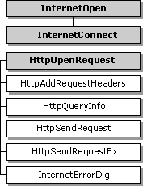

# HTTP Sessions

WinINet enables you to access resources on the World Wide Web (WWW). These resources can be accessed directly by using [**InternetOpenUrl**](/windows/desktop/api/Wininet/nf-wininet-internetopenurla) (for more information, see [Accessing URLs Directly](handling-uniform-resource-locators.md)).

Resources on the WWW are accessed by using http. The HTTP functions handle the underlying protocols, while allowing your application to access information on the WWW. As the HTTP protocol evolves, the underlying protocols are updated to maintain function behavior.

The following diagram shows the relationships of the functions that are used with the HTTP protocol. The shaded boxes represent functions that return [**HINTERNET**](appendix-a-hinternet-handles.md) handles, while the plain boxes represent functions that use the **HINTERNET** handle created by the function on which they depend.



For more information, see [HINTERNET Handles](appendix-a-hinternet-handles.md).

## Using the WinINet Functions to Access the WWW

-   [Initiating a Connection to the WWW](#initiating-a-connection-to-the-www)
-   [Opening a Request](#opening-a-request)
-   [Adding Request Headers](#adding-request-headers)
-   [Sending a Request](#sending-a-request)
-   [Posting Data to the Server](#posting-data-to-the-server)
-   [Getting Information About a Request](#getting-information-about-a-request)
-   [Downloading Resources from the WWW](#downloading-resources-from-the-www)

The following functions are used during HTTP sessions to access the WWW.


| Function                                               | Description                                                                                                                                                                                  |
|--------------------------------------------------------|----------------------------------------------------------------------------------------------------------------------------------------------------------------------------------------------|
| [**HttpAddRequestHeaders**](/windows/desktop/api/Wininet/nf-wininet-httpaddrequestheadersa) | Adds HTTP request headers to the HTTP request handle. This function requires a handle created by [**HttpOpenRequest**](/windows/desktop/api/Wininet/nf-wininet-httpopenrequesta).                                                 |
| [**HttpOpenRequest**](/windows/desktop/api/Wininet/nf-wininet-httpopenrequesta)             | Opens an HTTP request handle. This function requires a handle created by [**InternetConnect**](/windows/desktop/api/Wininet/nf-wininet-internetconnecta).                                                                         |
| [**HttpQueryInfo**](/windows/desktop/api/Wininet/nf-wininet-httpqueryinfoa)                 | Queries information about an HTTP request. This function requires a handle created by the [**HttpOpenRequest**](/windows/desktop/api/Wininet/nf-wininet-httpopenrequesta) or [**InternetOpenUrl**](/windows/desktop/api/Wininet/nf-wininet-internetopenurla) function. |
| [**HttpSendRequest**](/windows/desktop/api/Wininet/nf-wininet-httpsendrequesta)             | Sends the specified HTTP request to the HTTP server. This function requires a handle created by [**HttpOpenRequest**](/windows/desktop/api/Wininet/nf-wininet-httpopenrequesta).                                                  |
| [**InternetErrorDlg**](/windows/desktop/api/Wininet/nf-wininet-interneterrordlg)           | Displays predefined dialog boxes for common Internet error conditions. This function requires the handle used in the call to [**HttpSendRequest**](/windows/desktop/api/Wininet/nf-wininet-httpsendrequesta).                     |


 

### Initiating a Connection to the WWW

To start a connection to the WWW, the application must call the [**InternetConnect**](/windows/desktop/api/Wininet/nf-wininet-internetconnecta) function on the root [**HINTERNET**](appendix-a-hinternet-handles.md) returned by [**InternetOpen**](/windows/desktop/api/Wininet/nf-wininet-internetopena). [**InternetConnect**](/windows/desktop/api/Wininet/nf-wininet-internetconnecta) must establish an HTTP session by declaring the INTERNET\_SERVICE\_HTTP service type. For more information on using [**InternetConnect**](/windows/desktop/api/Wininet/nf-wininet-internetconnecta), see [Using InternetConnect](enabling-internet-functionality.md).

### Opening a Request

The [**HttpOpenRequest**](/windows/desktop/api/Wininet/nf-wininet-httpopenrequesta) function opens an HTTP request and returns an [**HINTERNET**](appendix-a-hinternet-handles.md) handle that can be used by the other HTTP functions. Unlike the other open functions (such as [**FtpOpenFile**](/windows/desktop/api/Wininet/nf-wininet-ftpopenfilea) and [**InternetOpenUrl**](/windows/desktop/api/Wininet/nf-wininet-internetopenurla)), [**HttpOpenRequest**](/windows/desktop/api/Wininet/nf-wininet-httpopenrequesta) does not send the request to the Internet when called. The [**HttpSendRequest**](/windows/desktop/api/Wininet/nf-wininet-httpsendrequesta) function sends the request and establishes a connection over the network.

[**HttpOpenRequest**](/windows/desktop/api/Wininet/nf-wininet-httpopenrequesta) takes an HTTP session handle created by [**InternetConnect**](/windows/desktop/api/Wininet/nf-wininet-internetconnecta) and an HTTP verb, object name, version string, referrer, accept types, flags, and context value.

The HTTP verb is a string to be used in the request. Common HTTP verbs used in requests include GET, PUT, and POST. If this value is set to **NULL**, [**HttpOpenRequest**](/windows/desktop/api/Wininet/nf-wininet-httpopenrequesta) uses the default value GET.

The object name is a string that contains the name of the specified HTTP verb's target object. This is generally a file name, an executable module, or a search specifier. If the object name supplied is an empty string, [**HttpOpenRequest**](/windows/desktop/api/Wininet/nf-wininet-httpopenrequesta) looks for the default page.

The version string should contain the HTTP version. If this parameter is **NULL**, the function uses ""HTTP/1.1"".

The referrer specifies the address of the document from which the object name was obtained. If this parameter is **NULL**, no referrer is specified.

The **null**-terminated string that contains the accept types indicates the content types accepted by the application. Setting this parameter to **NULL** indicates that no content types are accepted by the application. If an empty string is supplied, the application indicates it accepts only documents of type ""text/\*"". The value ""text/\*"" indicates text-only documents—not pictures or other binary files.

The flag values control caching, cookies, and security issues. For Microsoft Network (MSN), NTLM, and other types of authentication, set the [INTERNET\_FLAG\_KEEP\_CONNECTION](api-flags.md) flag.

If the [INTERNET\_FLAG\_ASYNC](api-flags.md) flag was set in the call to [**InternetOpen**](/windows/desktop/api/Wininet/nf-wininet-internetopena), a nonzero context value should be set for proper asynchronous operation.

The following example is a sample call to [**HttpOpenRequest**](/windows/desktop/api/Wininet/nf-wininet-httpopenrequesta).

`hHttpRequest = HttpOpenRequest( hHttpSession, "GET", "", NULL, "", NULL, 0, 0);`

### Adding Request Headers

The [**HttpAddRequestHeaders**](/windows/desktop/api/Wininet/nf-wininet-httpaddrequestheadersa) function enables applications to add one or more request headers to the initial request. This function allows an application to append additional free-format headers to the HTTP request handle; it is intended for use by sophisticated applications that require precise control over the request sent to the HTTP server.

[**HttpAddRequestHeaders**](/windows/desktop/api/Wininet/nf-wininet-httpaddrequestheadersa) needs an HTTP request handle created by [**HttpOpenRequest**](/windows/desktop/api/Wininet/nf-wininet-httpopenrequesta), a string that contains the headers, the length of the headers, and modifiers.

### Sending a Request

[**HttpSendRequest**](/windows/desktop/api/Wininet/nf-wininet-httpsendrequesta) establishes a connection to the Internet and sends the request to the specified site. This function requires an [**HINTERNET**](appendix-a-hinternet-handles.md) handle created by [**HttpOpenRequest**](/windows/desktop/api/Wininet/nf-wininet-httpopenrequesta). [**HttpSendRequest**](/windows/desktop/api/Wininet/nf-wininet-httpsendrequesta) can also send additional headers or optional information. The optional information is generally used for operations that write information to the server, such as PUT and POST.

After [**HttpSendRequest**](/windows/desktop/api/Wininet/nf-wininet-httpsendrequesta) sends the request, the application can use the [**InternetReadFile**](/windows/desktop/api/Wininet/nf-wininet-internetreadfile), [**InternetQueryDataAvailable**](/windows/desktop/api/Wininet/nf-wininet-internetquerydataavailable), and [**InternetSetFilePointer**](/windows/desktop/api/Wininet/nf-wininet-internetsetfilepointer) functions on the [**HINTERNET**](appendix-a-hinternet-handles.md) handle created by [**HttpOpenRequest**](/windows/desktop/api/Wininet/nf-wininet-httpopenrequesta) to download the server's resources.

### Posting Data to the Server

To post data to a server, the HTTP verb in the call to [**HttpOpenRequest**](/windows/desktop/api/Wininet/nf-wininet-httpopenrequesta) must be either POST or PUT. The address of the buffer that contains the POST data should then be passed to the *lpOptional* parameter in [**HttpSendRequest**](/windows/desktop/api/Wininet/nf-wininet-httpsendrequesta). The *dwOptionalLength* parameter should be set to the size of the data.

You can also use the [**InternetWriteFile**](/windows/desktop/api/Wininet/nf-wininet-internetwritefile) function to post data on an [**HINTERNET**](appendix-a-hinternet-handles.md) handle sent using [**HttpSendRequestEx**](/windows/desktop/api/Wininet/nf-wininet-httpsendrequestexa).

### Getting Information About a Request

[**HttpQueryInfo**](/windows/desktop/api/Wininet/nf-wininet-httpqueryinfoa) allows an application to retrieve information about an HTTP request. The function requires an [**HINTERNET**](appendix-a-hinternet-handles.md) handle created by [**HttpOpenRequest**](/windows/desktop/api/Wininet/nf-wininet-httpopenrequesta) or [**InternetOpenUrl**](/windows/desktop/api/Wininet/nf-wininet-internetopenurla), an information level value, and a buffer length. [**HttpQueryInfo**](/windows/desktop/api/Wininet/nf-wininet-httpqueryinfoa) also accepts a buffer that stores the information and a zero-based header index that enumerates multiple headers with the same name.

### Downloading Resources from the WWW

After opening a request with [**HttpOpenRequest**](/windows/desktop/api/Wininet/nf-wininet-httpopenrequesta) and sending it to the server with [**HttpSendRequest**](/windows/desktop/api/Wininet/nf-wininet-httpsendrequesta), the application can use the [**InternetReadFile**](/windows/desktop/api/Wininet/nf-wininet-internetreadfile), [**InternetQueryDataAvailable**](/windows/desktop/api/Wininet/nf-wininet-internetquerydataavailable), and [**InternetSetFilePointer**](/windows/desktop/api/Wininet/nf-wininet-internetsetfilepointer) functions to download the resource from the HTTP server.

The following example downloads a resource. The function accepts the handle to the current window, the identification number of an edit box, and an [**HINTERNET**](appendix-a-hinternet-handles.md) handle created by [**HttpOpenRequest**](/windows/desktop/api/Wininet/nf-wininet-httpopenrequesta) and sent by [**HttpSendRequest**](/windows/desktop/api/Wininet/nf-wininet-httpsendrequesta). It uses [**InternetQueryDataAvailable**](/windows/desktop/api/Wininet/nf-wininet-internetquerydataavailable) to determine the size of the resource and then downloads it using [**InternetReadFile**](/windows/desktop/api/Wininet/nf-wininet-internetreadfile). The contents are then displayed in the edit box.


```C++
int WINAPI Dumper(HWND hX, int intCtrlID, HINTERNET hResource)
{
    LPTSTR lpszData;    // buffer for the data
    DWORD  dwSize;       // size of the data available
    DWORD  dwDownloaded; // size of the downloaded data
    DWORD  dwSizeSum=0;  // size of the data in the textbox
    LPTSTR lpszHolding;  // buffer to merge the textbox data and buffer

    // Set the cursor to an hourglass.
    SetCursor(LoadCursor(NULL,IDC_WAIT));

    // This loop handles reading the data.
    do
    {
        // The call to InternetQueryDataAvailable determines the
        // amount of data available to download.
        if (!InternetQueryDataAvailable(hResource,&dwSize,0,0))
        {
            printf("InternetQueryDataAvailable failed (%d)\n", GetLastError());
            SetCursor(LoadCursor(NULL,IDC_ARROW));
            return FALSE;
        }
        else
        {
            // Allocate a buffer of the size returned by
            // InternetQueryDataAvailable.
            lpszData = new TCHAR[dwSize+1];

            // Read the data from the HINTERNET handle.
            if(!InternetReadFile(hResource,
                                 (LPVOID)lpszData,
                                 dwSize,
                                 &dwDownloaded))
            {
                printf("InternetReadFile failed (%d)\n", GetLastError());
                delete[] lpszData;
                break;
            }
            else
            {
                // Add a null terminator to the end of the data buffer
                lpszData[dwDownloaded]='\0';

                // Allocate the holding buffer.
                lpszHolding = new TCHAR[dwSizeSum + dwDownloaded + 1];

                // Check if there has been any data written
                // to the textbox.
                if (dwSizeSum != 0)
                {
                    // Retrieve the data stored in the textbox if any
                    GetDlgItemText(hX,intCtrlID,
                                   (LPTSTR)lpszHolding,
                                   dwSizeSum);

                    // Add a null terminator at the end of the
                    // textbox data.
                    lpszHolding[dwSizeSum]='\0';
                }
                else
                {
                    // Make the holding buffer an empty string.
                    lpszHolding[0]='\0';
                }

                size_t cchDest = dwSizeSum + dwDownloaded + dwDownloaded + 1;
                LPTSTR* ppszDestEnd = 0;
                size_t* pcchRemaining = 0;

                // Add the new data to the holding buffer
                HRESULT hr = StringCchCatEx(lpszHolding,
                                            cchDest,
                                            lpszData,
                                            ppszDestEnd,
                                            pcchRemaining,
                                            STRSAFE_NO_TRUNCATION);

                if(SUCCEEDED(hr))
                {
                    // Write the holding buffer to the textbox.
                    SetDlgItemText(hX,intCtrlID,(LPTSTR)lpszHolding);

                    // Delete the two buffers.
                    delete[] lpszHolding;
                    delete[] lpszData;

                    // Add the size of the downloaded data to the
                    // textbox data size.
                    dwSizeSum = dwSizeSum + dwDownloaded + 1;

                    // Check the size of the remaining data.
                    // If it is zero, break.
                    if (dwDownloaded == 0)
                        break;
                    else
                    {
                    //  TODO: Insert error handling code here.
                    }
                }
            }
        }
    }
    while(TRUE);

    // Close the HINTERNET handle.
    InternetCloseHandle(hResource);

    // Set the cursor back to an arrow.
    SetCursor(LoadCursor(NULL,IDC_ARROW));

    return TRUE;
}
```


> [!Note]  
> WinINet does not support server implementations. In addition, it should not be used from a service. For server implementations or services use [Microsoft Windows HTTP Services (WinHTTP)](/windows/desktop/WinHttp/winhttp-start-page).

 

 

 