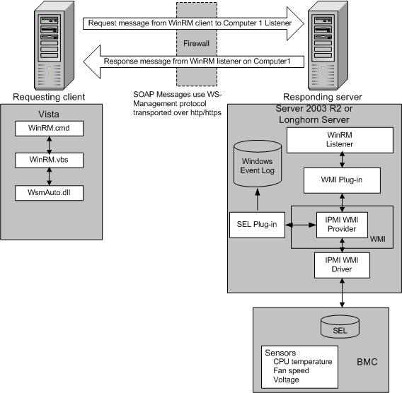

# Windows Remote Management Architecture

The Windows Remote Management architecture consists of components on the client and server computers. The following illustration shows the components on both computers, how the components interact with other components, and the protocol that is used to communicate between the computers.

## Requesting Client

The following WinRM components reside on the computer that is running the script that requests data.

-   WinRM application

    This is the script or **Winrm** command-line tool that uses the WinRM scripting API to make calls to request data or to execute methods. For more information, see the [WinRM Scripting API](winrm-scripting-api.md).

-   WSMAuto.dll

    The Automation layer that provides scripting support.

-   WsmCL.dll

    C API layer within the operating system.

-   HTTP API

    WinRM requires support for HTTP and HTTPS transport.

## Responding Server

The following WinRM components reside on the responding computer.

-   HTTP API

    WinRM requires support for HTTP and HTTPS transport.

-   WSMAuto.dll

    The Automation layer that provides scripting support.

-   WsmCL.dll

    C API layer within the operating system.

-   WsmSvc.dll

    WinRM [*listener*](windows-remote-management-glossary.md) service.

-   WsmProv.dll

    Provider subsystem.

-   WsmRes.dll

    Resource file.

-   WsmWmiPl.dll

    [*WMI plug-in*](windows-remote-management-glossary.md). This allows you to obtain WMI data through WinRM.

-   Intelligent Platform Management Interface (IPMI) driver and WMI IPMI provider

    These components supply any hardware data that is requested using the IPMI classes. For more information, see [IPMI Provider](/previous-versions/windows/desktop/ipmiprv/ipmi-provider). BMC hardware must have been detected by the SMBIOS or the device created manually by loading the driver. For more information, see [Installation and Configuration for Windows Remote Management](installation-and-configuration-for-windows-remote-management.md).

## Related topics

<dl> <dt>

[About Windows Remote Management](about-windows-remote-management.md)
</dt> </dl>

 

 