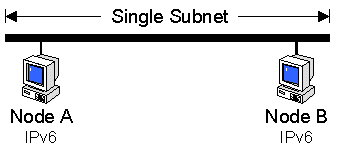

# Configuration 1: Single Subnet with Link-local Addresses

The first configuration requires no additional configuration beyond installing the Microsoft IPv6 Technology Preview protocol. This configuration consists of at least two nodes on the same subnet. In IPv6 terminology, the two nodes are on the same link with no intermediate routers.

The following illustration shows the configuration of two nodes on a single subnet using link-local addresses.



By default, IPv6 configures link-local IP addresses for each interface corresponding to installed Ethernet network adapters. Link-local addresses have the prefix fe80::/64. The last 64 bits of the IPv6 address is known as the interface identifier and is derived from the 48-bit MAC address of the network adapter.

To create the IPv6 interface identifier from the 48-bit (6-byte) Ethernet MAC address:

-   The hex digits 0xff-fe are inserted between the third and fourth byte of the MAC address.
-   The Universal/Local bit, the second low-order bit of the first byte of the MAC address, is complemented. If it is a 1, it is turned to 0, and if it is a 0, it is turned to 1.

For example, for the MAC address 00-60-08-52-f9-d8:

-   The hex digits 0xff-fe are inserted between 0x08 (the third byte) and 0x52 (the fourth byte) of the MAC address, forming the 64-bit address 00-60-08-ff-fe-52-f9-d8.
-   The Universal/Local bit, the second low-order bit of 0x00 (the first byte) of the MAC address is complemented. The second low-order bit of 0x00 is 0 which, when complemented, becomes 1. The result is that for the first byte, 0x00 becomes 0x02.

Therefore, the IPv6 interface identifier corresponding to the Ethernet MAC address of 00-60-08-52-f9-d8 is 02-60-08-ff-fe-52-f9-d8.

The link-local address of a node is the combination of the prefix fe80::/64 and the 64-bit interface identifier expressed in IPv6 colon-hexadecimal notation. Therefore, the link-local address of this example node with the prefix fe80::/64 and the interface identifier 02-60-08-ff-fe-52-f9-d8 is fe80::260:8ff:fe52:f9d8.

You can view your link local address by using ipv6 if, as demonstrated in the following example:

**ipv6 if**

``` syntax
Interface 4 (site 1): Local Area Connection
  uses Neighbor Discovery
  link-level address: 00-10-5a-aa-20-a2
    preferred address fe80::210:5aff:feaa:20a2, infinite/infinite
    multicast address ff02::1, 1 refs, not reportable
    multicast address ff02::1:ffaa:20a2, 1 refs, last reporter
  link MTU 1500 (true link MTU 1500)
  current hop limit 128
  reachable time 43500ms (base 30000ms)
  retransmission interval 1000ms
  DAD transmits 1
Interface 3 (site 1): 6-over-4 Virtual Interface
  uses Neighbor Discovery
  link-level address: 10.0.0.2
    preferred address fe80::a00:2, infinite/infinite
    multicast address ff02::1, 1 refs, not reportable
    multicast address ff02::1:ff00:2, 1 refs, last reporter
  link MTU 1280 (true link MTU 65515)
  current hop limit 128
  reachable time 34000ms (base 30000ms)
  retransmission interval 1000ms
  DAD transmits 1
Interface 2 (site 0): Tunnel Pseudo-Interface
  does not use Neighbor Discovery
  link-level address: 0.0.0.0
    preferred address ::10.0.0.2, infinite/infinite
  link MTU 1280 (true link MTU 65515)
  current hop limit 128
  reachable time 0ms (base 0ms)
  retransmission interval 0ms
  DAD transmits 0
Interface 1 (site 0): Loopback Pseudo-Interface
  does not use Neighbor Discovery
  link-level address:
    preferred address ::1, infinite/infinite
  link MTU 1500 (true link MTU 1500)
  current hop limit 1
  reachable time 0ms (base 0ms)
  retransmission interval 0ms
  DAD transmits 0
```

Interface 4 is an interface corresponding to an installed Ethernet adapter with a link-local address of fe80::210:5aff:feaa:20a2.

For more information on IPv6 addressing and an overview of IPv6 concepts, see the Introduction to IPv6 white paper.

## Testing Connectivity Between Two Link-local Hosts

You can do a simple ping (an exchange of ICMPv6 Echo Request and Echo Reply messages) using IPv6 between two link-local hosts.

**To ping using IPv6 between two link-local hosts**

1.  Install the Microsoft IPv6 Technology Preview for Windows on two Windows hosts (Host A and Host B) that are on the same link (subnet).
2.  Use ipv6 if on Host A to obtain the link-local address for the Ethernet interface.

    Example: The link-local address of Host A is fe80::210:5aff:feaa:20a2.

3.  Use ipv6 if on Host B to obtain the link-local address for the Ethernet interface.

    Example: The link-local address of Host B is fe80::260:97ff:fe02:6ea5.

4.  From Host A, ping Host B using Ping6.exe.

    Example: ping6 fe80::260:97ff:fe02:6ea5

To specify the source address from which the Echo Request messages are sent, you can also use the Ping6.exe -s option. For example, to send Echo Requests to Host B from the IPv6 address of fe80::210:5aff:feaa:20a2, use the following command:

**ping6 -s fe80::210:5aff:feaa:20a2%4 fe80::260:97ff:fe02:6ea5**

When pinging a link-local or site-local address, it is recommended to specify the scope-ID to make the destination address unambiguous. The notation to specify the scope-ID is address%scope-ID. For link-local addresses, the scope-ID is equal to the interface number as displayed in the ipv6 if command. For site-local addresses, the scope-ID is equal to the site number as displayed in the ipv6 if command. For example, to send Echo Request messages to Host B using scope-ID 4, use the following command:

**ping6 fe80::260:97ff:fe02:6ea5%4**

## Related topics

<dl> <dt>

[Recommended Configurations for IPv6](recommended-configurations-2.md)
</dt> </dl>

 

 


