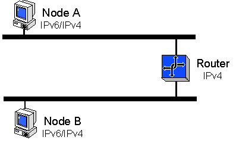

# Configuration 2: IPv6 Traffic Between Nodes on Different Subnets of an IPv4 Internetwork (6to4)

6to4 is a method for connecting IPv6 hosts or sites over the existing IPv4 Internet infrastructure. It uses a unique address prefix to give isolated IPv6 sites their own IPv6 address space. 6to4 is like a "pseudo-ISP" providing IPv6 connectivity. You can use 6to4 to communicate directly with other 6to4 sites. 6to4 does not require the use of IPv6 routers and its IPv6 traffic is encapsulated with an IPv4 header.

The following illustration shows the configuration of two nodes on separate subnets using 6to4 to communicate across an IPv4 router.



The main requirement for using 6to4 is one globally routable IPv4 address for your site. Suppose that your site consists of a collection of IPv6 computers that you manage (some running the Microsoft IPv6 protocol and some running other IPv6 implementations). Assume also that all IPv6 computers are directly connected using Ethernet or 6-over-4. The globally routable IPv4 address must be assigned to one of your computers running the Microsoft IPv6 protocol. This computer will be your 6to4 gateway.

If you have an IPv4 address that is part of the private address space (10.0.0.0/8, 172.16.0.0/12, or 192.168.0.0/16) or the Automatic Private IP Addressing (APIPA) address space of 169.254.0.0/16 used by Windows 2000, it is not globally routable. Otherwise, it is probably a public IP address and is globally routable. See the [Debugging 6to4 Configuration](#debugging-6to4-configuration) topic in this document for more help in determining whether your ISP connection supports 6to4.

## The 6to4cfg.exe Tool

The 6to4cfg.exe tool automates 6to4 configuration, automatically discovering your globally routable IPv4 address and creating a 6to4 prefix. It either performs the configuration directly, or it can write a configuration script that you can inspect and run later.

The basic 6to4cfg.exe command syntax is as follows.

``` syntax
6to4cfg [-r] [-s] [-u] [-R relay] [-b] [-S address] [filename]
```

<dl> <dt>

<span id="_filename_"></span><span id="_FILENAME_"></span>\[*filename*\]
</dt> <dd>

Writes the configuration script to a file, if you specify a file name. The configuration script uses Ipv6.exe.

You can specify con for the file name to write the configuration script to console output, which is useful for seeing what 6to4cfg.exe will do in a test scenario.

If you do not specify a file name, 6to4cfg.exe directly updates the IPv6 configuration on your computer.

</dd> <dt>

<span id="-r"></span><span id="-R"></span>-r
</dt> <dd>

Becomes a 6to4 gateway router for your local network, enabling routing on all of your interfaces and assigned subnet prefixes.

</dd> <dt>

<span id="-s"></span><span id="-S"></span>-s
</dt> <dd>

Enables site-local addressing in your 6to4 site. This command is only useful when used in conjunction with -r.

</dd> <dt>

<span id="-u"></span><span id="-U"></span>-u
</dt> <dd>

Specifies that the 6to4 configuration be reversed. Therefore 6to4cfg -u reverses the effect of 6to4cfg and 6to4cfg -r -u reverses the effect of 6to4cfg -r, and so on.

</dd> <dt>

<span id="-R_relay"></span><span id="-r_relay"></span><span id="-R_RELAY"></span>-R *relay*
</dt> <dd>

Specifies the name or IPv4 address of a 6to4 relay router. The default name is 6to4.ipv6.microsoft.com, the 6to4 relay router on the Internet.

</dd> <dt>

<span id="-b"></span><span id="-B"></span>-b
</dt> <dd>

Specifies that 6to4cfg.exe picks the "best" relay address instead of the first.

</dd> <dt>

<span id="-S_address"></span><span id="-s_address"></span><span id="-S_ADDRESS"></span>-S *address*
</dt> <dd>

Specifies the local IPv4 address for the 6to4 prefix.

</dd> </dl>

## Manual 6to4 Configuration

In this example the address of the 6to4 gateway is 172.31.42.239. You need your own globally routable IPv4 address to use 6to4.

> [!Note]  
> The IP address 172.31.42.239 is used for example purposes only. This is a private address and is not globally routable on the Internet.

 

The 32-bit globally routable IPv4 address is combined with the 16-bit prefix 2002::/16 to form a 48-bit IPv6 address prefix for your site. In this example, the 6to4 site prefix is 2002:ac1f:2aef::/48. Note that ac1f:2aef is the hexadecimal encoding of 172.31.42.239 (of course, you will use a different prefix based on your own globally routable IPv4 address). Using the 6to4 site prefix, you can assign addresses and subnet prefixes inside your site.

This example assumes that you use subnet 0 for manually configuring a 6to4 address on your 6to4 gateway computer and that you use subnet 1 for automatically configuring addresses on your Ethernet network segment. However, other choices are possible.

1.  Use Ipv6.exe to enable 6to4 on your 6to4 gateway computer:

    **ipv6 rtu 2002::/16 2**

    The **ipv6 rtu** command performs a routing table update. It can be used to add, remove, or update a route. In this case it is enabling 6to4.

    The 2002::/16 argument is the prefix of the route, specifying the unique 6to4 prefix.

    The 2 argument specifies the on-link interface for this prefix. Interface \#2 is the "pseudo-interface" used for configured tunnels, automatic tunneling, and 6to4. When an IPv6 destination address matches the 2002::/16 prefix, the 32 bits that follow the prefix in the destination address are extracted to form an IPv4 destination address. The packet is encapsulated with an IPv4 header and sent to the IPv4 destination address.

2.  Configure a 6to4 address on your 6to4 gateway computer:

    **ipv6 adu 2/2002:ac1f:2aef::ac1f:2aef**

    The **ipv6 adu** command performs an address update. It can be used to add, remove, or update an address on an interface. In this instance, it is configuring the computer's 6to4 address.

    The 2/2002:ac1f:2aef::ac1f:2aef argument specifies both the interface and the address. It requires configuring address 2002:ac1f:2aef::ac1f:2aef on interface \#2. The address is created using the site prefix 2002:ac1f:2aef::/48, subnet 0 to give a subnet prefix 2002:ac1f:2aef::/64, and a 64-bit interface identifier. The convention demonstrated uses the computer's IPv4 address for the interface identifier for addresses assigned to interface \#2. For your use, ac1f:2aef should be replaced by the hexadecimal encoding of your own globally routable IPv4 address.

The two preceding commands are sufficient to allow communication with other 6to4 sites. For example, you can try pinging the Microsoft 6to4 site:

**ping6 2002:836b:9820::836b:9820**

To enable communication with the 6bone, you must create a default configured tunnel to a 6to4 relay. You can use the Microsoft 6to4 relay router, 131.107.152.32:

**ipv6 rtu ::/0 2/::131.107.152.32 pub life 1800**

The **ipv6 rtu** command performs a routing table update, establishing, in this instance, a default route to the 6to4 relay.

The ::/0 argument is the route prefix. The zero-length prefix indicates that it is a default route.

The 2/::131.107.152.32 argument specifies the next-hop neighbor for this prefix. It requires that packets matching the prefix are forwarded to address ::131.107.152.32 using interface \#2. Forwarding a packet to ::131.107.152.32 on interface \#2 causes it to be encapsulated with a v4 header and sent to 131.107.152.32.

The pub argument makes this a published route. Because this is only relevant for routers, it has no effect until routing is enabled. Similarly, the 30-minute lifetime pertains only if routing is enabled.

You should be able to access 6bone sites as well as 6to4 sites. You can use the following command to test this:

**ping6 3ffe:1cff:0:f5::1**

The final step is to enable routing on your 6to4 gateway. This example assumes that interface \#3 on your gateway computer is an Ethernet interface and interface \#4 is 6-over-4. Your computer might number its interfaces differently. The following two commands assign subnet prefixes to the two links. The subnet prefixes are derived from the site's 6to4 prefix 2002:ac1f:2aef::/48:

**ipv6 rtu 2002:ac1f:2aef:1::/64 3 pub life 1800**

**ipv6 rtu 2002:ac1f:2aef:2::/64 4 pub life 1800**

The **ipv6 rtu** command specifies that the prefix 2002:ac1f:2aef:1::/64 is on-link to interface \#3. It is configuring the first subnet prefix on the Ethernet interface. The route is published with a lifetime of 30 minutes.

Similarly, the 2002:ac1f:2aef:2::/64 prefix is configured on the 6-over-4 interface.

The next three commands enable the 6to4 gateway computer to function as a router:

**ipv6 ifc 2 forw**

**ipv6 ifc 3 forw adv**

**ipv6 ifc 4 forw adv**

The **ipv6 ifc** command controls attributes of an interface. A router forwards packets and sends router advertisements. In the Microsoft IPv6 implementation, these per-interface attributes are controlled separately.

Interface \#2 is not needed for advertising because it is a pseudo-interface.

If your computer has additional interfaces, they should also be configured to be forwarding and advertising.

After running these commands, the Microsoft IPv6 protocol will automatically configure addresses on interfaces \#3 and \#4 using the respective subnet prefixes and the two interfaces will start sending router advertisements at approximately 3 to 10 minute intervals.

Hosts receiving these router advertisements will automatically configure themselves with a default route and a 6to4 address derived from the subnet prefix of their link. They will have communication to other 6to4 sites and the 6bone through the gateway computer.

## Debugging 6to4 Configuration

**To debug your 6to4 configuration**

1.  Check your IPv4 connectivity to the 6to4 relay router:

    **ping 6to4.ipv6.microsoft.com**

    If this fails, then you do not have global Internet connectivity.

2.  Check IPv6 encapsulation by using automatic tunneling:

    **ping6 ::131.107.152.32**

    If this fails, then you might have a firewall or network address translator (NAT) between your computer and the Internet. If this is successful, then your Internet connection can support 6to4.

3.  Check the display of the ipv6 rt command. You should see a 2002::/16 -> 2 route. Check the display of the ipv6 if 2 command. You should see a preferred address with a 2002::/16 prefix.

> [!Note]  
> The IPv4 address of the Microsoft 6to4 relay router of 131.107.152.32 is subject to change. If Step 2 above does not work, check the output of the ping command in step 1 to verify the IPv4 address of the Microsoft 6to4 relay router.

 

## Related topics

<dl> <dt>

[Recommended Configurations for IPv6](recommended-configurations-2.md)
</dt> <dt>

[Single subnet with link-local addresses](configuration-1-single-subnet-with-link-local-addresses-2.md)
</dt> <dt>

[Using IPsec between two local link hosts](configuration-4-using-ipsec-between-two-local-link-hosts-2.md)
</dt> </dl>

 

 


