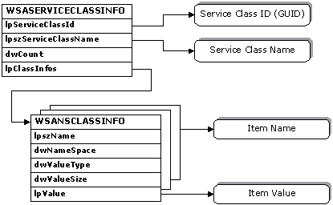

# Name Resolution Data Structures

There are several important data structures that are used extensively throughout the name resolution functions.

## Query-Related Data Structures

The [**WSAQUERYSET**](/windows/desktop/api/Winsock2/ns-winsock2-wsaquerysetw) structure is used to form queries for [**WSALookupServiceBegin**](/windows/desktop/api/Winsock2/nf-winsock2-wsalookupservicebegina), and used to deliver query results for [**WSALookupServiceNext**](/windows/desktop/api/Winsock2/nf-winsock2-wsalookupservicenexta). It is a complex structure since it contains pointers to several other structures, some of which reference still other structures. The relationship between the [**WSAQUERYSET**](/windows/desktop/api/Winsock2/ns-winsock2-wsaquerysetw) structure and the structures it references is illustrated as follows.

Within the [**WSAQUERYSET**](/windows/desktop/api/Winsock2/ns-winsock2-wsaquerysetw) structure, most of the member are self explanatory, but some deserve additional explanation. The **dwSize** member must always be filled in with sizeof(**WSAQUERYSET**), as this is used by namespace providers to detect and adapt to different versions of the **WSAQUERYSET** structure that may appear over time.

The **dwOutputFlags** member is used by a namespace provider to provide additional information about query results. For details, see the [**WSALookupServiceNext**](/windows/desktop/api/Winsock2/nf-winsock2-wsalookupservicenexta) function.

The [**WSAECOMPARATOR**](/windows/desktop/api/Winsock2/ne-winsock2-wsaecomparator) structure referenced by the **lpversion** member is used for both query constraint and results. For queries, the **dwVersion** member indicates the desired version of the service. The **ecHow** member is an enumerated type which specifies how the comparison can be made. The choices are COMP\_EQUALS which requires that an exact match in version occurs, or COMP\_NOTLESS which specifies that the service's version number be no less than the value of the **dwVersion** member.

The interpretation of **dwNameSpace** and **lpNSProviderId** depends upon how the structure is being used and is described further in the individual function descriptions that utilize this structure.

The **lpszContext** member applies to hierarchical namespaces, and specifies the starting point of a query or the location within the hierarchy where the service resides. The general rules are:

-   A value of **NULL**, blank ("") starts the search at the default context.
-   A value of "\\" starts the search at the top of the namespace.
-   Any other value starts the search at the designated point.

Providers that do not support containment may return an error if anything other than "" or "\\" is specified. Providers that support limited containment, such as groups, should accept "", '\\", or a designated point. Contexts are namespace specific. If the **dwNameSpace** member is NS\_ALL, then only "" or "\\" should be passed as the context since these are recognized by all namespaces.

The **lpszQueryString** member is used to supply additional, namespace-specific query information such as a string describing a well-known service and transport protocol name, as in "FTP/TCP".

The [**AFPROTOCOLS**](/windows/desktop/api/Winsock2/ns-winsock2-afprotocols) structure referenced by the **lpafpProtocols** member is used for query purposes only, and supplies a list of protocols to constrain the query. These protocols are represented as (address family, protocol) pairs, since protocol values only have meaning within the context of an address family.

The array of the [**CSADDR\_INFO**](/windows/win32/api/ws2def/ns-ws2def-csaddr_info) structure referenced by the **lpcsaBuffer** member contain all of the information needed for either a service to use in establishing a listen, or for a client to use in establishing a connection to the service. The **LocalAddr** and **RemoteAddr** members both directly contain a [**SOCKET\_ADDRESS**](/windows/desktop/api/Ws2def/ns-ws2def-socket_address) structure.

A service would create a socket by calling the [**socket**](/windows/desktop/api/Winsock2/nf-winsock2-socket) or [**WSASocket**](/windows/desktop/api/Winsock2/nf-winsock2-wsasocketa) function using the tuple of *LocalAddr.lpSockaddr->sa\_family*, *iSocketType*, and *iProtocol* as parameters. A service would bind the socket to a local address by calling the [**bind**](/windows/desktop/api/winsock/nf-winsock-bind) function using *LocalAddr.lpSockaddr* and *LocalAddr.lpSockaddrLength* as parameters.

A client creates its socket by calling the [**socket**](/windows/desktop/api/Winsock2/nf-winsock2-socket) or [**WSASocket**](/windows/desktop/api/Winsock2/nf-winsock2-wsasocketa) function using the tuple of *LocalAddr.lpSockaddr->sa\_family*, *iSocketType*, and *iProtocol* as parameters. A client uses the combination of *RemoteAddr.lpSockaddr* and *RemoteAddr.lpSockaddrLength* as parameters when making a remote connection using the [**connect**](/windows/desktop/api/Winsock2/nf-winsock2-connect), [**ConnectEx**](/windows/desktop/api/Mswsock/nc-mswsock-lpfn_connectex), or [**WSAConnect**](/windows/desktop/api/Winsock2/nf-winsock2-wsaconnect) function.

## Service Class Data Structures

When a new service class is installed, a [**WSASERVICECLASSINFO**](/windows/desktop/api/Winsock2/ns-winsock2-wsaserviceclassinfow) structure must be prepared and supplied. This structure also consists of substructures that contain a series of members that apply to specific namespaces. A class info data structure is as follows:

For each service class, there is a single [**WSASERVICECLASSINFO**](/windows/desktop/api/Winsock2/ns-winsock2-wsaserviceclassinfow) structure. Within the [**WSASERVICECLASSINFO**](/windows/desktop/api/Winsock2/ns-winsock2-wsaserviceclassinfow) structure, the service class' unique identifier is contained in the **lpServiceClassId** member, and an associated display string is referenced by the **lpServiceClassName** member. This is the string that is returned by the [**WSAGetServiceClassNameByClassId**](/windows/desktop/api/Winsock2/nf-winsock2-wsagetserviceclassnamebyclassida) function.

The **lpClassInfos** member in the [**WSASERVICECLASSINFO**](/windows/desktop/api/Winsock2/ns-winsock2-wsaserviceclassinfow) structure references an array of **WSANSCLASSINFO** structures, each of which supplies a named and typed member that applies to a specified namespace. Examples of values for the **lpszName** member include: "SapId", "TcpPort", "UdpPort", etc. These strings are generally specific to the namespace identified in the **dwNameSpace** member. Typical values for the **dwValueType** member might be REG\_DWORD, REG\_SZ, etc. The **dwValueSize** member indicates the length of the data item pointed to by **lpValue**.

The entire collection of data represented in a **WSASERVICECLASSINFO** structure is provided to each namespace provider when the [**WSAInstallServiceClass**](/windows/desktop/api/Winsock2/nf-winsock2-wsainstallserviceclassa) function is invoked. Each individual namespace provider then sifts through the list of **WSANSCLASSINFO** structures and retains the information applicable to it.

## Related topics

<dl> <dt>

[**AFPROTOCOLS**](/windows/desktop/api/Winsock2/ns-winsock2-afprotocols)
</dt> <dt>

[**CSADDR\_INFO**](/windows/win32/api/ws2def/ns-ws2def-csaddr_info)
</dt> <dt>

[Name Resolution Model](name-resolution-model-2.md)
</dt> <dt>

[Protocol-Independent Name Resolution](protocol-independent-name-resolution-2.md)
</dt> <dt>

[Registration and Name Resolution](registration-and-name-resolution-2.md)
</dt> <dt>

[**SOCKET\_ADDRESS**](/windows/desktop/api/Ws2def/ns-ws2def-socket_address)
</dt> <dt>

[Summary of Name Resolution Functions](summary-of-name-resolution-functions-2.md)
</dt> <dt>

[**WSAECOMPARATOR**](/windows/desktop/api/Winsock2/ne-winsock2-wsaecomparator)
</dt> <dt>

[**WSAGetServiceClassNameByClassId**](/windows/desktop/api/Winsock2/nf-winsock2-wsagetserviceclassnamebyclassida)
</dt> <dt>

[**WSAInstallServiceClass**](/windows/desktop/api/Winsock2/nf-winsock2-wsainstallserviceclassa)
</dt> <dt>

[**WSALookupServiceBegin**](/windows/desktop/api/Winsock2/nf-winsock2-wsalookupservicebegina)
</dt> <dt>

[**WSAQUERYSET**](/windows/desktop/api/Winsock2/ns-winsock2-wsaquerysetw)
</dt> <dt>

[**WSASERVICECLASSINFO**](/windows/desktop/api/Winsock2/ns-winsock2-wsaserviceclassinfow)
</dt> </dl>

 

 
