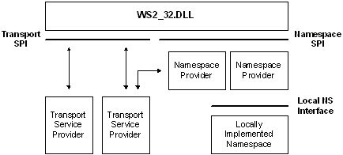

# Namespace Provider Architecture in the SPI

Programmatic interfaces used to query the various types of namespaces and to register information within a namespace, if supported, differ widely. A namespace provider is a locally-resident application that can map between the Windows Sockets namespace SPI and some existing namespace that could be implemented locally or accessed through the network. This is illustrated as follows:

> [!Note]  
> It is possible for a given namespace, for example DNS, to have more than one namespace provider installed on a given computer.

 

As mentioned above, the generic term, service, refers to the server-half of a client/server application. In Windows Sockets, a service is associated with a service class and each instance of a particular service has a service name which must be unique within the service class. Examples of service classes include FTP Server, SQL Server, XYZ Corp. Employee Info Server, and so on.

As the example attempts to illustrate, some service classes are well known while others are unique and specific to a particular vertical application. In either case, every service class is represented by both a class name and a class identifier. The class name does not necessarily need to be unique, but the class identifier must be. Globally Unique Identifiers (GUIDs) are used to represent service class IDs. For well-known services, class names, and class identifiers (GUIDs) have been preallocated, and macros are available to convert between, for example, TCP port numbers and the corresponding class identifier GUIDs. For other services, the developer chooses the class name and uses the Uuidgen.exe utility to generate a GUID for the class identifier.

The concept of a service class exists to allow a set of attributes to be established that are held in common by all instances of a particular service. This set of attributes is supplied to Windows Sockets at the time the service class is defined, and is referred to as the service class schema information. The Ws2\_32.dll in turn relays this information to all active namespace providers. When an instance of a service is installed and made available on a host computer, its service name is used to distinguish this particular instance from others that may be known to the namespace.

Be aware that the installation of a service class only needs to occur on computers where the service executes, not on all of the clients which may utilize the service. When possible, the Ws2\_32.dll will provide service class schema information to a namespace provider at the time an instance of a service is to be registered or a service query is initiated. The Ws2\_32.dll does not, of course, store this information itself, but attempts to retrieve it from a namespace provider that has indicated its ability to supply this data. Because there is no guarantee that the Ws2\_32.dll will be able to supply the service class schema, namespace providers that require this information must have a fallback mechanism to obtain it through namespace-specific means.

The Internet Domain Name System does not have a well-defined means to store service class schema information. As a result, DNS namespace providers will only be able to accommodate well-known TCP/IP services for which a service class GUID has been preallocated. In practice, this is not a serious limitation since service class GUIDs have been preallocated for the entire set of TCP and UDP ports, and macros are available to retrieve the GUID associated with any TCP or UDP port. Thus, all of the familiar services such as ftp, telnet, whois, etc. are well supported. When querying for these services, by convention the host name of the target computer is the service instance name.

Continuing with our service class example, instance names of the ftp service may be "alder.intel.com" or "rhino.microsoft.com" while an instance of the XYZ Corp. Employee Info Server might be named "XYZ Corp. Employee Info Server Version 3.5". In the first two cases, the combination of the service class GUID for ftp and the computer name (supplied as the service instance name) uniquely identify the desired service. In the third case, the host name where the service resides can be discovered at service query time, so the service instance name does not need to include a host name.

 

 

