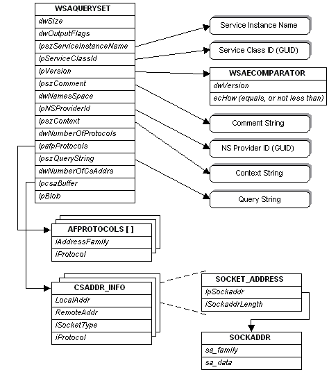

# Query-Related Data Structures in the SPI

The [**WSAQUERYSET**](/windows/desktop/api/Winsock2/ns-winsock2-wsaquerysetw) structure is used to form queries for [**NSPLookupServiceBegin**](/windows/desktop/api/Ws2spi/nc-ws2spi-lpnsplookupservicebegin), and used to deliver query results for [**NSPLookupServiceNext**](/windows/desktop/api/Ws2spi/nc-ws2spi-lpnsplookupservicenext). It is a complex structure because it contains pointers to several other structures, some of which reference still other structures. The relationship between **WSAQUERYSET** and the structures it references is illustrated as follows:

Within the [**WSAQUERYSET**](/windows/desktop/api/Winsock2/ns-winsock2-wsaquerysetw) structure, most of the members are self explanatory, but some deserve additional explanation. The **dwSize** will be filled in with sizeof( **WSAQUERYSET**), and can be used by namespace providers to detect and adapt to different versions of the **WSAQUERYSET** structure that may appear.

The **dwOutputFlags** member is used by a namespace provider to provide additional data about query results. For more information, see [**NSPLookupServiceNext**](/windows/desktop/api/Ws2spi/nc-ws2spi-lpnsplookupservicenext).

The [**WSAECOMPARATOR**](/windows/desktop/api/Winsock2/ne-winsock2-wsaecomparator) structure referenced by **lpversion** is used for both query constraint and results. For queries, the **dwVersion** member indicates the desired version of the service. The **ecHow** member is an enumerated type which specifies how the comparison will be made. The choices are COMP\_EQUALS which requires that an exact match in version occurs, or COMP\_NOTLESS which specifies that the service's version number be no less than the value of **dwVersion**.

The interpretation of **dwNameSpace** and **lpNSProviderId** depends upon how the structure is being used and is described further in the individual function descriptions that utilize this structure.

The **lpszContext** member applies to hierarchical namespaces, and specifies the starting point of a query or the location within the hierarchy where the service resides. The general rules are:

-   A value of **NULL**, blank ("") will start the search at the default context.
-   A value of "\\" starts the search at the top of the namespace.
-   Any other value starts the search at the designated point.

Providers that do not support containment may return an error if anything other than "" or "\\" is specified. Providers that support limited containment, such as groups, should accept "", '\\", or a designated point. Contexts are namespace specific. If **dwNameSpace** is NS\_ALL, then only "" or "\\" should be passed as the context because these are recognized by all namespaces.

The **lpszQueryString** member is used to supply additional, namespace-specific query information such as a string describing a well-known service and transport protocol name, as in "ftp/tcp".

The [**AFPROTOCOLS**](/windows/desktop/api/Winsock2/ns-winsock2-afprotocols) structure referenced by **lpafpProtocols** is used for query purposes only, and supplies a list of protocols to constrain the query. These protocols are represented as (address family, protocol) pairs, because protocol values only have meaning within the context of an address family.

The array of [**CSADDR\_INFO**](/windows/win32/api/ws2def/ns-ws2def-csaddr_info) structure referenced by **lpcsaBuffer** contains all of the information required for either a service to use in establishing a listen, or a client to use in establishing a connection to the service. The **LocalAddr** and **RemoteAddr** members both directly contain a [**SOCKET\_ADDRESS**](/windows/desktop/api/Ws2def/ns-ws2def-socket_address) structure. A service would create a socket using the tuple (LocalAddr.lpSockaddr->sa\_family, iSocketType, iProtocol). It would bind the socket to a local address using LocalAddr.lpSockaddr, and LocalAddr.lpSockaddrLength. The client creates its socket with the tuple (RemoteAddr.lpSockaddr->sa\_family, iSocketType, iProtocol), and uses the combination of RemoteAddr.lpSockaddr, and RemoteAddr.lpSockaddrLength when making a remote connection.

 

 
