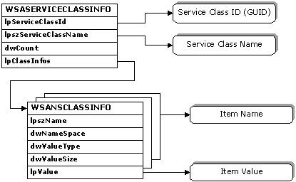

# Service Class Data Structures in the SPI

When a new service class is installed, a [**WSASERVICECLASSINFO**](/windows/win32/Winsock2/ns-winsock2-_wsaserviceclassinfow?branch=master) structure must be prepared and supplied. This structure also consists of substructures that contain a series of parameters that apply to specific namespaces.

For each service class, there is a single [**WSASERVICECLASSINFO**](/windows/win32/Winsock2/ns-winsock2-_wsaserviceclassinfow?branch=master) structure. Within the **WSASERVICECLASSINFO** structure, the service class's unique identifier is contained in **lpServiceClassId**, and an associated display string is referenced by **lpServiceClassName**.

The **lpClassInfos** member in the [**WSASERVICECLASSINFO**](/windows/win32/Winsock2/ns-winsock2-_wsaserviceclassinfow?branch=master) structure references an array of [**WSANSCLASSINFO**](/windows/win32/Winsock2/ns-winsock2-_wsansclassinfow?branch=master) structures, each of which supplies a named and typed parameter that applies to a specified namespace. Examples of values for the **lpszName** member include: SAPID, TCPPORT, UDPPORT, etc. These strings are generally specific to the namespace identified in **dwNameSpace**. Typical values for **dwValueType** might be REG\_DWORD, REG\_SZ, etc. The **dwValueSize** member indicates the length of the data item pointed to by **lpValue**.

The entire collection of data represented in a [**WSASERVICECLASSINFO**](/windows/win32/Winsock2/ns-winsock2-_wsaserviceclassinfow?branch=master) structure is provided to each namespace provider via [**NSPInstallServiceClass**](/windows/win32/Ws2spi/nc-ws2spi-lpnspinstallserviceclass?branch=master). Each individual namespace provider then sifts through the list of [**WSANSCLASSINFO**](/windows/win32/Winsock2/ns-winsock2-_wsansclassinfow?branch=master) structures and retain the information applicable to it. This architecture also envisions the future existence of a special namespace provider that would retain all of the service class schema information for all of the namespaces. The Ws2\_32.dll would query this provider to obtain the **WSASERVICECLASSINFO** data needed to supply to namespace providers when [**NSPLookupServiceBegin**](/windows/win32/Ws2spi/nc-ws2spi-lpnsplookupservicebegin?branch=master) is invoked to initiate a query, and when [**NSPSetService**](/windows/win32/Ws2spi/nc-ws2spi-lpnspsetservice?branch=master) is invoked to register a service. Namespace provider should not rely on this capability for the time being, and should instead have a provider-specific means to obtain any needed service class schema information. In the absence of a provider that stores all service class schema for all namespaces, the Ws2\_32.dll will use [**NSPGetServiceClassInfo**](/windows/win32/Ws2spi/nc-ws2spi-lpnspgetserviceclassinfo?branch=master) to obtain such information from each individual namespace provider.

 

 

