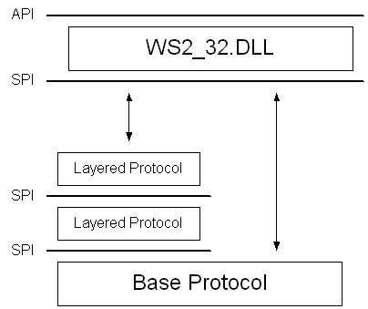

# Transport Service Providers

A given transport service provider supports one or more protocols. For example, a TCP/IP provider would supply, as a minimum, the TCP and UDP protocols, while an IPX/SPX provider might supply IPX, SPX, and SPX II. Each protocol supported by a particular provider is described by a [**WSAPROTOCOL\_INFO**](/windows/win32/api/winsock2/ns-winsock2-wsaprotocol_infoa) structure, and the total set of such structures can be thought of as the catalog of installed protocols. Applications can retrieve the contents of this catalog (for more information, see [**WSAEnumProtocols**](/windows/desktop/api/Winsock2/nf-winsock2-wsaenumprotocolsa), [**WSCEnumProtocols**](/windows/desktop/api/Ws2spi/nf-ws2spi-wscenumprotocols), and [**WSCEnumProtocols32**](/windows/desktop/api/Ws2spi/nf-ws2spi-wscenumprotocols32)), and by examining the available **WSAPROTOCOL\_INFO** structures, discover the communications attributes associated with each protocol.

## Layered Protocols and Protocol Chains in the SPI

Windows Sockets 2 accommodates the concept of a layered protocol. A layered protocol is one that implements only higher level communications functions, while relying on an underlying transport stack for the actual exchange of data with a remote endpoint. An example of such a layered protocol would be a security layer that adds protocol to the connection establishment process in order to perform authentication and to establish a mutually agreed upon encryption scheme. Such a security protocol would generally require the services of an underlying reliable transport protocol such as TCP or SPX. The term base protocol refers to a protocol such as TCP or SPX which is fully capable of performing data communications with a remote endpoint, and the term layered protocol is used to describe a protocol that cannot stand alone. A protocol chain would then be defined as one or more layered protocols strung together and anchored by a base protocol.

This stringing of layered protocols and base protocols into chains can be accomplished by arranging for the layered protocols to support the Winsock SPI at both their upper and lower edges. A special [**WSAPROTOCOL\_INFO**](/windows/win32/api/winsock2/ns-winsock2-wsaprotocol_infoa) structure is created which refers to the protocol chain as a whole, and which describes the explicit order in which the layered protocols are joined. This is illustrated in the following graphic.

 

 
