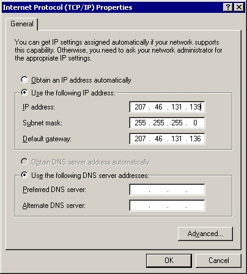

# User Interface Issues for IPv6 Winsock Applications

One of the most obvious changes from IPv4 to IPv6 is the size of the IP address. Many user interfaces provide dialog boxes that enable a user to enter an IP address, as exemplified in the following figure.



Addressing in IPv6, due to many factors such as length, complexity, and the significance of sections within the IPv6 address space, is not conducive to modification or specification by users. Therefore, the need to provide users with the capability of specifying their own address is reduced. Additionally, due to the complexity associated with IPv6 addressing, providing administrators with the capability of specifying IPv6 address information is not likely to occur on a per-node basis.

Displaying an IPv6 address in the UI is not inconceivable, and therefore developers should consider the variability in the size of an IPv6 address when modifying an application to support IPv6.

The rest of this section discusses the difference between IPv4 address length predictability and IPv6 address length considerations. This section presumes IPv6 addresses are being displayed in their hexadecimal representation.

IPv4 addresses are predictable in size, because they rigidly follow dotted decimal notation, as the following address example illustrates:

``` syntax
10.10.256.1
```

IPv6 addresses are not so predictable, due to the IPv6 address convention that enables the use of a double-colon (::) to represent a series of zeros. As such, the following IPv6 address representations equate to the same IPv6 address:

``` syntax
1040:0:0:0:0:0:0:1
1040::1
```

The capability to represent a series of zeros with a double-colon results in an unpredictable length for any given IPv6, which requires programmers to take this capability into consideration when creating user interface displays of IPv6 addresses. Certainly, developers should ensure that the user interface is capable of displaying IP addresses that do not use a double-colon to represent a series of zeros (first address below), as well as being capable of displaying the longest possible IPv6 address (second address below, with the embedded IPv4 address) when creating their IPv6-capable user interface. Note, too, that adding the Scope identifier (ID) to the following address would increase its length by as much as another eleven characters:

``` syntax
21DA:00D3:0010:2F3B:02AA:00FF:FE28:9C5A
0000:0000:0000:0000:0000:ffff:123.123.123.123
```

Another important consideration is whether name-based addresses are more appropriate than number-based IPv6 addresses. If name-based addresses are more appropriate, consideration for naming conventions should be built into the user interface, including any input error-checking appropriate for the task.

There are other complexities associated with displaying IPv6 addresses that developers must take into consideration when modifying their application, and when designing user interface representations of IPv6 addresses. Some of these considerations are the following:

-   Should the address contain all sequences of zeros, or use the double-colon notation?
-   Is it more appropriate to use a number-based address representation or a name-based representation?
-   Is the user interested in discerning a certain aspect of the addressing scheme, such as the subnet prefix, scope identifier, or other subfields?
-   Is the user interested in determining other aspects of the address, such as the TLA identifier, the NLA identifier, or the SLA identifier?
-   Will your user interface be capable of discerning embedded IPv6 addresses, and if so, how will those be handled and displayed? Will you discern between IPv4-compatible addresses and IPv4-mapped IPv6 addresses when displaying address information to the user?

There are other considerations as well, and developers should carefully consider their customer audience when developing IP address user interfaces.

Best Practices

-   Developers must consider the appropriate approach to each user interface when modifying their application to support IPv6. Ensuring that the user interface contains sufficient length to display IPv6 addresses is imperative, as is determining whether that address is number or name based.
-   Whenever possible, use existing Winsock and IP Helper functions when using IPv6 addresses rather than re-implementing this logic. For example, the [**RtlIpv6AddressToString**](/windows/win32/api/ip2string/nf-ip2string-rtlipv6addresstostringa), [**RtlIpv6AddressToStringEx**](/windows/win32/api/ip2string/nf-ip2string-rtlipv6addresstostringexw), [**RtlIpv6StringToAddress**](/windows/win32/api/ip2string/nf-ip2string-rtlipv6stringtoaddressa), and [**RtlIpv6StringToAddressEx**](/windows/win32/api/ip2string/nf-ip2string-rtlipv6stringtoaddressexw) functions can be used to convert between IPv6 addresses and string representations of these IPv6 addresses.

Code To Avoid

-   User interface elements that depend on an IPv4-sized address must undergo scrutiny, and part of that scrutiny should include whether the information you were providing (under IPv4) is appropriate for IPv6.
-   The capability to specify an IP address should also depend on whether IPv4 is in use, or IPv6 is available. If IPv6 is available, is it appropriate to specify number-based (hexadecimal) addresses or name-based addresses?

Coding Tasks

**To revise your existing code base from IPv4 to IPv4- and IPv6-interoperability**

1.  Perform a visual review of the user interface, looking for any element that is dependent on a specific length for the IP address string. Controls with the easily identified four-section dotted decimal notation are easy to spot, but others are not. There may be places where IP addresses could be displayed, such as in dialog boxes, where an IPv6 address might run out of display room.
2.  Upon finding any of these controls, scrutinize whether it is appropriate to display the address when using IPv6. If it is possible that either IPv4 or IPv6 is in use, ensure that the user interface can accommodate either. Replace or augment any controls with user interface controls that can display an entire IPv6 address.
3.  Follow up with testing of the user interface to ensure the changes that enable IPv6 address display maintain the intended usability when using IPv4 addresses. Also, test for protocol address display locations, such as informational dialog boxes, to ensure they properly handle IPv6 addresses.

## Related topics

<dl> <dt>

[IPv6 Guide for Windows Sockets Applications](ipv6-guide-for-windows-sockets-applications-2.md)
</dt> <dt>

[Changing Data Structures for IPv6 Winsock Appications](changing-data-structures-2.md)
</dt> <dt>

[Dual-Stack Sockets for IPv6 Winsock Applications](dual-stack-sockets.md)
</dt> <dt>

[Function Calls for IPv6 Winsock Applications](function-calls-2.md)
</dt> <dt>

[Use of Hardcoded IPv4 Addresses](use-of-hardcoded-ipv4-addresses-2.md)
</dt> <dt>

[Underlying Protocols for IPv6 Winsock Applications](underlying-protocols-2.md)
</dt> </dl>

 

 
