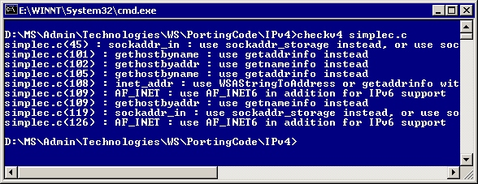
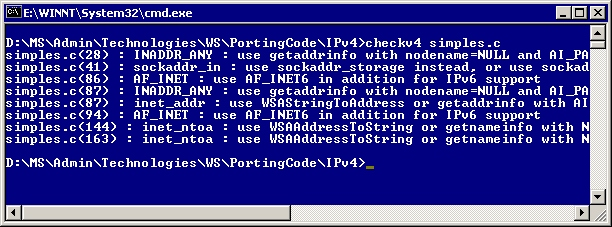

# Using the Checkv4.exe utility

> [!IMPORTANT]
> The *Checkv4.exe* utility doesn't ship in the Windows Software Development Kit (SDK) for Windows 8, nor in later versions of the Windows SDK.

The *Checkv4.exe* utility is designed to provide you with a code porting partner; a utility that steps through your code base with you, identifies potential problems or highlights code that could benefit from IPv6-capable functions or structures, and makes recommendations. With the Checkv4.exe utility, the task of modifying an existing IPv4 application to support IPv6 becomes much easier.

The *Checkv4.exe* utility is installed as part of the Microsoft Windows Software Development Kit (SDK) released for Windows Vista and later SDKs (up to, but not including, the Windows Software Development Kit (SDK) for Windows 8).

An earlier version of the *Checkv4.exe* utility with more limited features was also made available as part of the earlier Microsoft IPv6 Technology Preview for Windows 2000.

The following sections describe how to use the *Checkv4.exe* utility, then explain the recommended approach for modifying an existing IPv4 application to support IPv6.

## Recommendations for Running Checkv4.exe

-   The *Checkv4.exe* utility is straightforward. Simply execute *Checkv4.exe* at the command line with the name of the file you want to check as the parameter. *Checkv4.exe* parses the file and provides feedback as to where IPv6 porting issues exist in that file. Placing the *Checkv4.exe* into your computer's path makes running the *Checkv4.exe* utility from anywhere in your source code directory structure much easier. For example, placing *Checkv4.exe* into %windir% enables you to launch *Checkv4.exe* from any directory on your computer without including its path.

-   Issue the following command at the command prompt to parse the file Simplec.c:

    **Checkv4 simplec.c**

    Note that some of the recommendations made by the *Checkv4.exe* utility require structures available only in recent versions of the *Ws2tcpip.h* header file, such as the **SOCKADDR\_IN6** structure. These header files are included in the Windows SDK released for Windows Vista and later. These header files are also included in the earlier Platform Software Development Kit (SDK) released for Windows Server 2003. These header files are also included as part of an MSDN subscription or by download.

    The following screen shot displays the results of using the *Checkv4.exe* utility on the Simplec.c file included in Appendix A:

    

    The following screen shot displays the results of using the *Checkv4.exe* utility on the Simples.c file, which is also included in Appendix A:

    

## The Application Modification Process: Where to Start

There is a recommended procedure associated with adding IPv6 capability to applications. Following this sequence is beneficial, because it enables developers to ensure that all steps necessary to modify an existing IPv4 application to support IPv6 are taken. Certain applications may require more extensive attention to one of these sequences; for example, a system service would likely have less user interface issues than a graphical file transfer program (FTP).

**To modify IPv4 applications to support IPv6**

1.  Fix structures and declarations to enable IPv6 and IPv4 compatibility.
2.  Modify function calls to take advantage of IPv6-enabled functions, such as the [**getaddrinfo**](/windows/desktop/api/Ws2tcpip/nf-ws2tcpip-getaddrinfo) and [**getnameinfo**](/windows/desktop/api/Ws2tcpip/nf-ws2tcpip-getnameinfo) functions.
3.  Review source code for the use of hard-coded IPv4 addresses such as the loopback address, or the use of other literal strings.
4.  Perform a thorough review of the user interface, including informational dialog boxes. Give thought to whether it is appropriate for IPv6-enabled applications to specify or provide IP-address based information.
5.  Determine whether your application relies on underlying protocols, such as RPC, and make appropriate programmatic changes to handle IPv6 addresses.
6.  Use the compile-time flag IPV6STRICT when compiling applications on Windows XP and later. This flag results in incompatible code failing to compile, as follows:

    Windows Sockets 1.x applications with incompatible code fail to compile and return the error message "WINSOCK2 Required."

    Windows Sockets 2.x applications with incompatible code cause a compile time error for each instance of incompatible code. An error message is generated in the following format:

    `[file name] ([line number]) : [error message] '[symbol]_IPV6INCOMPATIBLE'`

    For example:

    `sample.c(8) : error C2065: 'gethostbyaddr_IPV6INCOMPATIBLE' : undeclared identifier`

 

 

